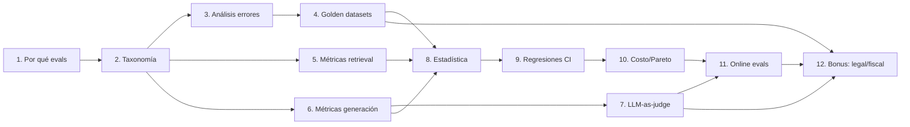

# 00 — Plan Maestro: Evaluación de Sistemas IA

## Objetivo de la masterclass

Construir la capacidad de diseñar, implementar e interpretar evaluaciones rigurosas
para sistemas RAG sobre corpus regulatorio/fiscal chileno. Al terminar, deberías
poder responder con confianza: "¿este cambio mejoró o empeoró el sistema?" —
con números, intervalos de confianza y criterios claros.

## Hilo conductor

Un sistema RAG que responde preguntas sobre normativa chilena (decretos, glosas
presupuestarias, circulares del SII). Cada sección construye una capa de evaluación
sobre este sistema, desde métricas unitarias hasta monitoreo en producción.

## Temario

### Sección 1 — Por qué evals es la disciplina más subestimada
- El problema: sistemas que "funcionan" en demos pero fallan en producción
- Analogía económica: evals como auditoría financiera
- El ciclo eval-driven development: eval → cambio → eval → ship
- Cuánto cuesta no evaluar: taxonomía de fallos silenciosos en RAG
- Mapa de la masterclass: qué cubre cada sección y cómo se conectan

### Sección 2 — Taxonomía de evaluaciones
- Eje 1: granularidad (unit → component → system → end-to-end)
- Eje 2: temporalidad (offline / online)
- Eje 3: referencia (reference-based / reference-free / human-grounded)
- Tabla cruzada con ejemplos concretos del dominio fiscal
- Diagrama Mermaid: flujo de decisión "¿qué tipo de eval necesito?"
- Qué está resuelto vs qué sigue siendo artesanal

### Sección 3 — Análisis de errores
- Por qué mirar outputs reales antes de diseñar evaluaciones
- Analogía: especificar un modelo econométrico sin explorar los datos
- Taxonomía de errores RAG: retrieval miss, wrong chunk, hallucination,
  format failure, refusal incorrecta, cita fantasma
- Protocolo de revisión manual: cuántos outputs, qué anotar, cómo sistematizar
- De patrones observados a ejes del golden dataset

### Sección 4 — Construcción de golden datasets
- Qué es un golden dataset y por qué es el activo más valioso del equipo
- Criterios de calidad: cobertura, dificultad, representatividad, versionado
- Tamaño mínimo: reglas prácticas y su justificación estadística
- Estrategias de construcción: manual, LLM-asistida, híbrida
- Anti-patrones: contaminación, facilidad artificial, sesgo de distribución
- Ejemplo ejecutable: generar un mini golden dataset para RAG fiscal

### Sección 5 — Métricas de retrieval
- El pipeline RAG como cadena: retrieval → reranking → generación
- Recall@k: definición, cálculo, interpretación, cuándo importa
- MRR (Mean Reciprocal Rank): cuándo preferirlo sobre recall
- nDCG: ganancia descontada, cuándo la posición relativa importa
- Ejemplo numérico completo: 10 queries sobre normativa, cálculo paso a paso
- Código ejecutable: calcular las tres métricas desde cero

### Sección 6 — Métricas de generación
- El problema: el retrieval puede ser perfecto y la respuesta mala (y viceversa)
- Faithfulness: ¿la respuesta se apoya en los documentos recuperados?
- Answer relevance: ¿la respuesta responde la pregunta?
- Context precision/recall: ¿los documentos recuperados eran los correctos?
- Comparación: métricas heurísticas (ROUGE, BERTScore) vs LLM-based
- Código ejecutable: implementar faithfulness con LLM-as-judge

### Sección 7 — LLM-as-judge
- Por qué necesitamos jueces automáticos (escala vs costo humano)
- Sesgos documentados:
  - Position bias: preferencia por la primera/última respuesta
  - Verbosity bias: preferencia por respuestas más largas
  - Self-preference: preferencia por outputs del mismo modelo
  - Anchoring: sensibilidad al orden de presentación del rubric
- Técnicas de mitigación: shuffling, multi-judge, calibración
- Correlación juez-humano: cómo medirla, qué esperar, cuándo no confiar
- Código: demostración empírica de position bias

### Sección 8 — Estadística para sistemas estocásticos
- El problema: misma query, diferente respuesta → ¿cómo comparar?
- Analogía económica: es como comparar rendimientos de portafolios con varianza
- Bootstrapping: por qué es ideal para métricas de eval
- Intervalos de confianza: construcción, interpretación, errores comunes
- Poder estadístico y tamaño de muestra: cuántas queries necesitas para
  detectar una mejora del X%
- Pruebas de hipótesis para outputs no deterministas
- Código ejecutable: bootstrap CI para métricas de retrieval

### Sección 9 — Regresiones y CI
- Evals en CI: qué correr en cada PR, qué correr nightly
- Presupuesto de evaluación: tiempo × costo × cobertura
- Dashboards mínimos: qué graficar, qué alertar
- Gestión de regresiones: umbrales, gates, rollback criteria
- Diagrama Mermaid: pipeline CI con evals integradas

### Sección 10 — Costo, latencia y frontera de Pareto de evals
- La eval como sistema con su propio presupuesto
- Costo por eval-run: tokens de juez, tiempo de cómputo, costo humano
- Latencia: cuánto puede tardar una eval sin bloquear el flujo de desarrollo
- Frontera de Pareto: calidad de la señal vs costo/latencia
- Estrategias de optimización: caching de embeddings, jueces escalonados,
  sampling inteligente del golden dataset
- Analogía económica: es elección bajo restricciones con frontera eficiente

### Sección 11 — Online evals
- Offline no basta: por qué necesitas evaluar en producción
- Shadow mode: correr nuevo modelo en paralelo sin servir al usuario
- A/B testing con outputs no deterministas: diseño, métricas, duración
- Logging para evals online: qué capturar, privacidad, retención
- Métricas proxy: tiempo en página, tasa de reformulación, thumbs up/down
- Feedback loops: cómo los resultados online alimentan los golden datasets

### Sección 12 — Bonus: dominios alto-stake (legal/fiscal)
- Verificación de citas normativas: ¿el artículo citado existe y dice eso?
- Alucinación normativa: el fallo más peligroso en este dominio
- Abstinencia calibrada: cuándo el sistema debe decir "no sé" y cómo evaluar eso
- Umbrales de confianza más estrictos que en dominios genéricos
- Eval de formato y estructura: ¿la respuesta sigue la forma esperada
  por un abogado/analista fiscal?
- Implicaciones regulatorias de usar IA en contextos legales

## Dependencias entre secciones

## Convenciones para esta masterclass

- Cada sección = un doc en `theory/` + código asociado en `code/`
- Los scripts usan datos de `shared/corpus_chileno/` y del golden dataset en `examples/`
- Diagramas matplotlib se guardan en `diagrams/`
- Todo se ejecuta con `uv run python 01-evals/code/script.py`
- Un commit por sección terminada: `feat(evals): sección N — título`

## Notas sobre estado del arte (2025-2026)

- **Frameworks de eval** (RAGAS, DeepEval, Braintrust) existen pero cambian rápido;
  enseñamos los conceptos desde cero para que sobrevivan a los frameworks.
- **LLM-as-judge** es práctica estándar pero la calibración sigue siendo un problema
  abierto. Los sesgos están bien documentados; las soluciones, menos.
- **No hay consenso** sobre "la" métrica de generación. Faithfulness es la más
  aceptada; las demás varían por dominio.
- **La estadística** para sistemas estocásticos (bootstrap, permutation tests) está
  bien resuelta en teoría; la adopción en equipos de ML es baja.
- **Dominios alto-stake**: la literatura de evals para legal/fiscal es escasa
  comparada con la genérica. Mucho de lo que se hace es artesanal y propietario.
