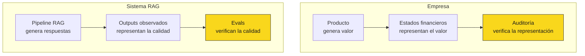
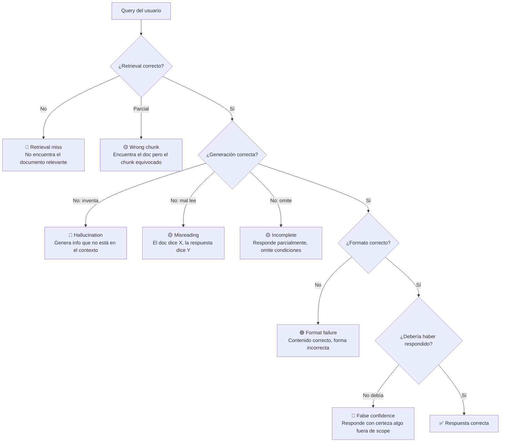
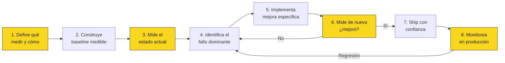
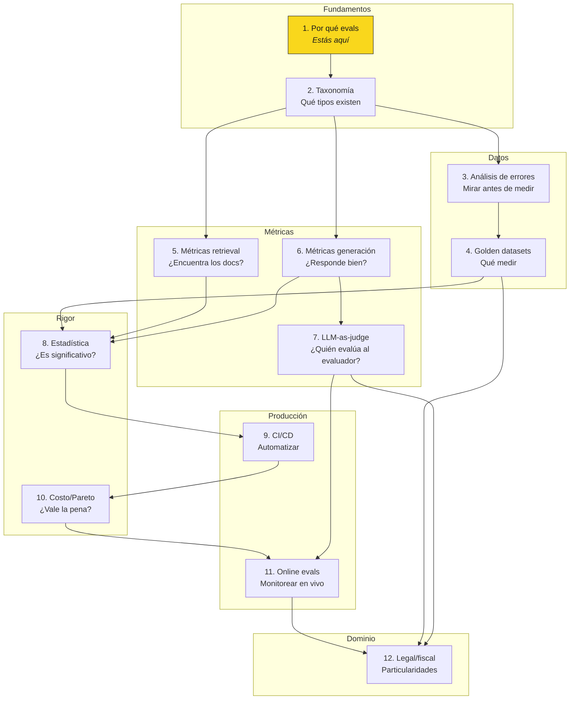

# 01 — Por qué evals es la disciplina más subestimada de LLM engineering

## La ilusión de la demo

Un sistema RAG sobre normativa chilena puede verse impresionante en una demo.
Le preguntas "¿cuánto es la subvención escolar preferencial para un alumno
prioritario de 3º básico?" y te responde correctamente: 1,694 USE. Todos
aplauden.

Pero ese aplauso esconde una trampa estadística: estás evaluando un sistema
estocástico con una muestra de tamaño **n=1**, seleccionada con sesgo de
confirmación (elegiste una pregunta que sabías que iba a funcionar), sin
grupo de control, sin intervalo de confianza, y sin definición previa de
qué constituye "éxito".

En econometría esto se llama *anecdotal evidence* y no pasaría ni el primer
filtro de un seminario de investigación. Sin embargo, en ingeniería de LLMs,
equipos enteros toman decisiones de producto basándose exactamente en esto.

## La analogía: evals como auditoría financiera

| Auditoría financiera | Evaluación de sistemas IA |
|---|---|
| No genera ingresos directamente | No genera features directamente |
| Sin ella, no sabes si los números son reales | Sin ella, no sabes si la calidad es real |
| Tiene estándares (IFRS, GAAP) | Estándares emergentes, no consolidados |
| La evitan quienes tienen algo que esconder | La evitan quienes no quieren ver los fallos |
| Es obligatoria para empresas públicas | Debería ser obligatoria para sistemas en producción |
| Cuesta dinero y tiempo | Cuesta tokens y tiempo de diseño |
| El costo de no hacerla > el costo de hacerla | Igual |

La diferencia clave: una empresa que no hace auditoría eventualmente enfrenta
consecuencias legales. Un sistema RAG que no tiene evals simplemente falla en
silencio hasta que alguien nota un error grave — y para entonces llevas semanas
o meses con un sistema degradado.

## El costo de no evaluar: fallos silenciosos en RAG

Un sistema RAG sobre corpus regulatorio chileno puede fallar de muchas formas,
y la mayoría son **silenciosas** — el sistema produce una respuesta que parece
correcta, tiene formato profesional, cita artículos, y sin embargo está mal.

### Taxonomía de fallos silenciosos

| Tipo de fallo | Severidad | Ejemplo en dominio fiscal | Detectable sin eval |
|---|---|---|---|
| **Retrieval miss** | Alta | Pregunta sobre IVA digital → recupera doc de IVA a inmuebles | No — la respuesta suena plausible |
| **Wrong chunk** | Media | Recupera la circular correcta pero el chunk de "Introducción", no el de "Servicios gravados" | No — el doc es correcto |
| **Hallucination** | Crítica | "La tasa de IVA para servicios digitales es del 15%" (es 19%) | No sin verificar contra fuente |
| **Misreading** | Alta | Dice "todos los servicios digitales están exentos" cuando el doc dice "están afectos" | No — parece coherente |
| **Incomplete** | Media | Responde sobre la tasa pero omite que aplica solo a proveedores extranjeros | No — lo que dice es correcto |
| **Format failure** | Baja | Responde correctamente pero sin citar el artículo/circular específica | Parcialmente |
| **False confidence** | Crítica | Pregunta sobre una norma de 2025 no incluida en el corpus; responde inventando | No — el tono es seguro |

### El costo económico real

Piénsalo así: si un analista fiscal usa tu sistema y obtiene una respuesta
incorrecta sobre la tasa de IVA aplicable, las consecuencias potenciales son:

1. **Costo directo**: declaración tributaria incorrecta → multa del SII
   (Art. 97 Nº 1 del Código Tributario: hasta 20% del impuesto adeudado
   + intereses).
2. **Costo de confianza**: el analista deja de confiar en el sistema →
   vuelve a hacer todo manualmente → el ROI del producto se va a cero.
3. **Costo reputacional**: si el error llega al cliente del analista →
   el daño es exponencial.

Sin evals, no sabes con qué frecuencia ocurren estos fallos. Podrían ser el
1% de las queries o el 30%. Literalmente no lo sabes. Es como invertir en un
portafolio sin conocer la varianza: estás volando a ciegas.

## Eval-driven development

La alternativa es tratar las evals como lo que son: **la primera cosa que
construyes**, no la última.

Los pasos amarillos son evaluación. La mitad del ciclo es evaluar. Esto no es
un overhead — es el proceso.

### Contraste: vibe-driven development

| Aspecto | Eval-driven | Vibe-driven |
|---|---|---|
| Decisión de ship | "recall@5 pasó de 0.72 a 0.81, CI 95% [0.78, 0.84]" | "probé 3 preguntas y se ve mejor" |
| Detección de regresión | Alerta automática: "faithfulness cayó 8pp" | Usuario reporta en 3 semanas: "a veces inventa" |
| Priorización de mejoras | "El 40% de los errores son retrieval miss en glosas" | "El prompt se siente raro, reescribámoslo" |
| Confianza del equipo | Basada en datos | Basada en la última demo |
| Costo de iteración | Bajo: sabes exactamente qué medir | Alto: cada cambio requiere revisión manual |

## El mapa de esta masterclass

Cada sección de esta masterclass construye una capacidad que se apila sobre
las anteriores:

### Qué *no* cubre esta masterclass

- **Cómo construir un RAG**: eso es materia de la masterclass 02-retrieval.
  Aquí asumimos que ya tienes un pipeline y quieres saber si funciona.
- **Cómo optimizar costos de inferencia**: eso es masterclass 04-economia.
  Aquí tocamos costos de evaluación (sección 10), no de servicio.
- **Frameworks específicos**: no enseñamos RAGAS ni DeepEval como herramientas.
  Enseñamos los conceptos que subyacen a todos ellos. Cuando un framework
  cambie su API (y lo hará), tus conceptos seguirán intactos.

## Lo que está resuelto y lo que no (2025-2026)

| Aspecto | Estado | Detalle |
|---|---|---|
| Métricas de retrieval | ✅ Resuelto | Recall@k, MRR, nDCG son estándar desde IR clásico |
| Métricas de generación | 🟡 En progreso | Faithfulness tiene consenso; el resto varía por dominio |
| LLM-as-judge | 🟡 En progreso | Los sesgos están documentados; las soluciones, menos |
| Bootstrapping para LLMs | ✅ Resuelto (en teoría) | La estadística funciona; la adopción es baja |
| Golden datasets | 🟡 Artesanal | No hay estándares; cada equipo reinventa la rueda |
| Online evals | 🔴 Incipiente | Shadow mode existe; A/B para LLMs es experimental |
| Evals para legal/fiscal | 🔴 Escaso | Literatura genérica; casi nada específico del dominio |

> ⚠️ No verificado: el estado del arte cambia rápido. Esta tabla refleja mi
> mejor comprensión a mayo de 2026. Verificar contra publicaciones recientes
> (HELM, LMSYS, papers de Anthropic/OpenAI sobre evals) antes de citar.
