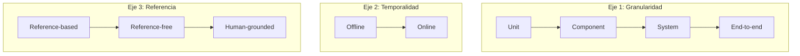
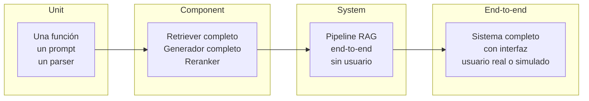
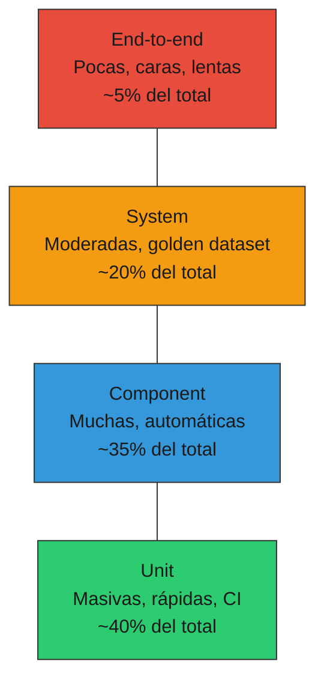
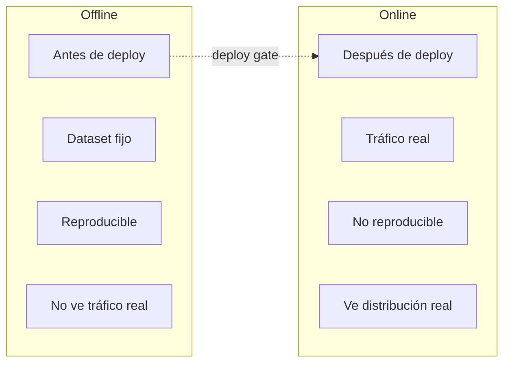
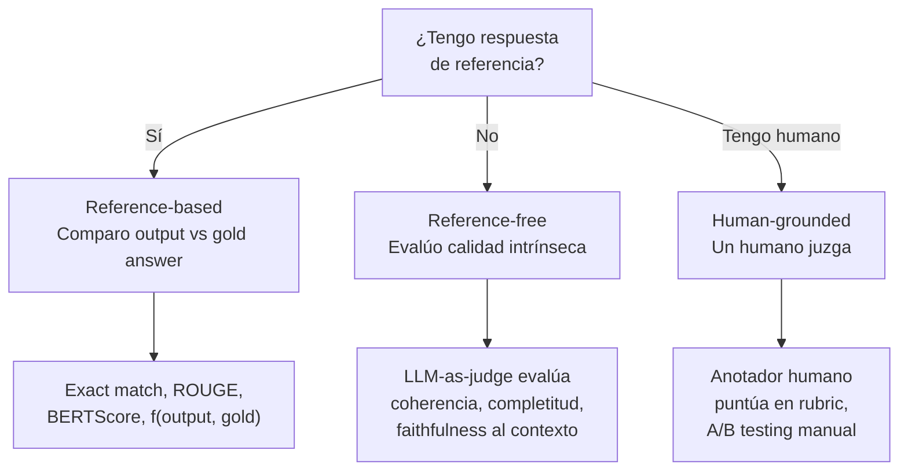
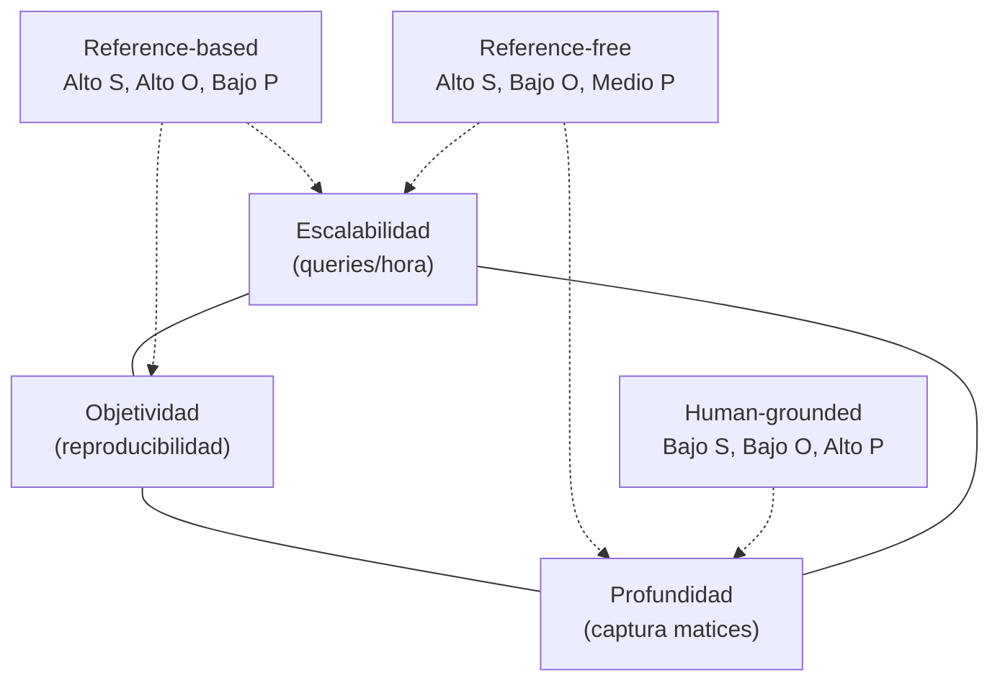
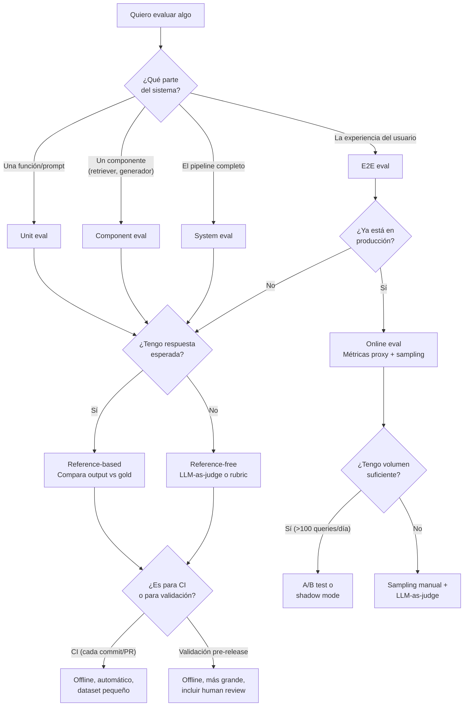
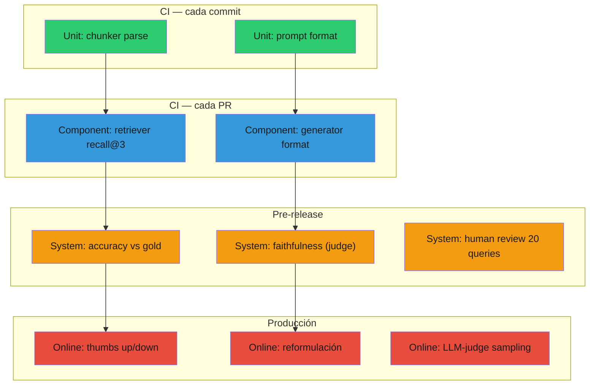

# 02 — Taxonomía de evaluaciones

## El problema de clasificar

Cuando alguien dice "necesitamos evals para nuestro RAG", la pregunta
inmediata es: ¿qué tipo de eval? La respuesta depende de tres ejes
independientes que se cruzan. Entender estos ejes evita el error más
común: construir una eval sofisticada que mide lo incorrecto en el
momento incorrecto.

Analogía económica: es como clasificar instrumentos financieros. Un bono
y una acción se diferencian en múltiples ejes (riesgo, liquidez, plazo,
rendimiento). Decir "invierte" sin especificar estos ejes es tan vago como
decir "evalúa" sin especificar granularidad, temporalidad y tipo de
referencia.

## Los tres ejes



Cada eval concreta es un punto en el espacio tridimensional
(granularidad × temporalidad × referencia). Hay combinaciones
frecuentes y combinaciones raras. Las veremos todas.

## Eje 1: Granularidad

La granularidad responde a la pregunta: **¿qué parte del sistema
estoy evaluando?**

### Niveles



| Nivel | ¿Qué evalúa? | Ejemplo en RAG fiscal | Velocidad | Costo | Señal |
|---|---|---|---|---|---|
| **Unit** | Una función o prompt aislado | "¿El parser de glosas extrae correctamente el monto?" | ms | ~$0 | Precisa pero estrecha |
| **Component** | Un componente completo | "¿El retriever encuentra los chunks relevantes para queries sobre IVA?" | segundos | bajo | Buena para diagnóstico |
| **System** | El pipeline integrado | "Dada esta pregunta, ¿la respuesta final es correcta?" | segundos-min | medio | La más informativa |
| **End-to-end** | Sistema + interfaz + usuario | "¿El usuario logra resolver su tarea con el sistema?" | horas-días | alto | Definitiva pero lenta |

### Cuándo usar cada nivel

La intuición clave: **los niveles bajos diagnostican, los altos validan**.

- Un test unitario te dice que el parser de montos funciona. No te dice
  si el sistema responde bien.
- Un eval end-to-end te dice que el usuario está satisfecho. No te dice
  *por qué* cuando no lo está.

La estrategia correcta es una **pirámide de evals** (análoga a la pirámide
de testing clásica):



> ⚠️ No verificado: los porcentajes son orientativos, no provienen de un
> estudio empírico. La proporción óptima depende del dominio y la madurez
> del sistema. El punto es la forma piramidal, no los números exactos.

## Eje 2: Temporalidad

La temporalidad responde a: **¿cuándo se ejecuta la eval, antes o después
de que el usuario vea el output?**

### Offline vs Online



| Aspecto | Offline | Online |
|---|---|---|
| **Cuándo** | Antes de deploy (CI, staging) | En producción, con usuarios reales |
| **Datos** | Golden dataset curado | Queries reales del usuario |
| **Reproducibilidad** | Alta (mismo dataset, seed fijo) | Baja (distribución cambia) |
| **Cobertura** | Lo que el golden dataset cubra | Lo que los usuarios pregunten |
| **Velocidad de feedback** | Minutos (CI) a horas (batch) | Horas a días |
| **Ejemplo fiscal** | "¿Responde correctamente estas 50 preguntas sobre IVA?" | "¿Qué % de usuarios reformulan su pregunta después de la respuesta?" |

### La trampa del offline-only

Un equipo que solo hace evals offline tiene un punto ciego enorme: **no sabe
qué preguntan los usuarios reales**. Su golden dataset refleja lo que el equipo
*imagina* que preguntarán, no lo que de hecho preguntan.

Analogía económica: es como hacer backtesting de una estrategia de trading
sin jamás probarla con datos out-of-sample. El backtest puede ser perfecto
y la estrategia puede fallar en producción porque la distribución cambió.

### La trampa del online-only

Un equipo que solo hace evals online tiene el problema opuesto: **no puede
iterar rápido**. Cada cambio requiere deployar, esperar tráfico, acumular
datos suficientes. El ciclo de feedback es de días o semanas en lugar de
minutos.

La respuesta correcta es **ambos**: offline para iterar rápido, online para
validar que el offline era representativo.

## Eje 3: Tipo de referencia

La referencia responde a: **¿contra qué comparo el output del sistema?**

### Tres modos



| Modo | Definición | Ventaja | Desventaja | Cuándo usarlo |
|---|---|---|---|---|
| **Reference-based** | Existe una respuesta gold; mido qué tan cerca está el output | Objetivo, reproducible, barato | Requiere construir el gold; frágil ante variación legítima | Preguntas factuales con respuesta única: "¿cuál es la tasa de IVA?" |
| **Reference-free** | No hay gold; evalúo el output por sus propiedades intrínsecas | No requiere gold; escala bien | Subjetivo; depende del evaluador (LLM o rubric) | Preguntas abiertas: "explica las implicaciones de este decreto" |
| **Human-grounded** | Un humano juzga la calidad del output | El gold standard definitivo | Lento, caro, no escala, variabilidad inter-anotador | Calibración: ¿mi eval automática correlaciona con lo que un experto diría? |

### El triángulo de trade-offs



En la práctica, usas los tres en diferentes momentos:

1. **Reference-based** para CI (rápido, objetivo, cada PR).
2. **Reference-free** (LLM-as-judge) para evals más ricas (nightly, pre-release).
3. **Human-grounded** para calibrar los dos anteriores (mensual, trimestral).

## La tabla cruzada: combinaciones en el dominio fiscal

Ahora cruzamos los tres ejes. No todas las 24 combinaciones
(4 × 2 × 3) son útiles. Estas son las que importan:

| Granularidad | Temporalidad | Referencia | Ejemplo concreto | Frecuencia |
|---|---|---|---|---|
| Unit | Offline | Reference-based | "¿El parser extrae '19%' del texto de la circular?" | Cada commit |
| Unit | Offline | Reference-free | "¿El prompt de extracción genera JSON válido?" | Cada commit |
| Component | Offline | Reference-based | "¿El retriever pone el doc correcto en top-5 para estas 50 queries?" | Cada PR |
| Component | Offline | Reference-free | "¿Los chunks recuperados son coherentes entre sí?" | Cada PR |
| System | Offline | Reference-based | "¿La respuesta final coincide con el gold para estas 50 queries?" | Pre-release |
| System | Offline | Reference-free | "LLM-as-judge: ¿la respuesta es faithful al contexto recuperado?" | Pre-release |
| System | Offline | Human-grounded | "Un analista fiscal revisa 20 respuestas y puntúa" | Mensual |
| System | Online | Reference-free | "LLM-as-judge sobre tráfico real muestreado" | Continuo |
| E2E | Online | Human-grounded | "% de usuarios que dan thumbs-up a la respuesta" | Continuo |
| E2E | Online | Reference-free | "% de queries que requieren reformulación" | Continuo |

### Combinaciones raras o inútiles

| Combinación | Por qué no se usa |
|---|---|
| Unit + Online | No tiene sentido evaluar una función aislada en producción |
| E2E + Offline + Reference-based | No puedes simular al usuario y a la vez tener un gold exacto |
| Component + Online + Human-grounded | Demasiado caro para un solo componente en producción |

## Árbol de decisión: ¿qué eval necesito?

Cuando te enfrentas a un problema de evaluación, usa este flujo:



## Ejemplo aplicado: RAG sobre normativa de IVA digital

Supongamos que tienes un RAG que responde preguntas sobre la Circular Nº 42
del SII (IVA a servicios digitales). ¿Qué evals construirías?

### Nivel 1: Unit evals (CI, cada commit)

```
Eval: ¿El chunker separa correctamente las secciones de la circular?
Tipo: Unit × Offline × Reference-based
Input: texto completo de la circular
Gold: lista esperada de chunks con sus títulos de sección
Métrica: exact match en número de chunks + títulos
```

### Nivel 2: Component evals (CI, cada PR)

```
Eval: ¿El retriever encuentra la sección relevante?
Tipo: Component × Offline × Reference-based
Input: 10 preguntas sobre IVA digital
Gold: chunk_id esperado para cada pregunta
Métrica: Recall@3, MRR
```

### Nivel 3: System evals (pre-release)

```
Eval: ¿La respuesta final es correcta y fiel al contexto?
Tipo: System × Offline × Reference-free
Input: 10 preguntas sobre IVA digital
Evaluador: LLM-as-judge con rubric de faithfulness
Métrica: faithfulness score promedio
```

### Nivel 4: E2E / Online (producción)

```
Eval: ¿Los usuarios encuentran útil la respuesta?
Tipo: E2E × Online × Human-grounded
Input: tráfico real
Métricas: tasa de thumbs-up, tasa de reformulación
```

### Cobertura visual



## Qué está resuelto y qué no

| Aspecto | Estado | Detalle |
|---|---|---|
| Unit evals | ✅ Resuelto | Son tests de software clásicos; nada nuevo |
| Component evals (retrieval) | ✅ Resuelto | Métricas de IR tienen décadas (sección 5) |
| System evals reference-based | ✅ Resuelto | Conceptualmente simple; la dificultad está en el golden dataset (sección 4) |
| System evals reference-free | 🟡 En progreso | LLM-as-judge funciona pero tiene sesgos (sección 7) |
| Online evals para LLMs | 🔴 Incipiente | A/B testing con outputs no deterministas es territorio nuevo (sección 11) |
| Taxonomía misma | 🟡 No estandarizada | Cada framework (RAGAS, DeepEval, Braintrust) usa su propia taxonomía; la que presento aquí es una síntesis |

## Conexión con las siguientes secciones

Ahora que sabes *qué tipos* de eval existen, las preguntas que siguen son:

- **Sección 3**: Antes de diseñar evals, ¿he mirado mis outputs reales?
  (análisis de errores)
- **Sección 4**: ¿Cómo construyo el golden dataset que usan las evals
  reference-based? (golden datasets)
- **Secciones 5-6**: ¿Qué métricas concretas uso para cada componente?
  (métricas de retrieval y generación)
- **Sección 7**: ¿Cómo funciona el evaluador en las evals reference-free?
  (LLM-as-judge)
