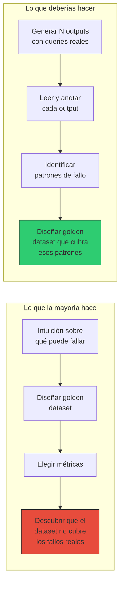
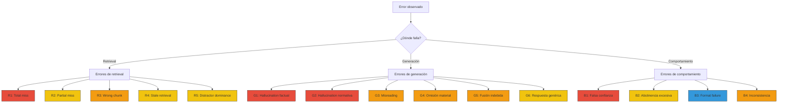
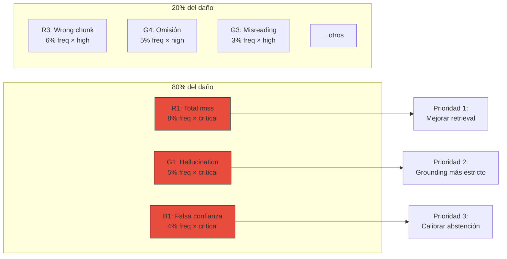
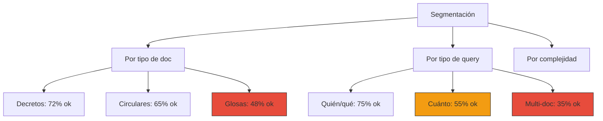

# 03 — Análisis de errores

## No diseñes lo que no has observado

El error más frecuente al construir un sistema de evaluación es empezar
por las métricas. Suena contraintuitivo — ¿no queremos medir? Sí, pero
medir *qué* es la pregunta que la mayoría salta.

La analogía es directa: un economista que especifica un modelo de regresión
sin haber hecho análisis exploratorio de datos (EDA) está eligiendo variables
a ciegas. Puede que su modelo estime algo, pero probablemente esté mal
especificado — omite variables relevantes, incluye variables irrelevantes,
o asume una forma funcional equivocada.

En evals pasa lo mismo. Si diseñas un golden dataset y defines métricas sin
haber leído 100-200 outputs reales de tu sistema, vas a medir lo que
*imaginas* que falla, no lo que *de hecho* falla.



## Taxonomía de errores en RAG

En la sección 1 vimos una taxonomía breve de fallos silenciosos. Ahora la
expandimos con la granularidad necesaria para anotar outputs reales.

### Errores de retrieval

| Código | Nombre | Descripción | Ejemplo en dominio fiscal |
|---|---|---|---|
| R1 | **Total miss** | Ningún documento relevante en top-k | Query sobre IVA digital → recupera decretos de educación |
| R2 | **Partial miss** | Documento correcto en top-k pero no en top-1 | Circular del SII en posición 4 de 5 |
| R3 | **Wrong chunk** | Documento correcto, chunk equivocado | Recupera la introducción de la circular en vez de la sección de tasas |
| R4 | **Stale retrieval** | Recupera versión desactualizada del documento | Recupera circular de 2018 cuando existe una de 2020 que la reemplaza |
| R5 | **Distractor dominance** | Un documento irrelevante pero léxicamente similar desplaza al correcto | "Ley de Transparencia" desplaza a "Ley de Lobby" por overlap de términos |

### Errores de generación

| Código | Nombre | Descripción | Ejemplo en dominio fiscal |
|---|---|---|---|
| G1 | **Hallucination factual** | Genera datos que no están en el contexto | Inventa una tasa de "15% para servicios digitales" |
| G2 | **Hallucination normativa** | Cita un artículo, ley o decreto que no existe | "Según el Art. 45 bis de la Ley 21.210..." (no existe) |
| G3 | **Misreading** | El contexto dice X, la respuesta dice Y | Contexto: "al menos 15% de matrícula" → Respuesta: "más del 50% de matrícula" |
| G4 | **Omisión material** | La respuesta es correcta pero omite condiciones o excepciones clave | Responde la tasa de IVA pero omite que aplica solo a proveedores extranjeros |
| G5 | **Fusión indebida** | Mezcla información de dos documentos distintos creando una afirmación falsa | Combina montos de dos glosas presupuestarias diferentes en una sola cifra |
| G6 | **Respuesta genérica** | Respuesta vaga que no aporta valor | "Depende de varios factores..." sin citar ninguno |

### Errores de comportamiento

| Código | Nombre | Descripción | Ejemplo en dominio fiscal |
|---|---|---|---|
| B1 | **Falsa confianza** | Responde con certeza cuando debería abstenerse | Query sobre norma no incluida en el corpus → responde como si la tuviera |
| B2 | **Abstinencia excesiva** | Se niega a responder cuando sí tiene la información | "No tengo suficiente información" cuando el chunk relevante está en el contexto |
| B3 | **Format failure** | Contenido correcto pero formato incorrecto | No cita el número de ley/artículo, o responde en inglés |
| B4 | **Inconsistencia** | Misma query, respuestas contradictorias en distintas ejecuciones | A veces dice 19%, a veces dice 21% para la misma pregunta |

### Mapa visual de la taxonomía



Colores: 🔴 crítico (puede causar daño), 🟠 alto (respuesta incorrecta),
🟡 medio (respuesta degradada), 🔵 bajo (cosmético).

## Protocolo de revisión manual

### ¿Cuántos outputs revisar?

La respuesta corta: **mínimo 100, idealmente 200**.

La justificación estadística: si un tipo de error ocurre con frecuencia
real del 5%, necesitas revisar al menos ~60 outputs para tener >95% de
probabilidad de observarlo al menos una vez (distribución binomial).
Para capturar errores del 2%, necesitas ~150. Para tener estimaciones
estables de la *proporción* de cada tipo de error, 200 es un buen número.

| Frecuencia real del error | P(observar ≥1 en 50 outputs) | P(observar ≥1 en 100) | P(observar ≥1 en 200) |
|---|---|---|---|
| 10% | 99.5% | ~100% | ~100% |
| 5% | 92.3% | 99.4% | ~100% |
| 2% | 63.6% | 86.7% | 98.2% |
| 1% | 39.5% | 63.4% | 86.6% |

> Estos números vienen de P(X ≥ 1) = 1 - (1-p)^n con distribución binomial.
> No son estimados — son cálculo exacto.

### De dónde sacar las queries

El orden de preferencia:

1. **Logs reales de producción** (si existes en producción) — la fuente
   definitiva de qué preguntan los usuarios.
2. **Queries de beta testers o stakeholders** — no tan representativas
   como logs, pero reales.
3. **Queries generadas por el equipo** — último recurso. El sesgo es
   inevitable: el equipo pregunta lo que sabe que el sistema puede
   responder.
4. **Queries generadas por LLM** — útil para volumen, pero con
   alto riesgo de sesgo de distribución. Úsalo solo como complemento,
   nunca como fuente principal.

### Qué anotar por cada output

Para cada par (query, output), registra:

```
1. query_id:           Identificador único
2. query_text:         La pregunta exacta
3. retrieved_docs:     Lista de documentos/chunks recuperados
4. generated_answer:   La respuesta generada
5. error_code:         R1-R5, G1-G6, B1-B4, o "OK"
6. error_severity:     critical / high / medium / low
7. correct_answer:     Respuesta correcta (si la conoces)
8. correct_doc:        Documento que debería haberse recuperado
9. notes:              Observaciones libres
10. annotator:         Quién anotó (para inter-annotator agreement)
```

### Formato de registro

Usa un JSON Lines (`.jsonl`) — una línea por output anotado. Es el formato
más práctico: fácil de leer con scripts, fácil de agregar líneas, fácil
de versionar con git.

```json
{
  "query_id": "q001",
  "query_text": "¿Cuál es la tasa de IVA para servicios digitales?",
  "retrieved_docs": ["circular-01-sii-iva-digital.txt"],
  "generated_answer": "La tasa es del 19%...",
  "error_code": "OK",
  "error_severity": null,
  "correct_answer": "19%, Circular Nº 42 SII",
  "correct_doc": "circular-01-sii-iva-digital.txt",
  "notes": "",
  "annotator": "alonso"
}
```

## De observaciones a patrones

Después de anotar 100-200 outputs, el análisis sigue estos pasos:

### Paso 1: Distribución de frecuencias

Cuenta cuántos outputs caen en cada categoría de error. Esto te da la
**línea base** — la fotografía de dónde está tu sistema hoy.

```
OK:                   62% (124/200)
R1 - Total miss:      8%  (16/200)
R3 - Wrong chunk:     6%  (12/200)
G1 - Hallucination:   5%  (10/200)
G4 - Omisión:         5%  (10/200)
B1 - Falsa confianza: 4%  (8/200)
G3 - Misreading:      3%  (6/200)
...otros:             7%  (14/200)
```

> ⚠️ No verificado: los números de arriba son ilustrativos, no provienen
> de un sistema real. La distribución real depende del dominio, la calidad
> del retriever y el modelo.

### Paso 2: Análisis de Pareto

Ordena los errores por frecuencia × severidad. El principio de Pareto
aplica casi siempre: un 20% de los tipos de error causan el 80% del daño.



### Paso 3: Análisis de co-ocurrencia

Algunos errores se causan mutuamente:

| Si observas... | Probablemente también verás... | Porque... |
|---|---|---|
| R1 (total miss) | G1 (hallucination) | Sin contexto relevante, el LLM inventa |
| R1 (total miss) | B1 (falsa confianza) | El LLM no sabe que no tiene información |
| R3 (wrong chunk) | G4 (omisión) | El chunk tiene info parcial, la respuesta es incompleta |
| R5 (distractor) | G5 (fusión indebida) | Mezcla info del distractor con la del doc correcto |

La co-ocurrencia te dice dónde intervenir. Si R1 causa G1 y B1, entonces
**mejorar el retriever reduce tres tipos de error de golpe**. Eso es
alto leverage — un concepto que como economista conoces bien.

### Paso 4: Segmentación

No todos los errores se distribuyen uniformemente. Segmenta por:

- **Tipo de documento**: ¿fallan más las queries sobre glosas presupuestarias
  que sobre decretos? (Probablemente sí — las glosas tienen estructura
  tabular más difícil de chunkear.)
- **Tipo de pregunta**: ¿fallan más las preguntas de "cuánto" (numéricas)
  que las de "quién" (entidades)? (Probablemente sí — los números son
  más frágiles.)
- **Complejidad**: ¿fallan más las preguntas que requieren cruzar dos
  documentos? (Casi seguro sí.)



La segmentación te dice **para qué** es bueno tu sistema y para qué no.
Esto informa directamente qué debe cubrir tu golden dataset (sección 4).

## De patrones a golden dataset

El análisis de errores produce tres entregables que alimentan la sección
siguiente:

| Entregable | Qué contiene | Para qué sirve |
|---|---|---|
| **Distribución de errores** | Frecuencia de cada tipo de error | Define qué *proporciones* de queries incluir en el golden dataset |
| **Queries difíciles** | Las queries concretas donde el sistema falla | Se convierten directamente en items del golden dataset |
| **Ejes de segmentación** | Tipo de doc, tipo de query, complejidad | Define las *dimensiones* de cobertura del golden dataset |

Sin estos tres entregables, tu golden dataset es un tiro a ciegas.

## Cuándo repetir el análisis

El análisis de errores no es un ejercicio de una sola vez. Repítelo cuando:

1. **Cambias el modelo base** — la distribución de errores puede cambiar
   drásticamente.
2. **Cambias la estrategia de chunking** — afecta R1-R5 directamente.
3. **Agregas documentos al corpus** — nuevos documentos pueden introducir
   distractores (R5).
4. **Las métricas online muestran degradación** — algo cambió, necesitas
   entender qué.

## Conexión con secciones anteriores y siguientes

- **Sección 2 (taxonomía)**: el análisis de errores te dice qué *tipo*
  de eval necesitas para cada categoría de error. Un R1 se detecta con
  component eval reference-based; un G1 se detecta con system eval
  reference-free.
- **Sección 4 (golden datasets)**: los patrones observados aquí son el
  input principal para diseñar el golden dataset.
- **Sección 7 (LLM-as-judge)**: algunos errores (G1, G4) son candidatos
  naturales para evaluación con judge; otros (R1, R3) se miden mejor
  con métricas de retrieval clásicas.
