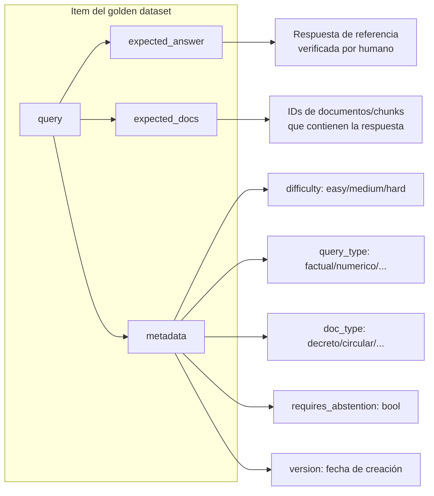
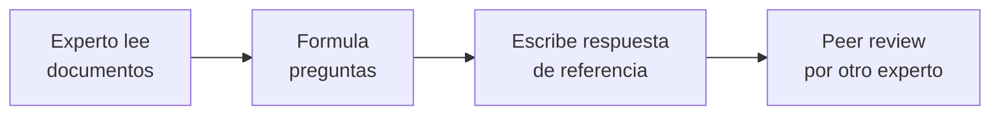
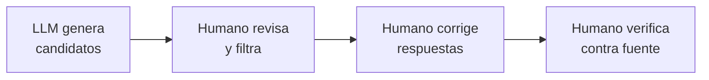
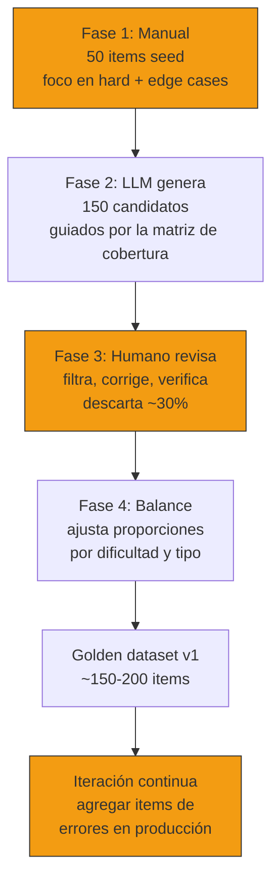
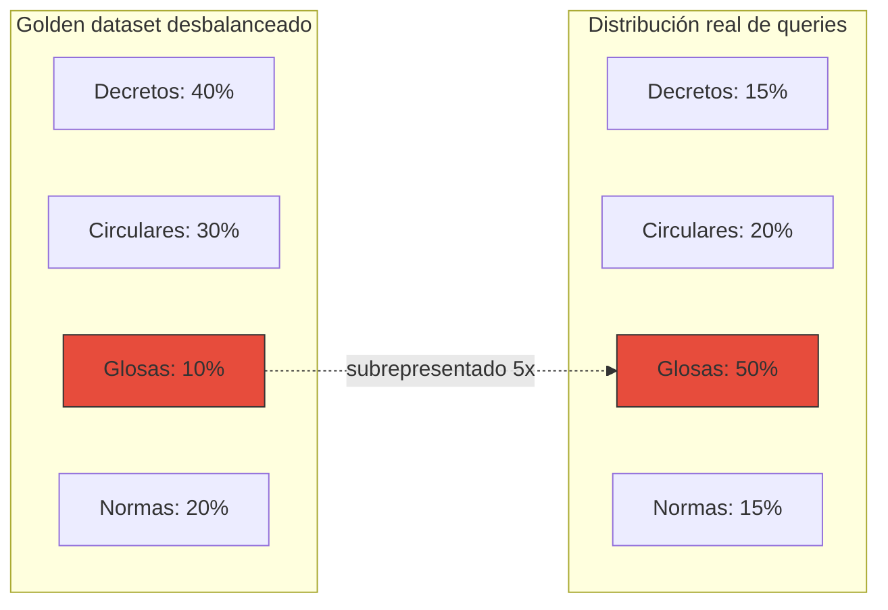
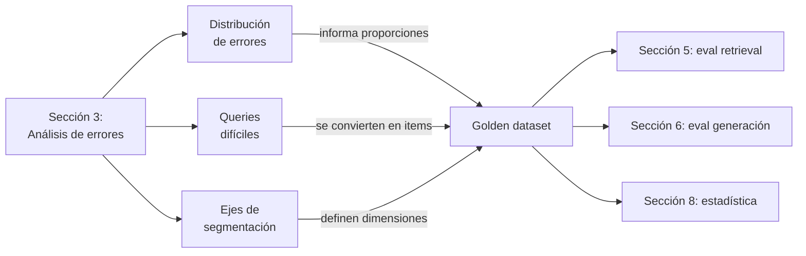

# 04 — Construcción de golden datasets

## El activo más valioso que nadie quiere construir

Un golden dataset es una colección curada de pares (input, output esperado)
que define qué significa "correcto" para tu sistema. Es el equivalente a los
estados financieros auditados de una empresa: sin ellos, cualquier afirmación
sobre la calidad del sistema es una opinión, no un hecho.

Y sin embargo, la mayoría de los equipos no lo tienen. O tienen uno que
construyeron en una tarde, con 15 preguntas fáciles que el sistema ya
respondía bien, y nunca lo actualizaron.

Analogía económica: el golden dataset es como la canasta del IPC. Define
qué se mide y con qué pesos. Si la canasta está mal diseñada (omite bienes
relevantes, sobrepondera otros), el índice resultante no refleja la realidad.
Y como con el IPC, la tentación es construirla una vez y olvidarla — pero
la distribución de consumo cambia, y la de queries también.

## Qué contiene un golden dataset para RAG

Cada item del golden dataset necesita más que una pregunta y una respuesta.
Para evaluar un pipeline RAG completo necesitas:



### Esquema completo

```json
{
  "id": "gd-001",
  "query": "¿Cuál es la tasa de IVA para servicios digitales de proveedores extranjeros?",
  "expected_answer": "19%, según la Circular Nº 42 del SII (2020), que implementa las modificaciones de la Ley Nº 21.210 al DL 825.",
  "expected_docs": ["circular-01-sii-iva-digital.txt"],
  "expected_chunks": ["circular-01-sii-iva-digital_chunk_003"],
  "difficulty": "easy",
  "query_type": "numerico",
  "doc_type": "circular",
  "requires_abstention": false,
  "reasoning": "Respuesta directa en sección II de la circular. Un solo documento relevante.",
  "created_by": "alonso",
  "created_at": "2026-05-25",
  "version": 1
}
```

Los campos `expected_docs` y `expected_chunks` permiten evaluar retrieval y
generación por separado. Sin ellos, solo puedes hacer eval end-to-end y no
sabes *dónde* falla el pipeline cuando falla.

## Criterios de calidad

### 1. Cobertura

El golden dataset debe cubrir las dimensiones que descubriste en el
análisis de errores (sección 3):

```mermaid
graph TD
    COV[Cobertura] --> DT[Por tipo de documento]
    COV --> QT[Por tipo de query]
    COV --> DIF[Por dificultad]
    COV --> EDGE[Casos borde]

    DT --> DT1["Decretos"]
    DT --> DT2["Circulares"]
    DT --> DT3["Glosas presupuestarias"]
    DT --> DT4["Normas/leyes"]

    QT --> QT1["Factual: ¿qué dice?"]
    QT --> QT2["Numérico: ¿cuánto?"]
    QT --> QT3["Entidad: ¿quién?"]
    QT --> QT4["Multi-doc: cruzar fuentes"]
    QT --> QT5["Scope: fuera del corpus"]

    DIF --> D1["Easy: respuesta directa<br/>en un solo chunk"]
    DIF --> D2["Medium: requiere<br/>sintetizar un doc"]
    DIF --> D3["Hard: requiere cruzar<br/>docs o inferir"]

    EDGE --> E1["Abstención: no está<br/>en el corpus"]
    EDGE --> E2["Ambigüedad: múltiples<br/>respuestas válidas"]
    EDGE --> E3["Distractores: docs<br/>similares pero irrelevantes"]
```



### Matriz de cobertura mínima

| | Factual | Numérico | Entidad | Multi-doc | Scope/Abstención |
|---|---|---|---|---|---|
| **Decreto** | 3 | 3 | 2 | 1 | 1 |
| **Circular** | 3 | 3 | 2 | 1 | 1 |
| **Glosa** | 2 | 4 | 1 | 2 | 1 |
| **Norma** | 3 | 2 | 2 | 1 | 1 |

Total mínimo: ~43 items. Esto garantiza al menos 1-4 items por celda,
suficiente para detectar problemas por segmento.

> ⚠️ No verificado: estos números son orientativos. La proporción óptima
> depende de tu distribución real de queries (sección 3). Si el 60% de
> tus queries son sobre glosas, sobrerrepresenta glosas.

### 2. Dificultad calibrada

Un golden dataset con solo preguntas fáciles es inútil — te da un
accuracy del 95% que no refleja el uso real. La distribución de
dificultad debería aproximar la distribución real:

| Dificultad | Proporción sugerida | Criterio |
|---|---|---|
| Easy | ~30% | Respuesta directa en un chunk, sin ambigüedad |
| Medium | ~45% | Requiere sintetizar información de un documento o discriminar entre chunks |
| Hard | ~25% | Requiere cruzar documentos, manejar ambigüedad, o abstenerse correctamente |

Analogía económica: es como un stress test bancario. Si solo testeas
escenarios normales, no sabes cómo se comporta el sistema bajo presión.
Los items "hard" son tu escenario de estrés.

### 3. Respuestas de referencia verificadas

Cada `expected_answer` debe cumplir:

- **Verificada contra la fuente**: alguien leyó el documento original y
  confirmó que la respuesta es correcta.
- **Autocontenida**: la respuesta tiene sentido sin ver la query.
- **Con cita específica**: incluye el artículo, glosa o sección exacta.
- **Acotada**: no incluye información adicional que no fue preguntada.

Las respuestas de referencia **no son** la respuesta ideal que el sistema
debería dar. Son la verdad factual contra la cual comparas. El sistema
puede responder de forma diferente y seguir siendo correcto.

### 4. Versionado

El golden dataset cambia cuando:
- Agregas documentos al corpus
- Descubres nuevos patrones de error
- Cambias la definición de "correcto"

Cada item tiene un campo `version`. Cuando actualizas un item, incrementas
la versión y registras qué cambió. Esto permite reproducibilidad: "con la
versión 3 del golden dataset, el accuracy era 72%".

## Tamaño mínimo: la justificación estadística

### ¿Cuántos items necesitas?

La respuesta depende de qué quieres poder decir con los resultados.

**Para detectar diferencias**: si quieres detectar una mejora del 5
puntos porcentuales (ej: de 70% a 75%) con 80% de poder y 95% de
confianza, necesitas:

| Mejora a detectar | Accuracy baseline | n mínimo (por grupo) |
|---|---|---|
| 10pp | 60% | ~85 |
| 5pp | 70% | ~250 |
| 5pp | 80% | ~300 |
| 3pp | 70% | ~700 |

> Estos números vienen de un test de proporciones de dos colas
> (z-test). La fórmula: n = (Z_α/2 + Z_β)² × (p₁(1-p₁) + p₂(1-p₂)) / (p₁ - p₂)²

**Para estimar con precisión**: si quieres un intervalo de confianza
de ±5pp para tu accuracy:

| n | Ancho del IC 95% (peor caso, p=0.5) |
|---|---|
| 50 | ±13.9pp |
| 100 | ±9.8pp |
| 200 | ±6.9pp |
| 400 | ±4.9pp |
| 500 | ±4.4pp |

Con 50 items no puedes distinguir entre un sistema con 65% y uno con 79%
de accuracy. Con 200 items empiezas a tener señal útil.

### Regla práctica

- **Mínimo absoluto**: 50 items. Por debajo de esto no tienes poder
  estadístico para nada.
- **Mínimo útil**: 100-200 items. Suficiente para estimar accuracy con
  ±7-10pp y detectar regresiones grandes.
- **Ideal**: 300-500 items. Permite detectar mejoras de 5pp y segmentar
  por categoría.
- **Lujo**: 1000+ items. Para A/B tests finos y análisis multidimensional.

## Estrategias de construcción

### 1. Manual pura



| Ventaja | Desventaja |
|---|---|
| Máxima calidad y realismo | Lento: ~2-5 min por item |
| El experto conoce las trampas del dominio | No escala: 200 items = 7-17 horas |
| Cubre casos que un LLM no imaginaría | Sesgo del experto hacia sus propias queries |

**Cuándo usarla**: para los primeros 50 items y para todos los items "hard".

### 2. LLM-asistida



| Ventaja | Desventaja |
|---|---|
| Rápido: genera 50 candidatos en minutos | Sesgo de distribución: el LLM pregunta lo "obvio" |
| Buena cobertura léxica | Puede generar preguntas que parecen razonables pero son ambiguas |
| El humano solo revisa, no crea desde cero | Las respuestas generadas necesitan verificación 100% |

**Cuándo usarla**: para expandir de 50 a 200+ items, especialmente
en las categorías "easy" y "medium".

### 3. Híbrida (recomendada)



Los pasos amarillos requieren trabajo humano. Los otros son automatizables.

## Anti-patrones

### 1. Contaminación

**El problema**: items del golden dataset que aparecen (textualmente o
parafraseados) en los datos de entrenamiento del modelo o en los prompts.

**Por qué es grave**: el sistema "recuerda" la respuesta en lugar de
razonar sobre el contexto recuperado. El accuracy se infla artificialmente.

**Cómo evitarlo**:
- No uses preguntas de benchmarks públicos
- No copies preguntas de FAQs publicadas sobre la normativa
- Genera preguntas originales sobre los documentos específicos de tu corpus

### 2. Facilidad artificial

**El problema**: todos los items son preguntas directas con respuesta
en un solo chunk.

**Por qué es grave**: el accuracy reportado no refleja el rendimiento
en queries reales, que suelen ser más complejas.

**Cómo detectarlo**: si tu accuracy es >90% en el golden dataset pero
los usuarios se quejan, el dataset es demasiado fácil.

**Ejemplo**:

| Pregunta fácil (no representativa) | Pregunta realista |
|---|---|
| "¿Cuál es la tasa de IVA?" | "¿Un proveedor de SaaS en EE.UU. que vende a empresas chilenas debe cobrar IVA? ¿A qué tasa?" |
| "¿Quiénes son sujetos pasivos?" | "¿Un concejal que recibe una solicitud de reunión de una ONG necesita registrarla en la Agenda Pública?" |

### 3. Sesgo de distribución

**El problema**: la distribución de queries en el golden dataset no
refleja la distribución real de uso.

**Por qué es grave**: optimizas para lo que mides. Si el 80% de las
queries reales son sobre glosas y tu dataset tiene 10% de glosas,
vas a tener un sistema que funciona bien "en promedio" pero mal para
la mayoría de los usuarios.

**Cómo detectarlo**: compara la distribución del golden dataset contra
los logs de producción (si los tienes) o contra el análisis de errores
(sección 3).



### 4. Respuestas de referencia incorrectas

**El problema**: la "respuesta correcta" en el golden dataset está
equivocada o desactualizada.

**Por qué es grave**: penalizas al sistema cuando acierta y lo premias
cuando se equivoca. Peor: pierdes confianza en las métricas y vuelves
a evaluar "a ojo".

**Cómo prevenirlo**: peer review obligatorio para cada respuesta de
referencia. Idealmente, dos personas independientes verifican contra
la fuente original.

### 5. Dataset estático

**El problema**: construyes el golden dataset una vez y nunca lo
actualizas.

**Por qué es grave**: el corpus crece, las queries evolucionan, y el
golden dataset se vuelve cada vez menos representativo.

**Frecuencia de actualización**:
- Agregar items: cada vez que descubres un nuevo patrón de error en
  producción
- Revisar items existentes: cada vez que actualizas el corpus
- Auditoría completa: trimestral

## Métricas del golden dataset mismo

El golden dataset también se evalúa. Antes de usarlo, verifica:

| Métrica | Qué mide | Umbral sugerido |
|---|---|---|
| **Cobertura** | % de celdas de la matriz con ≥2 items | >80% |
| **Balance** | Max/min ratio entre categorías | <3:1 |
| **Dificultad** | % de items hard | 20-30% |
| **Frescura** | Edad promedio de los items | <6 meses |
| **Inter-annotator agreement** | % de acuerdo entre revisores en respuesta correcta | >85% |

## Conexión con el análisis de errores

El flujo completo, desde la sección 3 hasta aquí:



Los outputs problemáticos que anotaste en la sección 3 son candidatos
directos para items del golden dataset. Las queries donde el sistema
falló son exactamente las que quieres incluir — no para castigarlo,
sino para medir si las mejoras futuras resuelven esos fallos.

## Conexión con secciones siguientes

- **Sección 5 (métricas retrieval)**: usa `expected_docs` y
  `expected_chunks` del golden dataset para calcular recall@k, MRR, nDCG.
- **Sección 6 (métricas generación)**: usa `expected_answer` para
  comparar con la respuesta generada. También usa el contexto recuperado
  para evaluar faithfulness.
- **Sección 8 (estadística)**: el tamaño del golden dataset determina
  el poder estadístico de tus comparaciones.
