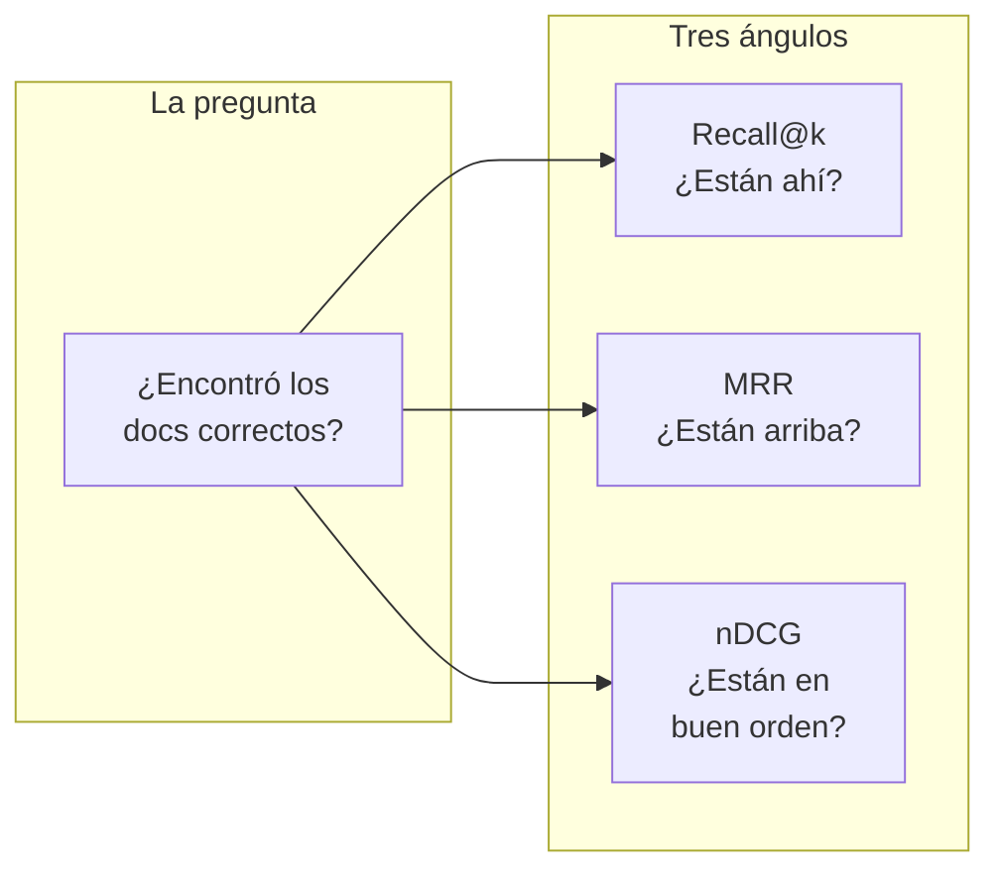
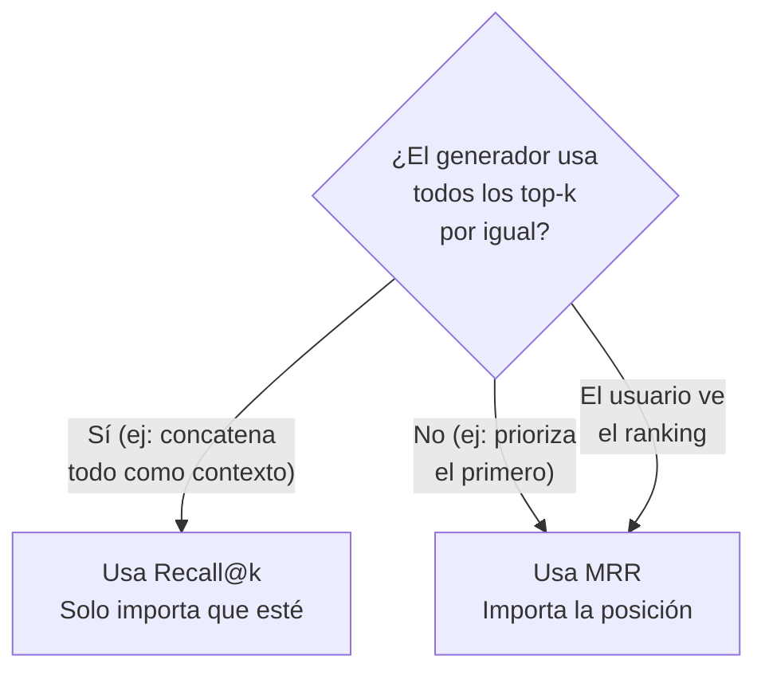
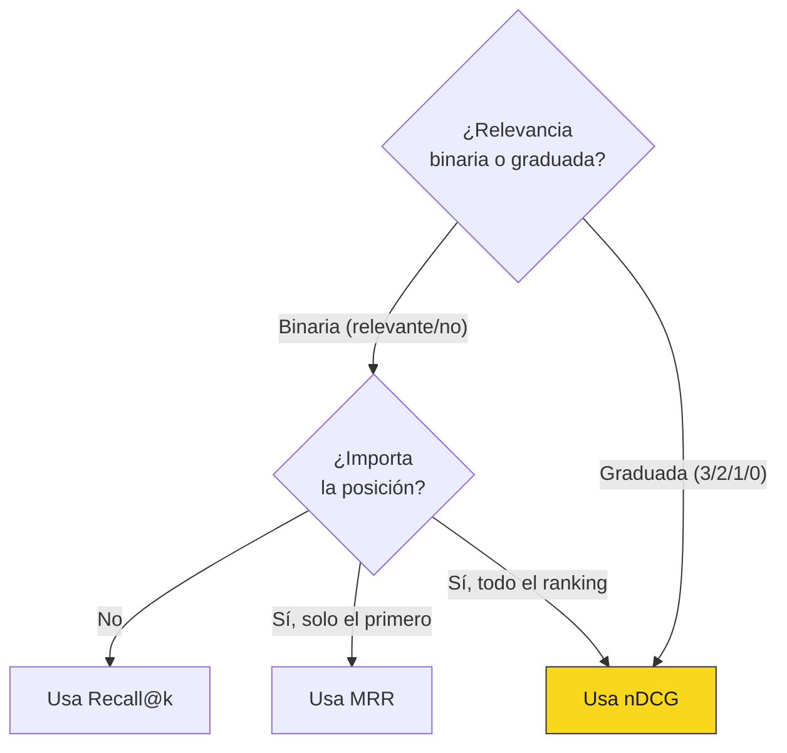
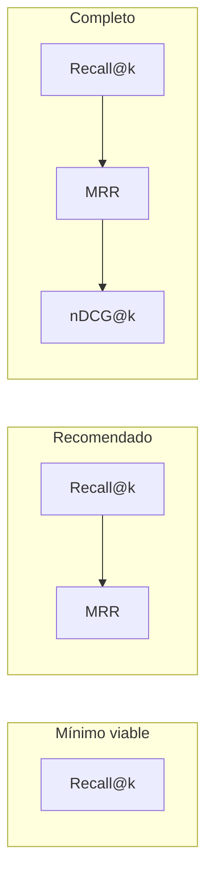

# 05 — Métricas de retrieval

## El retrieval como primer eslabón

En un pipeline RAG, el retriever es el primer filtro. Si falla, todo lo
que sigue — reranking, generación, postprocesamiento — trabaja con
material incorrecto. Es como una cadena de suministro: si la materia
prima está equivocada, no importa qué tan buena sea la fábrica.

Analogía económica: el retriever es el proceso de selección de datos
para un modelo econométrico. Si tus datos están mal (variable proxy
equivocada, período incorrecto, fuente contaminada), el modelo puede
ser sofisticadísimo y la conclusión será basura. Garbage in, garbage out.

Las métricas de retrieval responden una pregunta simple: **¿el sistema
encontró los documentos correctos?** Pero "correcto" tiene matices que
las distintas métricas capturan de forma diferente.

## Las tres métricas fundamentales



| Métrica | Pregunta que responde | Sensible a posición | Cuándo usarla |
|---|---|---|---|
| **Recall@k** | ¿El doc relevante está en los top-k resultados? | No — solo importa si está o no | Cuando el generador puede usar cualquier chunk del top-k |
| **MRR** | ¿Qué tan arriba está el primer doc relevante? | Sí — premia posición alta | Cuando el usuario ve un ranking o el generador prioriza el top-1 |
| **nDCG** | ¿Qué tan bueno es el ordenamiento completo? | Sí — premia orden global | Cuando hay múltiples docs relevantes con distinta importancia |

## Recall@k

### Definición

Para una query q con un conjunto de documentos relevantes R(q):

```
Recall@k(q) = |{docs relevantes en top-k}| / |R(q)|
```

En palabras: de todos los documentos que **deberían** aparecer, ¿qué
fracción efectivamente apareció en los primeros k resultados?

### Ejemplo numérico: queries sobre normativa chilena

Supongamos k=3 (recuperamos 3 chunks por query):

| Query | Docs relevantes R(q) | Top-3 recuperados | Relevantes en top-3 | Recall@3 |
|---|---|---|---|---|
| "¿Tasa de IVA digital?" | {circular-chunk-5} | [circular-chunk-5, circular-chunk-1, decreto-chunk-2] | {circular-chunk-5} | 1/1 = **1.00** |
| "¿Criterios alumno prioritario?" | {decreto-chunk-4, decreto-chunk-5} | [decreto-chunk-4, glosa-chunk-1, norma-chunk-3] | {decreto-chunk-4} | 1/2 = **0.50** |
| "¿Multa Ley de Lobby?" | {norma-chunk-8} | [decreto-chunk-1, circular-chunk-3, glosa-chunk-2] | {} | 0/1 = **0.00** |
| "¿Presupuesto inmunizaciones?" | {glosa-chunk-2} | [glosa-chunk-2, glosa-chunk-4, norma-chunk-1] | {glosa-chunk-2} | 1/1 = **1.00** |
| "¿Sujetos pasivos lobby?" | {norma-chunk-3, norma-chunk-4} | [norma-chunk-3, norma-chunk-4, circular-chunk-1] | {norma-chunk-3, norma-chunk-4} | 2/2 = **1.00** |

**Recall@3 promedio** = (1.00 + 0.50 + 0.00 + 1.00 + 1.00) / 5 = **0.70**

### Interpretación

- Recall@3 = 0.70 significa que, en promedio, el retriever encuentra el
  70% de los documentos relevantes dentro de los top-3.
- El 30% restante se pierde — nunca llega al generador.
- Un recall@3 perfecto (1.00) no garantiza buenas respuestas (el
  generador puede fallar), pero un recall@3 bajo garantiza malas
  respuestas para esas queries.

### Cuándo importa el valor de k

| k | Escenario | Trade-off |
|---|---|---|
| k=1 | Solo usas el top-1 resultado | Muy exigente — cualquier error es fatal |
| k=3 | Típico para RAG con contexto limitado | Buen balance costo/cobertura |
| k=5 | RAG con ventana de contexto amplia | Más tolerante pero más tokens consumidos |
| k=10 | Con reranker posterior | Recall alto pero depende del reranker para ordenar |
| k=20+ | Retrieval inicial antes de reranking | Se optimiza recall; la precisión la pone el reranker |

### Limitaciones

- **No distingue posición**: Recall@3 = 1.0 ya sea que el doc relevante
  esté en posición 1 o en posición 3. Para un generador que pondera
  más el contexto al inicio, esto importa.
- **No distingue relevancia graduada**: trata a todos los docs relevantes
  como iguales. En la práctica, un chunk que contiene exactamente el
  artículo citado es más relevante que uno que menciona el tema.

## MRR (Mean Reciprocal Rank)

### Definición

Para una query q, el Reciprocal Rank es:

```
RR(q) = 1 / rank del primer documento relevante
```

Si el primer doc relevante está en posición 1, RR = 1. En posición 2,
RR = 0.5. En posición 3, RR = 0.33. Si no aparece en top-k, RR = 0.

MRR es el promedio de RR sobre todas las queries:

```
MRR = (1/|Q|) × Σ RR(q)
```

### Ejemplo numérico (mismos datos)

| Query | Primer doc relevante | Posición | RR |
|---|---|---|---|
| "¿Tasa de IVA digital?" | circular-chunk-5 | 1 | 1/1 = **1.000** |
| "¿Criterios alumno prioritario?" | decreto-chunk-4 | 1 | 1/1 = **1.000** |
| "¿Multa Ley de Lobby?" | (no encontrado) | — | **0.000** |
| "¿Presupuesto inmunizaciones?" | glosa-chunk-2 | 1 | 1/1 = **1.000** |
| "¿Sujetos pasivos lobby?" | norma-chunk-3 | 1 | 1/1 = **1.000** |

**MRR** = (1.000 + 1.000 + 0.000 + 1.000 + 1.000) / 5 = **0.800**

### Interpretación

- MRR = 0.80 significa que, en promedio, el primer documento relevante
  aparece alrededor de la posición 1.25 (1/0.80).
- MRR es más sensible que recall a la **calidad del ranking** — premia
  que lo relevante esté arriba.
- En el ejemplo, el MRR (0.80) es mayor que el recall@3 (0.70) porque
  cuando el retriever encuentra el doc, tiende a ponerlo en posición 1.

### Cuándo preferir MRR sobre Recall@k



### Limitaciones

- **Solo mira el primer doc relevante**: si hay 5 docs relevantes y
  el retriever solo encuentra uno (en posición 1), MRR = 1.0 aunque
  se perdieron 4 docs. Recall@5 capturaría ese problema.
- **No captura el orden más allá del primero**: si los docs relevantes
  están en posiciones 2, 3 y 4, MRR solo ve al de posición 2.

## nDCG (Normalized Discounted Cumulative Gain)

### Definición

nDCG captura la calidad del ranking completo, no solo la presencia o
posición del primer resultado.

**Paso 1: Relevancia graduada**

Cada documento tiene un score de relevancia (no binario):

| Score | Significado |
|---|---|
| 3 | Altamente relevante — contiene exactamente la respuesta |
| 2 | Relevante — contiene información útil pero parcial |
| 1 | Marginalmente relevante — menciona el tema |
| 0 | Irrelevante |

**Paso 2: DCG (Discounted Cumulative Gain)**

```
DCG@k = Σᵢ₌₁ᵏ (relᵢ) / log₂(i + 1)
```

La ganancia de cada documento se descuenta por su posición. Un doc
relevante en posición 1 vale más que el mismo doc en posición 5.

**Paso 3: IDCG (Ideal DCG)**

El DCG del ranking perfecto — si ordenaras los docs de mayor a menor
relevancia.

**Paso 4: nDCG**

```
nDCG@k = DCG@k / IDCG@k
```

Normalizado entre 0 y 1.

### Ejemplo numérico detallado

Query: "¿Qué obligaciones tiene un prestador de servicios digitales
extranjero en Chile?"

Docs relevantes con scores de relevancia:
- circular-chunk-7 (sección IV, obligaciones): relevancia = 3
- circular-chunk-5 (sección II, servicios gravados): relevancia = 2
- circular-chunk-8 (sección V, responsabilidad sustituta): relevancia = 1

Top-5 recuperados:

| Pos (i) | Documento | rel | rel / log₂(i+1) |
|---|---|---|---|
| 1 | circular-chunk-5 | 2 | 2 / 1.000 = **2.000** |
| 2 | decreto-chunk-3 | 0 | 0 / 1.585 = **0.000** |
| 3 | circular-chunk-7 | 3 | 3 / 2.000 = **1.500** |
| 4 | norma-chunk-1 | 0 | 0 / 2.322 = **0.000** |
| 5 | circular-chunk-8 | 1 | 1 / 2.585 = **0.387** |

**DCG@5** = 2.000 + 0.000 + 1.500 + 0.000 + 0.387 = **3.887**

Ranking ideal (ordenado por relevancia):

| Pos (i) | Documento | rel | rel / log₂(i+1) |
|---|---|---|---|
| 1 | circular-chunk-7 | 3 | 3 / 1.000 = **3.000** |
| 2 | circular-chunk-5 | 2 | 2 / 1.585 = **1.262** |
| 3 | circular-chunk-8 | 1 | 1 / 2.000 = **0.500** |
| 4 | (no hay más) | 0 | **0.000** |
| 5 | (no hay más) | 0 | **0.000** |

**IDCG@5** = 3.000 + 1.262 + 0.500 = **4.762**

**nDCG@5** = 3.887 / 4.762 = **0.816**

### Interpretación

- nDCG@5 = 0.816 significa que el ranking captura el 81.6% de la calidad
  del ranking perfecto.
- El descuento es sustancial: el doc más relevante (rel=3) estaba en
  posición 3 en lugar de posición 1, lo que penaliza el score.
- Si el chunk-7 hubiera estado en posición 1, el DCG habría sido 4.149 y
  el nDCG 0.871 — una mejora del 7%.

### Cuándo usar nDCG



### Limitaciones

- **Requiere anotación de relevancia graduada**: más costoso que la
  anotación binaria (relevante/no) que usan recall y MRR.
- **Sensible a la escala de relevancia**: ¿3 niveles? ¿5? ¿10? La
  elección afecta el score y no hay estándar.
- **Más difícil de interpretar**: "nDCG = 0.816" es menos intuitivo que
  "recall@3 = 0.70" para un stakeholder no técnico.

## Comparación directa

| | Recall@k | MRR | nDCG@k |
|---|---|---|---|
| **Relevancia** | Binaria | Binaria | Graduada |
| **Sensible a posición** | No | Solo al 1º | A todos |
| **Complejidad de anotación** | Baja | Baja | Media-alta |
| **Interpretabilidad** | Alta | Alta | Media |
| **Mejor para** | "¿Lo encontró?" | "¿Lo encontró rápido?" | "¿El orden es bueno?" |
| **Típico en RAG** | Sí, la más común | Sí, complementaria | Menos común, más en IR clásico |

### Qué métrica(s) usar

La respuesta pragmática para un RAG sobre corpus fiscal:

1. **Siempre reporta Recall@k** — es la línea base. Si el recall es bajo,
   nada más importa.
2. **Agrega MRR** si tu generador pondera posición o si el usuario ve
   una lista de resultados.
3. **Agrega nDCG** si tienes anotación graduada y quieres optimizar el
   orden fino del ranking (típicamente después de agregar un reranker).



## Precision@k y F1: ¿dónde quedan?

**Precision@k** = |relevantes en top-k| / k — qué fracción de los
resultados recuperados son relevantes.

En RAG, precision@k es menos útil que recall@k porque:

- El generador recibe todos los top-k como contexto. Un doc irrelevante
  en el contexto degrada menos que un doc relevante que no está.
- Con k fijo y pequeño (3-5), precision y recall están fuertemente
  correlacionados.

**F1@k** = media armónica de precision@k y recall@k. Útil cuando k es
grande (>10) y quieres penalizar tanto el ruido como la omisión. Para
k=3-5 en RAG, recall@k suele bastar.

## Métricas a nivel de corpus vs query

Todas las métricas anteriores se calculan **por query** y luego se
promedian. Pero el promedio esconde distribución:

| Métrica | Promedio | Mediana | p10 | p90 |
|---|---|---|---|---|
| Recall@3 | 0.70 | 1.00 | 0.00 | 1.00 |

Un recall@3 promedio de 0.70 puede significar:
- **Escenario A**: 70% de las queries tienen recall = 1.0, 30% tienen 0.0
  → distribución bimodal, 30% de queries completamente rotas.
- **Escenario B**: todas las queries tienen recall ≈ 0.70 → degradación
  uniforme, quizás un problema de chunking.

Siempre reporta la distribución, no solo el promedio. Un histograma
o los percentiles (p10, p25, p50, p75, p90) dan mucha más información.

## Estado del arte

| Aspecto | Estado | Detalle |
|---|---|---|
| Recall@k, MRR, nDCG | ✅ Resuelto | Métricas estándar de IR desde los años 90, bien entendidas |
| Relevancia binaria vs graduada | ✅ Resuelto | La teoría es clara; la elección depende del presupuesto de anotación |
| Métricas para multi-hop retrieval | 🟡 En progreso | Cuando la respuesta requiere cruzar N documentos, recall@k por doc no captura la combinatoria |
| Evaluación de chunking | 🔴 Incipiente | No hay métricas estándar para evaluar si el chunking fue bueno independientemente del retrieval |

## Conexión con secciones anteriores y siguientes

- **Sección 4 (golden datasets)**: los campos `expected_docs` y
  `expected_chunks` del golden dataset son el insumo para calcular
  estas métricas.
- **Sección 6 (métricas de generación)**: retrieval y generación se
  evalúan por separado. Un recall perfecto con faithfulness bajo =
  problema de generación. Un recall bajo con faithfulness alta =
  el modelo fue fiel a un contexto equivocado (peor).
- **Sección 8 (estadística)**: estas métricas tienen varianza. Con
  50 queries puedes tener recall@3 = 0.70 ± 0.13. ¿Es mejor que
  0.65? Necesitas bootstrapping para responder (sección 8).
