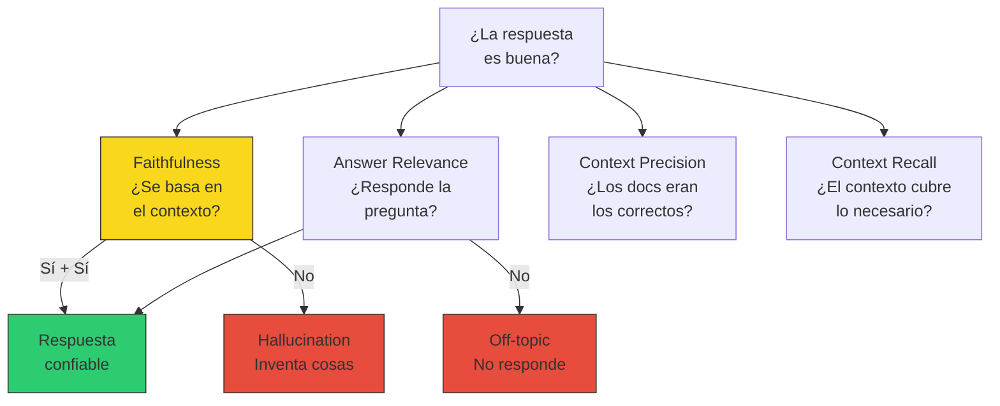
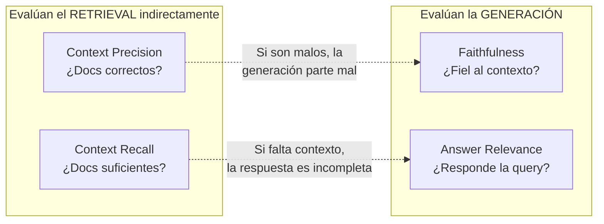
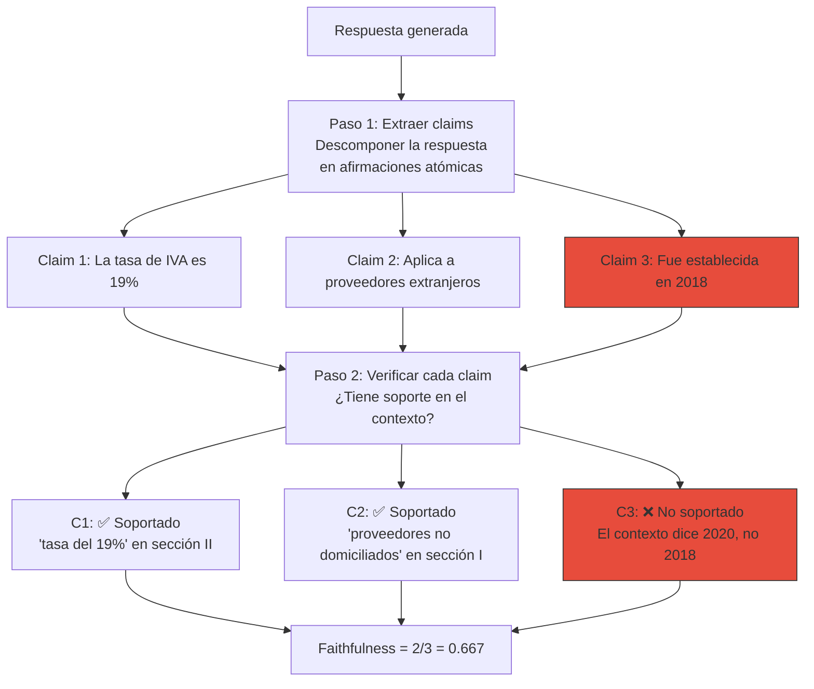
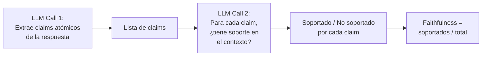
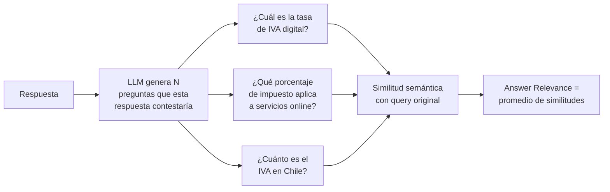
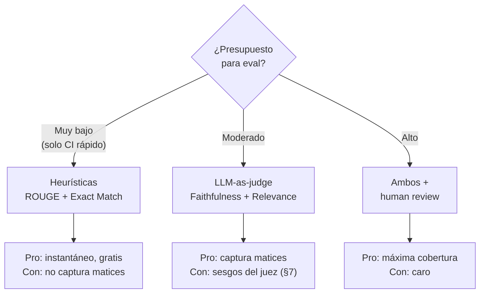
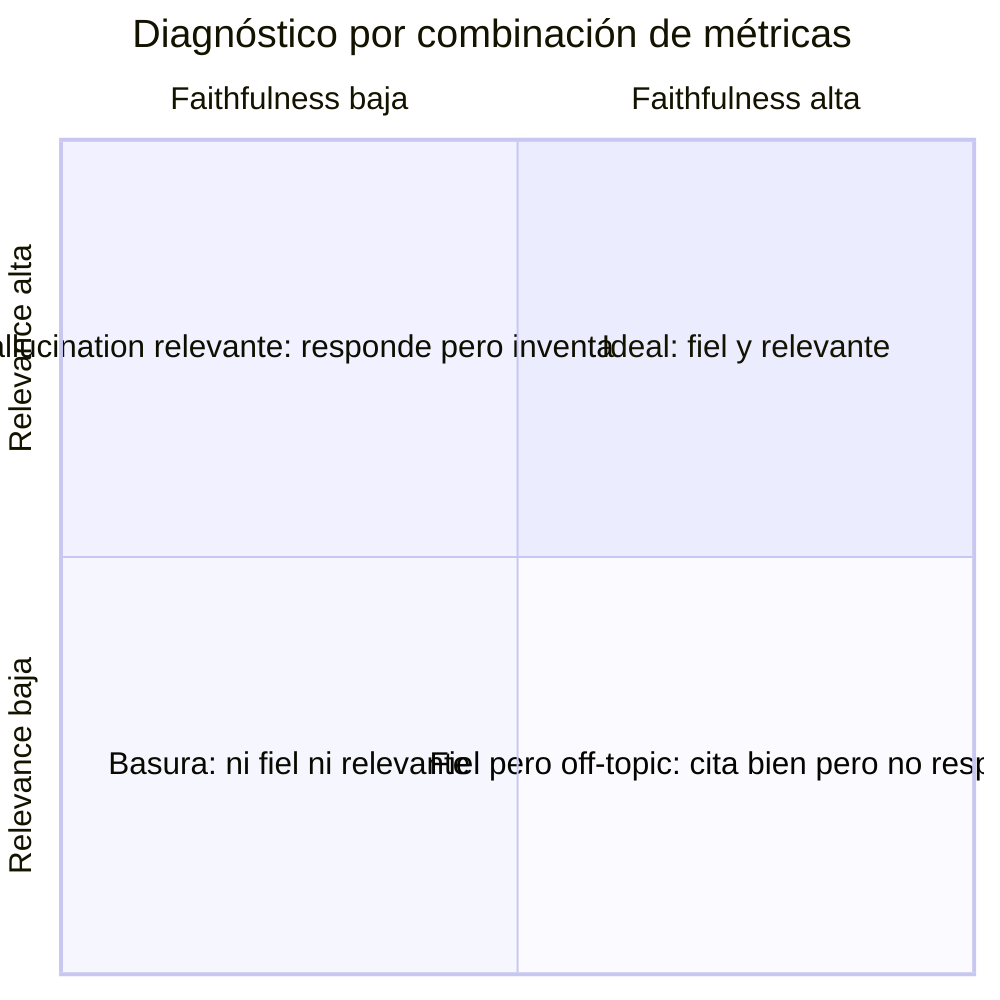

# 06 — Métricas de generación

## El retrieval puede ser perfecto y la respuesta mala

En la sección anterior medimos si el sistema encuentra los documentos
correctos. Ahora medimos algo diferente: **dado que tiene los documentos
correctos, ¿genera una buena respuesta?**

Estas son preguntas distintas. Un retrieval perfecto (recall@3 = 1.0)
con un generador mediocre produce respuestas que citan el documento
correcto pero lo interpretan mal, omiten condiciones o inventan
detalles. Un retrieval malo con un generador excelente produce
respuestas bien escritas y coherentes que dicen cosas incorrectas
— el peor escenario posible.

Analogía económica: el retrieval es la recolección de datos, la
generación es el análisis. Puedes tener datos perfectos y un
analista que los malinterpreta. O un analista brillante trabajando
con datos equivocados. Necesitas evaluar ambos por separado para
saber dónde intervenir.

## Las métricas fundamentales de generación



| Métrica | Pregunta | Input necesario | Requiere gold answer |
|---|---|---|---|
| **Faithfulness** | ¿Cada claim de la respuesta tiene soporte en el contexto? | query + contexto + respuesta | No |
| **Answer relevance** | ¿La respuesta aborda la pregunta formulada? | query + respuesta | No |
| **Context precision** | ¿Los docs recuperados son relevantes para la query? | query + contexto + gold docs | Sí (gold docs) |
| **Context recall** | ¿El contexto cubre toda la información necesaria? | query + contexto + gold answer | Sí (gold answer) |

### Qué mide qué



Context precision y recall son en realidad métricas de retrieval
disfrazadas. Las incluimos aquí porque se evalúan junto con la
generación y porque muchos frameworks (RAGAS, DeepEval) las
presentan así.

## Faithfulness: la métrica más importante

### Definición

Faithfulness mide qué proporción de los claims (afirmaciones factuales)
en la respuesta generada tienen soporte explícito en el contexto
recuperado.

```
Faithfulness = |claims con soporte en contexto| / |total de claims|
```

### El proceso de evaluación



### Ejemplo detallado

**Query**: "¿Qué obligaciones tiene un prestador de servicios digitales
extranjero en Chile?"

**Contexto recuperado** (de la Circular 42 del SII):
> Los prestadores deberán: (a) Registrarse ante el SII a través del
> portal simplificado. (b) Declarar y pagar trimestralmente el IVA,
> dentro de los primeros 20 días del mes siguiente al término del
> trimestre. (c) Emitir comprobante de pago.

**Respuesta generada**:
"Los prestadores de servicios digitales extranjeros deben: (1) registrarse
en el portal simplificado del SII, (2) declarar y pagar IVA mensualmente,
y (3) emitir facturas electrónicas por cada transacción."

**Extracción de claims y verificación**:

| Claim | ¿Soportado? | Evidencia |
|---|---|---|
| Deben registrarse en portal simplificado del SII | ✅ Sí | Literal (a) del contexto |
| Declarar y pagar IVA mensualmente | ❌ No | El contexto dice "trimestralmente", no mensualmente |
| Emitir facturas electrónicas | ❌ No | El contexto dice "comprobante de pago", no "factura electrónica" |

**Faithfulness = 1/3 = 0.333**

Los dos claims erróneos son cualitativamente diferentes:
- "Mensualmente" vs "trimestralmente" es un **misreading** (G3) — el dato
  está ahí pero lo leyó mal.
- "Facturas electrónicas" vs "comprobante de pago" es un **hallucination
  por sustitución** — reemplazó el término correcto por uno plausible
  pero incorrecto.

### Cómo se implementa (LLM-as-judge)

En la práctica, la extracción de claims y la verificación se hacen
con un LLM actuando como juez. El proceso tiene dos llamadas:



> ⚠️ No verificado: la calidad de esta evaluación depende fuertemente
> del modelo juez y del prompt. Un juez débil puede marcar claims
> ambiguos como soportados cuando no lo están. La calibración del juez
> se trata en la sección 7.

## Answer Relevance

### Definición

Answer relevance mide si la respuesta realmente aborda la pregunta
formulada, independientemente de si es correcta o no.

Una respuesta puede ser 100% faithful (todo lo que dice está en el
contexto) y 0% relevant (pero no responde lo que preguntaron).

### Ejemplo

**Query**: "¿Cuál es la tasa de IVA para servicios digitales?"

| Respuesta | Faithfulness | Answer Relevance | Diagnóstico |
|---|---|---|---|
| "La tasa es del 19% según la Circular 42" | Alta | Alta | Correcta |
| "La Circular 42 del SII regula los servicios digitales y fue publicada en 2020" | Alta | Baja | Fiel al contexto pero no responde la pregunta |
| "La tasa es del 15% para todo tipo de servicios" | Baja | Alta | Responde la pregunta pero con dato incorrecto |
| "Los servicios de educación están exentos" | Baja | Baja | Ni fiel ni relevante |

### Implementación

El enfoque más común: generar N preguntas a partir de la respuesta y
medir cuántas se asemejan a la pregunta original.



> Alternativa más simple: un solo LLM call que evalúe directamente
> "¿esta respuesta aborda la pregunta?" en una escala 1-5. Menos
> sofisticado pero más robusto y barato.

## Context Precision y Context Recall

### Context Precision

¿Qué proporción de los documentos recuperados son realmente relevantes?

```
Context Precision = |docs recuperados que son relevantes| / |docs recuperados|
```

Es equivalente a Precision@k de retrieval (sección 5) pero evaluada
en el flujo de generación.

### Context Recall

¿El contexto recuperado cubre toda la información necesaria para
responder correctamente?

```
Context Recall = |claims de la gold answer con soporte en contexto| / |claims de la gold answer|
```

Si la respuesta gold tiene 4 puntos y el contexto recuperado solo
permite derivar 2, el context recall es 0.5.

### Ejemplo

**Query**: "¿Qué criterios usa JUNAEB para determinar alumnos prioritarios?"

**Gold answer**: "(a) Chile Solidario, (b) Tramo A FONASA, (c) Tercil más
vulnerable de la Ficha de Protección Social"

**Contexto recuperado**: chunk que contiene solo los criterios (a) y (b).

| Claim de la gold | ¿En el contexto? |
|---|---|
| Chile Solidario | ✅ |
| Tramo A FONASA | ✅ |
| Tercil más vulnerable FPS | ❌ |

**Context Recall = 2/3 = 0.667**

Interpretación: el contexto no tiene toda la información necesaria.
Si el retriever hubiera recuperado el chunk completo, sería 1.0. Esto
es un problema de retrieval, no de generación.

## Métricas heurísticas vs LLM-based

Antes de LLM-as-judge, se usaban métricas heurísticas. Siguen siendo
útiles como complemento rápido y barato.

### Comparación

| Métrica | Tipo | Qué mide | Costo | Correlación con calidad humana |
|---|---|---|---|---|
| **ROUGE-L** | Heurística | Longest common subsequence entre respuesta y gold | ~$0 | Baja-media para generación libre |
| **BERTScore** | Heurística (embeddings) | Similitud semántica token-level | ~$0.001 | Media |
| **Exact Match** | Heurística | ¿Son idénticas respuesta y gold? | ~$0 | Solo para respuestas cortas/factuales |
| **Faithfulness (LLM)** | LLM-based | Claims soportados en contexto | ~$0.01-0.05 | Alta |
| **Answer Relevance (LLM)** | LLM-based | ¿Responde la pregunta? | ~$0.01-0.05 | Alta |

### Cuándo usar cada tipo



### Limitaciones de las heurísticas

**ROUGE falla cuando**:
- La respuesta es correcta pero usa sinónimos ("19%" vs "diecinueve por ciento")
- La respuesta es más concisa que el gold pero igualmente correcta
- La respuesta reformula el gold manteniendo el significado

**Exact Match falla cuando**:
- Hay variación legítima en formato ("$198.547.320 miles" vs "$198.547.320.000")
- La respuesta incluye contexto adicional correcto que el gold no tiene

**BERTScore es mejor que ROUGE** para capturar similitud semántica, pero
sigue sin capturar la relación entre respuesta y contexto fuente
(faithfulness).

> La recomendación pragmática: usa ROUGE/Exact Match para CI rápido
> (son gratis e instantáneos) y faithfulness LLM-based para pre-release.
> No confíes en una sola métrica heurística como indicador de calidad.

## El cuadrante de diagnóstico

Combinando faithfulness y answer relevance puedes diagnosticar qué tipo
de problema tiene tu sistema:



| Cuadrante | Faithfulness | Relevance | Problema | Acción |
|---|---|---|---|---|
| **Q1** (arriba-derecha) | Alta | Alta | Ninguno | Ship |
| **Q2** (arriba-izquierda) | Baja | Alta | Hallucination | Mejorar grounding, reducir temperatura |
| **Q3** (abajo-izquierda) | Baja | Baja | Todo | Revisar pipeline completo |
| **Q4** (abajo-derecha) | Alta | Baja | Off-topic | Mejorar prompt de generación |

Este cuadrante te da una guía de acción inmediata. Si el 60% de tus
queries caen en Q2 (hallucination relevante), sabes que el problema es
el generador, no el retriever.

## Combinación con métricas de retrieval

Las métricas de generación no reemplazan las de retrieval. Las
complementan. La tabla de diagnóstico completa:

| Recall@k | Faithfulness | Answer Relevance | Diagnóstico |
|---|---|---|---|
| Alto | Alta | Alta | Sistema funcionando bien |
| Alto | Baja | Alta | Retrieval OK, generador hallucina → mejorar prompt/modelo |
| Alto | Alta | Baja | Retrieval OK, generador off-topic → mejorar prompt |
| Bajo | Alta | Alta | Retrieval falla pero generador compensa (peligroso — puede estar inventando con confianza) |
| Bajo | Baja | Alta | Retrieval malo + hallucination → priorizar retrieval |
| Bajo | Baja | Baja | Todo roto → empezar por retrieval |

La combinación "recall bajo + faithfulness alta + relevance alta" es
la más peligrosa: parece que todo funciona, pero el generador puede
estar generando respuestas plausibles sin base documental. Esto es
exactamente el escenario B1 (falsa confianza) de la sección 3.

## Estado del arte

| Aspecto | Estado | Detalle |
|---|---|---|
| Faithfulness | 🟡 Consenso parcial | La más aceptada; la definición varía entre frameworks |
| Answer Relevance | 🟡 En progreso | Múltiples implementaciones, sin estándar |
| Context Precision/Recall | 🟡 En progreso | Popularizadas por RAGAS; adopción creciente |
| ROUGE / BERTScore | ✅ Resuelto | Bien entendidas, limitaciones conocidas |
| Correlación LLM-judge vs humano | 🟡 En progreso | Depende del modelo, prompt y dominio (ver sección 7) |
| Métricas para abstinencia | 🔴 Incipiente | ¿Cómo evaluar "el sistema dijo 'no sé' correctamente"? |

## Conexión con secciones anteriores y siguientes

- **Sección 3 (errores)**: los tipos de error G1-G6 y B1-B4 se detectan
  con estas métricas. Faithfulness captura G1, G3, G5. Answer relevance
  captura G6. Falsa confianza (B1) requiere combinar con retrieval.
- **Sección 5 (retrieval)**: las métricas se complementan. Recall@k dice
  si el contexto es correcto; faithfulness dice si la respuesta es fiel
  al contexto.
- **Sección 7 (LLM-as-judge)**: faithfulness y relevance se implementan
  con LLM-as-judge. Los sesgos del juez (sección 7) afectan directamente
  la confiabilidad de estas métricas.
- **Sección 8 (estadística)**: estas métricas tienen varianza aún mayor
  que las de retrieval (dos fuentes de aleatoriedad: el retriever y el
  generador). El bootstrapping es esencial.
