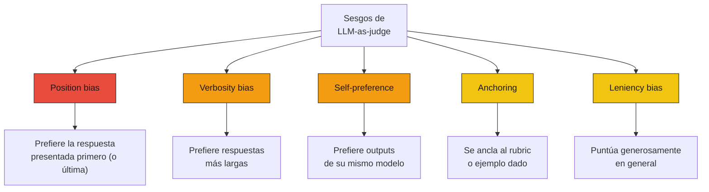
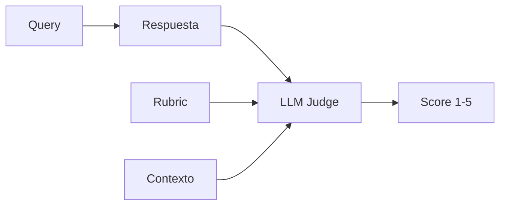
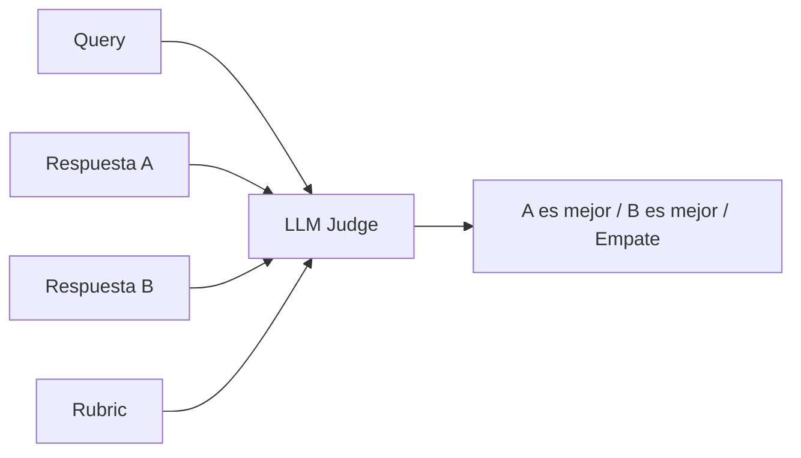
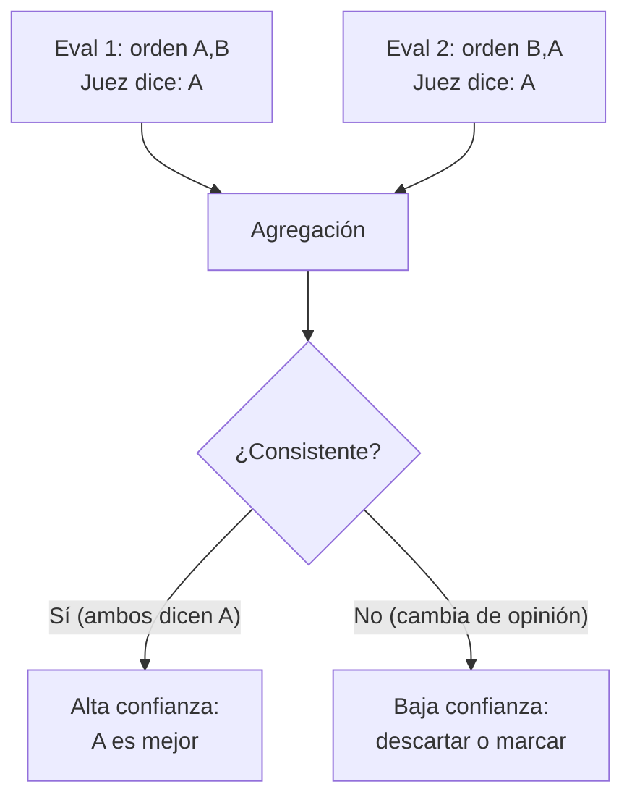
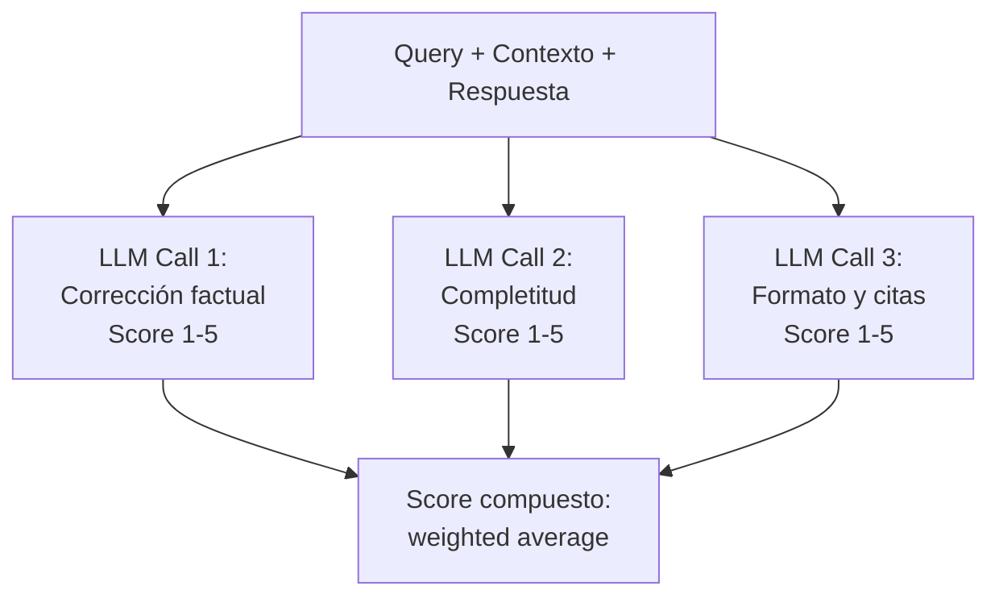
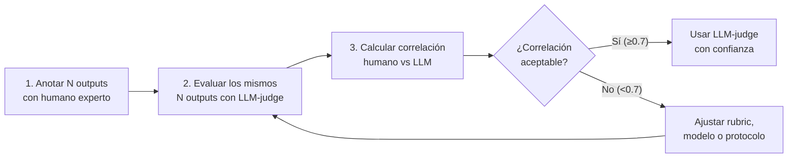
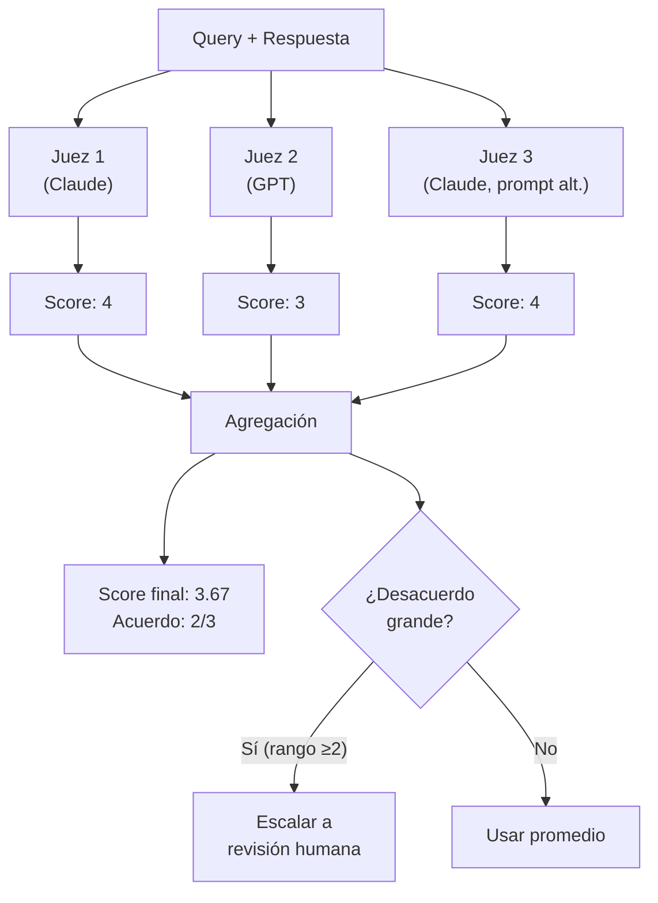

# 07 — LLM-as-judge: sesgos, calibración y protocolos

## Por qué necesitamos jueces automáticos

En las secciones 5 y 6 usamos métricas que requieren juicio: ¿este claim
está soportado en el contexto? ¿Esta respuesta es relevante? Alguien
tiene que emitir ese juicio. Las opciones son:

| Juez | Costo por query | Velocidad | Escalabilidad | Calidad |
|---|---|---|---|---|
| Humano experto | $2-10 | Minutos | No escala | Gold standard |
| Humano crowd | $0.10-0.50 | Minutos | Escala parcial | Variable |
| LLM-as-judge | $0.01-0.05 | Segundos | Escala total | Sesgada pero útil |
| Heurística (ROUGE) | ~$0 | Milisegundos | Escala total | Baja para generación libre |

La aritmética es simple: si tienes 200 queries en tu golden dataset y
quieres evaluar faithfulness (2 LLM calls por query: extraer claims +
verificar), son 400 llamadas. Con un humano a $5/query eso son $1,000
por eval-run. Con un LLM a $0.03/call son $12. La diferencia es de
dos órdenes de magnitud.

Analogía económica: es la diferencia entre auditoría manual (cara,
precisa, lenta) y monitoreo automatizado (barato, rápido, con sesgos
conocidos). Usas el automatizado para el día a día y el manual para
calibrar el automatizado.

## Los sesgos documentados

El problema con LLM-as-judge es que no es un juez imparcial. Tiene
sesgos sistemáticos, predecibles y medibles. La buena noticia: como
son sistemáticos, puedes mitigarlos.

### Mapa de sesgos



### 1. Position bias

**Qué es**: cuando el juez compara dos respuestas (A vs B), tiende a
preferir la que aparece en cierta posición — típicamente la primera
(primacy bias) o la última (recency bias).

**Magnitud**: estudios muestran diferencias de 5-15 puntos porcentuales
en tasa de preferencia solo por cambiar el orden de presentación.

> ⚠️ No verificado: las magnitudes exactas varían entre modelos y
> versiones. Los estudios más citados son de 2023-2024 (Zheng et al.,
> "Judging LLM-as-a-Judge"). Verificar con publicaciones recientes.

**Ejemplo**:

```
Prompt A primero:  "Respuesta A es mejor" → 62% de las veces
Prompt B primero:  "Respuesta B es mejor" → 58% de las veces

La respuesta A no es mejor — el juez prefiere lo que ve primero.
```

**Mitigación**: evaluar en ambos órdenes y promediar (o descartar
si el juez cambia de opinión).

### 2. Verbosity bias

**Qué es**: el juez tiende a preferir respuestas más largas, incluso
cuando la información adicional es redundante o irrelevante.

**Por qué ocurre**: los modelos fueron entrenados con RLHF donde las
respuestas largas y detalladas recibían mejor feedback. Ese sesgo
se transfiere al rol de juez.

**Ejemplo en dominio fiscal**:

| Respuesta A (concisa) | Respuesta B (verbosa) |
|---|---|
| "La tasa de IVA para servicios digitales es del 19% (Circular 42 SII)." | "Conforme a lo establecido en la Circular Nº 42 emanada del Servicio de Impuestos Internos, publicada durante el año 2020, la tasa impositiva correspondiente al Impuesto al Valor Agregado aplicable a los servicios de naturaleza digital prestados por proveedores domiciliados en el extranjero alcanza un valor del 19%." |
| **Correcta, completa, citable** | **Correcta, pero inflada — misma información en 4x más palabras** |

Un juez con verbosity bias preferirá B. Un humano experto preferirá A.

**Mitigación**: incluir en el rubric que la concisión es una virtud,
no un defecto. Penalizar explícitamente la redundancia.

### 3. Self-preference

**Qué es**: un modelo tiende a preferir outputs generados por sí mismo
(o por modelos de su misma familia) sobre outputs de otros modelos.

**Implicación práctica**: si usas Claude como juez para evaluar outputs
de Claude vs GPT, los resultados estarán sesgados a favor de Claude
(y viceversa si usas GPT como juez).

**Mitigación**:
- Usar un modelo diferente como juez del que genera las respuestas
- Si usas el mismo modelo, ser consciente del sesgo y reportarlo
- Calibrar con juicio humano (ver sección de calibración)

### 4. Anchoring

**Qué es**: el juez se ancla al primer ejemplo o criterio del rubric
y le da peso desproporcionado.

**Ejemplo**: si tu rubric dice "Evalúa: (1) corrección factual,
(2) completitud, (3) formato", el juez pondera más la corrección
factual no porque sea más importante, sino porque aparece primero.

**Mitigación**: rotar el orden de los criterios entre evaluaciones,
o evaluar cada criterio en una llamada separada.

### 5. Leniency bias

**Qué es**: el juez tiende a dar puntuaciones altas en general.
En una escala 1-5, el promedio suele estar en 3.5-4.2 en lugar del
3.0 teórico.

**Por qué importa**: comprime el rango útil de la escala. Si todo
está entre 3.5 y 4.5, tienes poco poder de discriminación.

**Mitigación**: usar escalas con anchors explícitos para cada nivel,
forzar distribución (ej: "máximo 20% puede ser 5/5"), o usar
comparación pareada en lugar de puntuación absoluta.

## Protocolos de evaluación

### Protocolo 1: Puntuación directa (pointwise)



El juez recibe la query, el contexto, la respuesta y un rubric,
y asigna un score.

**Ventajas**: simple, un solo LLM call por evaluación.

**Desventajas**: sujeto a leniency bias, anchoring. Los scores
absolutos son difíciles de comparar entre modelos o versiones del
juez.

**Cuándo usarlo**: evaluación rápida de un solo sistema. Faithfulness
y answer relevance típicamente usan este protocolo.

### Protocolo 2: Comparación pareada (pairwise)



El juez compara dos respuestas y dice cuál es mejor.

**Ventajas**: más discriminativo que puntuación directa. Los humanos
también son mejores comparando que puntuando en absoluto.

**Desventajas**: sujeto a position bias. Requiere O(n²) comparaciones
para rankear n respuestas.

**Cuándo usarlo**: comparar dos versiones de un sistema (A/B testing
offline). Útil para decisiones de "¿este cambio mejoró o empeoró?".

**Mitigación del position bias**:



### Protocolo 3: Evaluación por criterio (rubric-based)



Evalúa cada criterio por separado en llamadas independientes.

**Ventajas**: reduce anchoring (cada criterio se evalúa sin
contaminación de los otros). Más granular — sabes dónde falla.

**Desventajas**: más caro (N llamadas por evaluación). Más lento.

**Cuándo usarlo**: evaluaciones pre-release donde necesitas
diagnóstico detallado.

### Comparación de protocolos

| Protocolo | Calls/eval | Position bias | Leniency | Granularidad | Mejor para |
|---|---|---|---|---|---|
| Pointwise | 1 | N/A | Alto | Baja | Screening rápido |
| Pairwise | 2 (con swap) | Mitigable | Bajo | Comparativa | A/B testing |
| Rubric-based | N criterios | N/A | Medio | Alta | Diagnóstico detallado |

## Diseño de rubrics

El rubric es el instrumento más importante del juez. Un rubric mal
diseñado produce evaluaciones inconsistentes independientemente del
modelo.

### Principios

1. **Criterios mutuamente excluyentes**: cada aspecto se evalúa una
   sola vez. No pedir "corrección" y "precisión" como criterios
   separados si significan lo mismo.

2. **Anchors por nivel**: cada score (1-5) tiene una definición
   explícita con ejemplo, no solo una etiqueta vaga.

3. **Dominio-específico**: un rubric genérico ("¿es buena la respuesta?")
   no captura lo que importa en tu dominio.

### Ejemplo: rubric de faithfulness para RAG fiscal

```
Evalúa si la respuesta se basa exclusivamente en el contexto proporcionado.

Score 5 - Totalmente fiel:
  Cada afirmación tiene soporte directo en el contexto.
  No hay información añadida.
  Ejemplo: "La tasa es del 19% (Circular 42)" cuando el contexto
  dice exactamente "tasa del 19%".

Score 4 - Mayormente fiel:
  La información principal es correcta y soportada.
  Hay inferencias razonables pero no verificables directamente.
  Ejemplo: Dice "impuesto a plataformas como Netflix" cuando el
  contexto dice "servicios de entretenimiento digital" sin nombrar
  Netflix.

Score 3 - Parcialmente fiel:
  Mezcla información soportada con información no soportada.
  Los datos principales son correctos pero hay adiciones no verificables.
  Ejemplo: Cita correctamente la tasa pero agrega una fecha de
  implementación que no está en el contexto.

Score 2 - Mayormente infiel:
  La mayor parte de la respuesta no tiene soporte en el contexto.
  Puede haber datos correctos pero la narrativa general es inventada.
  Ejemplo: Describe un proceso de registro que no aparece en el
  contexto proporcionado.

Score 1 - Completamente infiel:
  La respuesta contradice el contexto o no tiene relación con él.
  Ejemplo: Dice "la tasa es del 15%" cuando el contexto dice "19%".
```

### Anti-patrones en rubrics

| Anti-patrón | Ejemplo | Problema |
|---|---|---|
| **Anchors vagos** | "5 = Excelente, 1 = Malo" | El juez no sabe qué distingue un 3 de un 4 |
| **Criterios solapados** | "Evalúa corrección Y precisión" | Son lo mismo — el juez los puntúa igual |
| **Sin ejemplos** | Solo definiciones abstractas | El juez interpreta a su manera |
| **Escala demasiado fina** | Escala 1-10 | El juez no discrimina entre 6 y 7 — comprime a 3-4 niveles |
| **Ignorar abstención** | No define qué puntuar cuando el sistema dice "no sé" | El juez penaliza la abstención correcta |

## Calibración: ¿el juez correlaciona con humanos?

### El proceso de calibración



### Métricas de correlación

| Métrica | Qué mide | Rango | Umbral aceptable |
|---|---|---|---|
| **Cohen's κ** | Acuerdo categórico (corregido por azar) | -1 a 1 | ≥0.6 (sustancial) |
| **Spearman's ρ** | Correlación de rankings | -1 a 1 | ≥0.7 |
| **Pearson's r** | Correlación lineal de scores | -1 a 1 | ≥0.7 |
| **% de acuerdo** | Fracción de juicios iguales | 0 a 1 | ≥0.8 (pero no corrige por azar) |

### Cuántas muestras necesitas para calibrar

La calibración necesita un subconjunto anotado por humanos. ¿Cuánto?

| Objetivo | n mínimo | Justificación |
|---|---|---|
| Estimación gruesa de correlación | 30-50 | IC amplio pero detecta problemas graves |
| Estimación confiable | 100-150 | IC del ±0.1 para correlación |
| Calibración por categoría | 200+ | Permite segmentar por tipo de query |

> Estos n vienen de la teoría de estimación de coeficientes de
> correlación. Para Pearson's r con n=50, el IC 95% para r=0.7
> es aproximadamente [0.52, 0.82] — todavía amplio.

### Cuándo recalibrar

- Cuando cambias el modelo juez (nueva versión)
- Cuando cambias el rubric
- Cuando el dominio cambia significativamente (nuevos tipos de documentos)
- Como mínimo, trimestralmente

## Multi-judge: reducir varianza

Usar múltiples jueces (mismo modelo con distintos prompts, o distintos
modelos) reduce la varianza de la evaluación.



**Ventajas**: reduce varianza, detecta casos ambiguos.

**Desventajas**: 2-3x más caro. Solo vale la pena para evaluaciones
pre-release o calibración, no para CI diario.

## Lo que está resuelto y lo que no

| Aspecto | Estado | Detalle |
|---|---|---|
| Position bias | ✅ Documentado y mitigable | Swap + promedio funciona bien |
| Verbosity bias | 🟡 Documentado, mitigación parcial | Rubrics ayudan pero no eliminan |
| Self-preference | 🟡 Documentado, difícil de mitigar | Usar juez distinto del generador es la mejor opción |
| Calibración humano-LLM | 🟡 En progreso | Correlaciones de 0.6-0.8 son típicas; varía mucho por dominio |
| Jueces para dominios especializados | 🔴 Incipiente | Pocos datos sobre calibración en legal/fiscal |
| Rubrics estandarizados | 🔴 No existe | Cada equipo diseña los suyos |

## Conexión con secciones anteriores y siguientes

- **Sección 6 (métricas de generación)**: faithfulness y answer relevance
  se implementan con LLM-as-judge. Los sesgos de esta sección afectan
  directamente esas métricas.
- **Sección 8 (estadística)**: la varianza del juez se suma a la varianza
  del sistema. El bootstrapping debe considerar ambas fuentes.
- **Sección 10 (costo/Pareto)**: el costo del juez es un componente
  principal del costo total de evaluación.
- **Sección 11 (online evals)**: en producción, el juez evalúa muestras
  de tráfico real. La velocidad y costo importan más.
- **Sección 12 (legal/fiscal)**: los sesgos del juez son especialmente
  problemáticos en dominios alto-stake donde la precisión importa más.
