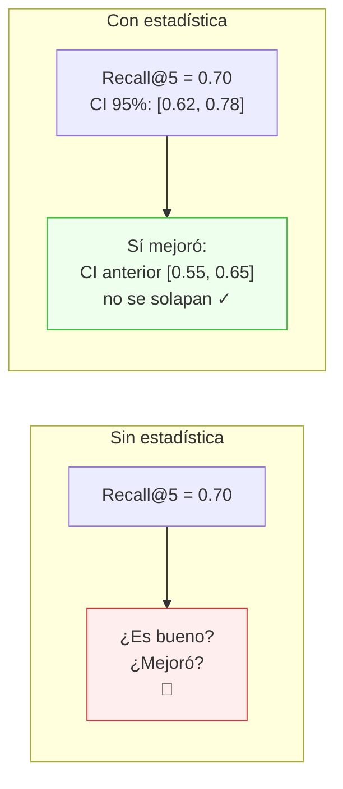
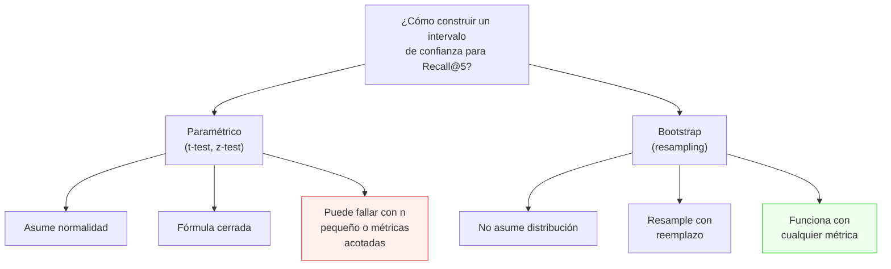
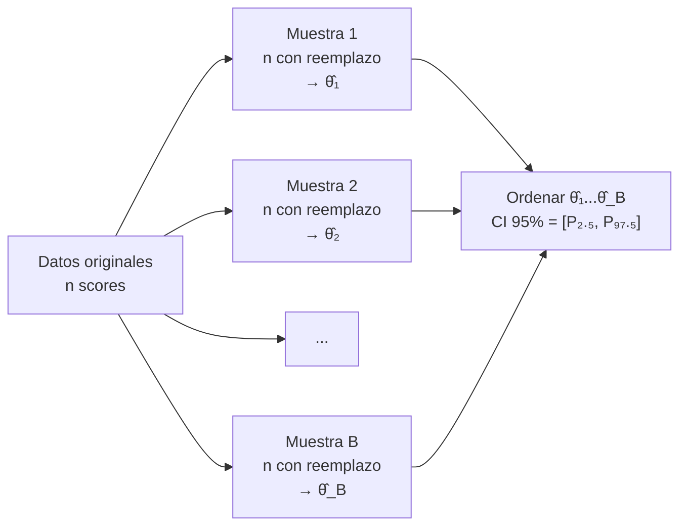
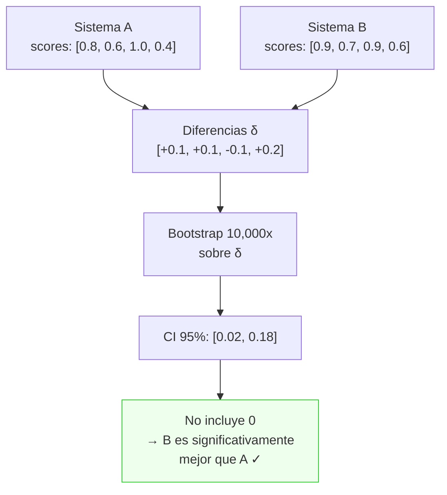
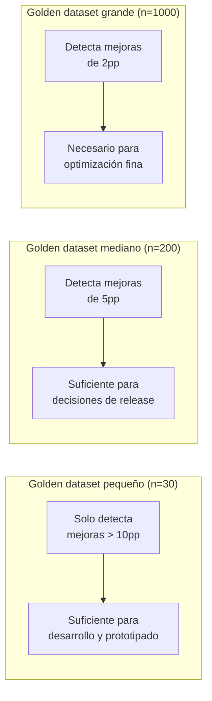
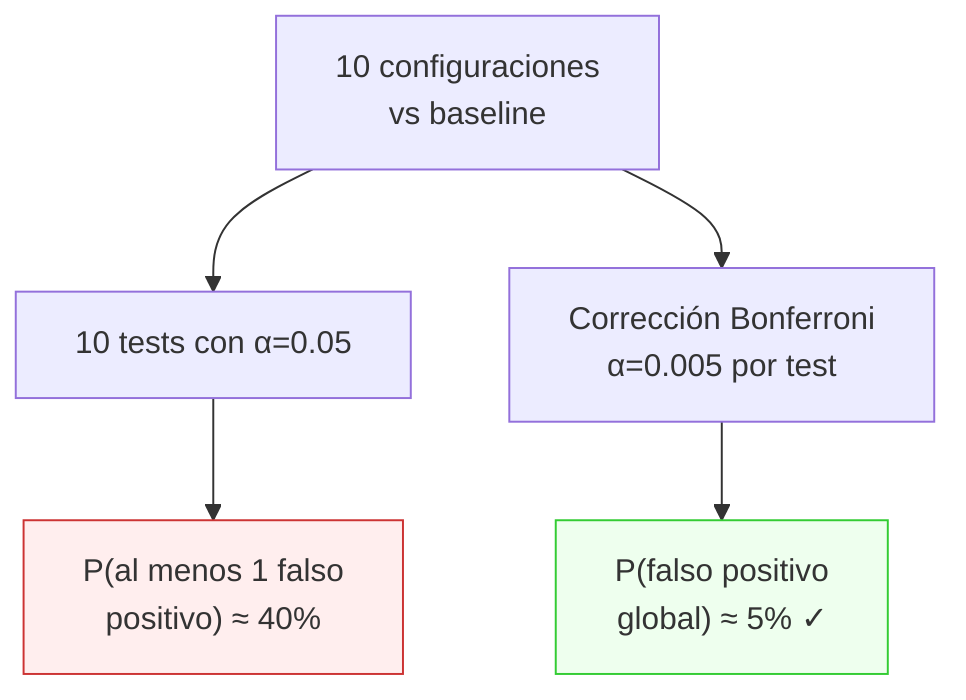
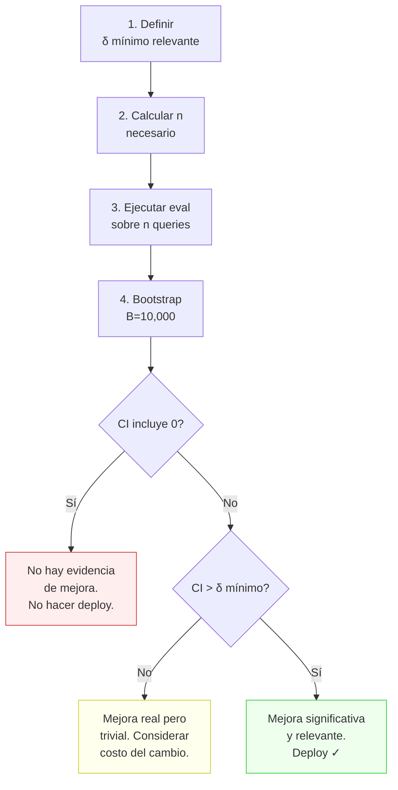

# 08 — Estadística para sistemas estocásticos

## El problema: misma query, diferente respuesta

Un sistema RAG basado en LLMs es **inherentemente estocástico**: la misma query puede
producir respuestas diferentes entre ejecuciones (variación en generación, en retrieval
si hay embeddings actualizados, en el orden de chunks). Esto significa que una sola
medición de Recall@5 = 0.70 no dice nada sin un intervalo de confianza.

**Analogía económica:** es como medir el rendimiento de un portafolio de inversión.
Un rendimiento promedio del 8% es muy distinto si la desviación estándar es 2% vs 20%.
Sin la varianza, el promedio es información incompleta. En evals, sin bootstrapping,
una mejora de 0.65 → 0.70 puede ser ruido estadístico o una mejora real — y la decisión
de hacer deploy depende de saberlo.



## Por qué bootstrapping y no tests paramétricos

Las métricas de eval (Recall, nDCG, Faithfulness) **no son normales**. Son proporciones,
rankings, y scores truncados entre 0 y 1. Los tests paramétricos clásicos (t-test, z-test)
asumen normalidad en los datos o en la distribución muestral (por CLT con n grande).

El **bootstrap** no asume nada sobre la distribución. Solo asume que tu muestra es
representativa de la población — algo razonable si tu golden dataset tiene buena cobertura
(sección 4).



**Analogía económica:** el bootstrap es como un análisis de escenarios Monte Carlo
para estimar el VaR de un portafolio — en vez de asumir retornos normales (que sabemos
no lo son), simulas miles de escenarios a partir de datos históricos reales.

## El algoritmo de bootstrap

El procedimiento es engañosamente simple:

1. Tienes `n` observaciones (scores de eval por query)
2. Generas `B` muestras de bootstrap (típicamente B = 10,000):
   - Cada muestra: selecciona `n` observaciones **con reemplazo**
   - Calcula la estadística de interés (media, mediana, etc.)
3. El intervalo de confianza al 95% = percentiles 2.5 y 97.5 de las B estadísticas



### Ejemplo numérico

Supongamos 10 queries con Recall@5 = `[1.0, 0.5, 1.0, 0.0, 1.0, 1.0, 0.5, 0.0, 1.0, 0.5]`.

- Media observada: 0.65
- Una muestra bootstrap (con reemplazo): `[1.0, 1.0, 0.5, 1.0, 0.5, 0.0, 1.0, 0.5, 1.0, 1.0]` → media = 0.75
- Otra muestra: `[0.0, 0.5, 0.0, 0.5, 1.0, 0.5, 0.5, 0.0, 0.5, 0.0]` → media = 0.30
- Repetir 10,000 veces → distribución de medias → CI 95%

**Intuición:** el bootstrap pregunta "¿qué tan diferente sería mi conclusión si hubiera
tenido una muestra ligeramente distinta?" — capturando la incertidumbre muestral.

## Tipos de intervalos de confianza bootstrap

| Método | Fórmula | Cuándo usar |
|--------|---------|-------------|
| **Percentil** | `[P_{α/2}, P_{1-α/2}]` | Caso general, simple y robusto |
| **BCa** (bias-corrected accelerated) | Corrige sesgo y asimetría | Cuando la distribución bootstrap es sesgada |
| **Normal** | `θ̂ ± z_{α/2} · SE_boot` | Solo si la distribución bootstrap es simétrica |

Para evals, el **método de percentil** es suficiente en la gran mayoría de casos.
El BCa es preferible cuando tu métrica tiene distribución muy asimétrica (e.g., nDCG
con muchos ceros).

## Bootstrap para comparar dos sistemas

El caso más importante: ¿el sistema B es mejor que el sistema A?

### Bootstrap pareado (paired bootstrap)

Las queries son las mismas para ambos sistemas, así que las diferencias están pareadas:

1. Para cada query `i`, calcular `δᵢ = score_B(i) - score_A(i)`
2. Aplicar bootstrap sobre los `δᵢ`
3. Si el CI 95% de la media de δ **no incluye 0** → la diferencia es significativa



**Analogía económica:** es como un test pareado de diferencia de medias para rendimientos
de dos portafolios medidos en los mismos períodos. No comparas los rendimientos por
separado — comparas la diferencia período a período.

### Test de permutación (alternativa)

Otra opción: bajo H₀ (los sistemas son iguales), la asignación de scores entre A y B
es intercambiable. Permutas aleatoriamente las etiquetas A/B para cada query y calculas
la distribución nula.

| Aspecto | Bootstrap pareado | Permutación |
|---------|-------------------|-------------|
| **H₀** | Diferencia media = 0 | Distribuciones idénticas |
| **Asume** | Muestra representativa | Intercambiabilidad |
| **Produce** | CI para la diferencia | p-value |
| **Ventaja** | CI interpretable | Control preciso del error tipo I |
| **Recomendado** | Para reportar magnitud | Para decisiones go/no-go |

## Poder estadístico y tamaño de muestra

### ¿Cuántas queries necesitas?

El **poder estadístico** es la probabilidad de detectar una mejora real. Depende de:

- **Tamaño del efecto** (δ): qué tan grande es la mejora que quieres detectar
- **Varianza** (σ²): qué tan ruidosas son tus métricas
- **n**: cuántas queries evalúas
- **α**: nivel de significancia (típicamente 0.05)

**Regla práctica para evals:**

| Efecto esperado | Descripción | n mínimo (aprox.) |
|-----------------|-------------|-------------------|
| δ = 0.10 | Mejora grande (10pp en Recall) | ~30-50 |
| δ = 0.05 | Mejora moderada (5pp) | ~100-200 |
| δ = 0.02 | Mejora pequeña (2pp) | ~500+ |

Estos números asumen σ ≈ 0.3 (varianza típica de Recall@5 binario) y poder del 80%.



### Fórmula aproximada

Para un test pareado con α = 0.05 y poder = 0.80:

```
n ≈ (z_α + z_β)² × σ² / δ²
n ≈ (1.96 + 0.84)² × σ² / δ²
n ≈ 7.85 × σ² / δ²
```

Con σ = 0.3 y δ = 0.05: n ≈ 7.85 × 0.09 / 0.0025 ≈ 283 queries.

**Analogía económica:** es exactamente el cálculo de tamaño de muestra para una encuesta.
Si quieres detectar una diferencia del 5% con 95% de confianza, necesitas ~400
encuestados. La lógica es la misma: más precisión requiere más datos.

## Trampas comunes

### 1. Comparaciones múltiples

Si comparas 10 configuraciones contra el baseline, con α = 0.05 tendrás ~0.5 falsos
positivos por pura suerte. Usa corrección de Bonferroni (α/m) o Holm-Bonferroni.



### 2. El CI no es lo que crees

- ✅ "Si repitiéramos el experimento muchas veces, el 95% de los CIs contendrían el valor real"
- ❌ "Hay 95% de probabilidad de que el valor real esté en este CI"

La diferencia es sutil pero importante: el parámetro es fijo, lo que varía es el CI
entre experimentos.

### 3. Significancia ≠ importancia

Un CI de [+0.001, +0.005] para la mejora en Recall es "estadísticamente significativo"
pero **operacionalmente irrelevante**. Define un **umbral de relevancia práctica**
antes de evaluar:

- Para retrieval: δ < 2pp probablemente no vale un deploy
- Para faithfulness: cualquier mejora en citas incorrectas es relevante (dominio fiscal)
- Para latencia: δ < 100ms es imperceptible para el usuario

### 4. Bootstrap con n muy pequeño

Con n < 15, el bootstrap genera CIs inestables. Con n < 8, directamente no es confiable.
Para golden datasets pequeños, reporta el rango observado en vez de un CI formal.

## Protocolo recomendado para evals



## Conexión con otras secciones

| Dependencia | Sección | Conexión |
|-------------|---------|----------|
| ← | 4. Golden datasets | El tamaño del golden dataset determina el poder estadístico |
| ← | 5. Métricas retrieval | Recall@k, MRR, nDCG son las métricas a las que aplicamos bootstrap |
| ← | 6. Métricas generación | Faithfulness, relevance son las métricas de generación con CI |
| → | 9. Regresiones y CI | Los CIs se integran como gates en el pipeline CI |

## Estado del arte (2025-2026)

- **Bootstrap para evals** está bien resuelto teóricamente. La adopción en equipos de ML
  es baja — la mayoría reporta promedios sin intervalos de confianza.
- **Frameworks**: ningún framework de eval popular (RAGAS, DeepEval) implementa
  bootstrapping nativo. Hay que añadirlo como capa encima.
- **Alternativas**: algunos equipos usan Bayesian bootstrap (que produce una distribución
  posterior) o credible intervals. La diferencia práctica es mínima para n > 30.
- **Significancia en LLMs**: con temperature > 0, hay dos fuentes de varianza: la del
  sampling del golden dataset y la de la generación. Un protocolo robusto debería
  ejecutar cada query K veces y hacer bootstrap sobre los promedios por query, pero
  el costo en tokens puede ser prohibitivo (ver sección 10).
