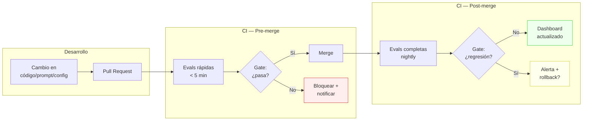
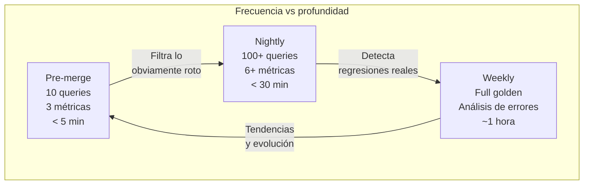
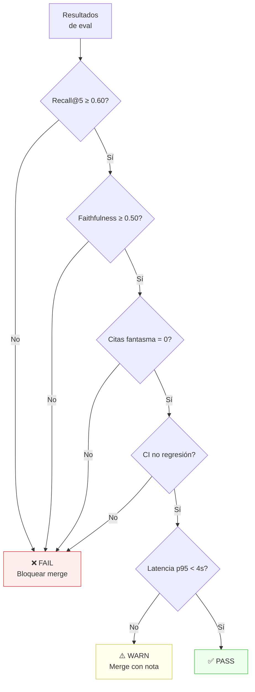
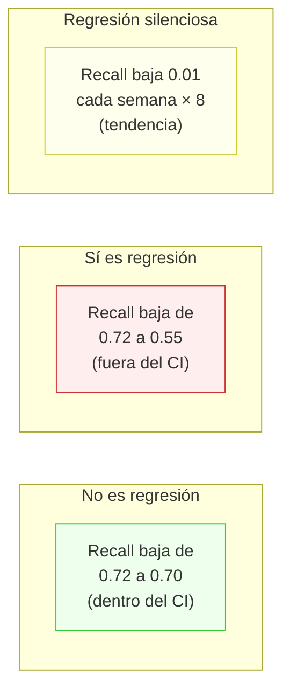
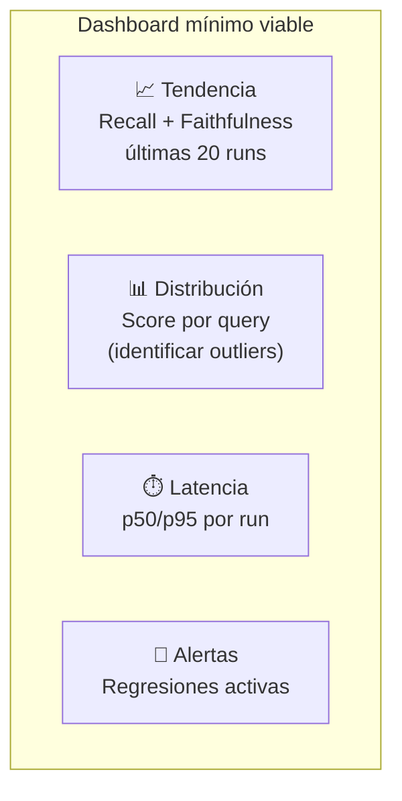
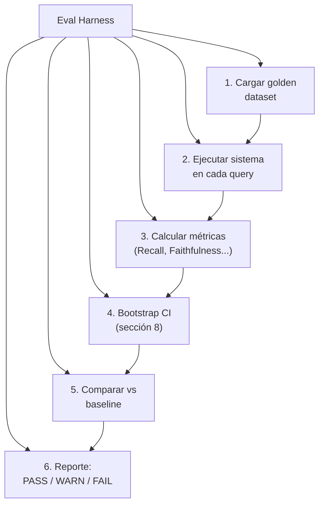

# 09 — Regresiones y CI

## El problema: evals que nadie corre

Tener métricas, golden datasets y bootstrap no sirve de nada si las evaluaciones
no se ejecutan de forma sistemática. La mayoría de equipos tienen evals que "alguien
corre a veces" — un proceso manual que inevitablemente se abandona cuando hay presión
de entrega.

**Analogía económica:** es como tener estados financieros pero no auditoría periódica.
La información existe, pero sin un proceso obligatorio de revisión, nadie la mira
hasta que hay una crisis. El CI con evals es la auditoría automatizada: corre siempre,
bloquea si hay problemas, y genera un registro histórico.

## Evals en el ciclo de desarrollo



## Qué correr en cada etapa

### Pre-merge (en cada PR)

Objetivo: **detectar regresiones obvias rápido**. Presupuesto: < 5 minutos, < $0.50.

| Eval | Métrica | Umbral | Costo |
|------|---------|--------|-------|
| Smoke test: 10 queries críticas | Recall@5 | ≥ 0.80 | ~$0.05 |
| Faithfulness spot-check: 5 queries | Faithfulness media | ≥ 0.70 | ~$0.20 |
| Format check: 10 respuestas | % formato correcto | = 100% | ~$0.05 |
| Latencia: 10 queries | p95 latencia | < 5s | ~$0.05 |

**Regla:** el subset pre-merge debe cubrir los **failure modes más costosos**
(sección 3), no ser una muestra aleatoria del golden dataset. Selecciona las queries
que históricamente han causado regresiones o que representan los casos más críticos.

### Nightly (post-merge, completo)

Objetivo: **evaluación rigurosa con intervalos de confianza**. Presupuesto: < 30 min, < $5.

| Eval | Métrica | Umbral | n queries |
|------|---------|--------|-----------|
| Retrieval completo | Recall@5, MRR, nDCG@5 | CI 95% no cae de baseline | Todo el golden |
| Generación completa | Faithfulness, Relevance | CI 95% no cae de baseline | Todo el golden |
| LLM-as-judge | Score ponderado con rúbrica | Media ≥ baseline - δ | 30+ queries |
| Cross-diagnóstico | Cuadrante faithfulness × relevance | Sin migración a Q3/Q4 | Todo el golden |

### Weekly (análisis profundo)

Objetivo: **detectar degradación lenta y tendencias**.

- Comparar métricas de las últimas 4 semanas (gráfico de tendencia)
- Análisis de errores sobre los peores outputs de la semana
- Revisión de queries nuevas que deberían entrar al golden dataset
- Actualización de umbrales si el baseline mejoró



## Diseño de gates

Un **gate** es una condición que debe cumplirse para que el pipeline continúe.
Un gate mal diseñado es peor que no tener gate: si es muy estricto, bloquea cambios
legítimos; si es muy laxo, deja pasar regresiones.

### Tipos de gate

| Tipo | Condición | Cuándo usar |
|------|-----------|-------------|
| **Absoluto** | `métrica ≥ umbral` | Para mínimos no negociables (faithfulness ≥ 0.60) |
| **Relativo** | `métrica ≥ baseline - δ` | Para métricas donde el baseline evoluciona |
| **Estadístico** | `CI 95% de (nuevo - baseline) > -δ` | Cuando hay varianza (sección 8) |
| **Tendencia** | `pendiente de últimas N runs ≥ 0` | Para detectar degradación lenta |

### Gate recomendado para RAG fiscal

```
PASS si:
  1. Recall@5 ≥ 0.60                    (absoluto, mínimo vital)
  2. Faithfulness ≥ 0.50                (absoluto, dominio fiscal)
  3. CI95(Recall_new - Recall_base) > -0.05  (estadístico, no regresión)
  4. Citas fantasma = 0                 (absoluto, cero tolerancia)

WARN si:
  5. Latencia p95 > 4s                  (rendimiento)
  6. Recall@5 < baseline - 0.02         (sin CI, señal temprana)

FAIL si:
  1-4 no se cumplen
```



## Gestión de regresiones

### ¿Qué es una regresión?

Una regresión es un **empeoramiento estadísticamente significativo** de una métrica
respecto al baseline. No cualquier fluctuación es una regresión:



### Protocolo ante regresión

| Severidad | Criterio | Acción |
|-----------|----------|--------|
| **Crítica** | Citas fantasma > 0 o Faithfulness < 0.40 | Rollback inmediato, post-mortem |
| **Alta** | Recall@5 cae > 10pp fuera del CI | Bloquear deploys, investigar en 24h |
| **Media** | Regresión significativa < 10pp | Ticket prioritario, no bloquea |
| **Baja** | Tendencia negativa sin significancia | Monitorear 1 semana más |

### Actualización del baseline

El baseline **no se actualiza automáticamente** con cada run exitosa. Se actualiza:

1. Después de un cambio intencional que mejora métricas (validado con CI)
2. Con revisión humana de que la mejora es real (no artefacto)
3. Registrando qué cambió y por qué (commit reference)

Esto evita el "baseline drift" donde el baseline sube lentamente hasta que cualquier
regresión real se enmascara como "variación normal".

## Dashboards mínimos

### Qué graficar

| Gráfico | Eje X | Eje Y | Por qué |
|---------|-------|-------|---------|
| Tendencia de métricas | Fecha/commit | Recall, Faithfulness, nDCG | Detectar degradación lenta |
| Distribución por query | Query ID | Score | Identificar queries consistentemente rotas |
| Latencia p50/p95 | Fecha | Milisegundos | Rendimiento del pipeline |
| Cobertura del golden | Fecha | % queries evaluadas | Asegurar que el golden crece |

### Qué alertar

- Métrica cae **fuera del CI histórico** (2σ de las últimas 20 runs)
- Citas fantasma **> 0** en cualquier run
- Latencia p95 **> umbral** por 3 runs consecutivas
- Golden dataset **no actualizado** en > 30 días



## Estructura de un eval harness

Un **eval harness** es el código que orquesta la ejecución de evaluaciones. No es
un framework — es un script que:

1. Carga el golden dataset
2. Ejecuta el sistema bajo evaluación
3. Calcula métricas
4. Compara contra el baseline
5. Produce un reporte con decisión (PASS/WARN/FAIL)



### Almacenamiento de resultados

Cada run de eval produce un archivo JSON con:

```json
{
  "run_id": "eval-2026-05-25-abc123",
  "commit": "d415070",
  "timestamp": "2026-05-25T14:30:00Z",
  "config": {"model": "claude-sonnet-4-6", "chunk_size": 512},
  "metrics": {
    "recall_at_5": {"mean": 0.72, "ci_lower": 0.65, "ci_upper": 0.79},
    "faithfulness": {"mean": 0.85, "ci_lower": 0.78, "ci_upper": 0.92}
  },
  "gate_result": "PASS",
  "queries_failed": ["gd-003", "gd-025"]
}
```

Guardar estos archivos permite:
- Construir la serie temporal para dashboards
- Hacer git blame sobre regresiones ("¿qué commit rompió esto?")
- Reproducir cualquier evaluación pasada

## Presupuesto de evaluación

**Analogía económica:** el presupuesto de evaluación es como el gasto en control de
calidad de una fábrica. Demasiado poco y salen productos defectuosos; demasiado y el
costo de QA supera el valor del producto.

| Recurso | Pre-merge | Nightly | Weekly |
|---------|-----------|---------|--------|
| Tiempo | < 5 min | < 30 min | < 1 hora |
| Tokens LLM (juez) | ~5K | ~50K | ~100K |
| Costo API | < $0.50 | < $5 | < $10 |
| Queries evaluadas | 10-15 | 30-100 | 100+ |

### Optimizaciones de costo

1. **Cache de embeddings:** no recalcular embeddings si el corpus no cambió
2. **Juez escalonado:** primero heurísticas (ROUGE), solo escalar a LLM-judge los
   casos ambiguos
3. **Sampling estratificado:** no evaluar todo el golden — muestrear por categoría
   de dificultad (sección 4)
4. **Modelos escalonados:** usar Haiku para pre-filtro, Sonnet para evaluación final

## Conexión con otras secciones

| Dependencia | Sección | Conexión |
|-------------|---------|----------|
| ← | 4. Golden datasets | El golden dataset es el input principal del harness |
| ← | 5-6. Métricas | Las métricas calculadas en el harness vienen de secciones 5 y 6 |
| ← | 7. LLM-as-judge | Los jueces automáticos son parte del pipeline de eval |
| ← | 8. Estadística | Los CIs y el bootstrap son el mecanismo de los gates estadísticos |
| → | 10. Costo/Pareto | El presupuesto de eval se optimiza en la sección 10 |

## Estado del arte (2025-2026)

- **CI para evals** es práctica estándar en equipos ML maduros (Google, Anthropic,
  OpenAI), pero la adopción en equipos de producto es baja.
- **Frameworks:** Braintrust, Humanloop y LangSmith ofrecen dashboards y tracking
  de evals, pero el diseño de gates sigue siendo manual.
- **GitHub Actions / GitLab CI** pueden orquestar evals, pero no están diseñados
  para métricas estocásticas — los gates binarios (pass/fail) son la norma.
- **Lo que falta:** no hay estándar para "eval harness" en la industria. Cada equipo
  construye el suyo. Los frameworks ayudan con la infraestructura pero no con las
  decisiones de diseño (qué evaluar, qué umbral, cuándo alertar).
