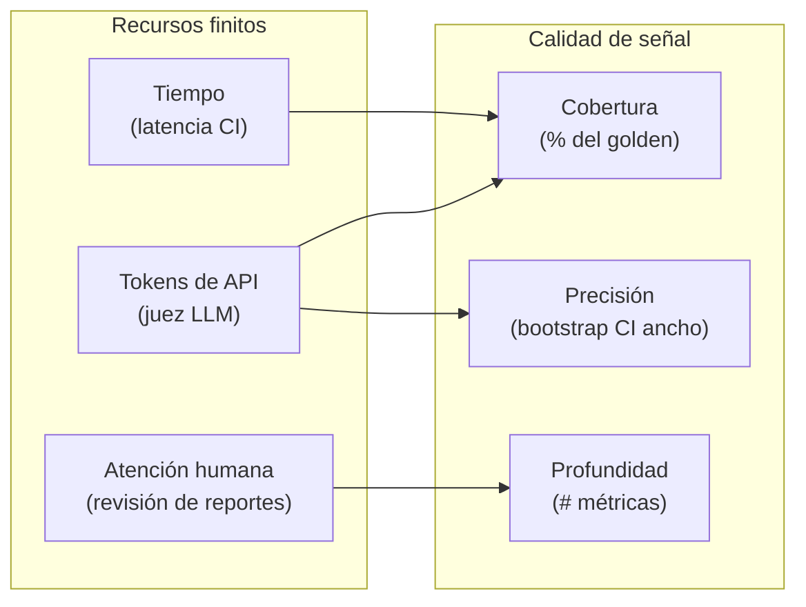
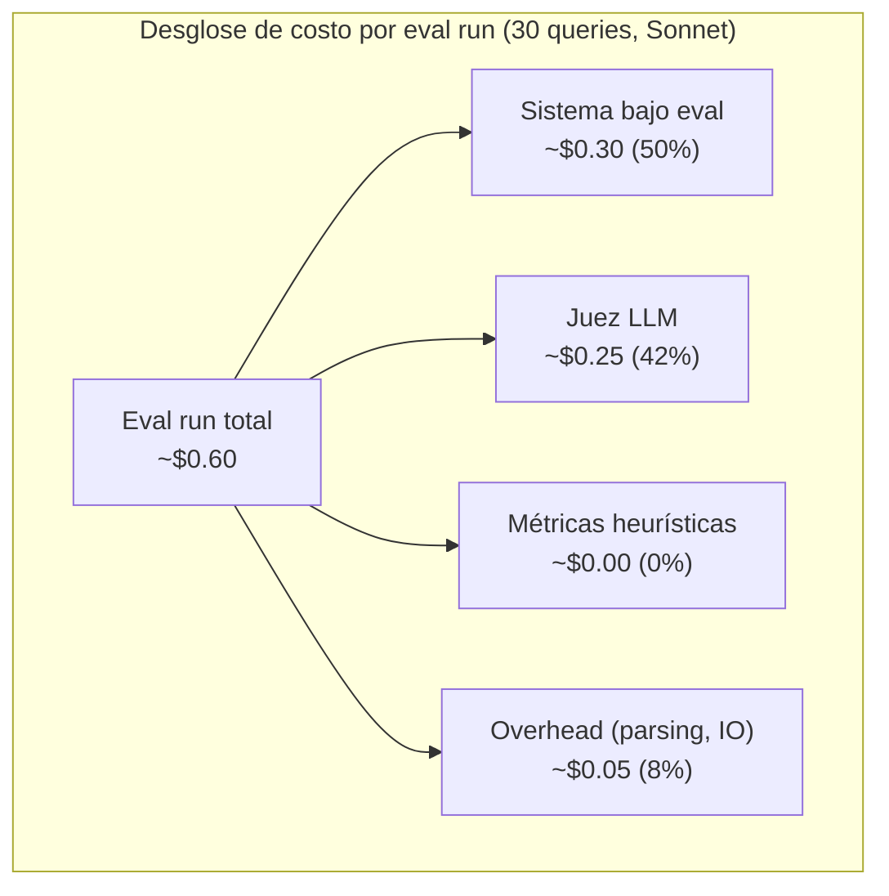
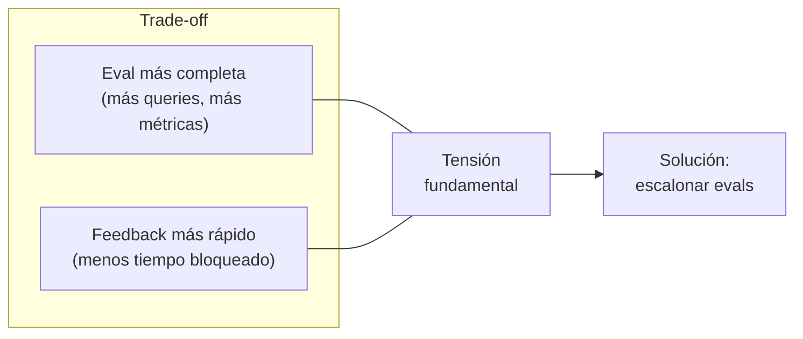
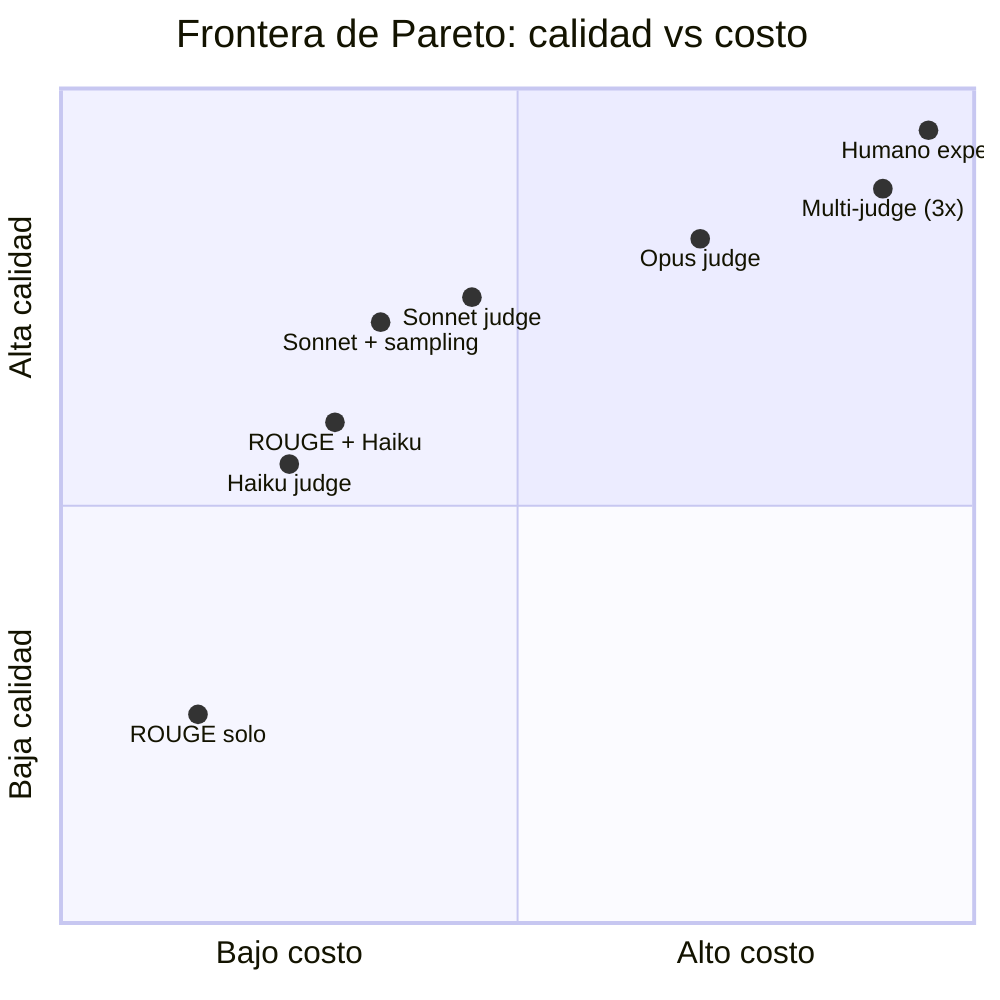
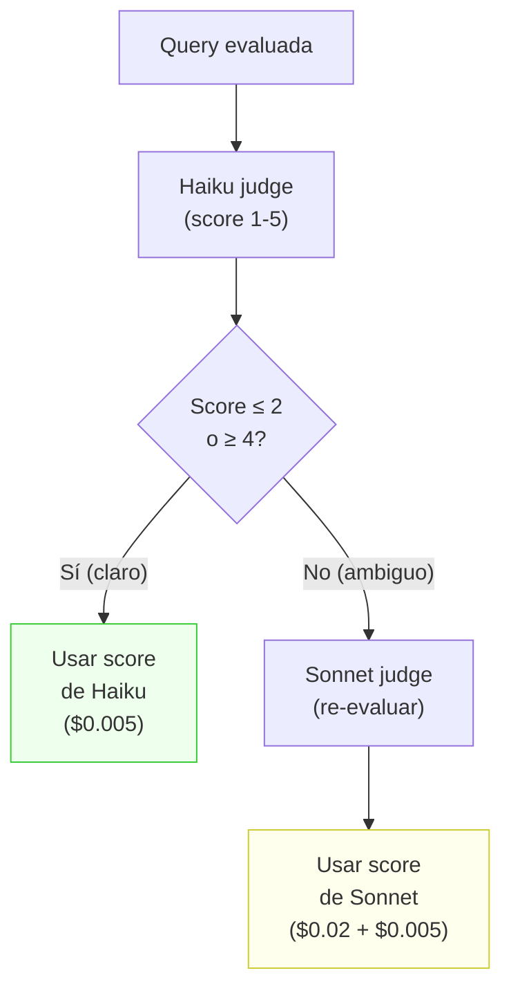
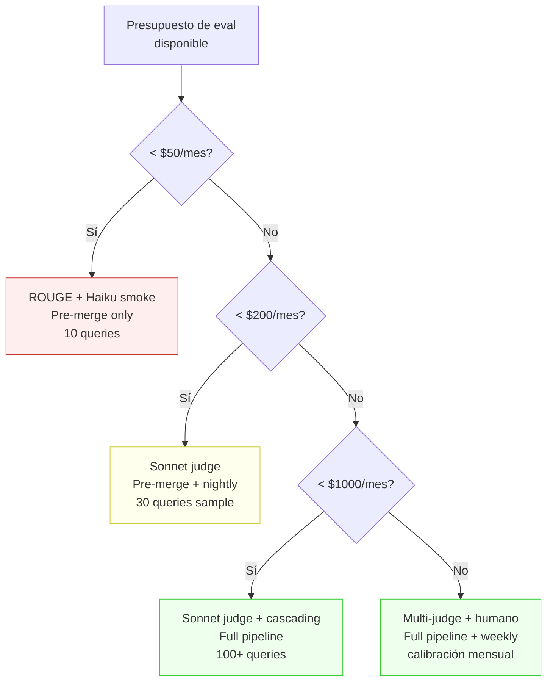

# 10 — Costo, latencia y frontera de Pareto de evals

## La eval como sistema con su propio presupuesto

Hasta ahora hemos tratado las evals como herramientas gratuitas: diseña un golden
dataset, corre las métricas, aplica bootstrap, revisa los gates. Pero en la práctica,
cada eval tiene un **costo en tokens, tiempo y atención humana** que compite con el
desarrollo del sistema que estás evaluando.

**Analogía económica:** la eval es control de calidad en una fábrica. Inspeccionar
el 100% de la producción es ideal en calidad pero destruye la rentabilidad. La pregunta
no es "¿más QC es mejor?" — siempre lo es — sino **"¿cuánto QC es óptimo dado mi
presupuesto?"**. Es un problema de optimización con restricciones, exactamente como
la frontera eficiente de Markowitz en teoría de portafolios.



## Anatomía del costo de una eval

### Componentes de costo

| Componente | Unidad | Ejemplo (30 queries) | Ejemplo (200 queries) |
|------------|--------|---------------------|-----------------------|
| **Tokens del sistema** | Input + output por query | ~50K tokens | ~330K tokens |
| **Tokens del juez** | Input + output por juicio | ~30K tokens | ~200K tokens |
| **Embedding** (si re-computa) | Por documento | ~10K tokens | ~10K tokens (cache) |
| **Cómputo** | Tiempo de CPU/GPU | ~2 min | ~15 min |
| **Humano** (revisión) | Minutos de experto | ~10 min | ~30 min |

### Costo en dólares (precios 2025-2026)

| Modelo de juez | Input ($/1M tok) | Output ($/1M tok) | Costo/30 queries | Costo/200 queries |
|----------------|-------------------|--------------------|------------------|-------------------|
| Haiku 4.5 | $0.80 | $4.00 | ~$0.15 | ~$1.00 |
| Sonnet 4.6 | $3.00 | $15.00 | ~$0.60 | ~$4.00 |
| Opus 4.6 | $15.00 | $75.00 | ~$3.00 | ~$20.00 |
| GPT-4o | $2.50 | $10.00 | ~$0.50 | ~$3.30 |

> Los costos varían según el largo del contexto y la complejidad de la rúbrica.
> Estos son estimados para queries típicas de RAG fiscal (~500 tokens de contexto,
> ~200 tokens de respuesta, ~300 tokens de rúbrica).



**Observación:** el juez LLM es ~40% del costo total. Optimizar el juez es la palanca
más grande.

## Latencia: el costo invisible

El costo en dólares es visible, pero el costo en **tiempo** suele ser el cuello de
botella real:

| Etapa | Tiempo (30 queries) | Tiempo (200 queries) | Bloquea |
|-------|--------------------|-----------------------|---------|
| Pre-merge | 2-5 min | 15-30 min | Merge del PR |
| Nightly | 10-30 min | 1-2 horas | Nada (async) |
| Weekly | 30 min - 1h | 2-4 horas | Nada (async) |

### El costo de bloquear un merge

Si un eval pre-merge tarda 20 minutos, y un equipo de 5 desarrolladores hace
3 PRs/día cada uno, eso son **5 horas-persona/día** esperando evals. A un costo
de $80/hora (costo empresa), eso son **$400/día** en tiempo perdido — mucho más que
los tokens.



## La frontera de Pareto

### ¿Qué es una frontera de Pareto?

Un punto es **Pareto-óptimo** si no se puede mejorar en una dimensión sin empeorar
en otra. En evals, las dimensiones son:

- **Calidad de señal** (eje Y): qué tan precisa y confiable es la evaluación
- **Costo** (eje X): tokens + tiempo + atención humana



**Puntos dominados:** un eval con "Sonnet judge en 200 queries" que cuesta $4 y da
la misma calidad que "Sonnet judge en 100 queries + sampling estratificado" a $2.20
está **dominado** — nunca deberías elegirlo.

### Configuraciones típicas en la frontera

| Config | Calidad | Costo/run | Latencia | Cuándo usar |
|--------|---------|-----------|----------|-------------|
| **ROUGE solo** | Baja (no detecta semántica) | ~$0.00 | <1s | Pre-commit hook rápido |
| **Haiku judge, 10 queries** | Media-baja | ~$0.05 | ~30s | Smoke test en PR |
| **Sonnet judge, 30 queries, sample** | Media-alta | ~$0.60 | ~3 min | Pre-merge gate |
| **Sonnet judge, full golden** | Alta | ~$4.00 | ~15 min | Nightly |
| **Multi-judge, full golden** | Muy alta | ~$12.00 | ~45 min | Pre-release |
| **Humano + LLM, full golden** | Máxima | ~$50+ | ~4 horas | Calibración trimestral |

## Estrategias de optimización

### 1. Jueces escalonados (cascading)

Usar un juez barato primero; solo escalar al caro si el resultado es ambiguo.



**Ahorro esperado:** si ~60% de los juicios son claros (score 1-2 o 4-5), el costo
se reduce ~50% vs usar Sonnet para todo:

```
Sin cascading: 100 queries × $0.02 = $2.00
Con cascading: 60 × $0.005 + 40 × $0.025 = $0.30 + $1.00 = $1.30
Ahorro: 35%
```

### 2. Sampling estratificado del golden dataset

No evaluar todo el golden en cada run. Muestrear por estrato (dificultad, tipo de doc)
para mantener representatividad con menos queries.

| Estrato | Golden completo | Sample estratificado |
|---------|-----------------|----------------------|
| Fácil (30%) | 30 queries | 6 queries |
| Media (45%) | 45 queries | 9 queries |
| Difícil (25%) | 25 queries | 8 queries |
| **Total** | **100** | **23** |

**Cuidado:** el sampling reduce el poder estadístico (sección 8). Un sample de 23
queries solo detecta mejoras > 15pp. Esto es aceptable para pre-merge pero no para
decisiones de release.

### 3. Cache de embeddings

Si el corpus no cambió, no recalcular embeddings. Guardar un hash del corpus y
solo recalcular cuando cambie.

```
Costo embedding (ada-002, corpus 4 docs): ~$0.01
Costo embedding si cambia 1 doc: ~$0.003 (solo el doc cambiado)
Costo con cache: $0.00 (si corpus no cambió)
```

Para corpus regulatorio que cambia mensualmente (nuevas circulares del SII, actualizaciones
presupuestarias), el cache tiene hit rate > 95%.

### 4. Evaluación incremental

Solo evaluar las queries **afectadas** por un cambio:

| Tipo de cambio | Queries a re-evaluar |
|----------------|----------------------|
| Cambio de prompt | Todas (afecta generación) |
| Cambio de chunking | Todas (afecta retrieval) |
| Nuevo documento | Solo queries relevantes al doc |
| Cambio de modelo | Todas |
| Cambio de temperatura | Muestra representativa |

### 5. Paralelización

Las queries son independientes — se pueden evaluar en paralelo. Con `asyncio` o
batch API:

| Estrategia | 30 queries | 100 queries |
|------------|-----------|-------------|
| Secuencial | ~3 min | ~10 min |
| Parallel (5 concurrentes) | ~40s | ~2 min |
| Batch API (si disponible) | ~20s | ~1 min |

## Presupuesto de eval: plantilla

**Analogía económica:** así como una empresa tiene un presupuesto de auditoría
proporcional a sus ingresos, el presupuesto de eval debería ser proporcional al
costo de un fallo en producción.

| Concepto | Pre-merge | Nightly | Weekly | Mensual total |
|----------|-----------|---------|--------|---------------|
| Tokens juez | $0.10 | $2.00 | $5.00 | ~$75 |
| Tokens sistema | $0.15 | $1.50 | $3.00 | ~$55 |
| Cómputo | $0.00 | $0.00 | $0.00 | ~$0 (local) |
| Tiempo dev (opp. cost) | $10/PR | $0 | $20 | ~$500 |
| **Total** | **~$10/PR** | **~$3.50** | **~$28** | **~$630** |

Para un producto RAG fiscal con ingresos de $10K+/mes, un presupuesto de eval de
~$630/mes es **~6% de ingresos** — razonable y comparable al gasto en testing de
software tradicional (5-15% del presupuesto de desarrollo).

### ¿Cuándo es demasiado caro?

Señales de que estás sobre-evaluando:
- El CI tarda más que el desarrollo
- El costo de evals supera el 20% del costo de API de producción
- Estás evaluando cambios que no afectan la calidad (refactors, docs)
- El equipo evita hacer PRs por la fricción del eval gate

Señales de que estás sub-evaluando:
- Descubres regresiones por feedback de usuarios, no por evals
- No tienes intervalos de confianza en tus métricas
- El golden dataset no se ha actualizado en > 2 meses
- No hay registro histórico de métricas

## Decisión bajo restricciones

### Framework de decisión



### La regla del 10x

**Si el costo de un fallo en producción es > 10x el costo de la eval que lo detectaría,
la eval se justifica.**

| Fallo | Costo estimado | Eval que lo detecta | Costo eval/mes | Ratio |
|-------|---------------|---------------------|----------------|-------|
| Cita fantasma en informe fiscal | $5,000+ (confianza, legal) | Ghost citation gate | $3 | 1,667x |
| Recall cae 20pp sin detectar | $2,000 (reputación) | Nightly + bootstrap CI | $75 | 27x |
| Latencia sube 3x | $500 (churn) | Pre-merge latency gate | $0 | ∞ |
| Error de formato | $100 (retrabajo) | ROUGE + format check | $0 | ∞ |

Todas las evals del pipeline pasan cómodamente la regla del 10x para un producto
fiscal. **Sub-evaluar es más caro que sobre-evaluar** en este dominio.

## Conexión con otras secciones

| Dependencia | Sección | Conexión |
|-------------|---------|----------|
| ← | 7. LLM-as-judge | Los jueces LLM son el componente más caro; cascading los optimiza |
| ← | 8. Estadística | El sampling reduce queries pero también poder estadístico |
| ← | 9. Regresiones/CI | El presupuesto define qué gates son viables en cada etapa |
| → | 11. Online evals | Las online evals añaden otra fuente de costo (logging, análisis) |

## Estado del arte (2025-2026)

- **Batch APIs** (Anthropic, OpenAI) reducen costo ~50% y latencia al procesar
  múltiples queries en un solo request. Ideal para evals nightly.
- **Prompt caching** (Anthropic) reduce costo ~90% en tokens de input repetidos
  (rúbricas, contexto del sistema). Transformativo para evals donde la rúbrica
  es larga y el contexto cambia poco entre queries.
- **Jueces pequeños fine-tuneados** están emergiendo: modelos de 7-13B parámetros
  fine-tuneados para ser jueces producen calidad ~80% de Sonnet a <5% del costo.
  Aún no es mainstream pero la tendencia es clara.
- **No hay herramienta estándar** para presupuestar evals. Cada equipo lo hace
  ad-hoc. La frontera de Pareto es un framework teórico que pocos aplican
  explícitamente.
