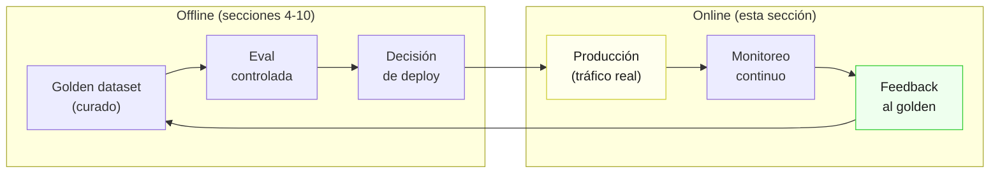
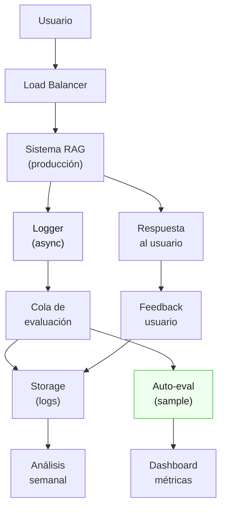
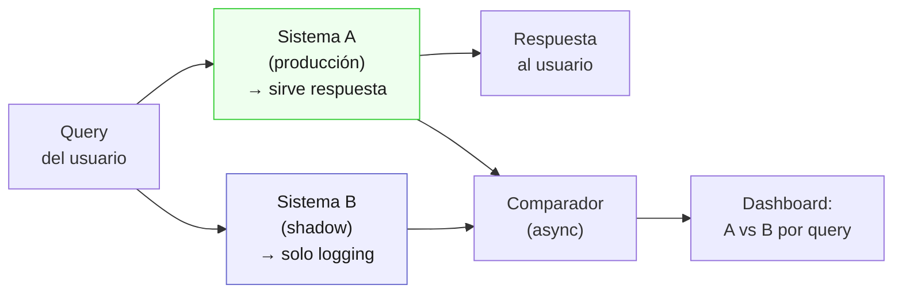
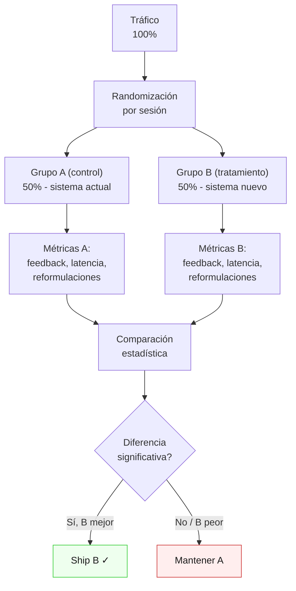
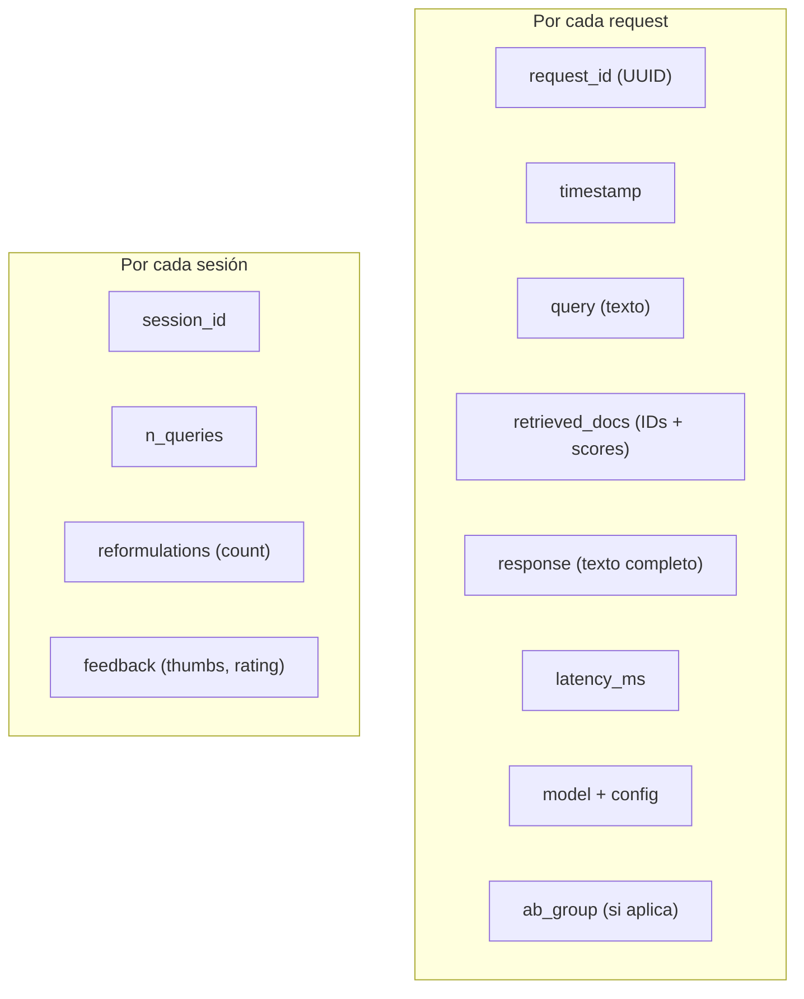
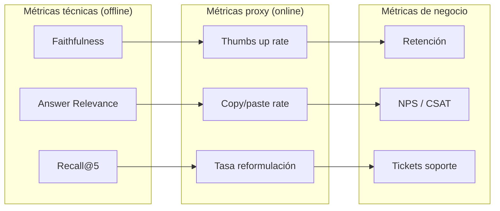
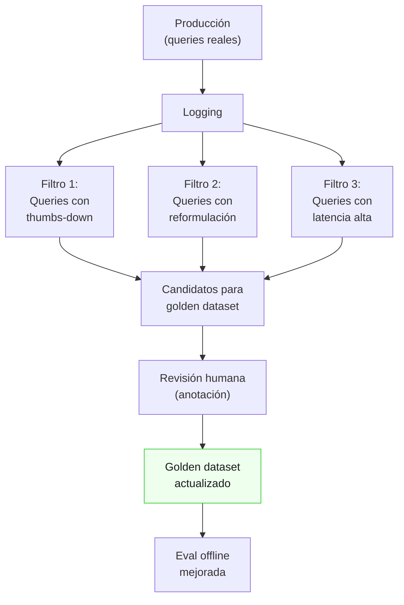
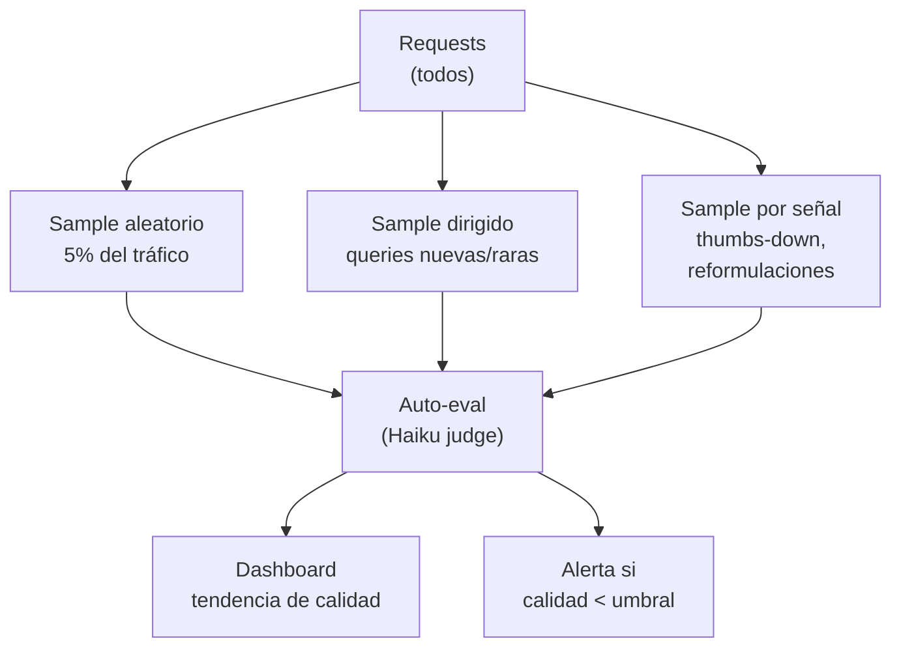

# 11 — Online evals

## Offline no basta

Todas las secciones anteriores (4-10) cubren evaluación **offline**: correr el sistema
contra un golden dataset, calcular métricas, decidir si hacer deploy. Pero hay una
brecha fundamental entre el rendimiento offline y el rendimiento en producción:

| Dimensión | Offline | Producción |
|-----------|---------|------------|
| Queries | Curadas, golden dataset | Reales, impredecibles |
| Distribución | Fija, balanceada | Cambiante, sesgada |
| Contexto | Controlado | Ruidoso (sesiones, historial) |
| Volumen | 30-200 queries | Miles/día |
| Feedback | Anotación experta | Implícito (clicks, reformulaciones) |

**Analogía económica:** la eval offline es como un backtest de una estrategia de
inversión — útil para filtrar estrategias malas, pero no garantiza rendimiento futuro.
La eval online es el rendimiento real del portafolio: con dinero real, en mercado real,
con fricciones reales.



### Modos de fallo que solo se ven en producción

1. **Distribution shift:** los usuarios preguntan cosas que el golden dataset no cubre
2. **Queries adversariales:** intentos de inyección, preguntas fuera de dominio
3. **Degradación de contexto:** el modelo se comporta distinto con historial largo
4. **Cambios en el corpus:** nuevas circulares del SII, actualizaciones de glosas
5. **Efectos de escala:** latencia bajo carga real, rate limits, timeouts

## Arquitectura de online evals



**Principio clave:** el logging y la evaluación son **asíncronos** — nunca bloquean
la respuesta al usuario. El costo en latencia debe ser cero para el usuario.

## Shadow mode

### ¿Qué es?

Correr un sistema candidato **en paralelo** con el sistema de producción, sin servir
sus respuestas al usuario. Ambos procesan las mismas queries; solo se sirve la
respuesta del sistema actual.



### Cuándo usar shadow mode

| Escenario | Shadow mode | Por qué |
|-----------|-------------|---------|
| Cambio de modelo (Sonnet → Opus) | Sí | Alto riesgo, alto impacto |
| Cambio de chunking strategy | Sí | Afecta retrieval completo |
| Ajuste menor de prompt | No | A/B test es suficiente |
| Nuevo documento en corpus | No | Eval offline cubre |
| Migración de infraestructura | Sí | Latencia y errores |

### Costos del shadow mode

El shadow mode **duplica el costo de API** durante el período de prueba:

```
Costo producción normal:    $X/día
Costo con shadow:           $2X/día
Duración típica:            3-7 días
Costo total del shadow:     $3X - $7X extra
```

Para un sistema RAG fiscal con ~500 queries/día a ~$0.05/query:
- Producción normal: ~$25/día
- Shadow: ~$50/día por 5 días = $125 extra
- Costo de un fallo en producción: $2,000+
- **ROI del shadow: 16x** (regla del 10x, sección 10)

## A/B testing

### El problema con LLMs

A/B testing clásico asume respuestas deterministas: el usuario ve A o B, mides
conversión, calculas significancia. Con LLMs, hay dos fuentes de varianza:

1. **Varianza entre usuarios** (cuál query hacen)
2. **Varianza intra-modelo** (temperature > 0 → misma query, distinta respuesta)

Esto requiere más muestras que un A/B test clásico para alcanzar significancia.

### Diseño del A/B test



### Métricas para A/B en RAG

| Métrica | Tipo | Qué mide | Cómo se captura |
|---------|------|----------|-----------------|
| Thumbs up/down | Explícita | Satisfacción | Botón en UI |
| Tasa de reformulación | Implícita | ¿La respuesta fue útil? | Logging de queries |
| Tiempo hasta reformulación | Implícita | ¿Cuánto costó entender? | Timestamps |
| Copy/paste de respuesta | Implícita | ¿Fue accionable? | Event tracking |
| Queries de seguimiento | Implícita | ¿Resolvió o generó dudas? | Session tracking |
| Latencia p50/p95 | Técnica | Rendimiento | Instrumentación |

### Tamaño de muestra para A/B

**Analogía económica:** es exactamente como calcular el tamaño de muestra para un
ensayo clínico o una encuesta electoral. Más varianza → más muestras.

Para detectar una diferencia del 5% en tasa de thumbs-up (baseline 60%):

```
n ≈ 2 × (z_α + z_β)² × p(1-p) / δ²
n ≈ 2 × (1.96 + 0.84)² × 0.6 × 0.4 / 0.05²
n ≈ 2 × 7.85 × 0.24 / 0.0025
n ≈ 1,507 queries por grupo
```

Con 500 queries/día: **~6 días** de A/B test (3 días por grupo si es 50/50).

### Duración mínima y máxima

| Regla | Valor | Por qué |
|-------|-------|---------|
| Mínimo | 7 días | Capturar efecto día-de-semana |
| Máximo | 30 días | Evitar contaminación por cambios externos |
| Early stopping | Si CI excluye 0 después de n_min | Ahorrar tiempo si efecto es claro |

## Logging para evals online

### Qué capturar



### Esquema de log

```json
{
  "request_id": "req-abc123",
  "session_id": "sess-xyz789",
  "timestamp": "2026-05-26T10:30:00Z",
  "query": "¿Cuál es la tasa de IVA para servicios digitales?",
  "retrieved_docs": [
    {"id": "circular-01-sii-iva-digital.txt", "score": 0.92},
    {"id": "norma-01-ley-lobby.txt", "score": 0.45}
  ],
  "response": "La tasa de IVA aplicable a servicios digitales...",
  "latency_ms": 2340,
  "model": "claude-sonnet-4-6",
  "config": {"chunk_size": 512, "top_k": 5, "temperature": 0.3},
  "ab_group": "B",
  "feedback": null
}
```

### Privacidad y retención

| Dato | Sensibilidad | Retención | Tratamiento |
|------|-------------|-----------|-------------|
| Query del usuario | Alta | 90 días | Pseudonimizar session_id |
| Respuesta completa | Media | 90 días | Retener para análisis de errores |
| Doc IDs recuperados | Baja | 1 año | Análisis de retrieval |
| Feedback (thumbs) | Baja | 1 año | Métricas agregadas |
| Datos personales en query | Alta | 0 días | **No almacenar** — redactar antes de log |

Para dominio fiscal chileno: las queries pueden contener RUTs, montos, nombres de
contribuyentes. **Implementar redacción automática** antes del logging:

```python
# Pseudocódigo — redactar datos sensibles
import re

def redact_pii(text: str) -> str:
    # RUT chileno: 12.345.678-9
    text = re.sub(r'\d{1,2}\.\d{3}\.\d{3}-[\dkK]', '[RUT]', text)
    # Montos: $1.234.567
    text = re.sub(r'\$[\d\.]+', '[MONTO]', text)
    return text
```

## Métricas proxy

Las métricas de eval offline (Recall, Faithfulness) miden **calidad técnica**.
Las métricas online miden **utilidad real para el usuario**. La conexión entre
ambas no siempre es directa.



### Calibración de métricas proxy

**Problema:** ¿un thumbs-up del 70% es bueno o malo? Depende del baseline y del
dominio.

| Métrica proxy | Baseline típico (RAG) | Alarma | Excelente |
|---------------|----------------------|--------|-----------|
| Thumbs-up rate | 55-65% | < 50% | > 75% |
| Reformulación (misma sesión) | 25-35% | > 45% | < 20% |
| Copy/paste rate | 15-25% | < 10% | > 30% |
| Queries por sesión | 2-4 | > 6 (frustración) | 1.5-3 |

**Cuidado con la interpretación:**
- Muchas queries/sesión puede ser **exploración** (bueno) o **frustración** (malo)
- Copy/paste alto puede ser **utilidad** (bueno) o **respuestas formulaicas** (malo)
- Solo el cruce con otras señales (feedback + reformulación) da una lectura confiable

## Feedback loops: de online a offline

El valor más grande de las online evals no es el monitoreo en tiempo real — es
**alimentar el golden dataset** con datos reales.



### Protocolo de incorporación

1. **Selección:** cada semana, seleccionar las 10-20 queries más problemáticas
   (thumbs-down, reformulaciones, errores detectados por auto-eval)
2. **Anotación:** un experto en dominio (analista fiscal, abogado) anota la respuesta
   correcta y los documentos relevantes
3. **Incorporación:** agregar al golden dataset con metadata de origen (`source: production`)
4. **Re-evaluación:** correr eval offline con el golden actualizado para detectar
   regresiones que el golden anterior no cubría

### Anti-patrones del feedback loop

| Anti-patrón | Problema | Solución |
|-------------|----------|----------|
| Solo agregar thumbs-down | Sesgo negativo en el golden | También agregar queries exitosas |
| No redactar PII | Golden dataset con datos sensibles | Redactar antes de anotar |
| Agregar sin anotar | Queries sin ground truth no sirven | Anotar antes de agregar |
| No versionar | No se puede medir el impacto de las adiciones | Tag de versión por batch |
| Agregar demasiado | Golden crece sin control, evals se vuelven caras | Cap de 200-500 items, rotar |

## Auto-eval en producción

Evaluar **cada** request en producción con un LLM-judge es prohibitivo en costo.
En su lugar, evaluar un **sample** asíncrono:

### Estrategia de sampling



| Tipo de sample | % del tráfico | Costo (500 queries/día) | Detecta |
|----------------|---------------|--------------------------|---------|
| Aleatorio 5% | 5% | ~$1.25/día | Degradación general |
| Dirigido (queries nuevas) | ~2% | ~$0.50/día | Distribution shift |
| Por señal (thumbs-down) | ~3% | ~$0.75/día | Fallos específicos |
| **Combinado** | **~10%** | **~$2.50/día** | **Todo** |

## Dashboard de online evals

### Vistas mínimas

| Vista | Frecuencia | Contenido |
|-------|-----------|-----------|
| **Real-time** | Cada 5 min | Latencia p50/p95, error rate, throughput |
| **Diario** | 1x/día | Thumbs-up rate, reformulación rate, auto-eval score |
| **Semanal** | 1x/semana | Tendencias, queries problemáticas, golden updates |
| **Mensual** | 1x/mes | Calibración juez, baseline update, presupuesto |

### Alertas

| Alerta | Condición | Acción |
|--------|-----------|--------|
| Latencia spike | p95 > 2× baseline por 15 min | Page oncall |
| Error rate | > 5% por 10 min | Page oncall |
| Quality drop | Auto-eval < 0.50 en ventana de 24h | Ticket urgente |
| Feedback crash | Thumbs-up < 40% en ventana de 24h | Investigar |
| Distribution shift | >20% queries sin match en golden | Revisar golden |

## Conexión con otras secciones

| Dependencia | Sección | Conexión |
|-------------|---------|----------|
| ← | 7. LLM-as-judge | Auto-eval usa jueces LLM (Haiku para costo, sección 10) |
| ← | 8. Estadística | A/B testing necesita tamaño de muestra y significancia |
| ← | 9. Regresiones/CI | Online evals son la última línea de defensa post-deploy |
| ← | 10. Costo/Pareto | El presupuesto de online eval se suma al offline |
| → | 12. Alto-stake | En dominio fiscal, las online evals tienen requisitos extras |
| ← | 4. Golden datasets | El feedback loop alimenta el golden dataset |

## Estado del arte (2025-2026)

- **Shadow mode** es práctica estándar en Google/Meta pero poco frecuente en startups.
  El costo se ha reducido con batch APIs y prompt caching.
- **A/B testing para LLMs** está poco documentado. La mayoría de equipos hacen
  "evaluación por vibes" en producción — miran outputs a mano después del deploy.
- **Plataformas:** Braintrust, Humanloop y LangSmith ofrecen logging y dashboards,
  pero el diseño del feedback loop (qué samplear, cómo incorporar al golden) sigue
  siendo artesanal.
- **Auto-eval en producción** con jueces baratos (Haiku, modelos on-premise) está
  emergiendo como estándar. El desafío es la calibración: un juez Haiku en producción
  puede tener sesgos distintos a un Sonnet en offline.
- **Métricas proxy** (reformulación, copy/paste) son señales ruidosas. La investigación
  actual se centra en combinar múltiples señales con modelos supervisados para
  predecir satisfacción real.
