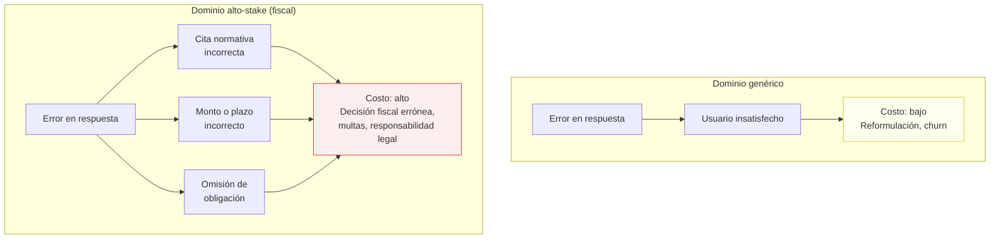
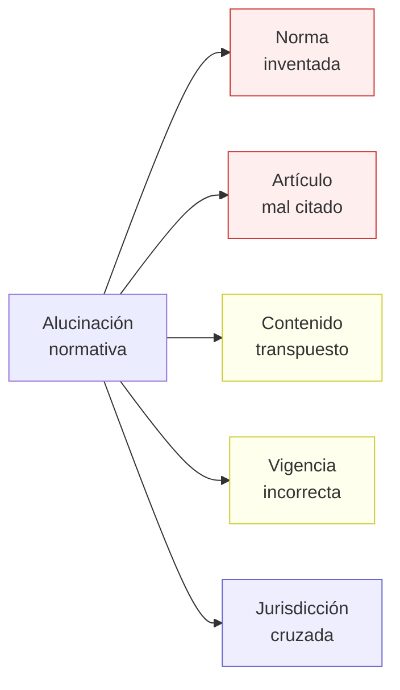
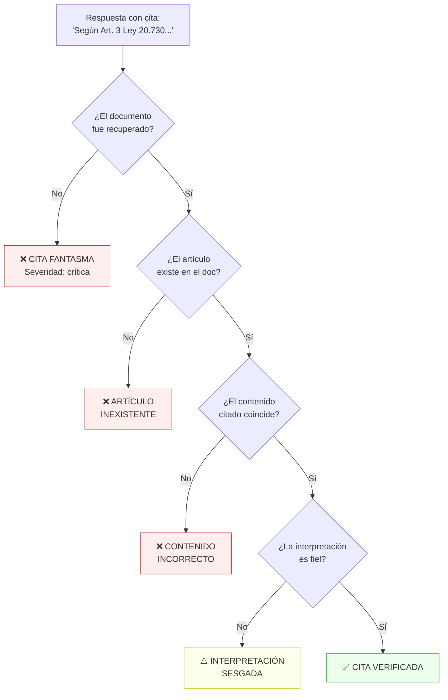
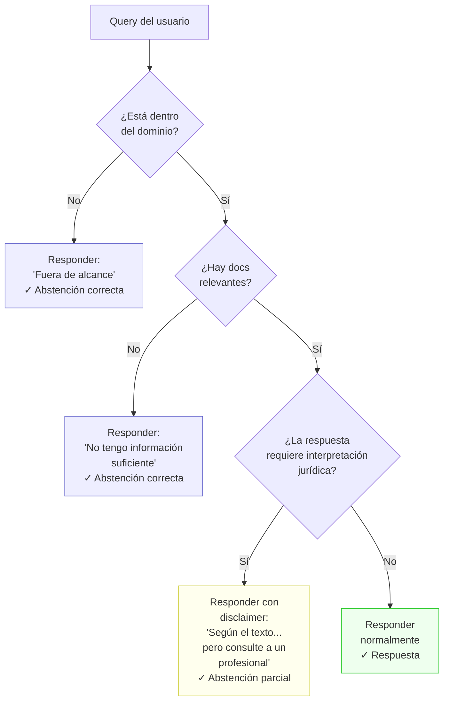
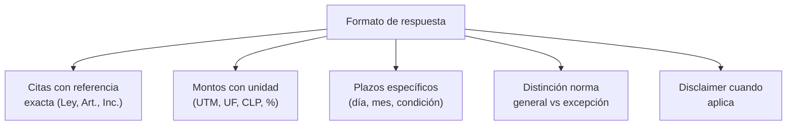
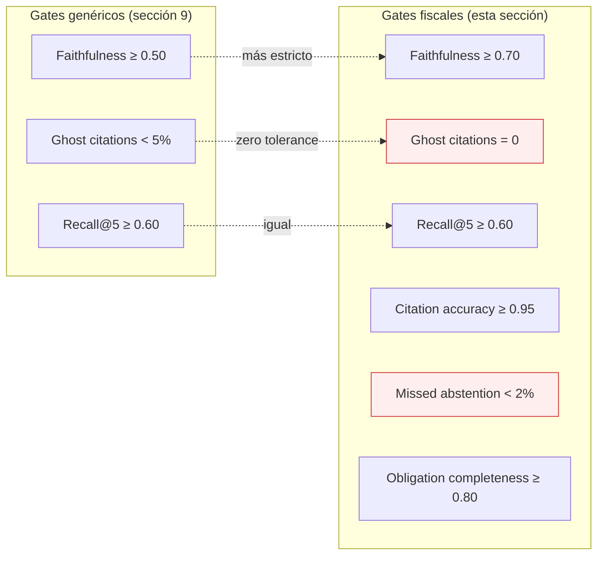
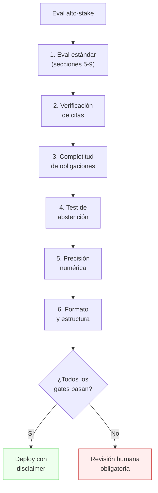

# 12 — Bonus: dominios alto-stake (legal/fiscal)

## Por qué este dominio es diferente

Todo lo que hemos construido en las secciones 1-11 aplica a cualquier sistema RAG.
Pero cuando el dominio es **regulatorio, legal o fiscal**, los estándares cambian
cualitativamente. Un error en un chatbot de recetas tiene costo bajo; un error en
un sistema que cita normativa chilena para informar decisiones fiscales puede tener
consecuencias legales, financieras y reputacionales graves.

**Analogía económica:** es la diferencia entre un error en un forecast del PIB
(impacto: paper con pie de página de corrección) y un error en una declaración de
impuestos (impacto: multas, intereses, sanción del SII). Mismo tipo de modelo,
consecuencias radicalmente distintas.



## Los 5 fallos críticos en dominio fiscal

### 1. Alucinación normativa

El fallo más peligroso: el sistema **inventa** una norma, artículo o circular que
no existe, o atribuye contenido incorrecto a una norma real.

| Tipo | Ejemplo | Gravedad |
|------|---------|----------|
| **Norma inventada** | "Según la Circular Nº 87 del SII..." (no existe) | Crítica |
| **Artículo mal citado** | "Art. 12 de la Ley 20.730" (el artículo dice otra cosa) | Crítica |
| **Contenido transpuesto** | Cita correcta pero contenido de otra norma | Alta |
| **Vigencia incorrecta** | Cita norma derogada como vigente | Alta |
| **Jurisdicción cruzada** | Aplica norma española a caso chileno | Media |



### 2. Cita fantasma

El sistema cita un documento o artículo específico que **no aparece en los documentos
recuperados** por el retriever. Es un subset de la alucinación normativa, pero
particularmente insidioso porque parece preciso.

**Eval específica:** para cada cita en la respuesta, verificar que:
1. El documento citado fue recuperado (está en `retrieved_docs`)
2. El contenido citado aparece en ese documento
3. La interpretación del contenido es correcta

### 3. Omisión de obligación

El sistema responde correctamente **lo que dice**, pero omite información crítica
que debería incluir. En dominio fiscal, una omisión puede ser tan dañina como un error.

| Ejemplo | Qué dice | Qué omite |
|---------|----------|-----------|
| "El IVA digital es 19%" | Correcto | No menciona que el plazo de declaración es el día 12 del mes siguiente |
| "La multa es 10-50 UTM" | Correcto | No menciona que hay reincidencia con agravante |
| "La Glosa 09 cubre operaciones" | Correcto | No menciona los requisitos de reporte trimestral |

### 4. Confianza no calibrada

El sistema presenta todas sus respuestas con el mismo nivel de confianza, sin distinguir
entre:
- Hechos extraídos directamente del texto normativo (alta confianza)
- Interpretaciones derivadas de múltiples fuentes (confianza media)
- Inferencias sin respaldo directo en el corpus (baja confianza)

### 5. Formato inadecuado para el usuario

En dominio legal/fiscal, el **formato** importa tanto como el contenido. Un analista
fiscal espera:
- Citas con referencia exacta (ley, artículo, inciso, literal)
- Montos con unidad (UTM, UF, CLP)
- Plazos con fecha específica o referencia temporal clara
- Distinción entre norma general y excepciones

## Evals específicas para alto-stake

### Eval 1: Verificación de citas normativas

Para cada respuesta que cite una norma:



**Métrica:** `citation_accuracy = citas_verificadas / total_citas`

Umbral recomendado: **≥ 0.95** (en dominio genérico, ≥ 0.80 es aceptable).

### Eval 2: Completitud de obligaciones

Para queries sobre obligaciones fiscales, verificar que la respuesta menciona
**todos** los elementos obligatorios:

| Elemento | Ejemplo (IVA digital) | Obligatorio |
|----------|----------------------|-------------|
| Tasa aplicable | 19% | Sí |
| Sujeto obligado | Prestador extranjero | Sí |
| Plazo de declaración | Día 12 del mes siguiente | Sí |
| Base imponible | Precio del servicio | Sí |
| Excepciones | Servicios B2B con reverse charge | Sí, si aplica |
| Sanciones por incumplimiento | Multas Art. 97 CT | Deseable |

**Métrica:** `obligation_completeness = elementos_mencionados / elementos_obligatorios`

Umbral recomendado: **≥ 0.80** para elementos obligatorios, sin umbral para deseables.

### Eval 3: Abstención calibrada

El sistema debe **decir "no sé"** cuando:
- La query está fuera del alcance del corpus
- El corpus no contiene información suficiente para responder
- La respuesta requiere interpretación jurídica que excede lo factual



**Métricas de abstención:**

| Métrica | Fórmula | Qué mide |
|---------|---------|----------|
| **Abstention rate** | abstenciones / total_queries | ¿Con qué frecuencia dice "no sé"? |
| **Correct abstention** | abstenciones_correctas / abstenciones | ¿Cuándo dice "no sé", tiene razón? |
| **Missed abstention** | debió_abstenerse_y_no_lo_hizo / total | Lo más peligroso: responde cuando no debería |
| **False abstention** | se_abstuvo_innecesariamente / total | Menos grave: dice "no sé" cuando sí sabe |

**El error asimétrico:** en dominio fiscal, una **missed abstention** (responder con
confianza algo incorrecto) es mucho peor que una **false abstention** (decir "no sé"
cuando podría haber respondido). El umbral debe reflejar esta asimetría:

- Missed abstention: **< 2%** (casi cero tolerancia)
- False abstention: **< 15%** (tolerable, preferible errar hacia la cautela)

### Eval 4: Consistencia temporal

La normativa cambia. Una respuesta correcta en enero puede ser incorrecta en julio
si hubo una modificación legal. El sistema debe:

1. **No citar normas derogadas** como vigentes
2. **Indicar la fecha de vigencia** cuando es relevante
3. **Alertar sobre cambios recientes** si el corpus fue actualizado

**Métrica:** `temporal_accuracy = respuestas_con_vigencia_correcta / total_respuestas`

### Eval 5: Formato y estructura



**Checklist de formato (evaluar por respuesta):**

| Criterio | Peso | Ejemplo correcto | Ejemplo incorrecto |
|----------|------|------------------|--------------------|
| Cita con referencia | 0.25 | "Art. 3 inc. 2 Ley 20.730" | "según la ley de lobby" |
| Monto con unidad | 0.20 | "10 a 50 UTM" | "una multa significativa" |
| Plazo específico | 0.20 | "hasta el día 12 del mes siguiente" | "en los próximos días" |
| Excepción mencionada | 0.20 | "salvo cuando el prestador..." | (omisión) |
| Disclaimer si aplica | 0.15 | "Consulte a un profesional" | (afirmación categórica sobre interpretación) |

## Umbrales diferenciados

Los umbrales de las secciones 9 (gates) deben ser **más estrictos** en dominio
alto-stake:

| Métrica | Dominio genérico | Dominio fiscal | Por qué |
|---------|-----------------|----------------|---------|
| Faithfulness | ≥ 0.50 | ≥ 0.70 | Cada claim debe tener respaldo |
| Citation accuracy | ≥ 0.80 | ≥ 0.95 | Citas incorrectas = responsabilidad |
| Ghost citations | < 5% | **= 0** | Zero tolerance |
| Missed abstention | < 10% | **< 2%** | Error asimétrico |
| Obligation completeness | ≥ 0.60 | ≥ 0.80 | Omisiones tienen costo legal |
| Format compliance | ≥ 0.50 | ≥ 0.75 | El usuario profesional exige precisión |



## Implicaciones regulatorias

### Marco legal en Chile (2025-2026)

- **No hay regulación específica de IA** en Chile (a diferencia de la EU AI Act).
  El Proyecto de Ley Marco de IA (Boletín 15.869) está en trámite legislativo.
- **Responsabilidad civil** sigue el régimen general: el proveedor del sistema
  puede ser responsable por daños derivados de información incorrecta.
- **Sector financiero:** la CMF ha emitido lineamientos sobre uso de IA en entidades
  supervisadas, exigiendo explicabilidad y auditoría.
- **SII:** no hay pronunciamiento específico sobre uso de IA para asesoría tributaria,
  pero el contribuyente es responsable de la información en sus declaraciones.

### Recomendaciones prácticas

1. **Disclaimer obligatorio:** toda respuesta del sistema debe incluir que no
   constituye asesoría legal o tributaria profesional
2. **Trazabilidad:** cada respuesta debe ser rastreable a sus fuentes documentales
3. **Auditoría:** mantener logs completos (sección 11) para revisión posterior
4. **Actualización del corpus:** establecer un SLA de actualización cuando cambia
   la normativa (e.g., < 48h para circulares del SII)
5. **Revisión humana:** para decisiones de alto impacto, el sistema debe recomendar
   consulta profesional

## Golden dataset para alto-stake

El golden dataset (sección 4) necesita items específicos para este dominio:

### Categorías adicionales

| Categoría | Descripción | Items mínimos |
|-----------|-------------|---------------|
| **Citas verificables** | Queries donde la respuesta debe citar norma exacta | 15-20 |
| **Obligaciones completas** | Queries sobre obligaciones con múltiples elementos | 10-15 |
| **Fuera de dominio** | Queries que el sistema debe rechazar | 10 |
| **Interpretación vs hecho** | Queries donde la respuesta requiere disclaimer | 10 |
| **Normas derogadas** | Queries sobre normas que ya no están vigentes | 5-10 |
| **Montos y plazos** | Queries donde la precisión numérica es crítica | 10-15 |

### Anotación enriquecida

Cada item del golden dataset fiscal necesita campos adicionales:

```json
{
  "query": "¿Cuál es la multa por no registrar reuniones en el registro de lobby?",
  "expected_answer": "Multa de 10 a 50 UTM según Art. 8 Ley 20.730",
  "relevant_docs": ["norma-01-ley-lobby.txt"],
  "citations_required": [
    {"law": "Ley 20.730", "article": "Art. 8", "content_fragment": "multa de 10 a 50 UTM"}
  ],
  "obligations": ["registrar", "plazo 30 días", "sanción por incumplimiento"],
  "should_abstain": false,
  "requires_disclaimer": false,
  "difficulty": "medium",
  "numerical_precision": {"value": "10-50", "unit": "UTM"}
}
```

## Protocolo de eval para alto-stake



## Conexión con todas las secciones

| Sección | Conexión con alto-stake |
|---------|------------------------|
| 1. Por qué evals | Los fallos silenciosos son más costosos en este dominio |
| 2. Taxonomía | Necesitas más tipos de eval (citas, abstención, formato) |
| 3. Errores | La taxonomía de errores incluye alucinación normativa y omisión |
| 4. Golden dataset | Items adicionales para citas, abstención, precisión numérica |
| 5. Retrieval | Recall es crítico: no recuperar la norma correcta es inaceptable |
| 6. Generación | Faithfulness tiene umbral más alto (≥ 0.70 vs ≥ 0.50) |
| 7. LLM-as-judge | El juez necesita rúbrica específica para dominio fiscal |
| 8. Estadística | CIs más estrictos; el costo del error tipo II es mayor |
| 9. CI | Gates adicionales (ghost citations = 0, missed abstention < 2%) |
| 10. Costo | ROI de las evals es mayor (costo del fallo > $5,000) |
| 11. Online | Redacción de PII fiscal (RUT, montos) es obligatoria |

## Estado del arte (2025-2026)

- **Evals para legal/fiscal** están en estado **incipiente**. No hay benchmarks
  estándar ni frameworks específicos. Cada equipo construye lo suyo.
- **Verificación de citas** es un problema abierto. Los LLMs son buenos generando
  citas plausibles pero incorrectas — exactamente el peor caso para este dominio.
- **Abstención calibrada** está mejor estudiada en medicina (modelos que dicen
  "consulte a su médico") que en legal/fiscal.
- **La EU AI Act** clasifica los sistemas de IA para legal como "alto riesgo",
  requiriendo transparencia, supervisión humana y evaluación de conformidad.
  Chile aún no tiene equivalente, pero la tendencia regulatoria es clara.
- **Oportunidad:** un framework de evals riguroso para dominio fiscal chileno
  sería diferenciador competitivo significativo. La mayoría de productos en este
  espacio operan sin evaluación formal.
