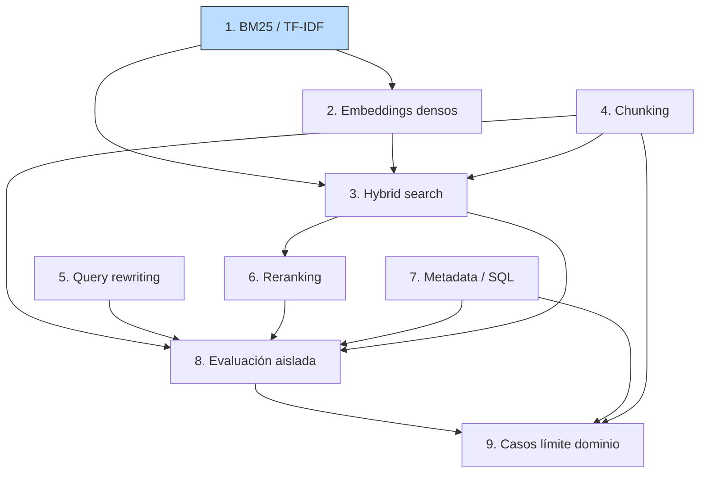

# 00 — Plan Maestro: Information Retrieval

## Objetivo de la masterclass

Dominar information retrieval como **disciplina**, no como un detalle de
implementación de RAG. IR existía décadas antes de los LLMs (Salton, Robertson,
los TREC de los 90) y sigue siendo el cuello de botella del 80% de los sistemas
RAG que fallan. Al terminar deberías poder responder, con números sobre tu
propio corpus: *¿qué arquitectura de retrieval necesita esta query, y por qué?*
— y reconocer cuándo la respuesta correcta es "BM25 con un filtro `WHERE`",
no un vector store de moda.

## Hilo conductor

El mismo sistema RAG sobre normativa chilena de la masterclass 01 (decretos,
glosas presupuestarias, circulares del SII, leyes). Allí evaluamos el sistema;
aquí construimos y comparamos los **retrievers** que lo alimentan. Reutilizamos
el golden dataset de `01-evals/examples/golden-dataset-rag-fiscal.json` como
banco de pruebas, y las métricas de `01-evals/theory/05` (Recall@k, MRR, nDCG)
como vara de medir. Esta masterclass es, en buena medida, "qué cambiar para que
esas métricas suban".

## Principios de trabajo

1. **Implementaciones desde cero** cuando enseñan algo (BM25, TF-IDF, RRF,
   PCA para proyección, fusión ponderada). Los wrappers de frameworks ocultan
   justo lo que hay que entender.
2. **Todo número viene del corpus real.** Cuando digamos "X mejora recall",
   habrá una corrida ejecutable que lo muestre, no una afirmación de fe.
3. **Honestidad sobre cuándo lo simple gana.** El sesgo de la industria es
   "denso = moderno = mejor". Mostraremos los casos —frecuentes en dominio
   regulatorio— donde BM25 + filtros estructurados le gana a un vector store,
   en calidad *y* en costo.
4. **Aislar retrieval de generación.** Evaluamos el retriever sin LLM de por
   medio (sección 8). Un buen retrieval con mala generación es un problema de
   generación; medirlos juntos esconde el diagnóstico.

## Temario

### Sección 1 — IR pre-LLM: BM25 y TF-IDF  ✅
- Por qué el matching léxico exacto sigue vivo en 2026.
- TF-IDF: tf, idf, similitud coseno. Implementación desde cero.
- BM25 (Okapi): saturación de term-frequency (k1) y normalización por
  longitud (b). Por qué es el baseline a batir.
- Demostración sobre el corpus: BM25 clava las referencias normativas exactas
  ("Ley Nº 21.210"); su talón de Aquiles es la brecha de vocabulario.
- Curva de saturación (matplotlib) y métricas Recall@k/MRR sobre el golden set.

### Sección 2 — Embeddings densos: geometría y sus fallos
- Qué es un embedding: del one-hot disperso al vector denso. Intuición
  geométrica (dirección = significado; coseno = similitud semántica).
- Visualización 2D del corpus chileno vía PCA desde cero (proyección de
  vectores reales a un plano, guardada en `diagrams/`).
- Por qué fallan en términos raros: "21.210", "USE", "PRAIS" — tokens de baja
  frecuencia que el modelo apenas vio en pre-entrenamiento.
- Por qué fallan en dominio especializado: el espacio fue entrenado en texto
  general, no en español jurídico chileno.
- Números: queries donde el denso le gana al sparse (paráfrasis, sinonimia) y
  donde lo pierde (referencias exactas, montos).
- Decisión técnica: embeddings vía API OpenAI (`text-embedding-3-small`) con
  caché en disco. (Ver "Decisiones técnicas".)

### Sección 3 — Hybrid search: sparse + dense
- La tesis: sparse y dense fallan en queries *distintas*, así que combinarlos
  domina a cualquiera por separado.
- Reciprocal Rank Fusion (RRF) desde cero: por qué fusionar *rankings* y no
  *scores* (escalas incomparables).
- Fusión ponderada y convex combination: cuándo y cómo elegir el peso.
- Números sobre el corpus: Recall@k de BM25 vs denso vs híbrido, por tipo de
  query (factual, numérico, paráfrasis, multi-doc).
- Diagrama Mermaid del pipeline híbrido.

### Sección 4 — Chunking serio para documentos legales largos
- El chunking es la decisión más subestimada: define qué puede recuperarse.
- Estrategias: fixed-size, por estructura (artículos/glosas), semantic
  chunking, hierarchical (parent/child), late chunking.
- Por qué los documentos legales rompen el chunking ingenuo: un artículo que
  referencia a otro, una glosa con definición anidada, una tabla partida.
- Números: misma query, mismo retriever, distinta estrategia de chunking →
  cuánto se mueve el recall.
- Diagrama Mermaid de hierarchical/parent-child retrieval.

### Sección 5 — Query rewriting
- El problema: la query del usuario y el texto de la norma viven en
  vocabularios distintos.
- HyDE (Hypothetical Document Embeddings): generar una respuesta hipotética y
  buscar con ella. Implementación con LLM.
- Multi-query: expandir una query en varias y fusionar resultados.
- Decomposition: partir una pregunta compuesta en sub-preguntas.
- Step-back: generar una pregunta más general para anclar contexto.
- Números: cuánto sube el recall en queries duras de paráfrasis, y cuánto
  cuesta (tokens, latencia) — anticipo de la frontera costo/calidad.

### Sección 6 — Reranking
- Por qué un segundo paso: el retriever optimiza recall@k_grande; el reranker
  optimiza precisión en el top.
- Cross-encoders: query y doc juntos en el modelo (vs bi-encoder, que los
  codifica por separado). Por qué son más precisos y más caros.
- Late interaction (ColBERT): el punto medio: token-level matching sin el costo
  full cross-encoder. Intuición y números.
- LLM-as-reranker: pointwise y listwise, implementación ejecutable.
- Trade-offs de costo/latencia: cuántos docs rerankear y con qué modelo.

### Sección 7 — Metadata filtering y retrieval estructurado
- La tesis incómoda: muchas "preguntas a un RAG" son en realidad consultas
  estructuradas disfrazadas. "¿Presupuesto de inmunizaciones 2024?" es un
  `SELECT`, no una búsqueda semántica.
- Metadata filtering: combinar filtros duros (año, tipo de doc, organismo) con
  retrieval. Por qué el filtro va *antes* (pre-filtering) o *después*.
- Retrieval estructurado: extraer entidades/montos/fechas a una tabla y
  consultar con SQL. Demo con SQLite desde cero sobre las glosas presupuestarias.
- Cuándo SQL + filtros le gana a vector search: en precisión, costo y
  explicabilidad. (Nota a tu stack: esto es pgvector + columnas en Supabase.)
- Diagrama Mermaid del árbol de decisión "¿semántico o estructurado?".

### Sección 8 — Evaluación de retrieval aislada de la generación  ✅
- Por qué medir el retriever solo, sin LLM: aísla el diagnóstico.
- Construir el ground truth a nivel *chunk*, no solo a nivel doc (lo que el
  golden de 01-evals aún no tiene; lo extendemos aquí).
- Recall@k, MRR, nDCG aplicados a cada arquitectura de las secciones 1–7,
  en una sola tabla comparativa con intervalos de confianza (bootstrap,
  reusando la sección 8 de 01-evals).
- Análisis por estrato: qué arquitectura gana en qué tipo de query.
- El error clásico: optimizar una métrica de retrieval que no correlaciona con
  la calidad final de la respuesta.

### Sección 9 — Casos límite del dominio regulatorio chileno
- **Referencias normativas**: "el artículo 5º de la Ley 20.730" — recuperación
  guiada por cita, no por semántica.
- **Tablas en PDFs**: montos presupuestarios en grillas que el chunking
  destroza. Estrategias de extracción y linearización.
- **Sinonimia técnica**: "USE" / "unidad de subvención educacional",
  "DL 825" / "Ley sobre Impuesto a las Ventas y Servicios". Diccionarios de
  expansión vs embeddings de dominio.
- **Versiones temporales de leyes**: la Ley 21.210 *modifica* el DL 825.
  ¿Qué versión aplica a una fecha? Retrieval con conciencia temporal.
- Síntesis: una arquitectura de referencia para RAG regulatorio que combina
  todo lo anterior.

## Dependencias entre secciones



(Sección 1 marcada como terminada.)

## Árbol propuesto

```
02-retrieval/
├── README.md                        # índice y estado (actualizado)
├── theory/
│   ├── 00-plan.md                   # este documento
│   ├── 01-ir-pre-llm.md             # ✅ BM25, TF-IDF
│   ├── 02-embeddings-densos.md
│   ├── 03-hybrid-search.md
│   ├── 04-chunking.md
│   ├── 05-query-rewriting.md
│   ├── 06-reranking.md
│   ├── 07-metadata-estructurado.md
│   ├── 08-evaluacion-retrieval.md
│   └── 09-casos-limite-dominio.md
├── code/
│   ├── retrieval_lib.py             # núcleo reutilizable (crece por sección):
│   │                                #   §1 BM25, TF-IDF, tokenizer
│   │                                #   §2 embeddings + caché
│   │                                #   §3 RRF, fusión ponderada
│   │                                #   §6 rerankers
│   ├── 01-ir-clasico.py             # ✅ demo sección 1
│   ├── 02-embeddings-geometria.py
│   ├── 03-hybrid-rrf.py
│   ├── 04-chunking-estrategias.py
│   ├── 05-query-rewriting.py
│   ├── 06-reranking.py
│   ├── 07-sql-vs-vectores.py
│   ├── 08-benchmark-retrievers.py   # tabla comparativa final
│   └── 09-casos-limite.py
├── diagrams/
│   ├── bm25-saturacion.png          # ✅
│   ├── espacio-vectorial-2d.png     # §2 (PCA del corpus)
│   └── ...                          # uno por sección que lo amerite
├── examples/
│   ├── golden-retrieval.json        # §8: golden con ground truth a nivel chunk
│   └── cache-embeddings/            # §2: caché en disco (no se versiona si pesa)
└── notes/
```

## Decisiones técnicas (requieren tu OK)

### 1. Stack de embeddings y rerankers

Propuesta (la **recomendada**, sin dependencias nuevas):

| Componente | Elección propuesta | Por qué |
|---|---|---|
| Embeddings densos | OpenAI `text-embedding-3-small` vía API, con **caché en disco** | Ya está en `pyproject.toml`; ~$0.02/1M tokens; el corpus es chico, así que la primera corrida cuesta centavos y las siguientes son gratis |
| Proyección 2D | PCA desde cero (numpy SVD) | Coherente con "implementar desde cero"; sin dependencias nuevas |
| Reranking | LLM-as-reranker (cliente Anthropic/OpenAI existente) | Refleja la práctica 2026 y no agrega deps |
| Cross-encoder / ColBERT | Explicación + ejemplo numérico pequeño | Un cross-encoder real (`sentence-transformers`) arrastra `torch` (~peso grande) |

Alternativa si la prefieres: agregar `sentence-transformers` para usar modelos
**locales** (embeddings tipo BGE/E5 + cross-encoder ms-marco real). Pro: 100%
offline y reproducible sin API keys. Contra: dependencia pesada (`torch`) y
descargas de modelos. **Dime cuál antes de la sección 2.**

> ⚠️ No verificado al detalle: precios y nombres de modelos de embeddings
> pueden haber cambiado; los confirmo contra la doc vigente al implementar §2.

### 2. Expansión del corpus

El corpus actual (4 documentos) alcanza para enseñar la **mecánica** de §1, pero
tiene techo: el Recall@k a nivel-doc ya da ~0.93 (es fácil acertar 1 de 4 docs),
así que no permite **medir** diferencias entre arquitecturas. Para que las
secciones 3, 8 y 9 tengan señal real, propongo expandir `shared/corpus_chileno/`
a ~20–24 documentos, añadiendo deliberadamente los casos difíciles del temario:

- **Versiones temporales**: el DL 825 antes y después de la Ley 21.210 (§9).
- **Documentos con tablas**: glosas presupuestarias con grillas de montos (§9).
- **Referencias cruzadas**: decretos que citan leyes presentes en el corpus (§9).
- **Sinonimia/paráfrasis**: docs que usan el término técnico y queries que usan
  el coloquial (§2, §5).
- **Distractores**: docs del mismo dominio que comparten vocabulario pero no
  responden la query (para que precision importe).

Y extender el golden dataset con ground truth a **nivel chunk** (§8). Todo se
agrega en `shared/corpus_chileno/`, nunca dentro de `02-retrieval/`.

## Convenciones para esta masterclass

- Cada sección = un doc en `theory/` + un script demo en `code/`.
- El núcleo reutilizable vive en `code/retrieval_lib.py` (snake_case, importable);
  los scripts demo (kebab-case, numerados) lo importan.
- Diagramas de pipeline en Mermaid embebido; visualizaciones de datos en
  matplotlib guardadas en `diagrams/`.
- Todo se ejecuta con `uv run python 02-retrieval/code/NN-script.py`.
- Un commit por sección terminada: `feat(retrieval): sección N — título`.

## Notas sobre estado del arte (2025–2026)

- **BM25 no está muerto.** Sigue siendo el baseline a batir y, en dominios con
  jerga y referencias exactas, a veces el ganador. El consenso 2026 es híbrido.
- **Embeddings densos** se commoditizaron, pero la brecha en dominios
  especializados (legal, médico, regulatorio local) sigue siendo real; el
  fine-tuning de embeddings de dominio es un área activa.
- **RRF** es el método de fusión por defecto por su robustez y falta de
  hiperparámetros; las alternativas ponderadas requieren tuning por dataset.
- **Reranking** con cross-encoders está resuelto técnicamente; el debate 2026 es
  costo/latencia (cuántos docs, qué modelo, LLM-reranker vs cross-encoder).
- **Late chunking** y **ColBERT/late interaction** son de las áreas con más
  movimiento; aún sin consenso de "default".
- **Retrieval estructurado / text-to-SQL** está subvalorado en la conversación
  de RAG, pese a ganar limpio en muchas queries factuales del mundo real.
