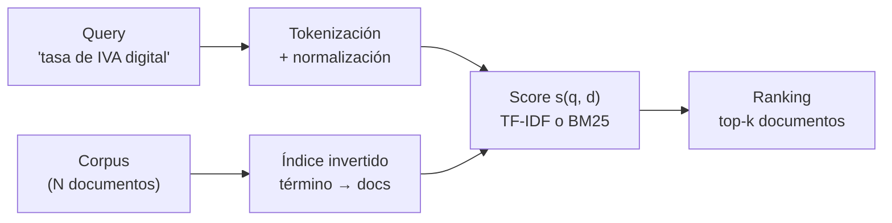
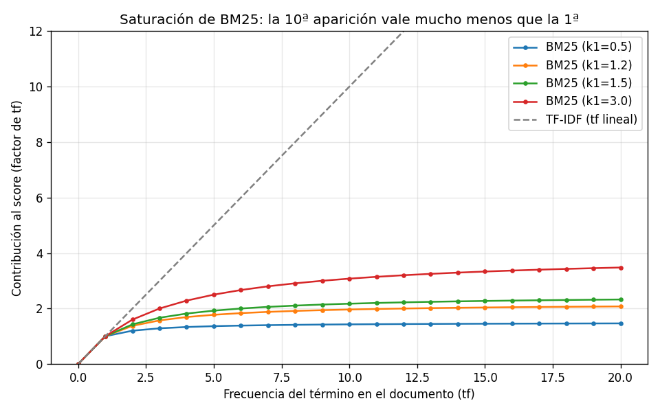

# 01 — IR pre-LLM: BM25 y TF-IDF

## Por qué empezar por lo "viejo"

Information retrieval es una disciplina de los años 60–70. Cuando Karen Spärck
Jones formuló la IDF (1972) y Stephen Robertson formalizó BM25 (1994, sobre el
modelo probabilístico de Robertson–Spärck Jones), no existían las redes
neuronales que usamos hoy. Sin embargo, en 2026, si abres el motor de búsqueda
de Elasticsearch, de Postgres (`ts_rank`), o el retriever por defecto de la
mitad de los sistemas RAG en producción, lo que encuentras es **BM25**.

Esto no es nostalgia. Es que el matching léxico exacto resuelve bien una clase
de queries que los embeddings densos resuelven *mal* — y esa clase es
sobrerrepresentada justo en dominios como el regulatorio. Antes de entender por
qué los vectores densos son poderosos (sección 2), hay que entender qué problema
resolvían ya, y bien, los métodos clásicos. Si no, no se puede razonar sobre
híbrido (sección 3), que es donde converge el estado del arte.

**Analogía económica.** BM25 es como un índice de precios bien construido: no
"entiende" la economía, pero cuenta lo que hay que contar, con las ponderaciones
correctas, de forma transparente y barata. Los embeddings densos son como un
modelo estructural: capturan relaciones que el índice no ve, a cambio de opacidad
y costo. El analista serio no elige uno por moda; usa el índice como base y el
modelo donde aporta.

## El problema de IR, formalmente

Dado un corpus de documentos `D = {d₁, …, d_N}` y una query `q`, queremos una
función de score `s(q, d)` que ordene los documentos de más a menos relevantes.
Todo lo demás —TF-IDF, BM25, embeddings, rerankers— son formas distintas de
definir `s`.

Los métodos clásicos comparten un supuesto: **bag-of-words**. Un documento es un
multiconjunto de términos; el orden no importa. "El IVA grava servicios" y
"servicios grava el IVA" son idénticos. Es una simplificación brutal, y aun así
funciona sorprendentemente bien, porque para muchas queries la *presencia* de los
términos correctos es casi toda la señal.



## Tokenización: la decisión silenciosa

Antes de cualquier score hay que convertir texto en términos. Esta etapa, que
parece trivial, define el techo de calidad de todo lo demás: **un término que no
se tokeniza bien no se puede recuperar**. En dominio jurídico chileno hay tres
trampas concretas, que nuestro tokenizador (`retrieval_lib.tokenize`) maneja
explícitamente:

1. **Acentos.** El usuario escribe "articulo", la norma dice "artículo". Si no
   normalizamos diacríticos, no hacen match. Solución: `NFKD` + descartar marcas
   combinantes.
2. **Referencias normativas con puntuación interna.** "Ley Nº 21.210",
   "Decreto Nº 1.423", "1,694 USE". Un tokenizador ingenuo parte "21.210" en
   "21" y "210". Preservamos el patrón `\d+([.,]\d+)*` para que "21.210" sea **un
   solo token** — y, como veremos, uno de altísimo poder discriminante.
3. **Ordinales.** `º` y `ª` se descomponen a `o`/`a` bajo `NFKD`, de modo que
   "Nº" terminaría como "no", colisionando con la negación "no" (que en texto
   legal **sí** importa: "no afecto a IVA" ≠ "afecto a IVA"). Los eliminamos
   antes de normalizar.

Sobre **stopwords**: la lista es deliberadamente conservadora. En texto general
se filtra agresivamente; en legal, palabras como "no", "sin", "menor", "salvo"
cambian el sentido jurídico. Quitamos solo conectores de altísima frecuencia
("de", "la", "que") y bajo poder discriminante.

> El detalle del punto 3 no es teórico: en la primera corrida, antes del fix,
> "Nº" se convertía en "no" y contaminaba el score del chunk top-1 de la query
> "¿Qué dice la Ley Nº 21.210?" con una contribución espuria de 2.19. Es el tipo
> de bug de tokenización que degrada un retriever sin que nadie lo note.

## TF-IDF

La idea de TF-IDF combina dos intuiciones:

- **TF (term frequency):** un término que aparece muchas veces en un documento
  es más representativo de ese documento.
- **IDF (inverse document frequency):** un término que aparece en *pocos*
  documentos discrimina más. "IVA" en una circular tributaria dice poco (está en
  todas); "21.210" dice mucho (está en una).

### Fórmulas (las que implementamos)

```
tf(t, d)  = frecuencia bruta del término t en el documento d
idf(t)    = log(N / df(t)) + 1          # df(t) = nº de docs que contienen t
peso(t,d) = tf(t, d) · idf(t)
```

El vector de un documento es `[peso(t₁,d), peso(t₂,d), …]` sobre el vocabulario.
Lo **normalizamos a norma L2**, de modo que el score entre query y documento es
el **coseno** entre sus vectores (producto punto de vectores unitarios). La
normalización L2 es clave: sin ella, los documentos largos (más términos, más
peso acumulado) dominarían solo por tamaño.

### IDF sobre el corpus real

Corriendo `01-ir-clasico.py` sobre los 4 documentos (68 chunks), el IDF de BM25
de algunos términos:

| Término | IDF | Lectura |
|---|---|---|
| `20.730` (Ley de Lobby) | 3.83 | Aparece en 1 doc → máximo poder discriminante |
| `vacunas` | 3.83 | Idem, término muy localizado |
| `21.210` (Ley IVA digital) | 3.32 | Referencia normativa, muy localizada |
| `iva` | 2.73 | Frecuente dentro de la circular |
| `lobby` | 2.73 | Concentrado en un doc pero repetido |
| `subvencion` | 2.22 | Aparece en el decreto, repetido |
| `salud` | 2.09 | El más "diluido" de los siete |

La lección de fondo: **las referencias normativas exactas son tokens de IDF
altísimo**. Eso es exactamente lo que las hace recuperables con precisión
quirúrgica por métodos léxicos — y, como veremos en la sección 2, lo que las hace
*invisibles* para los embeddings densos, que casi no las vieron en
pre-entrenamiento.

## BM25: lo que TF-IDF no tiene

BM25 mantiene la estructura `Σ idf(t) · (algo con tf)` pero arregla dos defectos
de TF-IDF que importan en documentos reales.

```
score(q, d) = Σ_{t ∈ q}  idf(t) · [ f(t,d) · (k₁ + 1) ] / [ f(t,d) + k₁ · (1 − b + b · |d|/avgdl) ]
```

donde `f(t,d)` es la frecuencia de `t` en `d`, `|d|` la longitud del documento,
`avgdl` la longitud promedio del corpus, y `k₁`, `b` hiperparámetros (usamos los
estándar `k₁=1.5`, `b=0.75`).

### Idea 1 — Saturación (k₁): utilidad marginal decreciente

En TF-IDF, si un término aparece 20 veces, contribuye 20×. BM25 dice: la 1ª
aparición confirma que el tema está presente; la 20ª aporta casi nada nuevo. La
contribución **satura**. Esto es, literalmente, utilidad marginal decreciente —
un concepto que como economista ya tienes internalizado.

Números (contribución de un término con `idf=1`, doc de longitud media, `k₁=1.5`):

| `tf` | BM25 | TF-IDF (lineal) |
|---|---|---|
| 1 | 1.000 | 1.000 |
| 2 | 1.429 | 2.000 |
| 5 | 1.923 | 5.000 |
| 10 | 2.174 | 10.000 |
| 20 | 2.326 | 20.000 |

La 20ª aparición en BM25 ya casi no mueve el score (2.33 vs 2.17 en tf=10);
en TF-IDF sigue sumando 1.0 cada vez. El hiperparámetro `k₁` controla la curvatura:



`k₁` bajo (0.5) satura agresivamente —casi binario, "está o no está"—; `k₁` alto
(3.0) se parece más a contar linealmente. El default 1.5 es un punto medio
robusto. Esta curva es, en una imagen, **por qué BM25 le gana a TF-IDF en
documentos donde los términos se repiten mucho** (spam de keywords, documentos
largos repetitivos): no se deja engañar por la repetición.

### Idea 2 — Normalización por longitud (b)

El término `(1 − b + b · |d|/avgdl)` penaliza a los documentos más largos que el
promedio. Sin esto, un documento extenso tendría ventaja injusta solo por
contener más palabras (más oportunidades de match). Con `b=0.75`, la
normalización es parcial: corrige el sesgo de longitud sin sobre-penalizar a los
documentos largos que son legítimamente más informativos. `b=0` la desactiva;
`b=1` normaliza completamente.

## Demostración sobre el corpus chileno

Todos los números siguientes salen de `uv run python 02-retrieval/code/01-ir-clasico.py`.

### Caso 1 — BM25 clava la referencia normativa

Query: *"¿Qué dice la Ley Nº 21.210?"*

```
1. [4.431] circular#2  MATERIA: ...aplicación del IVA... modificaciones por la Ley Nº 21.210...
2. [4.082] circular#4  La Ley Nº 21.210, publicada en el Diario Oficial el 24 de febrero de 2020...
3. [2.766] decreto#1   APRUEBA REGLAMENTO DE LA LEY Nº 20.248...
```

Los dos primeros resultados son los chunks de la circular que mencionan
explícitamente la 21.210. La descomposición del score del top-1 muestra de dónde
viene:

| Término | Contribución |
|---|---|
| `21.210` | 2.471 |
| `ley` | 1.961 |

El token `21.210`, con su IDF de 3.32, hace casi la mitad del trabajo. **Ningún
embedding denso le dará a esa cadena de dígitos el peso que merece**, porque para
el modelo "21.210" y "21.211" son casi el mismo vector (sección 2). Para una
query de cita normativa, esto es exactamente lo que quieres.

### Caso 2 — BM25 y TF-IDF rankean igual, por razones distintas

Query: *"obligaciones del prestador de servicios digitales extranjero"*

```
BM25                                    TF-IDF
1. [13.340] circular#11 IV. OBLIGACIONES...   1. [0.674] circular#11 IV. OBLIGACIONES...
2. [10.547] circular#12 Los prestadores...    2. [0.474] circular#12 Los prestadores...
3. [ 4.874] circular#2  MATERIA...            3. [0.194] circular#2  MATERIA...
```

Mismo orden. Las escalas son incomparables (BM25 no está normalizado a [0,1];
TF-IDF sí, por el coseno) — **una razón clave por la que en la sección 3 no
podremos fusionar híbrido sumando scores, sino fusionando rankings (RRF)**.

¿Por qué coinciden aquí? Porque nuestros chunks son cortos (15 tokens en
promedio) y de longitud pareja: las dos ventajas de BM25 (saturación y
normalización por longitud) no tienen sobre qué actuar. En documentos largos y
heterogéneos —contratos, leyes completas sin chunkear— BM25 se separa de TF-IDF.
Lección de diseño: **las ventajas de BM25 dependen de tu estrategia de chunking**
(sección 4).

### Caso 3 — El talón de Aquiles: brecha de vocabulario

Query: *"¿Cuántas USE recibe un alumno prioritario de 3º básico?"*

```
1. [9.067] decreto#7  a) Alumnos prioritarios de primer y segundo nivel... 1º a 6º básico: 1,694 USE...
2. [6.376] decreto#10 Artículo 2º.- La calidad de alumno prioritario...
3. [6.093] decreto#6  ...el monto de la subvención escolar preferencial...
```

BM25 recupera el chunk correcto (el #7 contiene la respuesta: 1,694 USE). Pero
mira *por qué*: el texto dice **"1º a 6º básico"**, nunca **"3º"**. BM25 no tiene
forma de saber que 3 ∈ [1, 6]. Acertó por los **otros** términos compartidos
(`use`, `alumno`, `prioritario`, `basico`), no porque entendiera el rango.

Esto funcionó por suerte —los demás términos bastaron—. Pero generaliza al
defecto estructural del matching léxico: **no captura significado, solo
coincidencia de superficie**. Una query parafraseada ("ayuda estatal para niños
vulnerables de primaria") que no comparta tokens con la norma haría que BM25
fallara por completo. Ahí es donde entran los embeddings densos (sección 2), y
por qué el futuro es híbrido (sección 3), no uno u otro.

## Métricas sobre el golden dataset

Reusamos las 25 queries con fuente conocida del golden de 01-evals (excluyendo
las 5 de abstención, que se tratan aparte) y las métricas Recall@k y MRR de
`01-evals/theory/05`, medidas a **nivel documento**:

| k | BM25 Recall@k | BM25 MRR | TF-IDF Recall@k | TF-IDF MRR |
|---|---|---|---|---|
| 1 | 0.926 | 0.963 | 0.926 | 0.963 |
| 3 | 0.926 | 0.963 | 0.926 | 0.963 |
| 5 | 0.944 | 0.963 | 0.944 | 0.963 |

Dos lecturas, una técnica y una honesta:

- **Técnica:** ambos retrievers identifican el documento correcto en el ~93% de
  las queries ya en la posición 1 (MRR 0.963 ≈ casi siempre top-1). Para un
  corpus de referencias normativas con jerga específica, BM25 puro es un baseline
  fortísimo. Esto es el primer dato concreto contra el reflejo "necesito un
  vector store".
- **Honesta:** con **solo 4 documentos**, acertar el doc correcto es fácil
  (hay 1 entre 4). El recall a nivel-doc tiene techo bajo y casi no discrimina
  entre arquitecturas. Por eso la sección 2 en adelante **expande el corpus** y
  la sección 8 mide a **nivel chunk**, donde recuperar el pasaje exacto entre
  decenas de candidatos sí separa a los buenos retrievers de los malos.

## Cuándo BM25 es la respuesta correcta (y no un paso previo)

No siempre se necesita lo siguiente en el pipeline. BM25 puro gana, en calidad
*y* costo, cuando:

| Situación | Por qué BM25 gana |
|---|---|
| Queries con referencias exactas ("artículo 5º Ley 20.730") | IDF alto premia el token raro; el denso lo aplana |
| Jerga/identificadores de dominio ("USE", "PRAIS", "DL 825") | Tokens fuera de la distribución de pre-entrenamiento del embedder |
| Corpus chico y vocabulario controlado | El costo y la complejidad de un vector store no se justifican |
| Necesitas explicabilidad ("¿por qué salió este doc?") | `explain()` da la contribución por término; el coseno denso es opaco |
| Restricción de costo/latencia/infra | BM25 corre en CPU, sin API, sin GPU, en microsegundos |

BM25 **no** basta cuando la query y el documento usan vocabularios distintos
(paráfrasis, sinonimia, traducción de registro coloquial↔técnico). Ese es el
hueco que llena la sección 2, y la razón por la que el default moderno no es
"BM25 o denso" sino **"BM25 y denso"** (sección 3).

## Estado del arte

| Aspecto | Estado | Detalle |
|---|---|---|
| BM25 como baseline | ✅ Vigente | Sigue siendo el baseline a batir en benchmarks de IR (BEIR, 2021–2026) |
| TF-IDF en producción | 🟡 En retirada | Desplazado por BM25 salvo en sistemas legacy o muy simples |
| Tokenización de dominio | 🟡 Artesanal | No hay estándar; cada dominio (legal, médico, código) requiere reglas propias |
| BM25 + filtros estructurados | ✅ Subvalorado | Resuelve más queries reales de las que la industria de "vector DB" admite |
| Variantes (BM25F, BM25+) | ✅ Resueltas | Extensiones para campos múltiples y corrección de saturación; rara vez necesarias en RAG |

## Conexiones

- **Sección 2 (embeddings densos):** el reverso de esta moneda. Donde BM25 falla
  (paráfrasis, sinonimia), el denso brilla; donde BM25 brilla (referencias
  exactas, jerga), el denso falla. La tabla de IDF de aquí es el setup del
  contraste.
- **Sección 3 (hybrid):** combinar ambos. El detalle de que las escalas de BM25
  y TF-IDF/coseno son incomparables (Caso 2) es justo por lo que se fusiona con
  RRF sobre rankings, no sumando scores.
- **Sección 4 (chunking):** las ventajas de BM25 (saturación, normalización por
  longitud) dependen de cómo se corten los documentos.
- **Sección 8 (evaluación):** las métricas a nivel-doc de aquí son el piso;
  allí se mide a nivel-chunk con intervalos de confianza para comparar
  arquitecturas con rigor.
- **01-evals/theory/05:** las definiciones de Recall@k y MRR que usamos vienen
  de allí; esta masterclass es "qué cambiar en el retriever para moverlas".
