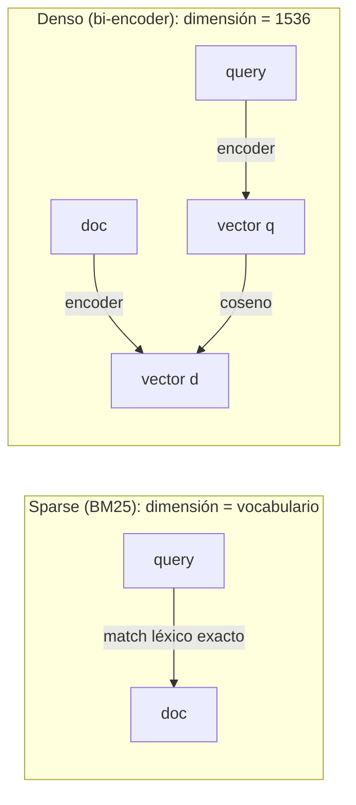
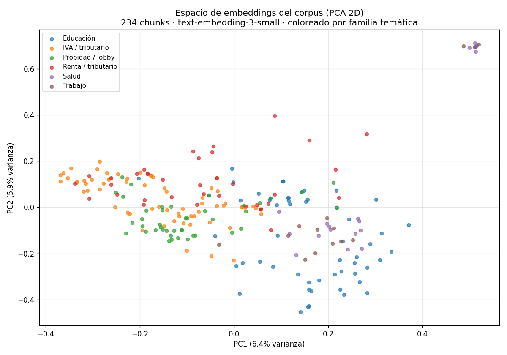

# 02 — Embeddings densos: geometría y sus fallos

## De la palabra al vector

La sección 1 trató cada término como un símbolo opaco: "IVA" hace match con
"IVA" y con nada más. Formalmente, BM25 vive en un espacio **disperso** de
dimensión = tamaño del vocabulario, donde cada documento es un vector con un 1
(o un peso) en las posiciones de sus términos y 0 en el resto. "IVA" y "tributo"
son ejes **ortogonales**: su similitud es exactamente cero, por más que
signifiquen casi lo mismo.

Un embedding denso cambia el espacio. Cada texto se mapea a un vector de unos
cientos o miles de dimensiones (1536 en `text-embedding-3-small`, el que usamos
aquí), donde **la dirección codifica significado**. Textos con sentido parecido
apuntan en direcciones parecidas, aunque no compartan una sola palabra. La
similitud se mide con el **coseno** del ángulo entre vectores.

**Analogía económica.** BM25 es como clasificar países por una lista de
atributos binarios ("¿exporta cobre? ¿tiene IVA? ¿es OCDE?"): dos países son
"similares" solo si comparten exactamente los mismos casilleros. Un embedding es
como ubicarlos en un espacio latente de factores (apertura comercial, ingreso,
estructura productiva) donde Chile y Perú quedan cerca *aunque* sus casilleros
difieran. El embedding no compara palabras; compara posiciones en un espacio de
significado aprendido.



Los dos textos se codifican **por separado** (de ahí "bi-encoder") y solo
interactúan al final, vía coseno. Guarda esta idea: en la sección 6 veremos que
los cross-encoders rompen justamente esa separación, a cambio de costo.

## La geometría, con números

Tomamos tres pares de frases y medimos el coseno entre sus embeddings reales
(corrida de `02-embeddings-geometria.py`):

| Frase A | Frase B | Coseno |
|---|---|---|
| "IVA a servicios digitales" | "impuesto a plataformas de streaming extranjeras" | **0.417** |
| "subvención escolar para alumnos prioritarios" | "ayuda estatal a niños vulnerables" | **0.508** |
| "IVA a servicios digitales" | "multa por no declarar patrimonio" | **0.197** |

Los dos primeros pares **no comparten casi ninguna palabra** y aun así tienen
coseno alto: el embedding capturó que "streaming extranjero" ≈ "servicios
digitales" y que "niños vulnerables" ≈ "alumnos prioritarios". Para BM25 esos
pares tendrían solapamiento léxico casi nulo. El tercer par, de temas distintos,
cae a 0.197. **Esto es exactamente lo que BM25 no puede hacer**, y la razón por
la que existen los embeddings.

> Nota sobre escala: los cosenos de `text-embedding-3-small` son "comprimidos"
> (rara vez superan 0.7 incluso para casi-sinónimos). Lo que importa no es el
> valor absoluto sino el **orden**: relacionado > no relacionado. No interpretes
> 0.5 como "50% similar".

## Visualizar el espacio: PCA desde cero

1536 dimensiones no se pueden ver. Para tener intuición, proyectamos los 234
chunks del corpus a 2D con **PCA implementado desde cero** (`pca_2d` en
`retrieval_lib`): centrar los datos y quedarse con las dos direcciones de máxima
varianza (los primeros vectores singulares de la matriz centrada, vía SVD).



Se ve estructura temática real: los chunks de IVA/tributario se agrupan a la
izquierda, los de educación a la derecha, probidad/lobby al centro. Pero hay
**solape** y un detalle honesto en los ejes: PC1 explica solo **6.4%** de la
varianza y PC2 **5.9%** — juntos ~12%. Es decir, **el 88% de la información
geométrica no cabe en 2D**. La lección metodológica: las proyecciones 2D
(PCA, t-SNE, UMAP) son útiles para *intuición*, pero nunca para *decidir* — dos
puntos que se ven lejos en el plano pueden estar cerca en 1536D y viceversa.
Evalúa con métricas (sección 8), no con la vista.

## Dónde el denso le gana a BM25

El caso más nítido (corrida real). Query:
*"¿cómo se sanciona a un funcionario que esconde sus bienes?"*

```
BM25                                         DENSO
1. [4.300] ley-01-dl-825-iva-base   "vendedor"  1. [0.538] norma-02-probidad  Art. 18º: el que no
2. [3.636] ley-01-dl-825-iva-base   "venta"        presente la declaración... multa 10 a 30 UTM
3. [3.067] ley-01-dl-825-iva-base   Art. 8º IVA  2. [0.479] norma-02-probidad  LEY 20.880 PROBIDAD
                                                 3. [0.477] norma-02-probidad  Art. 19º datos falsos
```

BM25 **falla por completo**: matchea "persona natural", "que se dedique" en las
definiciones del DL 825 (IVA) y devuelve basura tributaria. La query no comparte
vocabulario con la norma de probidad ("esconde bienes" vs "no presente la
declaración de intereses y patrimonio"). El denso clava los tres chunks
correctos de la Ley 20.880, incluyendo el artículo de sanciones. Esto es la
**brecha de vocabulario** de la sección 1, cerrada.

Segundo caso. Query: *"¿pagan impuesto las plataformas de streaming
extranjeras?"* — BM25 pone en el puesto 2 un chunk de la **Ley de Lobby**
(matchea "remunerada", "extranjeras"); el denso pone primero el chunk exacto de
la circular de IVA digital sobre plataformas de intermediación. El denso filtra
el ruido léxico que confunde a BM25.

## Dónde el denso falla (y por qué)

Aquí está el contrapeso honesto. Los embeddings densos tienen tres puntos ciegos
sistemáticos, todos visibles en el corpus.

### 1. Referencias exactas y tokens raros

Query: *"Ley Nº 21.210"*

```
BM25                                         DENSO
1. [6.911] ley-02-ley-21210  ← LA LEY 21.210  1. [0.658] ley-01-dl-825-iva-base ← el DL 825,
2. [6.060] ley-01-dl-825     "previo a 21.210"     que dice "PREVIO A LA LEY 21.210"
3. [5.067] circular-02-propyme                2. [0.649] ley-02-ley-21210  ← LA LEY 21.210
```

BM25 pone la Ley 21.210 en el puesto 1. **El denso la pone en el 2**, detrás del
DL 825 — el documento que *menciona* la 21.210 como contexto ("texto previo a la
Ley 21.210"). El embedder no le da a la cadena "21.210" el peso de identificador
único que merece: para él, "la ley 21.210" y "el texto previo a la ley 21.210"
son semánticamente casi idénticos, porque ambos hablan "de la misma reforma
tributaria". El tokenizador del modelo parte "21.210" en sub-piezas (BPE) que vio
en mil contextos, diluyendo su poder discriminante. Para una consulta por cita
normativa —el pan de cada día en dominio regulatorio— eso es justo lo que no
quieres. **Aquí BM25, con su IDF altísimo para "21.210" (sección 1), gana.**

### 2. Dominio especializado

`text-embedding-3-small` se entrenó con texto general de internet, no con español
jurídico chileno. Su noción de "cercanía" refleja semántica general, no las
distinciones finas del dominio: la diferencia entre una ley y la ley que ella
modifica, o entre "subvención" (transferencia a colegios) y "subsidio"
(transferencia a trabajadores), se difumina. Es la misma razón por la que un
embedding general confunde jerga médica o de programación: nadie le enseñó la
estructura del dominio. La solución real es *fine-tunear* embeddings de dominio
—área activa en 2026— o, más barato, usar híbrido (sección 3).

### 3. Honestidad: a veces el denso NO falla en tokens raros

Query: *"¿qué es el PRAIS?"* — **empate**: tanto BM25 como el denso devuelven
primero el chunk correcto de la glosa de Salud (`Asignación 112 - Programa de
Reparación y Atención Integral de Salud (PRAIS)`). La sigla aparece *literal y
saliente* en el texto, y el embedder la asoció bien. Moraleja: el denso no es
ciego a toda sigla; falla cuando el token raro es un **identificador arbitrario**
(un número de ley) más que un **concepto con contexto** (un programa con nombre
descriptivo). No sobre-generalices "denso = malo en términos raros".

En la query de la UTM, ambos encuentran la tabla correcta, pero el denso elige
la **fila equivocada** (devuelve la línea de la UTA anual antes que la cabecera
de UTM mensual). Es un fallo de *grano fino* dentro del documento correcto —
preludio del problema de chunking de tablas (sección 9).

## El veredicto cuantificado

Recall@k de BM25 vs denso sobre las 25 queries con fuente del golden, ahora sobre
el corpus completo de 16 documentos (con distractores):

| | recall@1 | recall@3 | recall@5 |
|---|---|---|---|
| **BM25** | **0.907** | 0.907 | 0.907 |
| **Denso** | 0.796 | **0.963** | **0.963** |

Dos lecturas que, juntas, son la tesis de toda la masterclass:

1. **BM25 gana en precisión de tope (@1)**: 0.907 vs 0.796. Cuando hay solape
   léxico, clava el doc correcto en el puesto 1. Pero su recall es **plano**:
   lo que no encuentra de inmediato, no lo encuentra nunca (las queries sin
   solape léxico son misses totales — recall@5 sigue en 0.907).
2. **El denso gana en recall (@3)**: 0.963 vs 0.907. Recupera lo que a BM25 se le
   escapa por vocabulario, aunque a veces lo ponga en el puesto 2-3 en vez del 1.

Y al desagregar por tipo de query (recall@3) aparece *dónde* exactamente:

| Tipo de query | BM25 | Denso | n |
|---|---|---|---|
| entidad | 1.000 | 1.000 | 5 |
| factual | 1.000 | 1.000 | 10 |
| numérico | 1.000 | 1.000 | 8 |
| **multi-doc** | **0.375** | **0.750** | 4 |

En las queries factuales/numéricas/de entidad empatan en techo. **Toda la
diferencia está en las multi-doc** (preguntas que cruzan documentos y usan
paráfrasis): el denso dobla a BM25 (0.750 vs 0.375). Ese es el estrato donde el
significado importa más que las palabras.

La conclusión no es "denso > sparse" ni al revés. Es que **fallan en queries
distintas**: BM25 en la paráfrasis, el denso en la cita exacta. Combinarlos
debería dominar a cualquiera por separado — y eso es, con números, la sección 3.

## Costo y operación (lo que el coseno esconde)

- **Necesitas un índice de vectores.** Aquí cabe en memoria (234 × 1536 floats);
  en producción son FAISS, pgvector (tu caso con Supabase) o un vector store.
- **Embeddings cuestan.** Vía API se paga por token; el corpus completo costó
  **1 llamada** y centavos. La caché en disco (`examples/cache-embeddings/`)
  hace que las corridas siguientes sean gratis y **reproducibles sin API key**.
- **Re-indexar al cambiar de modelo.** Los vectores de un modelo no son
  comparables con los de otro: cambiar de embedder obliga a re-embeddear todo.

## Estado del arte

| Aspecto | Estado | Detalle |
|---|---|---|
| Embeddings densos de propósito general | ✅ Commodity | OpenAI, Cohere, Voyage, modelos abiertos (BGE, E5) muy maduros |
| Brecha en dominios especializados | 🟡 Real y persistente | Legal/médico/regulatorio local siguen necesitando fine-tuning o híbrido |
| Fine-tuning de embeddings de dominio | 🟡 En progreso | Efectivo pero caro de datos; contrastive learning sobre pares del dominio |
| Embeddings multilingües para español legal | 🟡 Aceptable | Funcionan, pero no entrenados en jerga jurídica chilena específica |
| Visualización 2D como herramienta de decisión | 🔴 Anti-patrón | Útil para intuición; engañosa para evaluar (poca varianza capturada) |

## Conexiones

- **Sección 1 (BM25):** el reverso exacto. La tabla de IDF de allí (tokens raros
  = IDF alto) explica por qué BM25 gana en citas; aquí vimos que el denso aplana
  justo esos tokens.
- **Sección 3 (hybrid):** la tabla de recall por tipo de query es la
  justificación numérica. Fusionamos con RRF (no sumando scores) porque, como
  vimos, las escalas de BM25 (0–14) y del coseno (0–1) son incomparables.
- **Sección 6 (reranking):** el fallo de "fila equivocada" en la tabla de UTM y
  el de "doc de contexto en vez del doc exacto" en la 21.210 son precisamente lo
  que un reranker (cross-encoder) corrige re-ordenando el top-k.
- **Sección 9 (casos límite):** las tres debilidades del denso (citas, dominio,
  tablas) son tres de los casos límite del dominio regulatorio chileno.
