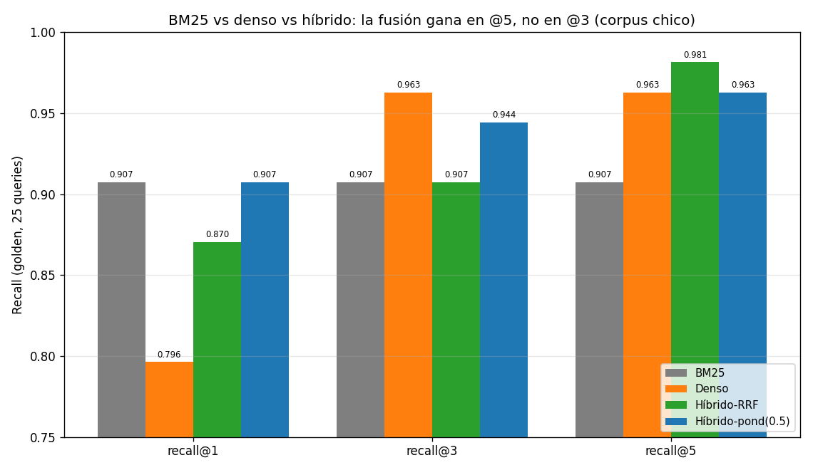
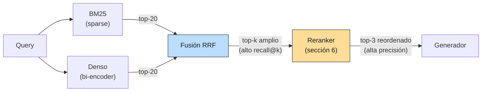

# 03 — Hybrid search: sparse + dense

## La tesis, heredada de la sección 2

La sección 2 cerró con un número que es toda la motivación de esta sección:
BM25 y el denso **fallan en queries distintas**. BM25 gana en citas exactas y
pierde en paráfrasis; el denso gana en paráfrasis y pierde en citas. Si sus
errores no están correlacionados, combinarlos debería darnos lo mejor de cada
uno sin tener que saber de antemano qué tipo de query llegó.

Eso es hybrid search: correr ambos retrievers y **fusionar** sus resultados. La
pregunta técnica es *cómo* fusionar, y la respuesta tiene una trampa que vimos
en la sección 1.

## Por qué no se pueden sumar los scores

Recordemos los scores de la sección 1, caso 2: para la misma query, BM25 daba
13.34 al top-1 y el coseno daba 0.674. Las escalas son **incomparables**:

- BM25 no está acotado: depende del IDF y del número de términos que matchean
  (vimos scores de 4 a 14 en el corpus).
- El coseno vive en [−1, 1], y con `text-embedding-3-small` rara vez supera 0.7.

Sumar `13.34 + 0.674` no significa nada: BM25 dominaría siempre solo por estar
en otra escala. Hay dos salidas:

1. **Normalizar los scores** a una escala común y combinarlos (fusión ponderada).
2. **Ignorar los scores y usar solo las posiciones** (RRF).

La segunda es la que la industria adoptó por defecto, y ahora veremos por qué.

## RRF: Reciprocal Rank Fusion, desde cero

RRF asigna a cada documento un puntaje basado únicamente en su **posición** en
cada ranking:

```
score_RRF(d) = Σ_r  1 / (k + rank_r(d))
```

donde `r` recorre los retrievers, `rank_r(d)` es la posición de `d` en el
ranking del retriever `r`, y `k` es una constante de amortiguación (estándar:
60). Un documento ausente de un ranking simplemente no suma por esa vía.

La intuición: estar en el puesto 1 vale `1/(60+1) = 0.0164`; en el puesto 2,
`1/62 = 0.0161`; la diferencia entre posiciones altas es pequeña y se aplana
hacia abajo. `k` controla cuánto premiar las primeras posiciones: `k` chico las
premia mucho; `k` grande aplana. Al usar solo rangos, RRF es inmune al problema
de escalas.

### Paso a paso sobre el corpus

Query: *"Ley Nº 21.210"* (corrida real de `03-hybrid-rrf.py`):

| rank | BM25 | DENSO |
|---|---|---|
| 1 | **ley-02-ley-21210** | ley-01-dl-825 (el doc de *contexto*) |
| 2 | ley-01-dl-825 | **ley-02-ley-21210** |
| 3 | circular-02-propyme | circular-04-exenciones |

El denso, como vimos en §2, se equivoca de tope: pone primero el DL 825 (que
*menciona* la 21.210) y relega la ley misma al puesto 2. BM25 la pone primera.
RRF fusiona:

| doc | cálculo RRF | score |
|---|---|---|
| ley-02-ley-21210 | 1/61 (BM25#1) + 1/62 (denso#2) | **0.03252** |
| ley-01-dl-825 | 1/62 (BM25#2) + 1/61 (denso#1) | 0.03252 |
| circular-02-propyme | 1/63 (BM25#3) | 0.01587 |

La ley y su doc de contexto quedan **empatados en el tope** y la ley se queda con
el primer lugar. Sin saber qué retriever creer, RRF recuperó la respuesta
correcta al puesto 1. Esa es la promesa de la fusión: **robustez**.

## Fusión ponderada (y por qué es más frágil)

La alternativa normaliza los scores de cada retriever a [0,1] (min-max) y los
combina con pesos:

```
score(d) = Σ_r  w_r · normalizado_r(score_r(d))
```

Tiene dos debilidades frente a RRF, ambas en `weighted_fuse`:

1. **Hay que elegir los pesos** (`w_r`) — un hiperparámetro que depende del
   dataset.
2. **El min-max es brutal**: el peor resultado de cada lista se normaliza a 0,
   sin importar su calidad absoluta. Si BM25 devuelve 5 docs todos buenos, el 5º
   igual queda en 0.

## Los resultados: honestidad sobre lo que la fusión sí y no logra

Aquí es donde hay que resistir el relato fácil de "híbrido siempre gana". Los
números reales sobre las 25 queries del golden (corpus de 16 docs):

| Sistema | recall@1 | recall@3 | recall@5 |
|---|---|---|---|
| BM25 | 0.907 | 0.907 | 0.907 |
| Denso | 0.796 | **0.963** | 0.963 |
| **Híbrido-RRF** | 0.870 | 0.907 | **0.981** |
| Híbrido-ponderado (0.5) | 0.907 | 0.944 | 0.963 |



Lo honesto:

- **En recall@5, RRF gana a todos** (0.981 vs 0.963 del denso y 0.907 de BM25).
  Con un corte un poco más profundo, la fusión rescata los hits complementarios
  que ningún método solo tenía en su top-5.
- **En recall@3, RRF (0.907) NO supera al denso (0.963)**; de hecho lo empata con
  BM25. La fusión ingenua, a igual peso, arrastró hacia abajo la buena señal del
  denso en el top-3.

¿Por qué? El desglose por tipo de query (recall@3) lo muestra:

| Tipo | BM25 | Denso | RRF | Ponderado |
|---|---|---|---|---|
| entidad / factual / numérico | 1.000 | 1.000 | 1.000 | 1.000 |
| **multi-doc** | 0.375 | **0.750** | 0.375 | 0.625 |

Tres de los cuatro tipos ya están en **techo** para ambos retrievers: no hay nada
que fusionar. Todo el juego está en las 4 queries multi-doc, y ahí RRF a igual
peso (0.375) iguala a BM25 en lugar de al denso (0.750): al tratar a ambos
retrievers como igual de confiables, **diluyó** la ventaja del denso en el
estrato donde el denso domina.

El barrido del peso α (peso del denso) lo confirma — recall@3 sube monótono al
dar más peso al denso, y el óptimo es α≈1 (denso casi puro):

```
α=0.0–0.2 → 0.907   α=0.3–0.7 → 0.944   α=0.8–1.0 → 0.963
```

### Las dos lecciones honestas

1. **La fusión rinde donde los retrievers genuinamente discrepan, y a la k que
   importa.** En este corpus chico, la mayoría de queries ya están resueltas por
   ambos métodos (efecto techo) y solo 4 son multi-doc, así que el margen es
   estrecho y se materializa en @5, no en @3. En un corpus grande con más queries
   de paráfrasis y citas mezcladas, la brecha se ensancha.

2. **El verdadero valor de RRF no es ganar siempre, sino la robustez sin
   tuning.** Cualitativamente, RRF mantuvo el doc correcto en el tope en las tres
   queries problemáticas a la vez — la cita exacta ("Ley 21.210", donde el denso
   fallaba), la paráfrasis ("ayuda económica para colegios", donde BM25 se
   dispersaba) y la semántica pura ("funcionario que esconde sus bienes", donde
   BM25 devolvía basura del DL 825). **No tuviste que saber el tipo de query.**
   La ponderada habría exigido elegir α; RRF no.

## El pipeline que esto implica

El patrón ganador en 2026 no es "elegir retriever" sino esta cadena:



Y los números de arriba explican exactamente por qué hay un reranker después: RRF
**maximiza recall@5** (0.981 — casi todo lo relevante está en el top-5) pero su
**orden dentro del top no es óptimo** (recall@3 < denso). El trabajo del reranker
(§6) es justamente reordenar ese pool de alto recall para subir lo relevante a
las primeras posiciones. Hybrid recupera; reranking ordena.

## Cuándo NO molestarse con híbrido

Coherente con la honestidad de la masterclass:

- Si **todas** tus queries son citas exactas (códigos de ley, números de
  artículo, montos), BM25 solo ya da recall@1 alto y el denso solo agrega costo.
- Si **todas** son paráfrasis conceptuales, el denso solo basta.
- El híbrido paga cuando el tráfico **mezcla** ambos tipos y no quieres clasificar
  cada query — que es el caso real de un RAG regulatorio abierto al usuario.
- Y siempre tiene un costo: dos índices que mantener, dos retrievals por query,
  más latencia. En un corpus chico y homogéneo puede ser sobre-ingeniería.

## Estado del arte

| Aspecto | Estado | Detalle |
|---|---|---|
| RRF como fusión por defecto | ✅ Consenso | Robusto, sin hiperparámetros, en Elasticsearch, Weaviate, etc. |
| Constante k de RRF | ✅ Resuelto | 60 es el estándar; el resultado es poco sensible a su valor exacto |
| Fusión ponderada / aprendida | 🟡 Caso a caso | Mejora si tunéas α por dataset o aprendes pesos (learning-to-rank) |
| Hybrid + reranking | ✅ Patrón dominante | "Retrieve wide, rerank narrow" es la arquitectura RAG de referencia |
| Cuánta profundidad fusionar | 🟡 Empírico | Fusionar top-20–100 de cada uno; depende del reranker posterior |

## Conexiones

- **Sección 1 y 2:** la fusión existe porque BM25 (cita exacta) y denso
  (paráfrasis) son complementarios; el problema de escalas incomparables que
  motiva RRF lo vimos en §1, caso 2.
- **Sección 6 (reranking):** RRF maximiza recall@k pero no el orden fino; el
  reranker arregla justo eso sobre el pool fusionado. Es el siguiente eslabón.
- **Sección 8 (evaluación):** el efecto techo que vimos (3 de 4 tipos en 1.000)
  es un problema del banco de pruebas; allí construimos ground truth a nivel
  chunk para que las métricas discriminen de verdad entre arquitecturas.
- **01-evals/theory/08 (estadística):** con solo 4 queries multi-doc, la
  diferencia 0.375 vs 0.750 tiene una incertidumbre enorme. Antes de declarar
  "el denso gana en multi-doc" habría que ponerle un intervalo de confianza
  (bootstrap) — lo retomamos en §8.
