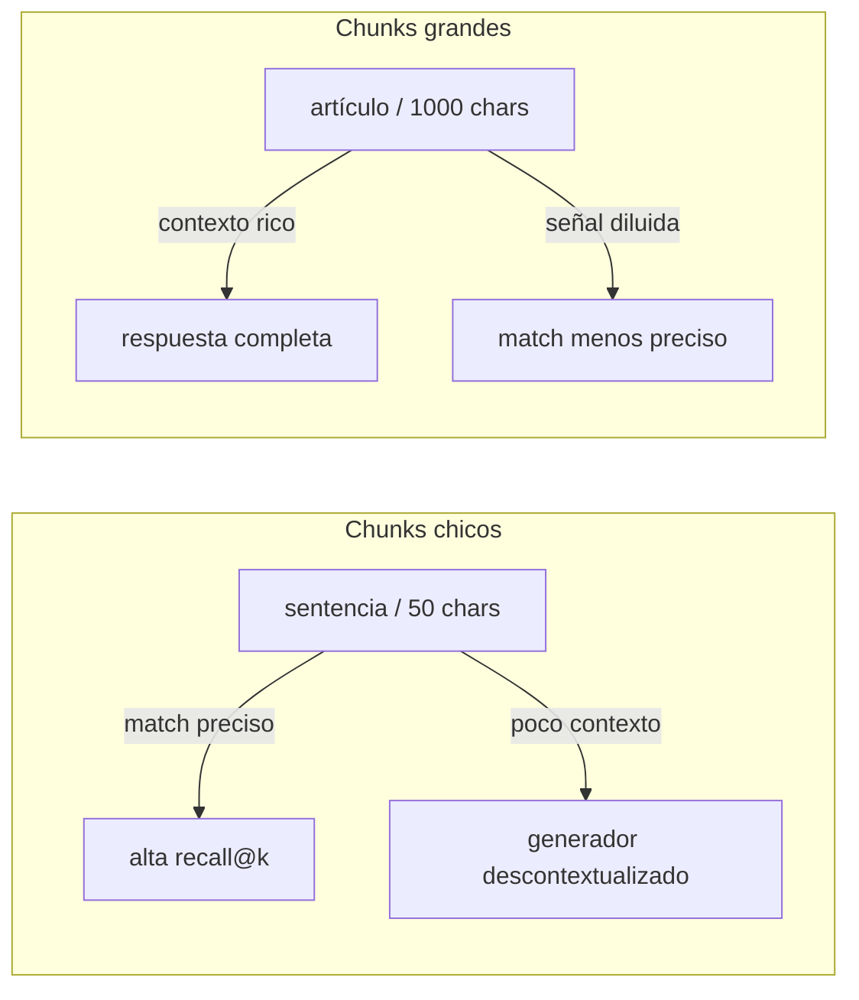
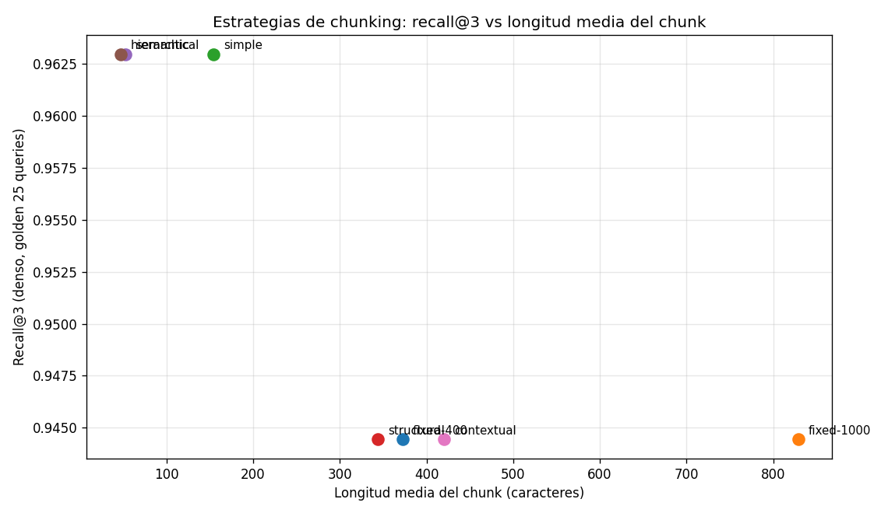
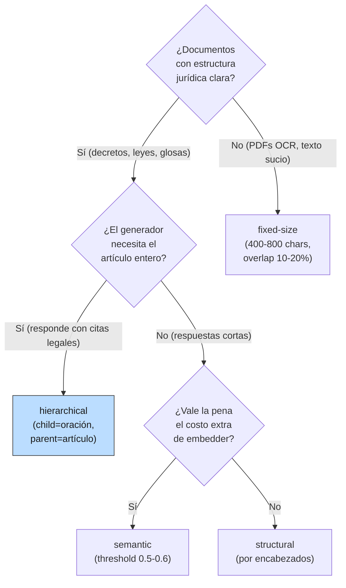

# 04 — Chunking serio para documentos legales largos

## La decisión silenciosa

Los retrievers de las secciones 1-3 trabajan sobre **chunks**, no sobre
documentos. Eso significa que toda la calidad de tu sistema RAG depende, antes
que de cualquier modelo, de una decisión que casi nadie discute: *cómo cortar el
documento*. Un chunk demasiado chico no tiene contexto suficiente; uno demasiado
grande mezcla temas y diluye el match. Un chunk que parte una tabla la
destruye; uno que parte un artículo legal lo deja sin antecedente. **Si un
término no cabe en un chunk indexable, no se puede recuperar** — punto, da
igual qué tan bueno sea tu BM25 o tu embedder.

**Analogía económica.** Chunking es decidir la **unidad de análisis** antes de
estimar nada. Si analizas inflación con datos *mensuales* ves cosas que con
datos *trimestrales* desaparecen, y viceversa: ninguna de las dos elecciones es
neutra. Lo mismo aquí: la unidad de chunkeo define qué hipótesis (qué queries)
puedes responder y cuáles quedan estructuralmente fuera del alcance.

## El trade-off central: precisión vs contexto



Cuanto **más chico** el chunk, **más precisa** la coincidencia (cada chunk es
una unidad temática estrecha que matchea o no matchea limpiamente), pero
**menos contexto** lleva al generador. Cuanto **más grande**, lo opuesto. Las
cinco estrategias siguientes son distintos puntos de esa frontera, más una
sexta (jerárquica) que intenta tener las dos cosas a la vez.

## Cinco estrategias, implementadas en `retrieval_lib`

### 1. Fixed-size (ventana deslizante)

El más ingenuo: corta cada N caracteres con solape O. No respeta nada: parte
artículos, oraciones, tablas, donde caiga. Es la elección de defecto cuando no
hay estructura confiable o cuando no quieres invertir tiempo en la decisión.

```python
fixed_chunk(text, doc_id, size=400, overlap=50)
```

Hiperparámetros: `size` (típico 200-1000), `overlap` (10-20% del size) para que
ningún hecho quede partido sin redundancia.

### 2. Simple (línea en blanco)

Lo que veníamos usando. Aprovecha que los documentos legales chilenos tienen
párrafos visualmente separados. Es un proxy *barato* de estructura.

### 3. Structural (por encabezados del dominio)

Detecta encabezados específicos del español jurídico chileno —`Artículo Nº`,
`Glosa N:`, `TÍTULO`, `PÁRRAFO`, `CAPÍTULO`, numerales romanos— y agrupa todo
el texto bajo cada encabezado en un solo chunk. Un artículo completo queda
indivisible; una glosa entera también.

```python
structural_chunk(text, doc_id)   # usa _LEGAL_HEADER, regex en retrieval_lib
```

Ventaja: la unidad recuperada es la unidad **citable** ("Artículo 3º del decreto
1.423"). Costo: chunks más largos y con menor poder de discriminación.

### 4. Semantic (donde el coseno cae)

Parte el texto en oraciones, embebe cada una, y empieza un nuevo chunk cuando
el coseno entre oraciones consecutivas cae bajo un umbral. Idea: mantener
juntas oraciones que hablan de lo mismo, separar al cambio de tema.

```python
semantic_chunk(text, doc_id, embedder, threshold=0.55)
```

Requiere embeddings de oraciones (costo extra) y elegir `threshold`. Demasiado
alto → fragmenta de más; demasiado bajo → no fragmenta.

### 5. Hierarchical (parent / child)

Combina dos granos. Los **hijos** son chunks chicos (en nuestra implementación,
oraciones); los **padres** son los bloques estructurales que los contienen.
Indexas y recuperas por hijo (precisión); devuelves el padre al generador
(contexto).

```python
hierarchical_chunk(text, doc_id)
# devuelve hijos con meta={'parent_id', 'parent_text'}
```

Es el patrón con mejor relación precisión-contexto en la práctica. Su talón de
Aquiles aparece cuando el hijo matchea por sentido pero el padre no es el
correcto (lo veremos en los números).

### 6. Late chunking — y lo que SÍ podemos hacer

**True late chunking** (Günther et al., 2024) embebe el documento *entero* con
un encoder de contexto largo y luego hace `mean-pool` de los embeddings
token-level sobre el rango de cada chunk. El resultado: la representación de
cada chunk "vio" el documento completo al codificarse. Es atractivo para
docs legales donde una glosa al final tiene sentido por el título al inicio.

**Lo que no podemos hacer aquí**: la API de OpenAI Embeddings devuelve **un
vector por input**, no token-level. Esa es la barrera técnica. Late chunking
real requiere un encoder local (Jina v2/v3, BGE-M3) con acceso al pooling.

**Lo que sí podemos hacer**: la técnica de Anthropic (2024) llamada *contextual
chunking* ataca el mismo problema (chunks descontextualizados) desde otro
ángulo: a cada chunk se le **prepone una descripción del documento** antes de
embeberlo. Es compatible con cualquier embedder. Lo implementamos en
`contextual_chunk` y aparece como una fila más en los números.

## Los números, sobre el corpus

Recall@k denso por estrategia (golden, 25 queries con fuente):

| Estrategia | nº chunks | avg chars | @1 | @3 | @5 |
|---|---|---|---|---|---|
| fixed-400 | 111 | 372 | 0.833 | 0.944 | 0.963 |
| fixed-1000 | 48 | 829 | **0.907** | 0.944 | **0.981** |
| simple | 234 | 154 | 0.796 | **0.963** | 0.963 |
| structural | 106 | 344 | **0.907** | 0.944 | 0.963 |
| semantic | 666 | 52 | 0.815 | **0.963** | **0.981** |
| hierarchical | 740 | 47 | 0.852 | **0.963** | **0.981** |
| contextual | 106 | 420 | **0.907** | 0.944 | 0.963 |



Lecturas honestas:

- **Hay dos grupos claros.** Estrategias de chunk grande (`fixed-1000`,
  `structural`, `contextual`) ganan en `@1` (0.907) pero se quedan en 0.944 en
  `@3`. Estrategias de chunk chico (`simple`, `semantic`, `hierarchical`) ganan
  en `@3` y `@5` (hasta 0.981) pero pierden en `@1`. Es el trade-off del
  comienzo, en números.
- **Contextual chunking no movió la aguja aquí.** En este corpus chico y con
  golden mayoritariamente dentro de un solo doc, prefijar el doc no aporta. Su
  beneficio documentado en la literatura aparece en queries cross-doc y con
  chunks que pierden referente — lo veremos mejor cuando construyamos el golden
  a nivel chunk en §8.
- **El recall@3 está cerca de techo en todas (0.94–0.96).** Como en §3, hay
  efecto techo: la mayoría de queries del golden se resuelven independiente de
  la estrategia de chunkeo. Para discriminar de verdad necesitamos métricas a
  nivel chunk con expected_chunks como ground truth (§8).

## Por qué los números no cuentan toda la historia

Recall@k a nivel doc dice "el doc correcto está en el top-k", pero no "el chunk
devuelto contiene la respuesta". Esto último depende fuertemente de la
estrategia. Misma query, *"¿Cuántas USE recibe un alumno prioritario de 3º
básico?"* (respuesta: **1.694 USE**), top-1 de cada estrategia:

| Estrategia | Contiene "1.694 USE" | Qué devuelve |
|---|---|---|
| fixed-400 | ✓ | Fragmento que parte a media palabra pero incluye los rates |
| fixed-1000 | ✓ | Ventana grande con todos los rates por nivel |
| simple | ✓ | Bloque limpio con la lista completa |
| **structural** | **✗** | Artículo 1º (procedimiento), no Artículo 3 (rates) |
| semantic | ✓ | Lista de rates como un bloque semántico |
| **hierarchical** | **✗** | Oración "b) 7º y 8º básico: 1.130 USE" — **tramo equivocado** |
| **contextual** | **✗** | Artículo 2º (criterios JUNAEB), no el de rates |

`hierarchical` falló de forma instructiva: la oración correcta dice "1º a 6º
básico" y la incorrecta dice "7º y 8º básico". Para el embedder son
semánticamente casi idénticas (ambas listan tramos escolares con valores USE),
y eligió la equivocada. El embedder **no hace aritmética**: no entiende que 3º
está en [1º, 6º]. Esto es la brecha de la sección 2 (denso vs siglas/números),
reaparecida a nivel chunk.

Pero `hierarchical` brilla cuando devolvemos el padre. Query *"declarar el IVA
dentro de los primeros 20 días del mes siguiente"*:

```
HIJO (indexado, matchea):  60 chars
  "b) Declarar y pagar trimestralmente el IVA devengado, dentro"

PADRE (devuelto al generador):  633 chars
  IV. OBLIGACIONES DEL PRESTADOR EXTRANJERO

  Los prestadores de servicios digitales domiciliados o residentes
  en el extranjero deberán:
     a) Registrarse ante el Servicio de Impuestos Internos...
     b) Declarar y pagar trimestralmente el IVA devengado, dentro
        de los primeros 20 días del mes siguiente al término del
        trimestre respectivo.
     c) Emitir un comprobante de pago al usuario por cada transacción...
```

El hijo da precisión de match; el padre da contexto completo (todas las
obligaciones del artículo IV, no solo la trimestral). Es el patrón "small to
big retrieval" del estado del arte.

## ¿Qué chunking usar? Un árbol de decisión honesto



Defaults para corpus regulatorio chileno: empieza con **hierarchical**; si el
costo de embedder es prohibitivo, cae a **structural**; si los docs vienen de
OCR sucio sin encabezados confiables, **fixed-400 con overlap 50**. Evita
`semantic` con `threshold` agresivo (≥0.7) en este dominio: el español jurídico
repite tanto formato que parte de más.

## Estado del arte

| Aspecto | Estado | Detalle |
|---|---|---|
| Fixed-size como default | ✅ Funcional | Funciona "bastante bien" en RAG genérico; rara vez óptimo en dominios estructurados |
| Hierarchical / small-to-big | ✅ Patrón dominante | Estándar de facto en 2026 cuando hay estructura |
| Semantic chunking | 🟡 Caso a caso | Útil en docs sin estructura visible; sensible al threshold |
| Late chunking real | 🟡 En adopción | Requiere encoder con token embeddings (Jina v2/v3, BGE-M3); gran promesa, integración lenta |
| Contextual chunking (Anthropic) | ✅ Producción | Compatible con cualquier embedder; costo: 1 LLM call por chunk al indexar |
| Chunking de tablas en PDFs | 🔴 Sin solución estándar | Sección 9 le dedica espacio explícito |

## Conexiones

- **Sección 1 y 2:** las ventajas de BM25 (saturación, normalización por
  longitud) y la geometría densa dependen del *tamaño* de la unidad indexable.
  Los números de §1 (chunks de 15 tokens) y §2 (mismos chunks) son una elección
  de chunking entre muchas.
- **Sección 3 (hybrid):** el techo de recall@3 que vimos (≈0.96) sigue acá. La
  fusión y el chunking no se sustituyen; se combinan.
- **Sección 6 (reranking):** las fallas de `hierarchical` ("7º y 8º básico" en
  vez de "1º a 6º") son exactamente lo que un cross-encoder corrige al
  reordenar el top-k del retriever.
- **Sección 8 (evaluación):** el efecto techo de recall@k a nivel doc invita a
  construir ground truth a nivel chunk. Lo hacemos ahí.
- **Sección 9 (casos límite):** chunking de **tablas** en PDFs queda explícito
  como caso límite del dominio; aquí lo dejamos planteado.
