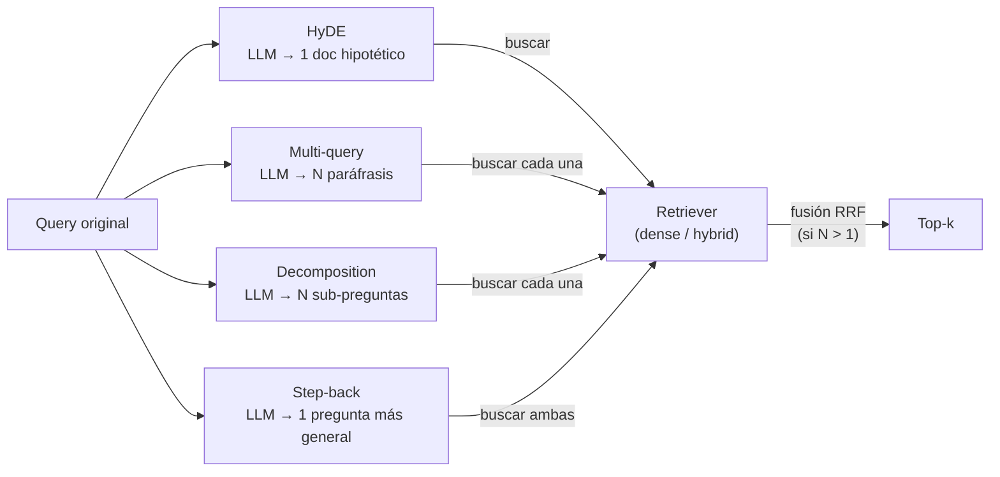
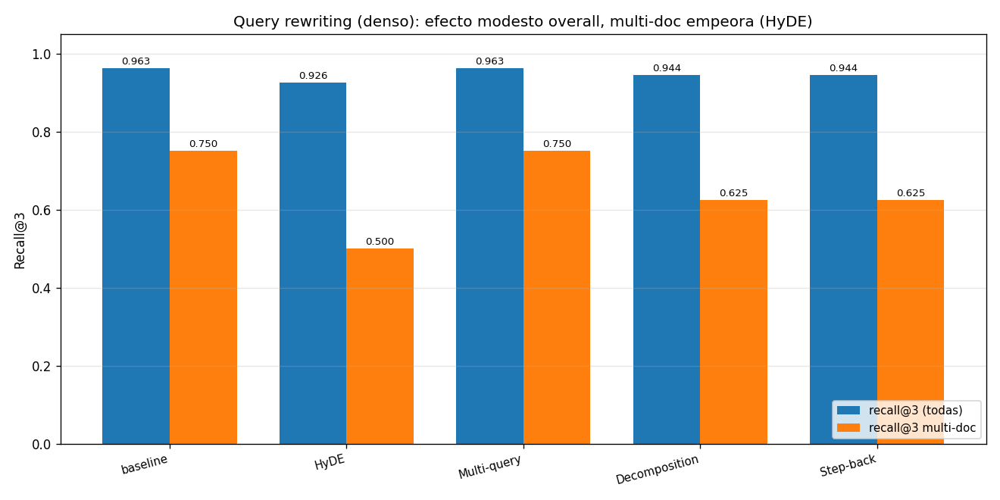

# 05 — Query rewriting: HyDE, multi-query, decomposition, step-back

## Cambiar la query, no el corpus

Las secciones 1-4 atacaron el problema desde el lado del **corpus**: cómo
indexarlo (BM25 vs denso vs híbrido) y cómo cortarlo (chunking). Esta sección
ataca el otro extremo: la **query**. La idea es simple: si la pregunta del
usuario y el texto de la norma viven en vocabularios distintos, en lugar de
intentar que el retriever cierre la brecha solo, reescribimos la query con un
LLM para que se parezca más a lo que hay que recuperar.

Las cuatro técnicas que cubrimos —HyDE, multi-query, decomposition, step-back—
representan estrategias distintas de reescritura:

- **HyDE** (Gao et al., 2022): genera el *documento que respondería* la query.
- **Multi-query**: genera *varias paráfrasis* de la query y fusiona los resultados.
- **Decomposition**: parte una query *compuesta* en sub-preguntas.
- **Step-back** (Zheng et al., 2023): formula una pregunta *más abstracta* para
  anclar contexto.

Todas comparten una promesa y un costo: una llamada extra al LLM por query
antes del retrieval. La pregunta empírica es si esa llamada vale lo que cuesta.
Sobre el corpus chileno, la respuesta corta es: **mucho menos de lo que la
literatura sugiere, y a veces nada**.

## Cómo opera cada estrategia

Implementación en `retrieval_lib.LLMRewriter`: las cuatro estrategias son
prompts distintos al mismo modelo (`gpt-4o-mini` en estos experimentos), con
**caché en disco** de cada respuesta. La primera corrida cuesta 4 llamadas LLM
por query del golden; las siguientes son gratis y reproducibles sin API key.

## Qué genera cada estrategia (texto real, no inventado)

Query: *"¿Qué obligación trimestral comparten los prestadores de servicios
digitales extranjeros y el Ministerio de Salud respecto a inmunizaciones?"*
(es una multi-hop, cruza la circular de IVA digital y la glosa de Salud).

**HyDE** (un párrafo en estilo jurídico):
> "Los prestadores de servicios digitales extranjeros que operen en el
> territorio nacional deberán remitir trimestralmente al Ministerio de Salud
> un informe detallado sobre las transacciones realizadas que involucren la
> prestación de…"

**Decomposition** (4 sub-preguntas):
> - ¿Qué obligación trimestral tienen los prestadores de servicios digitales extranjeros en Chile?
> - ¿Cuál es la normativa que regula las obligaciones de los prestadores de servicios digitales extranjeros en relación a la salud?
> - ¿Qué obligaciones tiene el Ministerio de Salud en relación a las inmunizaciones?
> - ¿Cómo se relacionan las obligaciones de los prestadores de servicios digitales extranjeros con las del Ministerio de Salud respecto a inmunizaciones?

**Step-back** (una pregunta abstracta):
> "¿Cuáles son las responsabilidades y obligaciones de los actores en el ámbito
> de la salud pública en relación con la regulación de servicios digitales?"

**Multi-query** (4 paráfrasis):
> - ¿Cuál es la responsabilidad trimestral que tienen en común los proveedores de servicios digitales foráneos y el Ministerio de Salud en relación a las inmunizaciones?
> - ¿Qué deber trimestral comparten los prestadores de servicios digitales internacionales y el Ministerio de Salud en cuanto a las vacunas?
> - …

## La trampa del HyDE: alucinación normativa

Query: *"valor de la UTM en septiembre de 2024"*. El HyDE generó:

> "El valor de la Unidad Tributaria Mensual (UTM) correspondiente al mes de
> septiembre del año 2024 será determinado por el Servicio de Impuestos
> Internos, conforme a lo establecido en el **artículo 1° de la Ley N° 18.356**…"

La Ley 18.356 no existe en nuestro corpus y la referencia es **fabricada**.
Esto es lo más peligroso de HyDE en dominio jurídico-fiscal: el documento
hipotético puede inventar normas, montos y plazos con apariencia plausible. Si
el sistema luego *cita* ese contexto en la respuesta, tienes una alucinación de
norma. Aquí no nos quema porque el embedding del párrafo aún sirve para
recuperar la tabla correcta, pero **el riesgo de citar la referencia falsa es
real**. Se conecta con §12 de 01-evals (dominios alto-stake).

## Los números, sobre el golden

Recall@k sobre las 25 queries con fuente, dense retriever (mismo de §2):

| Estrategia | @1 | @3 | @5 |
|---|---|---|---|
| baseline (sin rewriting) | 0.796 | **0.963** | 0.963 |
| **HyDE** | **0.907** | 0.926 | **0.981** |
| Multi-query (n=4) | 0.833 | **0.963** | **0.981** |
| Decomposition | 0.833 | 0.944 | 0.963 |
| Step-back | 0.722 | 0.944 | 0.944 |

Y, lo más revelador, recall@3 desagregado por tipo de query:

| Estrategia | factual | numérico | entidad | **multi-doc** |
|---|---|---|---|---|
| baseline | 1.000 | 1.000 | 1.000 | **0.750** |
| HyDE | 1.000 | 1.000 | 1.000 | **0.500** |
| Multi-query | 1.000 | 1.000 | 1.000 | **0.750** |
| Decomposition | 1.000 | 1.000 | 1.000 | **0.625** |
| Step-back | 1.000 | 1.000 | 1.000 | **0.625** |

Tres lecturas honestas, ninguna en línea con el relato típico de "agrega
rewriting y el RAG mejora":

1. **HyDE sube recall@1 de 0.796 a 0.907** — un salto real de 11 puntos. El
   párrafo hipotético cierra la brecha de vocabulario y pone el doc correcto
   en el puesto 1 con más frecuencia. Esa es la promesa cumplida. Sube @5
   también a 0.981 (tope de todo el repo, empatado con RRF de §3).
2. **HyDE BAJA recall@3** (0.963 → 0.926) **y BAJA recall@3 en multi-doc**
   (0.750 → 0.500). El doc hipotético es muy específico; cuando la query
   verdaderamente exige varios docs, HyDE se concentra en uno y descarta los
   otros. Es justo el caso *contrario* al que esperabas que ayudara.
3. **Decomposition no rescata multi-doc** (0.750 → 0.625). En teoría
   debería brillar aquí: las 4 sub-preguntas que generó arriba se ven
   razonables. En la práctica, sus sub-preguntas se concentran en aspectos
   semánticamente cercanos al primer doc relevante y no pescan el segundo. El
   LLM no conoce tu corpus; descompone en ejes plausibles, no necesariamente
   en los ejes correctos.

**Step-back es la única estrategia que empeora todo** (recall@1: 0.796 →
0.722). La pregunta más abstracta atrae docs temáticamente relacionados pero
no relevantes — exactamente el ruido que el retriever original filtraba.

**Multi-query es la más segura**: empata baseline en @3, mejora @5 a 0.981, no
hiere nada. Si vas a hacer rewriting "por si acaso", esta es la opción de menor
riesgo.

## La conclusión, honestamente

Sobre **este** corpus (16 docs, 25 queries), el cuadro completo es:

- Tres tipos de query (factual, numérico, entidad) ya están en **techo 1.000**
  para todas las estrategias. El rewriting no puede mejorar lo que ya está
  perfecto.
- En el único estrato con margen (multi-doc, baseline 0.750), **ninguna técnica
  de rewriting mejora; tres lo empeoran**.
- Donde el rewriting paga es en **recall@1 con HyDE** (0.796 → 0.907) y
  **recall@5 con HyDE o multi-query** (0.963 → 0.981).
- El costo: una llamada LLM por query (más latencia, más dependencia, más
  posibilidad de alucinación). En el dominio regulatorio chileno, el riesgo de
  HyDE inventando una "Ley N° 18.356" es no trivial.

Esto contradice mucha literatura de demos. Por qué pasa aquí:

- **Las queries del golden ya están bien escritas** (yo o tú las redactamos);
  no son las queries "sucias" del usuario final donde rewriting brilla.
- **El corpus es chico** y los retrievers ya están cerca de techo en la mayoría
  de tipos; el margen es pequeño.
- **Multi-doc en español jurídico es difícil porque el LLM no sabe los nombres
  específicos** (numero de partida, glosa, nº de circular) que el retriever
  necesita para fusionar correctamente. El LLM compone semánticamente bien y
  léxicamente mal.

## Cuándo paga query rewriting

| Situación | Recomendación |
|---|---|
| Queries cortas y telegráficas del usuario ("UTM septiembre") | **HyDE o multi-query** — cierran la brecha de vocabulario |
| Queries compuestas claras ("compara A con B") | **Decomposition**, pero verifica que las sub-preguntas matcheen tus docs |
| Queries muy específicas con jerga de dominio | **Multi-query** (paráfrasis) si la jerga del usuario difiere de la del corpus |
| Queries abstractas / conceptuales | **Step-back** (raro útil) |
| Corpus dominado por **referencias exactas** (leyes, montos) | **Nada de HyDE** — inventa referencias |
| Latencia crítica | Ninguna: agregás >1s al pipeline |

## Estado del arte

| Aspecto | Estado | Detalle |
|---|---|---|
| HyDE para zero-shot retrieval | ✅ Probado | Útil cuando no hay datos para fine-tunear embeddings de dominio |
| Multi-query / RAG-fusion | ✅ Patrón estable | Robusto, suele ser un net positive modesto |
| Decomposition para multi-hop | 🟡 Variable | Mejora si el LLM conoce los ejes del corpus; aquí no fue el caso |
| Step-back | 🟡 Nicho | Útil en QA conceptual; daña QA factual |
| Riesgo de alucinación en HyDE | 🔴 Activo | Sin solución estándar para dominios alto-stake; mitigar con verificación posterior |
| Rewriting + cita verificada | 🟡 Práctica emergente | Combinar HyDE con un paso de chequeo de citas (ver §9 y 01-evals §12) |

## Conexiones

- **Sección 2 (denso):** el rewriting actúa sobre el lado de la query lo que
  los embeddings densos hacen sobre el documento — ambos cierran la brecha de
  vocabulario, desde extremos opuestos.
- **Sección 3 (hybrid):** el patrón completo en producción combina las dos:
  reescribir la query (multi-query) Y fusionar BM25 + denso (RRF). No lo
  ejecutamos aquí para no inflar la sección, pero la mecánica es directa.
- **Sección 6 (reranking):** el rewriting amplía el pool de candidatos
  (rescata @5); el reranker arregla su orden. Son complementarios, no
  sustitutos.
- **Sección 9 (casos límite):** la alucinación de HyDE ("Ley N° 18.356") es
  exactamente el tipo de falla normativa que el dominio regulatorio no
  perdona. Conectada con 01-evals §12.
