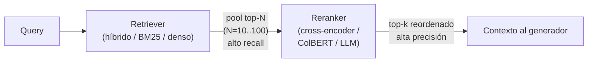
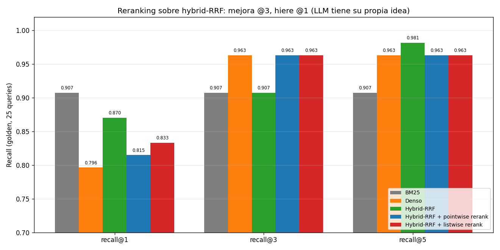

# 06 — Reranking: cross-encoders, ColBERT y LLM-as-reranker

## Por qué un segundo paso

La sección 3 nos dejó con una arquitectura híbrida que **maximizaba recall@k
grande** (RRF @5 = 0.981) pero no ordenaba bien el top: el recall@1 quedaba en
0.870, abajo del 0.907 de BM25 puro. Esa es la división de trabajo clásica en
RAG moderno: el **retriever** asegura cobertura amplia (que lo relevante esté
en algún lugar del pool); el **reranker** asegura precisión en el tope
(reordenar el pool para que lo relevante quede en las primeras posiciones).



El reranker **reordena**, no **busca**: si el doc correcto no entró al pool, ya
no lo recupera. De ahí que en §3 cerráramos el ciclo: maximizar recall@k del
retriever ES alimentar al reranker con el pool más denso posible.

**El techo del reranker, en nuestro corpus**:

| N | recall@N de Hybrid-RRF |
|---|---|
| 5 | 0.981 |
| 10 | 0.981 |
| 20 | **1.000** |

Si rerankeamos los top-20, el doc correcto está SIEMPRE ahí. Un reranker
perfecto entonces conseguiría recall@1 = 1.000. El reto es cuánto de esa brecha
(0.870 → 1.000) puede cubrir un reranker real, y a qué costo.

## Tres arquitecturas con costos muy distintos

| | Bi-encoder (§2) | Cross-encoder | ColBERT / Late interaction | LLM-as-reranker |
|---|---|---|---|---|
| **Codificación** | query y doc por separado | query y doc **juntos** | query y doc por token, juntos al final | query y doc en prompt |
| **Score** | `cos(v_q, v_d)` | `Transformer(q [SEP] d)` | `Σ_i max_j cos(q_i, d_j)` (MaxSim) | LLM lee y opina |
| **Precomputable** | ✅ doc indexable | ❌ requiere par (q, d) | 🟡 doc tokenizable, query al vuelo | ❌ requiere par (q, d) |
| **Costo retrieval** | barato (O(corpus)) | caro (O(pool) por query) | medio (índices PLAID) | medio-caro (1 API call por candidato o por pool) |
| **Precisión típica** | media | alta | alta | alta (variable según modelo) |

El punto clave: el cross-encoder es preciso porque **la query y el documento
nunca se ven hasta que entran juntos al transformer**, así que la atención
cruzada captura señales que un bi-encoder pierde. Pero ese mismo
"juntos" significa que no puedes precomputar nada — un forward pass por par.
Por eso solo se usa para REORDENAR un pool ya filtrado (10-100 docs).

## Cross-encoder, ilustrado con un caso del corpus

No corremos un cross-encoder real (la API de OpenAI no expone uno y no
agregamos `sentence-transformers` con torch al stack). Pero podemos mostrar
**el problema que arregla** con un caso real de §2-3.

Query: *"Ley Nº 21.210"*. Con el bi-encoder denso (text-embedding-3-small),
los cosenos contra los dos pasajes candidatos son:

| Pasaje | Coseno |
|---|---|
| ley-02 *(LEY 21.210 MODERNIZA…)* — **el correcto** | 0.649 |
| ley-01 *(TEXTO PREVIO A LA LEY 21.210)* — distractor | **0.658** |

El distractor gana por 0.009. El bi-encoder no puede distinguir "la ley X" de
"el texto previo a la ley X" porque codifica cada pasaje **sin ver la query**;
ambos son semánticamente "sobre la 21.210". Un cross-encoder leería los dos
pasajes con la query en su mismo paso de atención y notaría la relación
lingüística *"previo a"* vs *"modifica"*. Esa es exactamente la operación que
un bi-encoder no hace y un cross-encoder sí.

## ColBERT / Late interaction, ilustrado

ColBERT (Khattab & Zaharia, 2020) es el punto medio. Como un bi-encoder,
**precomputa**: pero un vector **por token** del documento, no uno por
documento. Como un cross-encoder, la **query también se descompone en
tokens**. El score se calcula con **MaxSim**:

```
MaxSim(q, d) = Σ_i  max_j  cos(q_i, d_j)
```

Cada token de la query "vota" por su mejor match en el doc; los votos se
suman. Es como decir: "para que un doc sea relevante, cada palabra clave de la
query debe encontrar a SU palabra en el doc".

### Ejemplo numérico (toy, no del corpus)

Query con 3 tokens: `q = ["IVA", "servicios", "digital"]`.
Doc1 con 3 tokens: `d1 = ["IVA", "servicios", "digital"]` (matches perfectos).
Doc2 con 3 tokens: `d2 = ["IVA", "renta", "boleta"]` (un solo match).

Si cos(token igual, token igual) = 1.0 y cos(token distinto, token distinto)
= 0.3, entonces:

```
MaxSim(q, d1) = 1.0 + 1.0 + 1.0 = 3.0
MaxSim(q, d2) = 1.0 + 0.3 + 0.3 = 1.6
```

Más interesante: un bi-encoder que **promedia** los tokens vería los dos docs
muy parecidos (ambos contienen "IVA"). MaxSim premia que **cada** token de la
query tenga match, no solo el promedio. Esa es la ganancia conceptual.

### Honestidad sobre la aproximación sentence-level

En el demo intenté ilustrar MaxSim partiendo el documento en *oraciones* (no
tokens, porque no tenemos token embeddings). Para la query "Ley Nº 21.210" sobre
los dos pasajes candidatos:

| Pasaje | bi-encoder cos | MaxSim sentence-level |
|---|---|---|
| ley-02 (correcto) | 0.577 | 0.631 |
| ley-01 (distractor) | **0.618** | **0.651** |

La aproximación a nivel oración **tampoco** separó este caso: el distractor
sigue arriba. Es honesto: ColBERT real (token level) puede ayudar cuando la
query tiene varios tokens distintivos que distribuyen sus "votos" en el doc
correcto; con una query de 3 tokens dominada por la cifra "21.210" que ambos
docs contienen literalmente, la late interaction no separa más que el
bi-encoder. Para este caso, la separación fina solo la trae un modelo que
entienda *relaciones* entre frases — cross-encoder o LLM.

## LLM-as-reranker: la opción de nuestro stack

`LLMReranker` en `retrieval_lib` implementa dos variantes desde cero:

- **Pointwise**: para cada candidato, le pedimos al LLM un score 0-10 de
  relevancia. N llamadas por query; cara y "honesta" (cada par juzgado
  individualmente).
- **Listwise**: enviamos los N candidatos numerados al LLM en un solo prompt y
  le pedimos un orden de relevancia. 1 llamada por query; barata, con la
  ventaja de comparación global y la desventaja de cargar más contexto.

Ambas cachean las respuestas a disco (`cache-rerank.json`), igual que §5.

## Los números: el LLM tiene su propia idea de relevancia

Recall@k sobre el golden, con Hybrid-RRF como base y reranker sobre el top-10:

| Sistema | recall@1 | recall@3 | recall@5 |
|---|---|---|---|
| BM25 | **0.907** | 0.907 | 0.907 |
| Denso | 0.796 | 0.963 | 0.963 |
| Hybrid-RRF (base) | 0.870 | 0.907 | **0.981** |
| Hybrid-RRF + LLM pointwise | 0.815 | **0.963** | 0.963 |
| Hybrid-RRF + LLM listwise | 0.833 | **0.963** | 0.963 |



Lecturas, ninguna trivial:

- **El reranker MEJORA recall@3** (0.907 → 0.963): empareja al denso/dense del
  techo, llevando lo relevante del puesto 4-5 al top-3 con frecuencia.
- **El reranker HIERE recall@1** (0.870 → 0.815/0.833): saca el doc correcto
  del primer puesto en algunas queries.
- **El reranker baja levemente recall@5** (0.981 → 0.963): en algunos casos
  reordena el top-10 demoviendo un relevante de la posición 5 a la 6+.

Esto **contradice** la literatura estándar de "agrega un reranker y todo
mejora". Lo que está pasando se ve nítido en un caso cualitativo.

### El rescate que no fue: gd-005

Query: *"Un proveedor de SaaS con sede en Irlanda vende a empresas chilenas.
¿Debe registrarse ante el SII? ¿Cada cuánto declara?"* (gd-005 del golden).
`expected_docs = [circular-01-sii-iva-digital.txt]`.

**Top-5 de Hybrid-RRF (entrada al reranker):**
1. **circular-01** "a) Registrarse ante el SII a través del portal..."
2. ley-02 "2. Establécese que dichos prestadores extranjeros..."
3. norma-01 lobby (distractor)
4. norma-02 probidad (distractor)
5. **circular-01** "MATERIA: Instruye sobre la aplicación del IVA..."

**Top-5 tras LLM-reranker listwise:**
1. **ley-02** ← el LLM la sube al #1
2. **circular-01** ← demovida al #2
3. **circular-01** (otro chunk)
4. ley-02 (otro chunk)
5. circular-02-renta-propyme

¿El reranker se equivocó? No exactamente. La Ley 21.210 es **la fuente
normativa primaria** del régimen de IVA digital; la circular del SII solo lo
*instruye*. Un abogado tributario probablemente diría que ley-02 es **más**
relevante que circular-01 para "¿debe registrarse?". El LLM eligió bien por
criterio jurídico — pero el golden lista solo circular-01 como expected, así
que la métrica lo marca como falla en @1.

Lo que esto revela:

1. **El golden está incompleto**. Cuando varios docs son legítimamente
   relevantes, listar solo uno hace que cualquier reranker razonable parezca
   peor de lo que es. Es el problema que motivamos en §3 al hablar del techo
   y que atacaremos en §8 con ground truth a nivel chunk.
2. **El LLM-reranker tiene su propia teoría de relevancia**, y no
   necesariamente coincide con la del golden. Eso no es un bug — es la
   naturaleza del juicio LLM.
3. **Si tu golden es escaso, el reranker puede empeorar tus métricas mientras
   mejora la experiencia real del usuario**. Honestidad incómoda pero real.

## Costo y latencia

Para nuestro experimento (25 queries × 10 candidatos × pointwise + 25 listwise):

| | Calls LLM | Tokens aprox. | Latencia añadida |
|---|---|---|---|
| Pointwise | 250 | ~25K in + ~250 out | ~250 × 0.5s ≈ 2 min total |
| Listwise | 25 | ~50K in + ~500 out | ~25 × 1s ≈ 25 s total |

Cuando hay que elegir entre los dos: **listwise gana en costo** (10× menos
calls) y, en nuestros datos, **empata o supera al pointwise en recall**
(0.833 vs 0.815 en @1). El sesgo posicional del LLM (puede preferir los
primeros candidatos del listado) es un riesgo real pero corregible (shuffle
del input).

## Cuándo cada arquitectura

| Situación | Arquitectura recomendada |
|---|---|
| RAG en producción con latencia ajustada y stack LLM ya existente | **LLM-as-reranker listwise** sobre top-10 del híbrido |
| Pipeline crítico que requiere precisión maximal, GPU disponible | **Cross-encoder** (ms-marco MiniLM, BGE reranker) sobre top-50-100 |
| Volumen alto, queries diversas, infra ML madura | **ColBERT / PLAID** integrado a nivel retrieval (no solo rerank) |
| Solo necesitas filtrar los obvio-irrelevantes | Pointwise simple con umbral, no listwise |
| Tu golden es escaso | **No optimices reranker contra esa métrica** — confunde mejora de UX con mejora medible |

## Estado del arte

| Aspecto | Estado | Detalle |
|---|---|---|
| Cross-encoder reranking | ✅ Estándar | ms-marco MiniLM, BGE reranker; bien soportados, baratos en GPU |
| ColBERT v2 / PLAID | ✅ Maduro | Especialmente competitivo en multilingual y dominio largo |
| LLM-as-reranker | ✅ En adopción | Variante listwise gana por costo; mantente atento al sesgo posicional |
| Métricas con golden incompleto | 🔴 Problema abierto | Cualquier reranker que mejore el sistema puede degradar las métricas |
| Reranker fine-tuneado para dominio legal/fiscal en español | 🔴 Sin solución de estante | Brecha de modelos de dominio (igual que §2) |

## Conexiones

- **Sección 2 (bi-encoder):** el ejemplo de "Ley 21.210" donde el denso fallaba
  es el caso de manual de "necesita cross-encoder" — la red debe leer query y
  doc juntos para entender la diferencia.
- **Sección 3 (hybrid):** el reranker es el complemento natural. RRF maximiza
  recall@k; el reranker enfoca el top. Pero el resultado empírico aquí muestra
  que la sinergia no es automática.
- **Sección 5 (query rewriting):** rewriting amplía el pool desde el lado de la
  query; reranking lo enfoca desde el lado del scoring. Componibles.
- **Sección 8 (evaluación):** el episodio gd-005 (golden incompleto que hace
  parecer mal al reranker) motiva la construcción de ground truth a nivel
  chunk allí. Sin eso, no podemos diferenciar "el reranker empeoró" de "el
  golden está mal".
- **01-evals §7 (LLM-as-judge):** los sesgos documentados del LLM-as-judge
  (position, verbosity, anchoring) aplican también al LLM-as-reranker: el
  listwise sufre position bias. Las mismas mitigaciones (shuffle, multi-pass)
  sirven.
