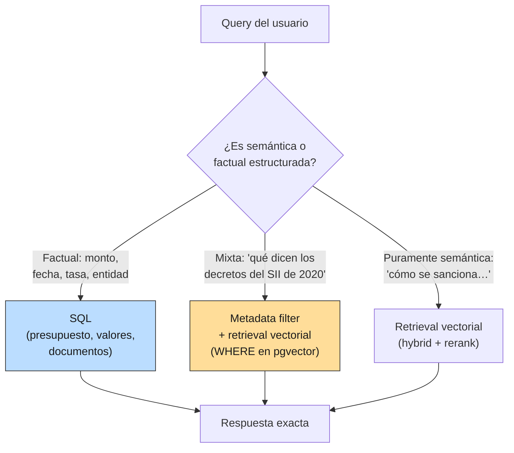
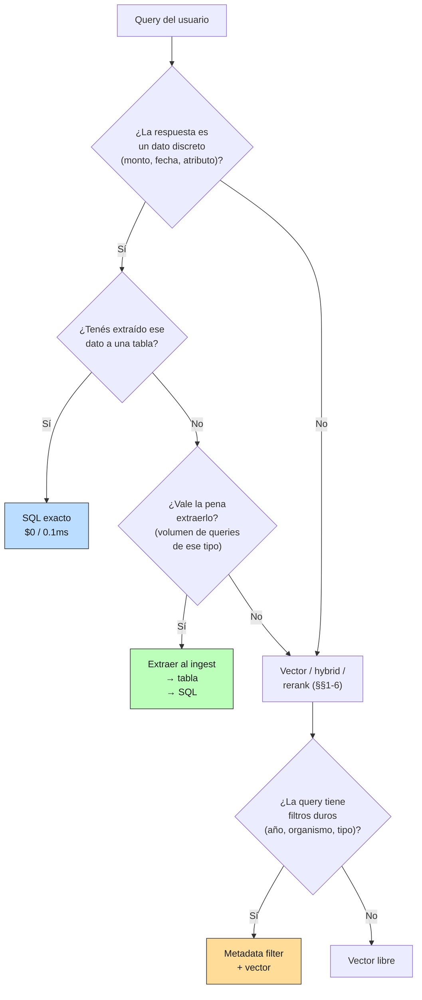

# 07 — Metadata filtering y retrieval estructurado: cuándo SQL gana

## La tesis incómoda

Vamos seis secciones ajustando retrievers semánticos. Pero hay una clase
gigantesca de queries para las que toda esa maquinaria es **el diseño
equivocado**. Si la respuesta a la pregunta del usuario es un **monto**, una
**fecha**, una **tasa**, un **organismo**, un **número de glosa** — algo
discreto y citable — entonces la pregunta es una *consulta SQL disfrazada*.

> "¿Cuánto se asigna al Programa Nacional de Inmunizaciones en 2024?"
>
> Esto no es una pregunta semántica. Es:
>
> ```sql
> SELECT monto_miles FROM presupuesto_2024
> WHERE descripcion LIKE '%Inmunizaciones%' AND ministerio = 'Salud'
> ```

La industria de vector stores se ganó la última vuelta de hype, pero el RAG
maduro en 2026 reserva el vector para lo que es *intrínsecamente semántico* y
manda al SQL las queries factuales. La elección no es "moderno vs viejo" —
es elegir la herramienta correcta para cada tipo de query.

**Analogía económica.** Cuando consultas una serie de IPC mensual no abres un
LLM: vas a la tabla. Hay un tipo de pregunta para la cual **la respuesta está
literalmente almacenada en una celda**. Pedirle a un retriever vectorial que
"deduzca" esa celda es como pedirle a un macroeconomista que reestime el IPC
de cabeza en vez de mirarlo. Caro, ruidoso, innecesario.

## Dos patrones complementarios

Lo que esta sección agrega al pipeline no reemplaza al retrieval semántico de
las secciones 1-6, lo **redirecciona**:



Los dos patrones nuevos:

1. **Retrieval estructurado**: para cada doc del corpus identificás los hechos
   discretos (montos, plazos, organismos) y los pasás a una tabla. La query
   factual se responde con un `SELECT` exacto, sin pasar por el LLM.
2. **Metadata filtering**: cada chunk lleva atributos discretos
   (`doc_type`, `organismo`, `año`, `tema`). El retrieval semántico se
   restringe (`WHERE`) antes del kNN. El cálculo del coseno solo recorre la
   parte del corpus que pasa el filtro.

## Implementación, sin agregar nada al stack

Todo lo que sigue se hace con la stdlib + el embedder de §2:

**Metadata** (`retrieval_lib.DOC_METADATA`): un diccionario por doc con
`doc_type`, `organismo`, `tema`, `anio`, `partida`, `leyes_citadas`.
Anotación manual: 16 docs × 5-6 campos. Inversión inicial baja, vida útil
larga.

**`FilteredDenseRetriever`** (`retrieval_lib`): envuelve un `DenseRetriever` y
pre-filtra los chunks. La implementación es una máscara con `-inf` sobre los
índices excluidos antes del `argsort` — el coseno se calcula igual, pero los
descalificados nunca compiten. Es exactamente el patrón de **pgvector**:

```sql
SELECT chunk_id, 1 - (embedding <=> :q) AS score
FROM chunks
WHERE doc_type = 'circular' AND organismo = 'SII' AND tema = 'IVA'
ORDER BY score DESC LIMIT 5;
```

**SQL estructurado**: `sqlite3` de la stdlib. Tres tablas creadas en memoria a
partir de los datos extraídos manualmente de las glosas y la tabla de UTM:

| Tabla | Filas | Origen |
|---|---|---|
| `presupuesto_2024` | 13 | glosa-01 (Salud), glosa-02 (Educación), glosa-03 (Trabajo) |
| `valores_tributarios` | 12 | tabla-01-valores-tributarios-2024 (UTM mensual) |
| `documentos` | 16 | `DOC_METADATA` |

En producción esta extracción la hace un pipeline al ingesta (a mano,
con regex, o con un LLM extractor estructurado). Se hace **una vez** por doc y
sirve para siempre las queries factuales sobre ese doc.

## Los cuatro casos, con números

### Caso A — SQL gana limpio

Query: *"¿Cuánto se asigna al Programa Nacional de Inmunizaciones en 2024?"*

```sql
SELECT ministerio, descripcion, monto_miles
FROM presupuesto_2024
WHERE descripcion LIKE '%Inmunizaciones%' AND ministerio = 'Salud';
```

| | Resultado | Tiempo | Tokens LLM | $ |
|---|---|---|---|---|
| **SQL** | Salud · Programa Nacional de Inmunizaciones · **$198.547.320 miles** | 0.02 ms | 0 | $0 |
| Vector denso | top-1 chunk con el dato adentro | ~ms + embed API | ~50 in | ~$10⁻⁶ |
| Vector + extractor LLM | el número, después de leer el chunk | + 0.5-2 s | ~500 in + ~50 out | ~$10⁻³ |

El SQL entrega **el número**. El vector entrega **el chunk con el número
adentro** — y necesita un paso adicional (regex frágil o llamada LLM extractora)
para devolver la cifra. Para una query de este tipo, el vector hace el doble
de trabajo, paga el costo del LLM, y arriesga errores de extracción.

### Caso B — SQL gana en filas exactas

Query: *"valor de la UTM en septiembre de 2024"*

```sql
SELECT mes_nombre, anio, utm
FROM valores_tributarios
WHERE mes = 9 AND anio = 2024;
```

→ **$66.362** en 0.06 ms.

El retriever denso devuelve el doc correcto (tabla-01) en top-1 pero el chunk
top-1 contiene la **UTA anual**, no la fila de septiembre. Sin el SQL hay que
leer toda la tabla del chunk, encontrar la fila, parsear el número. Cada uno
de esos pasos puede fallar. El SQL no.

Este es exactamente el caso que motivamos en §2 ("dense pierde en
números") y §4 (chunking de tablas las rompe). El arreglo *correcto* no era
mejor chunking ni mejor reranker: **era una tabla**.

### Caso C — Metadata filter + vector: efecto al subir la escala

Query: *"obligaciones del prestador en circulares del SII sobre IVA"*

Pre-filtro: `doc_type='circular' AND organismo='SII' AND tema='IVA'` →
**2 docs / 31 chunks** (de los 16 docs / 234 chunks totales).

Honestidad: en NUESTRO corpus, el top-3 **no cambia** con o sin filtro. El
vector ya pone circular-01 y circular-04 (las dos relevantes) arriba por
similitud, así que el filtro no rescata nada que la búsqueda libre no haya
encontrado. Esto es importante decirlo: **a pequeña escala, el filtro suele
ser invisible en métricas de recall.**

¿Dónde sí paga el filtro?

| Ventaja del filtro | Cuándo aparece |
|---|---|
| **Eliminar distractores con vocabulario compartido** | Cuando hay 50+ "circulares SII de cualquier tema" mezcladas con leyes que también dicen "obligaciones", "prestador", "IVA". El filtro saca el ruido. |
| **Reducir el costo del kNN** | A 100K+ chunks, calcular coseno sobre el 5% que pasa el filtro es 20× más rápido. Esto importa en latencia y $$ con índices a escala. |
| **Garantizar atributos duros** | Si la query dice "presupuesto 2024", el filtro `año=2024` *garantiza* que ningún doc de 2023 entre. El vector solo, no lo garantiza. |
| **Explicabilidad** | "Te muestro estos resultados porque pasan WHERE x AND y" es más auditable que "te los muestro porque su coseno fue 0.638". Crítico en dominios regulados. |

Con 16 docs el efecto es invisible. Con 16.000 docs es la diferencia entre un
RAG usable y uno inviable.

### Caso D — SQL no puede; el vector gana

Query: *"cómo se sanciona a un funcionario que esconde sus bienes"*

No hay tabla de sanciones (no la extrajimos; en serio se podría extraer los
artículos 18-19 de la Ley 20.880 a una tabla `sanciones_probidad`, y sería el
diseño correcto, pero aquí no lo hicimos). El SQL **literalmente no tiene de
dónde sacar la respuesta**.

El vector denso clava la Ley de Probidad con sus artículos 18 y 19 en el
top-3. Esta es la clase de queries para las que se diseñaron los embeddings:
la pregunta y el texto usan **vocabularios distintos** que comparten
significado ("esconde bienes" ↔ "omisión inexcusable de información").
Aquí no hay tabla que sirva.

## Costo y latencia: el escalado decide

Órdenes de magnitud honestos, por query:

| Estrategia | Tiempo | Tokens | $ por query |
|---|---|---|---|
| SQL puro | ~0.1 ms | 0 | $0 |
| Vector denso (con caché de query) | ~10 ms | 0 | $0 |
| Vector denso (query nueva) | ~100-500 ms | ~50 in (embed) | ~$10⁻⁶ |
| Vector + extractor LLM | +0.5-2 s | ~500 in + ~50 out | ~$10⁻³ |

Y en **1 millón de queries**, donde estas diferencias se vuelven decisión
de arquitectura:

| Estrategia | Tiempo acumulado | $ acumulado |
|---|---|---|
| SQL puro | ~100 segundos | $0 |
| Vector denso | ~horas + indexing inicial | ~$1-10 |
| Vector + extractor | ~días | **~$1.000** |

Mil dólares por millón de queries no es teórico: es lo que un RAG factual mal
diseñado le cobra mensualmente a tu cuenta de OpenAI cuando debió haber sido
un `SELECT`.

## Cómo decidir, por adelantado



Regla práctica para corpus regulatorio chileno (mismo de éste):

- **Siempre extraé a SQL**: montos presupuestarios, valores UTM/UF/IPC, tasas
  vigentes por año, plazos legales con fechas, identificación de organismo
  competente.
- **Siempre anotá metadata** (mínimo `doc_type`, `organismo`, `año`, `tema`):
  permite filtrar barato a escala y explicar resultados.
- **Reservá vector para queries semánticas**: "qué dice", "cómo se interpreta",
  "qué obligación implica" — donde la respuesta es prosa y no celdas.

## Tu stack: Supabase / pgvector

Esto encaja directamente con tu setup. `chunks` queda como tabla con columnas
de metadata + `embedding vector(1536)`. El filtro se vuelve `WHERE` antes del
operador `<=>`:

```sql
SELECT chunk_id, text, 1 - (embedding <=> :query_embedding) AS score
FROM chunks
WHERE doc_type = 'circular' AND organismo = 'SII' AND tema = 'IVA'
ORDER BY score DESC LIMIT 5;
```

Y los hechos discretos viven en sus tablas relacionales normales
(`presupuesto`, `valores_tributarios`, `documentos`). El router al frente
decide si pegarle al SQL, al vector filtrado, o a ambos.

## Estado del arte

| Aspecto | Estado | Detalle |
|---|---|---|
| pgvector con WHERE pre-filtro | ✅ Producción | Patrón estándar 2024-2026 en Supabase, Postgres extensions |
| Hybrid SQL + vector ("routing") | 🟡 En adopción | Aún se cocina a mano; LangGraph y agentes lo automatizan parcialmente |
| Text-to-SQL para queries factuales | 🟡 Maduro pero frágil | Funciona con esquemas chicos y bien documentados; degrada con DBs reales |
| Extracción estructurada al ingest | ✅ Práctica estándar | LLM con JSON schema o función-calling; razonablemente fiable |
| Auditoría de filtros para dominios regulados | 🟢 Punto fuerte | Filtros SQL son trivialmente auditables; embeddings, no |

## Conexiones

- **Sección 2 (denso):** las fallas del denso en *números* y *referencias
  exactas* son la motivación natural para esta sección. Lo que el embedding no
  puede, una tabla bien diseñada sí.
- **Sección 4 (chunking):** las tablas en PDFs que destrozaba el chunking se
  resuelven extrayendo a SQL al ingest. Es el otro lado del problema de §4.
- **Sección 6 (reranker):** un reranker LLM sobre un pool ya filtrado es la
  mejor combinación de los dos mundos cuando la query mezcla filtros duros
  con matiz semántico.
- **Sección 8 (evaluación):** el golden de §8 debe diferenciar queries
  "SQL-respondibles" de "vector-respondibles" para no premiar al vector en
  queries donde gana por descalificación del SQL no implementado.
- **Sección 9 (casos límite):** las tablas en PDFs y los versionados temporales
  son dos casos donde esta sección y §9 se cruzan: la solución es extracción
  estructurada con metadata de versión.
