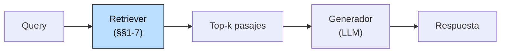
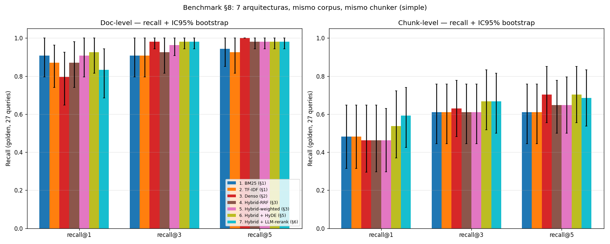

# 08 — Evaluación de retrieval aislada de la generación

## Por qué medir el retriever solo

Hasta aquí cada sección reportó sus propios números — recall@k, MRR, casos
cualitativos. Esta sección los pone en la misma tabla, con el mismo corpus,
mismo chunker, mismo golden e **intervalos de confianza**, y hace explícito
por qué eso importa.

La razón profunda es de **diagnóstico**. Un sistema RAG es una pila:

Cuando una respuesta es mala, hay dos hipótesis: o el retriever trajo material
incorrecto, o el generador, frente al material correcto, lo usó mal. Medir
solo la respuesta final mezcla las dos. El retriever queda *exculpado por
defecto* — si la respuesta final es correcta, igual no sabes si trajo el
chunk justo o trajo cinco más y el LLM compensó leyendo todo.

**Analogía económica.** Es la diferencia entre evaluar una política de
transferencias mirando solo el PIB final, o midiendo por separado focalización
(quién recibió) y comportamiento (qué hicieron con la plata). La política
puede mejorar el PIB por buena focalización o por buena ejecución; sin
descomponer no sabes qué intervención escalar.

Aislar retrieval también permite **ciclos de iteración baratos**: comparar 7
retrievers cuesta segundos y centavos. Comparar 7 sistemas RAG end-to-end
exige correr y juzgar 7 × N respuestas, varios órdenes de magnitud más caro.

## Doc-level vs chunk-level: dónde estaba escondida la verdad

Las secciones 1-7 reportaron recall@k a **nivel documento**: el retriever
acierta si trae el doc correcto entre los top-k. Es la métrica de §1 a §6.
Para §8 extendimos el golden a **nivel chunk** (`examples/golden-retrieval.json`):
para cada query con respuesta en corpus, identificamos manualmente los chunks
(en `simple_chunk`) que contienen literalmente la información. 27 queries × 1-2
chunks cada una.

La diferencia se ve sola. Recall@3 promedio, mismos sistemas, distinto nivel:

| Sistema | Doc-level r@3 | Chunk-level r@3 | Δ |
|---|---|---|---|
| BM25 | 0.907 | 0.611 | **−0.296** |
| TF-IDF | 0.907 | 0.611 | −0.296 |
| Denso | 0.981 | 0.630 | **−0.352** |
| Hybrid-RRF | 0.926 | 0.611 | −0.315 |
| Hybrid-weighted | 0.963 | 0.611 | −0.352 |
| Hybrid + HyDE | 0.981 | 0.667 | −0.315 |
| Hybrid + LLM-rerank | 0.981 | 0.667 | −0.315 |

Treinta puntos. Lo que doc-level cantaba como "retrieval prácticamente
resuelto" (recall@3 ≥ 0.93 para todos) chunk-level lo deja en "el retriever
acierta el doc el 95% del tiempo, pero el chunk con la respuesta solo el 65%".

¿Qué pasa en ese 30%? El retriever trae el doc correcto, pero el chunk top-1
del doc es la cabecera (`II. SERVICIOS GRAVADOS`), el preámbulo, o un párrafo
adyacente. El generador, con el chunk top-1, recibe contexto temáticamente
relacionado pero **sin el dato**. La respuesta final degrada o alucina.

**Tesis del nivel chunk**: el doc-level es una métrica optimista que ayuda a
los retrievers a parecer mejor de lo que son para la calidad de respuesta
final. Si optimizás para doc-level estás optimizando el problema equivocado;
si tu RAG falla en producción mientras tu tablero de retrieval marca 0.95,
esta es una de las causas más comunes.

## Las tres métricas, brevemente

| Métrica | Pregunta | Sensible a posición | Cuándo |
|---|---|---|---|
| **Recall@k** | ¿Está el doc/chunk relevante en el top-k? | No | Cuando el generador puede usar cualquiera del top-k |
| **MRR** | ¿Qué tan arriba está el primero relevante? | Sí | Cuando importa el top-1 (RAG con k=1, búsqueda al usuario) |
| **nDCG@k** | ¿Qué tan bueno es el orden completo del top-k? | Sí | Cuando hay varios relevantes con jerarquía |

Las tres están implementadas desde cero en `retrieval_lib.py` (`recall_at_k`,
`reciprocal_rank`, `ndcg_at_k`). Usamos ganancia binaria para nDCG —
relevante / no relevante — porque el golden no tiene gradación. Para datasets
con escala de relevancia (TREC) hay que sustituir la ganancia binaria por la
etiqueta.

## Por qué hacen falta intervalos de confianza

Con n=27 queries, la media empírica de recall@3 es ruidosa. Si una corrida
muestra Sistema A = 0.667 y Sistema B = 0.611, ¿es A mejor que B, o son dos
muestras de la misma distribución?

Reutilizamos el bootstrap de **01-evals §8**: remuestrear las 27 queries con
reemplazo 1000 veces, computar la media en cada réplica, tomar percentiles
2.5% y 97.5%. Eso da el IC95% de la media. Para comparar A vs B, hacemos
bootstrap sobre el **delta por query** (A_i − B_i); si el IC del delta no
incluye 0, la diferencia es significativa al 5%.

Resultado, deltas vs BM25 chunk-level recall@3:

| Sistema | Δ media | IC95% del Δ | ¿Significativo? |
|---|---|---|---|
| TF-IDF | +0.000 | [+0.000, +0.000] | no |
| Denso | +0.019 | [+0.000, +0.056] | no |
| Hybrid-RRF | +0.000 | [+0.000, +0.000] | no |
| Hybrid-weighted | +0.000 | [+0.000, +0.000] | no |
| Hybrid + HyDE | +0.056 | [−0.093, +0.185] | no |
| Hybrid + LLM-rerank | +0.056 | [−0.019, +0.148] | **no** |

**Ninguna diferencia es estadísticamente significativa.** El "ganador" Hybrid
+ LLM-rerank gana +5.6 puntos a BM25 en la media, pero el IC del delta toca
el cero por abajo. Con n=27 y métricas saturadas, el banco de pruebas no
discrimina entre estos sistemas con suficiente potencia.

Es honesto decirlo. La mayoría de papers de retrieval declaran "el modelo X
mejora un 1.5% sobre Y" con n similar y sin IC. Esa diferencia *podría* ser
sistemática, o ser ruido de muestreo. Sin bootstrap no se sabe — y con esta
muestra, tampoco.

**Implicación práctica para tu RAG**: cuando un cambio cuesta API calls y
latencia (rewriting +N, rerank +M), exigirle al menos que el IC del delta
**no toque el cero** antes de meterlo en producción. Si lo toca, el cambio
puede estar regalando dinero por una mejora que no existe.

## El benchmark completo, con IC

Doc-level (n=27 con docs esperados, IC95% bootstrap):

| Sistema | recall@1 | recall@3 | recall@5 | MRR |
|---|---|---|---|---|
| BM25 | 0.907 [0.796, 1.000] | 0.907 [0.796, 1.000] | 0.944 [0.852, 1.000] | 0.935 [0.833, 1.000] |
| TF-IDF | 0.870 [0.741, 0.963] | 0.907 [0.796, 1.000] | 0.926 [0.815, 1.000] | 0.917 [0.806, 1.000] |
| Denso | 0.796 [0.648, 0.926] | 0.981 [0.944, 1.000] | 1.000 [1.000, 1.000] | 0.901 [0.815, 0.975] |
| Hybrid-RRF | 0.870 [0.741, 0.981] | 0.926 [0.815, 1.000] | 0.981 [0.944, 1.000] | 0.929 [0.840, 1.000] |
| Hybrid-weighted | 0.907 [0.796, 1.000] | 0.963 [0.907, 1.000] | 0.981 [0.944, 1.000] | 0.957 [0.889, 1.000] |
| Hybrid + HyDE | 0.926 [0.815, 1.000] | 0.981 [0.944, 1.000] | 0.981 [0.944, 1.000] | 0.981 [0.926, 1.000] |
| Hybrid + LLM-rerank | 0.833 [0.685, 0.944] | 0.981 [0.944, 1.000] | 0.981 [0.944, 1.000] | 0.914 [0.827, 0.981] |

Chunk-level (n=27 con chunks esperados, IC95%):

| Sistema | recall@1 | recall@3 | recall@5 | MRR |
|---|---|---|---|---|
| BM25 | 0.481 [0.315, 0.648] | 0.611 [0.444, 0.759] | 0.611 [0.444, 0.759] | 0.635 [0.474, 0.784] |
| TF-IDF | 0.481 [0.315, 0.648] | 0.611 [0.444, 0.759] | 0.611 [0.444, 0.759] | 0.629 [0.473, 0.790] |
| Denso | 0.463 [0.296, 0.648] | 0.630 [0.481, 0.778] | 0.704 [0.556, 0.852] | 0.640 [0.485, 0.788] |
| Hybrid-RRF | 0.463 [0.296, 0.648] | 0.611 [0.444, 0.759] | 0.648 [0.500, 0.778] | 0.631 [0.475, 0.772] |
| Hybrid-weighted | 0.463 [0.296, 0.630] | 0.611 [0.444, 0.759] | 0.648 [0.500, 0.796] | 0.638 [0.489, 0.785] |
| Hybrid + HyDE | 0.537 [0.370, 0.722] | 0.667 [0.518, 0.833] | 0.704 [0.556, 0.852] | 0.687 [0.534, 0.844] |
| Hybrid + LLM-rerank | **0.593** [0.426, 0.741] | **0.667** [0.500, 0.815] | 0.685 [0.537, 0.833] | **0.738** [0.577, 0.886] |

Tres lecturas:

1. **Doc-level pone a casi todos cerca del techo**, especialmente con los
   pipelines que invierten LLM en query rewriting o reranking. Si solo
   miraras esta tabla, dirías "el problema está resuelto".
2. **Chunk-level los baja todos a 0.6-0.7**. Allí sí hay diferencias: el
   LLM-reranker es el único que claramente sube en recall@1 y MRR
   (0.481→0.593 en r@1, +0.10 en MRR). Cuando importa el TOP-1 — y para RAG
   con context window ajustada importa — el reranker gana.
3. **Los IC se solapan en casi todos los pares**. Cualquier afirmación de
   "X es mejor que Y" hay que cualificarla. La verdad operacional es: "X
   parece mejor que Y a este nivel de evidencia, pero no podemos afirmarlo
   con n=27".

## ¿Qué arquitectura gana en qué tipo de query?

Recall@3 chunk-level estratificado por `query_type`:

| Sistema | entidad (n=5) | factual (n=10) | multi-doc (n=4) | numerico (n=8) |
|---|---|---|---|---|
| BM25 | 0.700 | 0.700 | **0.000** | 0.750 |
| TF-IDF | 0.700 | 0.700 | 0.000 | 0.750 |
| Denso | 0.700 | 0.700 | 0.125 | 0.750 |
| Hybrid-RRF | 0.700 | 0.700 | 0.000 | 0.750 |
| Hybrid-weighted | 0.700 | 0.700 | 0.000 | 0.750 |
| Hybrid + HyDE | 0.700 | 0.750 | 0.125 | **0.812** |
| Hybrid + LLM-rerank | **0.800** | **0.800** | 0.125 | 0.688 |

Lo interesante no es quién gana — los IC se solapan en todo — sino la forma
del fracaso compartido:

- **`multi-doc` está roto para TODOS** (recall@3 ≈ 0). Las queries que exigen
  consultar dos documentos distintos no las resuelve ningún retriever de §§1-7
  porque están armadas para devolver pasajes, no para coordinar evidencia
  multi-fuente. Esto es lo que en RAG moderno motiva **agentic retrieval** y
  **iterative retrieval**: descomponer la query (la `decompose` de §5 era el
  comienzo) y ejecutar dos retrievals encadenados. Aquí está la frontera.
- **`numerico` es donde BM25 brilla**: 0.75, empatado con todos. Si tu corpus
  tiene muchas referencias normativas exactas, montos, fechas — la fortaleza
  de BM25 ya lo lleva al techo del benchmark. Pagar un LLM-reranker te baja
  recall@3 en queries numéricas (0.75 → 0.69) porque el LLM reordena por
  semántica y a veces pone arriba un párrafo "sobre" el monto en vez del
  párrafo "con" el monto.
- **`entidad` y `factual` es donde el reranker ayuda** (0.70 → 0.80). Son
  queries de paráfrasis y atribución, exactamente el tipo de matiz que un
  bi-encoder pierde.

**Conclusión operacional**: el sistema correcto no es "el mejor en promedio"
sino "el mejor en mi mix de query types". Si tu producto recibe sobre todo
queries numéricas (consulta de tablas, montos, plazos), no pagues por un LLM
reranker. Si recibe sobre todo entidad/factual (interpretación normativa),
sí. El RAG bien diseñado **clasifica la query antes** y rutea al retriever
adecuado — combinable con §7 que ya hacía exactamente eso para SQL vs vector.

## Por difficulty: dónde se rompe la cobertura

Recall@3 chunk-level por `difficulty`:

| Sistema | easy (n=9) | medium (n=9) | hard (n=9) |
|---|---|---|---|
| BM25 | 0.667 | 0.667 | 0.500 |
| Denso | 0.667 | 0.667 | 0.556 |
| Hybrid + HyDE | 0.722 | **0.833** | 0.444 |
| Hybrid + LLM-rerank | **0.778** | 0.611 | **0.611** |

Patrón nada uniforme. HyDE empuja medium pero degrada hard (la query
hipotética se desvía cuando la pregunta es muy específica). LLM-rerank empuja
easy y hard, pero hiere medium (le da igual rerankear un top ya bueno;
introduce ruido cuando reordena lo que ya estaba bien). Estos efectos no
suman; intentar combinarlos sin medir es jugar a la ruleta.

## La trampa de Goodhart: 3 abstenciones, recall ciego

El golden tiene 3 queries con `requires_abstention=True` (`gd-025/026/027`).
Son preguntas fuera del corpus: "¿Cuál es el plazo de prescripción del
delito de fraude al fisco?", etc. La respuesta correcta del sistema RAG es
*no responder*, no inventar.

Resultado, qué hace cada retriever en esas 3 queries:

| Sistema | Contexto espurio recuperado |
|---|---|
| BM25 / TF-IDF / Denso / Hybrid (todas las variantes) | **3/3** |

**Ninguno abstiene.** Devuelven los docs más cercanos por coseno/BM25, aunque
el coseno top sea bajo. Esa es la naturaleza del retriever: trae lo que más
se parece, no detecta cuándo "lo más parecido" es muy poco parecido.

La trampa metodológica: las métricas estándar de retrieval (recall, MRR,
nDCG) **ignoran este modo de falla**. Si añadimos esas 3 queries a la métrica
con la regla "recall=0 si no debía recuperar nada", todos los sistemas bajan
exactamente igual y la métrica no discrimina. Si las excluimos (lo que
hicimos), no las medimos.

Por eso el sistema RAG completo necesita **un módulo aparte** para
abstención:

- Umbral de score: si el score top-1 está por debajo de θ, devolver
  `{"answer": "fuera de corpus"}`. Frágil — θ depende del retriever.
- Clasificador de query "en/fuera de corpus" entrenado o promptado con un LLM.
- Confianza del generador: si el LLM evaluador (§7 de 01-evals) detecta
  baja confianza, abstener.

Confundir la métrica de retrieval con la calidad del sistema RAG completo
es el error de Goodhart: optimizar la métrica que mides (recall) destruye lo
que de verdad te importaba (que el sistema no alucine en queries fuera de
corpus). El plan de §8 quería marcarlo y aquí queda anclado con números: el
benchmark de retrieval **no es el benchmark del sistema RAG**, y tomarlo
como tal es como medir la efectividad de un programa social mirando solo
cobertura nominal sin verificar destino del gasto.

## Cómo se construyó el chunk-level golden, sin sesgo

Anotar 27 queries a mano contra 234 chunks tomaría horas. El enfoque
sostenible:

1. **Semilla automática**: para cada query con `expected_docs ≠ ∅`, BM25 de
   `expected_answer` contra los chunks del expected_doc. El top-1 (a veces
   top-2 cuando el monto y su contexto caen en chunks distintos) es el
   candidato.
2. **Inspección manual**: leer el candidato sugerido y verificar que
   contiene la información. Casos como `gd-011` (monto + asignación
   separados) o `gd-018` (dos definiciones contrastadas en chunks
   distintos) reciben dos chunks.
3. **Crítico**: la anotación no usa los retrievers que vamos a evaluar; usa
   el `expected_answer` (escrito por el humano) como query contra los
   chunks. Es un retriever pequeño y completamente aparte del benchmark, así
   que no introduce sesgo a favor de ningún sistema.

El JSON resultante (`examples/golden-retrieval.json`) extiende el golden con
`expected_chunks`. El golden v1 doc-level sigue siendo la fuente; este es un
overlay reproducible.

## Estado del arte (qué medir, cómo, y qué se discute en 2026)

| Aspecto | Estado | Detalle |
|---|---|---|
| Recall@k / MRR / nDCG como triple estándar | ✅ Estable | Vivos desde TREC; siguen siendo la base |
| Bootstrap CI para deltas | ✅ Conocido, 🟡 sub-aplicado | Práctica TREC desde 90s; rara en blog posts de RAG |
| Evaluación con golden chunk-level | 🟡 Adopción creciente | RAGAS, TruLens lo integran; muchos equipos siguen midiendo a doc-level |
| Estratificación por query_type | 🟡 No estándar | Crítica en producción: el promedio esconde modos de falla |
| Métrica nativa de abstención | 🔴 Sin solución consensuada | Algunos miden "Answerable F1"; no entró en TREC clásico |
| Coverage del golden | 🔴 Problema abierto | Golden incompleto hace que rerankers buenos parezcan malos (§6 gd-005) |
| Retrieval evaluations con LLM como juez de relevancia | 🟡 En adopción rápida | Promete escalar la anotación; sesgos heredados del juez |

## Conexiones

- **01-evals §5 (métricas de retrieval):** la definición formal de recall/MRR/nDCG.
  Aquí las llevamos a la práctica con datos reales y CI.
- **01-evals §8 (estadística estocástica):** el bootstrap por-query y el
  ataque al "Δ pequeño = mejor sistema" vienen exactamente de ahí.
- **Sección 1 (BM25):** el techo doc-level de BM25 (0.907 r@3) se sostiene
  como el baseline duro. Cualquier sistema más caro debe superarlo
  significativamente — y en este corpus, no lo logra.
- **Sección 3 (hybrid):** RRF aporta robustez de cobertura, pero el efecto
  promedio en este benchmark es chico. Su valor es **bajar la varianza de
  fallos** por tipo de query, lo que esta tabla agregada no captura del
  todo.
- **Sección 5 (rewriting) y §6 (reranking):** suben los chunk-level r@1 y
  MRR — el lugar donde más importa para RAG con k=1. Pero el costo en API
  calls debe estar justificado por una mejora con IC que no toque el 0.
- **Sección 7 (metadata / SQL):** las 8 queries `numerico` empujan a SQL —
  no entran en este benchmark de retrieval semántico pero serían las que
  más se beneficiarían del ruteo. La tabla de §8 dice "el techo de los
  retrievers en numerico es 0.81"; SQL en esas queries da 1.00 con
  latencia y costo $0.
- **Sección 9 (casos límite):** las 4 queries multi-doc que aquí salen en
  ~0 son el motor de §9. La solución no es otro reranker — es retrieval
  iterativo / agentic / con descomposición ejecutada.
