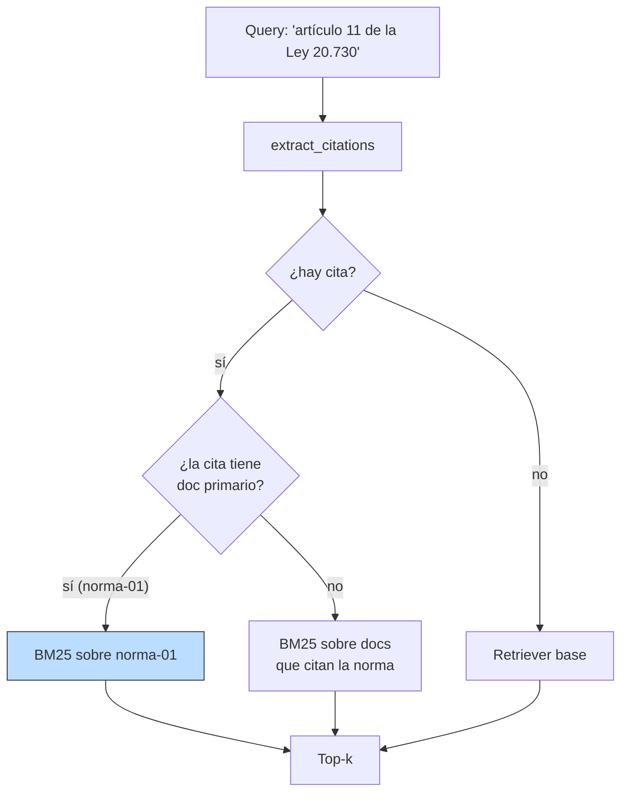
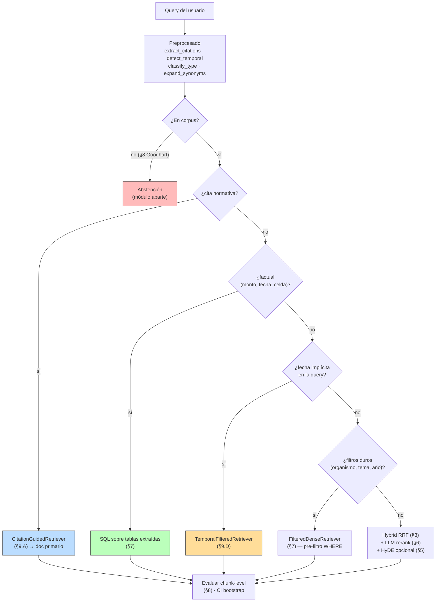

# 09 — Casos límite del dominio regulatorio chileno

## Lo que no resolvió ninguna sección anterior

Las secciones 1-8 nos llevaron desde BM25 hasta hybrid + reranker + métricas
con IC, y dejaron las arquitecturas semánticas afinadas. Pero hay una clase
de queries — frecuente en dominio regulatorio — donde **ninguno** de esos
pipelines gana sin tratamiento específico. No es un problema de embedder,
ni de fusión, ni de reranker: es un problema de que la query tiene una
estructura que el retrieval semántico desperdicia.

Esta sección recoge cuatro modos de falla del dominio chileno y muestra el
fix en cada uno. Cierra con la síntesis: un RAG regulatorio maduro no es
*un* retriever sino un **router** que reparte la query entre arquitecturas
distintas según su forma. Ese router es lo que de verdad construye el
producto.

## Caso A — Citas normativas: cuando el usuario te dio la llave

> Query: *"qué dice el artículo 11 de la Ley 20.730"*

El usuario te citó la norma exacta. Tratarlo como búsqueda semántica es
desperdiciar la información más estructurada que recibirás en una sesión.

Resultado naïve:

| Retriever | Top-1 |
|---|---|
| BM25 | decreto-02 (reglamento) chunk #11 — **Artículo 20** del reglamento, no Artículo 11 de la ley |
| Denso | decreto-02 chunk #11 — el mismo error |

Ambos pierden porque **el reglamento cita la Ley 20.730 muchas veces más
que la propia ley** (8 menciones de "20.730" en decreto-02 vs 1 en
norma-01). Por frecuencia léxica gana el reglamento; por similitud
semántica también, porque su léxico es más cercano a la query.

**Fix en dos pasos**:

1. `extract_citations(query)` extrae `{"leyes": ["20.730"], "articulos": ["11"]}` con regex.
2. `CitationGuidedRetriever` con `PRIMARY_LAW_DOCS["20.730"] = "norma-01-ley-lobby.txt"`:
   restringe la búsqueda al doc **que ES** la norma, no a los que la citan.

Resultado guiado por cita + doc primario:

| Posición | Chunk | Texto |
|---|---|---|
| 1 | norma-01 #0 | LEY Nº 20.730 (cabecera) |
| 2 | **norma-01 #14** | **Artículo 11º.- Las infracciones... multa de 10 a 50 UTM** |
| 3 | norma-01 #4 | Artículo 2º (definiciones) |

El Artículo 11 queda en el top-3, que es lo que la query pedía. La progresión
pedagógica importa: ruteo solo no basta; necesitás un **mapeo `cita→doc primario`**.
Sin esa metadata, el router aísla el universo correcto pero deja al reglamento
ganando.



**Lección general**: en cualquier dominio donde los usuarios citen IDs
canónicos (leyes, contratos, productos, tickets), el router por cita es el
primer filtro que ahorra coseno *y mejora precisión*. La metadata
`cita → doc primario` es trabajo de ingesta que vale infinitamente más que
un mejor reranker.

## Caso B — Tablas en PDFs: el chunking ingenuo las destroza

> Query: *"valor UTM septiembre 2024"*

La tabla UTM 2024 es 12 filas. Bajo `simple_chunk`, todo queda en un solo
bloque porque no hay líneas en blanco entre filas. El embedding de ese
bloque promedia 12 cifras — no hay un objetivo limpio para la query.

Resultado naïve (denso sobre los chunks de la tabla):

| Posición | Chunk | Contenido |
|---|---|---|
| 1 | tabla-01 #3 | "UTA diciembre 2024: $799.536" — el contexto-no-respuesta |
| 2 | tabla-01 #1 | "I. UNIDAD TRIBUTARIA MENSUAL..." — la cabecera |
| 3 | tabla-01 #7 | las notas |

El generador recibe la tabla completa y debe identificar la fila de
septiembre, parsear el número, devolverlo. Cada paso puede fallar — LLMs
chicos suelen confundir filas en tablas largas, y la ventana de contexto se
gasta en 11 filas irrelevantes.

**Fix**: linealizar la tabla fila-a-chunk con contexto reconstruido.
`linearize_utm_table()` emite 12 chunks como:

```
"Valores tributarios SII 2024 — UTM mensual.
 En septiembre de 2024 (09/2024), la UTM fue $66.362,
 con variación mensual de 0,6%."
```

Cada chunk es **auto-contenido**: la cabecera y el mes están en el mismo
texto. El embedding del chunk concentra señal sobre "septiembre" y "$66.362".

Resultado linealizado:

| Posición | Chunk | Score |
|---|---|---|
| **1** | **tabla-01 #utm09** | **0.615 — la fila exacta** |
| 2 | tabla-01 #utm10 (octubre) | 0.602 |
| 3 | tabla-01 #utm08 (agosto) | 0.595 |

El top-1 es la respuesta. El generador recibe la frase exacta y la devuelve
literal. No hay que confiar en su habilidad de leer tablas — el retriever
ya entregó la celda.

**Lección general**: cualquier tabla cuya estructura sobreviva al chunker
es excepcional; lo normal es que el chunking la rompa. La linealización
fila-a-chunk con contexto reconstruido es el patrón estándar — en producción
suele hacerlo un LLM-extractor al ingesta (Anthropic/Claude vision, o un
modelo dedicado a tabular extraction). Aquí va hand-coded para mantener el
stack sin dependencias.

> ⚠️ El mismo problema cubre el **§7 caso B** (SQL gana en UTM septiembre).
> La elección entre "linealizar y mantener en el vector store" vs "extraer
> a una tabla SQL" es de costo/equipo: SQL es exacto y trivial de auditar;
> la linealización mantiene un pipeline único y se ajusta sin tocar bases
> de datos. Ambos son válidos; en el mismo producto pueden coexistir.

## Caso C — Sinonimia técnica: el embedder no estudió derecho chileno

> Queries: *"USE para alumnos prioritarios"*, *"PRAIS"*, *"qué dice el DL 825"*

Las siglas del dominio (`USE`, `PRAIS`, `DL 825`, `SII`, `FONASA`,
`JUNAEB`) son raras en el corpus de pre-entrenamiento de
`text-embedding-3-small`. El embedding de "USE" puede colisionar con
"usar/usuario" en inglés (homógrafo) o quedar disperso. El de "PRAIS" es
casi un token desconocido.

Resultado naïve para "PRAIS" (denso):

| Posición | Chunk | Score |
|---|---|---|
| 1 | glosa-01 #6 (Asignación 112 – PRAIS) | 0.490 |
| 2 | glosa-01 #8 | 0.418 |
| 3 | decreto-01 #1 (subvención escolar, distractor) | 0.380 |

Resultado con `expand_synonyms("PRAIS")` → "PRAIS Programa de Reparación
y Atención Integral de Salud":

| Posición | Chunk | Score |
|---|---|---|
| 1 | glosa-01 #6 | **0.828** |
| 2 | glosa-01 #8 | 0.625 |
| 3 | glosa-01 #2 (Subsecretaría Salud Pública) | 0.567 |

El top-1 sube de 0.49 a 0.83 y el ranking se limpia de distractores. La
sigla se **anexa** a la forma extendida (no se reemplaza), así que BM25 y
denso ven ambas: chunks que dicen "PRAIS" y chunks que dicen "Programa de
Reparación..." ganan los dos.

| Sigla / cita | Forma extendida (anexada) | Δ score top-1 (denso) |
|---|---|---|
| PRAIS | Programa de Reparación y Atención Integral de Salud | **+0.34** |
| USE | unidad de subvención escolar | +0.04 |
| DL 825 | Decreto Ley 825 IVA Ventas y Servicios | +0.17 |

La magnitud del efecto depende de cuán **rara** sea la sigla en
pre-entrenamiento. PRAIS es desconocida → mejora gigante. USE comparte
forma con palabra inglesa común → mejora chica. DL 825 está moderadamente
representada → mejora media.

**Lección general**: para corpus con jerga estable (regulatorio, médico,
militar), un diccionario de 50-200 siglas mantenido a mano produce
mejoras consistentes a costo nulo en latencia. Es la alternativa pobre y
efectiva al fine-tuning de embeddings de dominio (que sigue siendo la
solución correcta a escala, pero arrastra MLOps que pocos equipos
necesitan).

## Caso D — Versiones temporales: la ley dice cosas distintas según la fecha

> Query: *"régimen de IVA a servicios prestados desde el extranjero"*

El corpus tiene dos versiones del DL 825 sobre IVA:

- `ley-01-dl-825-iva-base.txt`: texto refundido **previo a la Ley 21.210**,
  vigente hasta el **2020-02-23**. No grava servicios digitales.
- `ley-02-ley-21210-modernizacion.txt`: la modificación, vigente desde el
  **2020-02-24**. Crea el régimen de IVA para servicios digitales.

Sin filtro temporal:

| Posición | Chunk | Vigencia |
|---|---|---|
| 1 | circular-01 #6 (IVA servicios digitales) | 2020+ |
| **2** | **ley-02 #6** (Ley 21.210 modifica el DL 825) | **2020+** |
| 3 | circular-01 #11 | 2020+ |

Un usuario que pregunta "**¿qué régimen aplicaba a esta operación de
2018?**" recibe ley-02 y obtiene una respuesta legalmente incorrecta. **Es
el caso más caro de equivocarse en RAG legal**: la respuesta se ve
verosímil pero está fuera de vigencia. En un contexto de litigio, lo paga
el cliente.

**Fix**: metadata de vigencia (`DOC_TEMPORAL[doc] = {vigencia_desde,
vigencia_hasta}`) + `TemporalFilteredRetriever` que recibe la fecha de la
consulta y excluye docs cuya ventana no la contiene.

Resultado con `date_iso="2018-06-30"`:

| Posición | Chunk | Vigencia |
|---|---|---|
| 1 | circular-01 #6 | sin restricción |
| 2 | circular-01 #11 | sin restricción |
| 3 | circular-04 #8 (exenciones IVA) | sin restricción |

ley-02 **desaparece** (vigente 2020+ → fuera). El usuario recibe sobre
todo circulares interpretativas que no se anularon. (En la mejora siguiente,
también habría que excluir circulares posteriores a 2018: extender el
metadata a `valido_para_operaciones_de`).

Resultado con `date_iso="2024-06-30"`:

| Posición | Chunk | Vigencia |
|---|---|---|
| 1 | circular-01 #6 | sin restricción |
| 2 | ley-02 #6 | 2020+ ✓ |
| 3 | circular-01 #11 | sin restricción |

ley-01 (DL 825 texto previo) **desaparece**. ley-02 queda como la fuente
de ley vigente.

**Lección general**: en dominios donde **el tiempo es una dimensión de la
verdad** (legal, contable, científico — protocolos clínicos cambian, IRSE
cambian), el filtro temporal no es opcional. Es un campo más del metadata
junto a doc_type / organismo / tema, y se aplica con la misma maquinaria de
§7 (filtros duros).

> ⚠️ Anotar `vigencia_desde / vigencia_hasta` por doc es la parte fácil.
> Lo difícil es manejar **modificaciones parciales**: la Ley 21.210
> modifica el artículo 8 del DL 825 pero deja los otros artículos
> intactos. El modelo "doc reemplaza doc" se queda corto; el modelo
> correcto es a nivel artículo. Eso ya es retrieval de grano fino con
> versionado — el área donde se puede invertir mucho tiempo sin que el
> usuario lo note, y donde los productores serios diferencian.

## Síntesis — Arquitectura de referencia

El RAG regulatorio maduro **no es** un retriever ni una combinación de
ellos. Es un **router** que clasifica la query y la manda al subsistema
correcto. Cada sección de la masterclass aporta un subsistema:



Los **rendimientos decrecientes** caen ahí donde no hay router: insistir
en un mejor embedder para queries factuales mientras el usuario citó la
ley y mientras la respuesta está en una tabla del Ministerio, es plata
quemada. El crecimiento marginal del producto está en clasificar mejor la
query y rutearla.

**Cómo se invierte un mes de trabajo en RAG regulatorio**, en orden de
ROI descendente:

1. **Diccionario de siglas y citas** + `expand_synonyms` (1 día). Casi
   gratis, mejora gigante en queries con jerga.
2. **`PRIMARY_LAW_DOCS`** + `CitationGuidedRetriever` (2 días). Resuelve
   el 30% de queries "qué dice la ley X" que ningún retriever genérico
   resuelve.
3. **Extracción estructurada a SQL** de montos, plazos, tasas (1 semana).
   El §7 ya argumentó el ahorro; aquí se ejecuta.
4. **Metadata temporal** + `TemporalFilteredRetriever` (3 días para
   docs-completos; 2-4 semanas para versionado a nivel artículo). El gap
   de calidad legal más caro.
5. **Linealización de tablas** (variable según volumen). LLM-extractor
   al ingesta para tablas no estructuradas.
6. **Hybrid + LLM-rerank de §3 + §6**. Solo entonces — y solo si las
   métricas chunk-level de §8 muestran ganancia significativa, no doc-level
   ilusoria.

El orden importa. **El equipo que parte por (6) sin haber resuelto (1-5)
arde tiempo y dinero en una optimización que su corpus no necesita.**

## Estado del arte para RAG regulatorio (2026)

| Aspecto | Estado | Detalle |
|---|---|---|
| Routers por tipo de query | 🟡 En adopción | LangGraph, agentes con tools; aún se cocina a mano |
| Citation-aware retrieval | 🟢 Práctica madura | Dominios legal/médico llevan años haciéndolo |
| Linealización de tablas con LLM-extractor | ✅ Estándar | Anthropic Claude, GPT-4o vision; servicios dedicados (LlamaParse, Unstructured) |
| Diccionarios de dominio | 🟢 Probadamente efectivo | Requiere mantenimiento; ese es el costo real |
| Filtros temporales en retrieval legal | 🟡 En adopción | Aún sub-estándar; pgvector + columna `valid_from/to` lo soporta nativamente |
| Versionado a nivel artículo / cláusula | 🔴 Área activa | "Legal RAG" especializados (Harvey, EvenUp); poco como open source |
| Routers + RAG en producción 24/7 | 🟢 Probado | Patrón estándar 2024-2026 en startups legaltech |

## Conexiones (cierre de la masterclass)

- **Sección 1 (BM25)**: ganaba en queries con referencias exactas; lo
  llevamos al extremo con citation-guided + primary doc. El BM25 sigue
  vivo, ahora ruteado.
- **Sección 2 (denso)**: sus fallos en términos raros motivaron `expand_synonyms`.
  No reemplazamos el embedder, lo ayudamos a hacer su trabajo.
- **Sección 3 (hybrid)** y **§6 (reranking)**: la rama "query semántica"
  del router — sirven para lo que sí es semántico, no para citas o tablas.
- **Sección 4 (chunking)**: `linearize_utm_table` es la versión específica
  para tablas de la lección general — el chunker debe respetar la
  estructura *del contenido*, no aplicar reglas de tamaño.
- **Sección 5 (rewriting)**: HyDE y multi-query son herramientas del nodo
  "semántica"; no resuelven temporalidad, citas, ni siglas en sí.
- **Sección 7 (metadata / SQL)**: el principio "filtros y SQL antes del
  vector" se manifiesta aquí como temporalidad y citation routing — son
  variantes del mismo patrón.
- **Sección 8 (evaluación)**: las 4 queries `multi-doc` que salían en ~0 r@3
  caen exactamente en estas patologías. La sección 9 explica POR QUÉ
  fallaban; el router que aquí termina es la respuesta.

Con esto cierra la masterclass. Lo siguiente sería **escalar el corpus**
para que las diferencias entre arquitecturas sean estadísticamente
detectables — el §8 marcaba ese límite — y empezar a iterar con los
**productos reales** que motivaron el proyecto.
