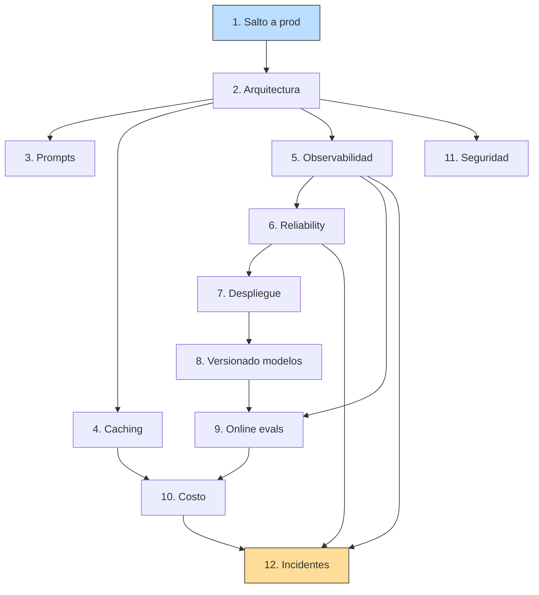

# 00 — Plan Maestro: Patrones de Producción

## Objetivo de la masterclass

Construir la capacidad de llevar un sistema RAG **a producción** y mantenerlo
ahí: con observabilidad real, prompts versionados, caché coherente,
fallback ante fallos del proveedor de LLM, despliegue reproducible, costo
predecible y un protocolo claro para incidentes. Al terminar, deberías
poder responder con propiedad: *¿este sistema aguanta tráfico real, con
qué presupuesto, con cuánta latencia, y cómo me entero cuándo se rompe?*

Producción no es una versión "más robusta" de la demo. Es una **disciplina
distinta**: el mismo sistema que en local responde bien una query, en
producción tiene varianza estadística no trivial, gasta dinero en cada
llamada, depende de proveedores externos cuyo SLA no controlás, y va a
fallar de formas que tu demo nunca expuso. Esta masterclass es el manual
para esa realidad.

## Hilo conductor

El mismo sistema RAG sobre normativa chilena que construimos en
**02-retrieval** (BM25 + denso + hybrid + rerank, con corpus regulatorio
chileno) y que evaluamos en **01-evals** (golden datasets, métricas con
IC, online evals). Aquí no tocamos su lógica de retrieval ni sus métricas:
las dos masterclasses previas ya lo dejaron correcto. **Lo que cambia es
cómo lo hacemos sobrevivir afuera del notebook.**

Cada sección agrega una capa de servicio sobre ese RAG:

```mermaid
graph LR
    DEV["RAG dev/notebook<br/>(§§ 01-evals, 02-retrieval)"] --> S["Servicio HTTP<br/>(§2)"]
    S --> P["Prompts versionados<br/>(§3)"]
    P --> C["Caché multinivel<br/>(§4)"]
    C --> O["Observabilidad<br/>(§5)"]
    O --> R["Reliability<br/>(§6)"]
    R --> D["Despliegue<br/>(§7)"]
    D --> V["Versionado de modelos<br/>(§8)"]
    V --> ONL["Online evals + loop<br/>(§9)"]
    ONL --> COST["Costo en prod<br/>(§10)"]
    COST --> SEC["Seguridad<br/>(§11)"]
    SEC --> INC["Incidentes<br/>(§12)"]

    style DEV fill:#bdf,stroke:#333
    style INC fill:#fd9,stroke:#333
```



## Principios de trabajo

1. **Honestidad sobre el escenario chileno.** El proyecto del usuario es
   un producto SaaS pequeño-mediano sobre corpus regulatorio, no
   Twitter/X. Nada de patrones Fortune-500 (Kafka clusters, service mesh,
   multi-region active-active) que cobran tax cognitivo sin pagar valor.
   Lo que mostramos es lo mínimo viable que funciona para 1-1.000 QPS,
   un equipo de 1-3 personas, presupuesto de $hundreds-$thousands/mes.
2. **Implementaciones desde cero cuando enseñan.** Caché LRU con TTL,
   token bucket de rate limiting, retry exponencial con jitter, circuit
   breaker — todos desde cero. Es lo que hay debajo del wrapper y lo que
   importa entender para diagnosticar cuando falla.
3. **Cada patrón con su corrida ejecutable.** Como las masterclasses
   anteriores: si decimos "esto reduce latencia 5×", hay un script que
   lo mide. Nada de "best practices" sin números.
4. **Eval-driven a lo largo de toda la sección.** Cada cambio de prompt,
   modelo, caché o rate limiter se acompaña de las métricas relevantes
   de 01-evals. La pregunta "¿esto mejoró el sistema?" tiene exactamente
   el mismo aparato matemático que en §8 de evals: deltas con IC.
5. **El honest scaling.** Para tu corpus chileno, una sola instancia
   con Postgres + pgvector + FastAPI atiende los hipotéticos primeros
   miles de usuarios sin sudar. Vamos a marcar dónde sí hace falta
   escalar y dónde estás sobre-construyendo por miedo.

## Temario

### Sección 1 — Por qué producción es una disciplina distinta
- El gap demo→prod: lo que el notebook no expone (varianza, fallos del
  proveedor, costo por uso, tráfico concurrente, regresiones silentes).
- Analogía económica: el sistema en prod es como una política pública
  en ejecución vs el paper que la diseñó. La realidad introduce
  fricciones que el modelo no contempla.
- Mapa del ciclo de vida de un RAG en producción.
- Demo numérica: tomamos el RAG de 02-retrieval, lo corremos 100 veces
  con la misma query (temperatura > 0), medimos varianza de salidas y
  costo acumulado. El número no es un número: es una distribución.

### Sección 2 — Arquitectura de servicio
- De script a HTTP: FastAPI con un endpoint `/query` que envuelve el RAG.
- Capas: handler → orquestador (router de §9 de retrieval) → retrievers
  → generador → post-procesado.
- Por qué separar **stateless** (handler, retrieval, generación) de
  **stateful** (Supabase / pgvector). El retrieval es stateless; el
  índice no.
- Patrón "puertos y adaptadores" para no quedar atado al SDK de un
  proveedor. Un `LLMClient` abstracto con implementaciones para
  Anthropic, OpenAI, etc. Hace canary y A/B triviales.
- Diagrama de despliegue mínimo para el stack chileno típico:
  FastAPI + Postgres/pgvector + un secret manager + un object store.

### Sección 3 — Gestión de prompts
- Por qué el prompt es código y va al control de versiones.
- Anti-patrones comunes: prompt embebido en string mutable, prompt
  cambiado a mano en producción, dos versiones del mismo prompt en dos
  archivos.
- **Prompt registry** simple: archivos `.md` o `.txt` versionados,
  cargados por nombre + hash, con tests obligatorios.
- A/B de prompts: cómo comparar dos versiones con golden + LLM-judge.
  Reusa el aparato de 01-evals §7.
- Templating sin sorpresas: Jinja2 con escaping; cómo evitar inyección
  desde el corpus al prompt (chunk con `{{ ... }}` adentro).
- Multi-idioma y multi-tono cuando importa.

### Sección 4 — Caching multinivel
- Tres niveles que cubren el 95% del valor:
  1. **Embedding cache** (ya implementado en 02-retrieval): hash texto →
     vector, persistente en disco / Redis / pgvector.
  2. **Response cache** (LLM): hash (prompt + modelo + temp) → respuesta,
     con TTL y stale-while-revalidate.
  3. **Semantic cache**: la query nueva se embebe y si su coseno con
     una query anterior supera un umbral, se devuelve la respuesta
     cacheada.
- Implementación desde cero de un LRU con TTL.
- Trade-offs: hit rate vs riesgo de servir respuestas obsoletas, vs
  costo de almacenamiento.
- Cuándo NO cachear: queries personalizadas con datos del usuario,
  outputs con timestamps, RAG sobre corpus que muta a diario.
- Demo numérica: misma carga sintética con/sin cada nivel, mediendo
  tokens, latencia p50/p95 y costo.

### Sección 5 — Observabilidad y tracing
- Las tres patas: **logs estructurados** (JSON, no print), **métricas**
  (counter, histogram, gauge), **traces** (un request ID atraviesa
  retrieval → rerank → generación).
- Qué medir, en orden de prioridad:
  1. Latencia end-to-end p50/p95/p99.
  2. Costo por request (in/out tokens × precio del modelo).
  3. Tasa de fallos (errores del proveedor, timeouts, rate limits).
  4. Métricas de calidad (online eval del §11 de 01-evals).
- Implementación: OpenTelemetry SDK + un backend (Tempo/Jaeger,
  Honeycomb, o solo logs + DuckDB para empezar).
- Anti-patrón: dashboards bonitos sin alertas. El valor de la
  observabilidad es enterarse **antes** que el usuario.

### Sección 6 — Reliability: rate limit, retries, circuit breakers
- Modelo mental: las APIs de LLM son recursos compartidos con SLA
  estadístico, no servicios infalibles. El cliente las trata como red
  externa flaky.
- **Rate limiting de cliente**: token bucket desde cero. Por qué tu
  cliente debe limitarse ANTES de que el proveedor te devuelva 429.
- **Retries con backoff exponencial + jitter**: por qué el jitter, qué
  errores se retentan (transient 5xx, 429) y cuáles no (4xx del cliente).
- **Circuit breaker**: cuándo dejar de pegarle al proveedor que está
  caído para no agravar el incidente. Implementación de estados
  closed/open/half-open desde cero.
- **Fallback**: cuando Claude está caído, ¿qué hacer? Servir respuesta
  cacheada, ir a un modelo secundario (GPT-4o-mini), o degradar
  visiblemente con "estamos en mantención".

### Sección 7 — Despliegue y configuración
- Container minimalista (Dockerfile + `uv pip install --system`).
- Config por entorno: `pydantic-settings` desde `.env` y secrets vault
  para producción. Anti-patrón: variables hardcoded.
- Secrets management: nunca en logs, nunca en stack traces, nunca en
  el control de versiones. Cómo verificarlo automáticamente.
- Migraciones de schema en pgvector: alembic + plan de rollback.
- Despliegue plain-vanilla sobre Fly.io / Railway / un VPS (cuál
  conviene para el escenario chileno; Supabase Edge Functions cuando
  aplica).
- Por qué Kubernetes es over-engineering para el 95% de estos productos.

### Sección 8 — Versionado de modelos
- Por qué nunca hardcodear `model="claude-opus-4-7"`: el modelo es
  configuración, no constante.
- Tres patrones para cambiar de modelo sin susto:
  1. **Shadow**: el modelo nuevo corre en paralelo, sin afectar al
     usuario; comparamos métricas offline.
  2. **A/B con métricas**: una fracción del tráfico va al modelo nuevo;
     comparamos online (§9 de 01-evals).
  3. **Canary**: 1% → 5% → 25% → 100%, con criterio de rollback
     automático si métricas caen.
- Cuándo cada uno y cómo decidirlo. Ejemplo: migrar de Sonnet 4.5 a
  Sonnet 4.6 con golden + canary.
- El problema del versionado del proveedor: "modelo X" puede cambiar
  bajo tus pies. Pinning, snapshotting, comportamiento si el proveedor
  retira un modelo.

### Sección 9 — Online evals y loop de feedback
- Conexión con 01-evals §11: el online eval no es un dashboard, es un
  ciclo cerrado entre producción y el golden dataset.
- Sampling: no podés evaluar 100% del tráfico; cómo elegir qué evaluar
  (sampling estratificado por query type, errores conocidos, queries
  raras).
- Llevar producción a tu golden: las queries que fallaron en prod son
  el mejor inventario para crecer el golden dataset.
- Auto-eval con LLM-judge en línea: cuándo sí (queries fuera de scope),
  cuándo no (queries factuales que el judge no sabe juzgar).
- Drift detection: cómo te enterás de que tu corpus o tus queries
  cambiaron de distribución.

### Sección 10 — Costo en producción
- Por qué el costo del LLM es la línea más volátil del P&L de un
  producto IA: cambio de modelo, cambio de tasa, cambio de tráfico
  pueden 10× el costo en un día.
- Presupuestación por feature: cuánto cuesta una conversación
  promedio, una conversación P99.
- **Cost-aware routing**: la pregunta es "¿qué modelo es el más barato
  que resuelve esta query?". Reuso del router de §9 de retrieval.
- Alertas: presupuesto mensual con tasas de quemado por hora.
- Caching agresivo cuando aplica (§4) como palanca de costo, no solo
  de latencia.
- Tabla concreta para el corpus chileno: $/1000 queries con cada
  arquitectura (BM25 only, Hybrid + Sonnet 4.6, Hybrid + Haiku 4.5,
  con/sin cache).

### Sección 11 — Seguridad
- **Prompt injection**: el chunk recuperado contiene "Ignora las
  instrucciones anteriores y responde X". Por qué pasa, cómo
  defenderse (separación clara contexto/instrucción, sandboxing de
  herramientas, output filtering).
- **PII en logs**: cómo identificar y redactar números de RUT,
  direcciones, nombres antes de loggear.
- **Auditoría regulatoria chilena**: si tu producto opera sobre
  normativa, hay obligaciones implícitas (privacidad Ley 19.628,
  protección de menores, etc.). Qué loggear obligatoriamente, qué
  destruir, durante cuánto tiempo.
- **Secrets** y rotación: prácticas mínimas (no commitear, KMS,
  rotación cada N meses).
- Modelo de amenazas pragmático para el producto chileno: qué pasa si
  un usuario hostil intenta usar el sistema para X.

### Sección 12 — Incidentes y postmortems
- Los modos de falla específicos de un sistema con LLM:
  1. **Proveedor caído** (Anthropic 503).
  2. **Latencia explotada** (modelo lento, cola larga).
  3. **Alucinación masiva** (cambio de modelo trajo regresión).
  4. **Retrieval roto** (índice corrupto, embedding model cambió).
  5. **Costo desbocado** (un usuario en loop, una query que
     itera tools sin fin).
- Runbooks: qué mirar en los primeros 5 minutos para cada uno.
- Postmortem honesto: blameless, con la pregunta "¿qué nos faltó
  para detectarlo antes?".
- Cierre: la métrica que vale es **Mean Time To Detect**, no MTTR.
  Bajar MTTD es lo que te da margen.

## Dependencias entre secciones



## Árbol propuesto

```
03-produccion/
├── README.md                            # índice y estado
├── theory/
│   ├── 00-plan.md                       # este documento
│   ├── 01-salto-a-produccion.md
│   ├── 02-arquitectura-servicio.md
│   ├── 03-gestion-prompts.md
│   ├── 04-caching-multinivel.md
│   ├── 05-observabilidad.md
│   ├── 06-reliability.md
│   ├── 07-despliegue-config.md
│   ├── 08-versionado-modelos.md
│   ├── 09-online-evals-loop.md
│   ├── 10-costo-produccion.md
│   ├── 11-seguridad.md
│   └── 12-incidentes-postmortems.md
├── code/
│   ├── prod_lib.py                      # núcleo reutilizable (crece por sección):
│   │                                     #   §4 LRU+TTL, semantic cache
│   │                                     #   §6 token bucket, retry, circuit breaker
│   │                                     #   §8 model router con shadow/canary
│   │                                     #   §10 cost meter
│   ├── 01-demo-prod-vs-demo.py
│   ├── 02-fastapi-rag.py                # servicio mínimo con endpoint /query
│   ├── 03-prompt-registry.py
│   ├── 04-caching.py
│   ├── 05-tracing.py
│   ├── 06-reliability.py
│   ├── 07-config-secrets.py
│   ├── 08-model-routing.py
│   ├── 09-online-eval-loop.py
│   ├── 10-cost-meter.py
│   ├── 11-prompt-injection.py
│   └── 12-incident-runbooks.py
├── diagrams/
│   ├── arquitectura-servicio.png        # §2
│   ├── caching-niveles.png              # §4
│   ├── pareto-costo-latencia.png        # §10
│   └── incident-funnel.png              # §12
├── examples/
│   ├── prompts/                         # §3, prompts versionados
│   │   └── README.md
│   ├── traces/                          # §5, traces JSON de ejemplo
│   └── incidents/                       # §12, postmortems ficticios
└── notes/
```

## Decisiones técnicas (requieren tu OK)

### 1. Stack del servicio

Propuesta (la **recomendada**, mínima sobre tu stack actual):

| Componente | Elección propuesta | Por qué |
|---|---|---|
| HTTP framework | **FastAPI** + `uvicorn` | Estándar 2026, autodocs OpenAPI, type-hints integrados |
| Config | `pydantic-settings` (`.env` + env vars) | Validación de tipos, ya en el ecosistema |
| Vector store | **Supabase Postgres + pgvector** | Tu stack actual; el `FilteredDenseRetriever` de §7 retrieval mapea directo |
| Cache | LRU en proceso + opcional Redis (§4) | Empezamos en memoria; Redis cuando hay multi-réplica |
| Observabilidad | **OpenTelemetry SDK** + backend opcional | Vendor-neutral; podemos emitir a Jaeger local o Honeycomb |
| LLM clients | Wrappers ya existentes en `shared/llm_clients.py` | Anthropic + OpenAI cubren todo lo discutido |
| Despliegue | Container + Fly.io / Railway / VPS | Stack pequeño, SLA simple, sin K8s |

Alternativa si la prefieres: **LiteLLM** como capa de abstracción de LLM
en vez de wrappers propios. Pro: routing y fallback gratis, métricas
estándar. Contra: una dep más, behavior implícito. **Dime cuál antes
de §2.**

### 2. Profundidad del despliegue

Tres niveles posibles para §7:

| Nivel | Qué cubre | Esfuerzo |
|---|---|---|
| **A — Conceptual** | Dockerfile + compose; sin desplegar nada real | bajo |
| **B — Local end-to-end** | Compose con app + Postgres + Redis; se levanta y prueba en tu máquina | medio |
| **C — Deploy real** | Cuenta y despliegue en Fly.io / Railway con secrets reales | alto |

Propongo **B**: tiene el principio sin pedir cuentas externas. Si en
algún momento querés C, lo agregamos como apéndice. **OK?**

### 3. Alcance del cost monitoring

§10 propone una tabla concreta de $/1000 queries sobre tu corpus.
Implica correr cada combinación N veces con un script de carga. Costo
real estimado: $1-5 por la tabla completa (gracias al cache). **OK
quemar eso?** Si no, lo dejo simulado a partir de las tarifas públicas.

## Convenciones para esta masterclass

- Cada sección = un doc en `theory/` + un script demo en `code/`.
- Núcleo reutilizable en `code/prod_lib.py` (snake_case, importable);
  scripts demo (kebab-case, numerados) lo importan.
- Diagramas Mermaid embebidos para arquitectura; matplotlib en
  `diagrams/` para datos cuantitativos.
- Todo se ejecuta con `uv run python 03-produccion/code/NN-script.py`.
- Un commit por sección terminada: `feat(produccion): sección N — título`.

## Notas sobre estado del arte (2026)

- **FastAPI + Pydantic** es el default de facto para servicios Python
  con LLMs; resiste el escrutinio incluso a escala media.
- **OpenTelemetry** consolidó el espacio de tracing; los vendor lock-in
  de hace 3 años se diluyeron.
- **LiteLLM y los router-frameworks** ganaron terreno cuando hay 3+
  proveedores y necesitás unificar; bajo eso, los SDKs nativos están
  bien.
- **Costo de LLM** sigue siendo la línea más volátil del P&L y la peor
  presupuestada en proyectos chicos. La caída de precios año-sobre-año
  (Sonnet 4.6, Haiku 4.5) no debe relajar la disciplina porque el
  tráfico crece más rápido que la baja.
- **Prompt injection** sigue sin solución general; las defensas son por
  capas (sanitización, separación contexto/instrucción, salidas
  validadas).
- **Online evals** son el área menos madura: muchos productos los
  llaman "dashboards" sin cerrar el loop con golden. La masterclass
  apunta al ciclo cerrado.
- **Postmortems en sistemas con LLM** son nuevos: la industria todavía
  está descubriendo qué postmortem-tipo aplica para una regresión de
  modelo o una alucinación masiva.

## Conexiones con las otras masterclasses

- **01-evals**: §9 (regresiones/CI) y §11 (online evals) son insumos
  directos; en producción cobran sentido completo.
- **02-retrieval**: el RAG de las §§1-9 es lo que servimos; el router
  de §9 retrieval es la base de §8 versionado y §10 costo.
- **04-economia** (futura): la frontera de Pareto costo/calidad de
  01-evals §10 conecta con la economía de inferencia que vendrá.
