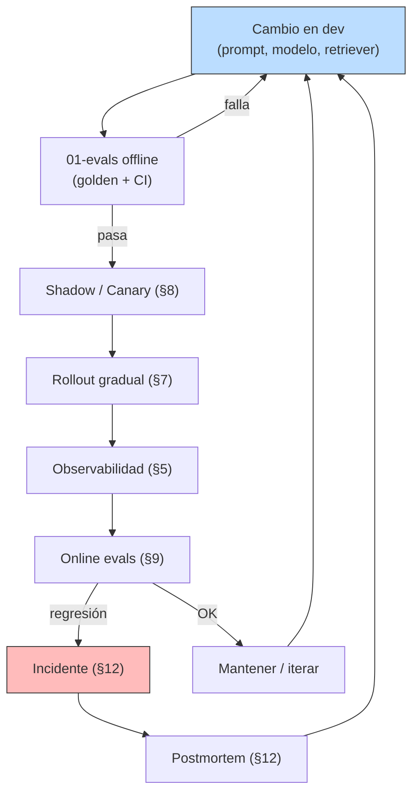

# 01 — Por qué producción es una disciplina distinta

## La frase con la que empieza casi todo problema

> "Pero en mi notebook funcionaba."

Hay un momento, en cada equipo que construye sistemas con LLMs, donde
alguien dice esa frase con genuina perplejidad. El notebook respondía
bien la query, el golden offline daba 0.92 de recall, el demo al cliente
salió impecable. Y después algo se rompió en producción.

Lo que se rompió no es el sistema. **Es la idea de que el sistema era
una función**.

En un notebook un sistema RAG es, conceptualmente, una función pura:
metés una query y sale una respuesta. En producción es:

- una **distribución de respuestas** (estocasticidad del LLM),
- ejecutada bajo **carga concurrente** (latencia tail, contención),
- contra **proveedores externos** con SLAs no perfectos (rate limits,
  caídas, cambios silenciosos de versión de modelo),
- con un **costo medido en dinero real**, no en segundos,
- con **trazabilidad y auditoría** exigibles ex post,
- y cuyas **regresiones son silenciosas** (un prompt cambiado, un modelo
  versionado, un chunk envenenado) y solo aparecen cuando alguien las mide.

Esta masterclass es lo que hay que poner alrededor del RAG de
**02-retrieval** para que sobreviva ese cambio de naturaleza.

## Analogía económica

Pasar de notebook a producción es la diferencia entre **diseñar una
política pública** y **ejecutarla**. El paper donde diseñaste el bono
de invierno usa supuestos limpios: información perfecta, agentes
racionales, sin frijoles administrativos. La ejecución sufre
**fricciones de implementación** — bancos que no procesan a tiempo,
beneficiarios mal clasificados, fraude, cambios de gobierno. El bono
puede haber sido correcto y aun así fallar en ejecución.

La masterclass anterior (01-evals) fue tu modelo econométrico: te dijo
"este RAG es efectivo según estas métricas". La masterclass actual es
el **manual de implementación**: lo que hay que hacer para que esas
métricas sigan siendo ciertas cuando hay tráfico, dinero, regulación y
proveedores externos en el medio.

## Las cinco cosas que cambian

### 1. La salida del sistema es una distribución, no un valor

Para cualquier `temperature > 0` (el default de la mayoría de productos
conversacionales), la misma query produce **respuestas distintas en
muestras independientes**. Cuán distintas depende de:

- La longitud del output (más tokens, más oportunidades de divergir).
- La "saturación" del contexto: si el chunk recuperado tiene la
  respuesta literal, hay menos espacio para divergencia.
- El modelo y la temperatura.

Demostración con nuestro RAG (`code/01-demo-prod-vs-demo.py`, T=0.9,
gpt-4o-mini, misma query y mismo contexto, 3 muestras):

| Muestra | Out tokens | Primera línea |
|---|---|---|
| sto-1 | 28 | "No está explícitamente presente la información..." |
| sto-2 | 44 | "No se puede brindar una respuesta explícita..." |
| sto-3 | 95 | "La aplicación del Impuesto al Valor Agregado..." |

**Dos muestras se abstuvieron con textos distintos; una respondió la
pregunta completa.** Para el usuario que pidió esa query y recibió la
abstención, el producto falló — aunque el "mismo" sistema funcionaba
en la siguiente muestra. Similitud Ratcliff/Obershelp entre pares:
0.670, 0.128, 0.109. La varianza en longitud (coeficiente de
variación): **51%**.

Lecciones:

- La métrica de calidad tiene que ser una **distribución**, no un
  número. Bootstrap (01-evals §8) es el aparato correcto.
- En queries-borde, **la abstención también es estocástica**. La
  defensa: instrucción explícita de abstener en el prompt y `temp=0` o
  muy baja para módulos críticos.
- "El sistema dio una respuesta mala una vez" no es señal de bug; es
  señal de muestrear la distribución. La pregunta correcta es: *¿con
  qué frecuencia?*

### 2. Hay tráfico real (y eso revela latencia tail)

En el notebook hacés una llamada por vez. En producción hay decenas o
miles por segundo. Aparecen:

- **Concurrencia**: dos requests pegándole al mismo cliente HTTP, a
  la misma conexión Postgres, a la misma key de cache.
- **Backpressure**: si la cola crece más rápido que la capacidad de
  procesamiento, todo se cae.
- **Latencia tail**: el p50 luce bien, el p99 te mata. Una llamada al
  proveedor que tarda 30 s degrada toda la cadena.

Cuantitativamente, la diferencia entre `await response` con N=1 y
`await response` con N=100 concurrentes no es lineal: cada eslabón
(retrieval, generación, parseo) tiene un cuello distinto y el sistema
total sufre el peor de todos.

Lecciones, anticipando §5 (observabilidad) y §6 (reliability):

- Medí siempre p50, p95 y p99. Promedio es ruido.
- Tu cliente del LLM tiene que tener **timeout finito** y **retry con
  backoff**. Sin eso, una llamada lenta cuelga todo el request.
- "Carga sintética" en CI (50-100 requests concurrentes contra un mock
  del proveedor) revela cuellos antes de que los revele el usuario.

### 3. Cada query cuesta plata

Tu producto vive del LLM. La factura mensual sube linealmente con el
tráfico, y la elección de modelo es la palanca más importante.

Cuanto cuesta una query típica de nuestro RAG (tarifas 2026-Q2,
[aprox.]):

| Modelo | $/query (260 in, 65 out) |
|---|---|
| gpt-4o-mini | $0.000078 |
| haiku-4.5 | $0.000468 |
| sonnet-4.6 | $0.00176 |

Escalado a un mes:

| Escenario | queries/mes | gpt-4o-mini | haiku-4.5 | sonnet-4.6 |
|---|---|---|---|---|
| Validación (β) | 100 | $0.01 | $0.05 | $0.18 |
| Crecimiento (1k usuarios) | 10.000 | $0.78 | $4.68 | $17.56 |
| Escala (10k usuarios) | 1.000.000 | **$78** | **$468** | **$1.756** |

Para el escenario chileno típico — un producto SaaS pequeño con cientos
o miles de usuarios activos — la elección de modelo entre Haiku y
Sonnet es la diferencia entre **$50/mes** y **$200/mes** a escala
media. No te quiebra; sí cambia la economía de pricing del producto.

Lecciones, anticipando §10 (costo):

- El costo es la **línea más volátil** del P&L: cambio de modelo,
  cambio de tarifa, un usuario en loop, una tool que itera — pueden
  10× la factura en un día.
- Presupuestar por **feature**, no por mes. "Una conversación
  promedio cuesta X, una conversación P99 cuesta Y."
- **Cost-aware routing**: la pregunta clave no es "qué modelo es
  mejor" sino "qué modelo es el más barato que resuelve esta query".

### 4. El proveedor de LLM no es infalible

Anthropic y OpenAI tienen SLAs estadísticos, no garantías. Lo que
pasa de verdad:

- Caídas zonales o globales de unos minutos a una hora, varias veces
  al año.
- Picos de latencia que multiplican el p99 por 10× durante decenas de
  minutos.
- Cambios silenciosos en el comportamiento del modelo (pasaron Sonnet
  4.5 a Sonnet 4.6 y tus respuestas cambian).
- Rate limits que cambian sin aviso.
- Deprecación de modelos en plazos cortos.

En el notebook, asumimos que `client.messages.create()` siempre devuelve
algo razonable. En producción es un servicio externo flaky que necesita
todo el aparato de redes distribuidas: timeouts, retries, circuit
breakers, fallbacks.

Lecciones, anticipando §6 (reliability) y §8 (versionado):

- **Pin del modelo a una versión** específica (ej. `claude-sonnet-4-6`,
  no `claude-sonnet`). Cambiar es decisión, no accidente.
- **Fallback declarado** para cuando el proveedor primario falla:
  servir desde cache, ir a un secundario, o degradar visiblemente con
  "estamos en mantención" — pero no quedar colgados.
- **Health check** del proveedor en background, no descubrirlo
  cuando el primer usuario pega.

### 5. Las regresiones son silenciosas

En código tradicional, una regresión rompe un test. En un sistema con
LLM, una regresión:

- cambia el **tono** de las respuestas (8% más largo, más formal),
- empeora **una clase específica de query** (queries numéricas caen,
  el promedio no se mueve),
- empieza a **alucinar más** en un dominio que no estaba en el golden,
- consume **más tokens** en promedio (factura sube sin que nadie note).

Lo peor: tu CI no las atrapa si tu golden no las cubre. La masterclass
01-evals te dio el aparato (§9 regresiones, §11 online evals); aquí lo
metés al pipeline.

Lecciones, anticipando §3 (prompts), §8 (versionado), §9 (online evals):

- **El prompt es código**: versionado, revisado, con tests obligatorios.
  Cambios al prompt corren el golden antes de mergear.
- **El modelo es configuración**: cambiar de modelo en producción
  exige canary o shadow, no flag boolean.
- **Online evals con sampling**: 1% del tráfico real evaluado
  automáticamente, comparado contra distribución histórica.

## El ciclo de vida que arma esta masterclass

Cada uno de los nodos de ese ciclo es una sección. La cosa que importa
no es ninguno aislado — es que el ciclo **se cierra**. Cambio →
medición → despliegue gradual → observación → medición → cambio. Sin
ese cierre, cualquier mejora ofline es una hipótesis no contrastada.

## Catálogo de modos de falla típicos

Doce fallos que aparecen en producción y nunca en el notebook
(`code/01-demo-prod-vs-demo.py` los lista en tabla con sección
responsable). En orden de probabilidad, no de gravedad:

1. Proveedor de LLM caído (503).
2. Rate limit del proveedor (429).
3. Latencia tail (p99 explotado por una llamada).
4. Costo desbocado por usuario en loop o tool iterativa.
5. Regresión silenciosa por cambio de prompt "sin importancia".
6. Versión del modelo cambió bajo tus pies.
7. Caché stale: corpus mutó, respuestas servidas son viejas.
8. Prompt injection desde el corpus al LLM.
9. PII en logs (RUTs, direcciones).
10. Drift del tráfico (queries cambian de distribución).
11. Alucinación masiva tras cambio de modelo no detectado.
12. Embedding cache corrupto (hash colisión, vectores incorrectos).

Si tu sistema en producción no tiene defensa para estos doce, no es un
sistema en producción — es un demo con tráfico.

## Lo que NO cambia entre demo y producción

Por simetría, también vale marcar lo que se mantiene:

- **La lógica de retrieval**. El BM25, el hybrid, el reranker — son
  los mismos, ya están bien medidos en 02-retrieval. No hay que
  re-inventarlos.
- **El golden dataset**. 01-evals nos dio el banco de pruebas; sigue
  siendo el árbitro de la calidad ofline.
- **Las métricas**. Recall, MRR, nDCG, bootstrap CI — son las mismas
  herramientas; ahora las aplicamos a un sistema con más capas.

La masterclass NO es "rehacer el RAG". Es **envolverlo en las capas
que producción requiere**, una por sección.

## Estado del arte (2026)

| Aspecto | Estado | Detalle |
|---|---|---|
| Servir RAG con FastAPI + Postgres/pgvector | ✅ Estándar | El stack del 80% de productos pequeños-medianos |
| Caché de embeddings y de respuestas | ✅ Estándar | Redis/Memcached o disco; semantic caching aún emergente |
| Tracing OpenTelemetry para LLMs | 🟢 Adopción rápida | Vendor-neutral, ya el default sobre vendors propietarios |
| Online evals con sampling | 🟡 Emergente | Muchos lo llaman "dashboard"; cerrar el loop sigue siendo raro |
| Canary / shadow para cambios de modelo | 🟢 Práctica madura | Falta tooling estandarizado; mucho se hace a mano |
| Postmortem-tipo para LLMs | 🟡 Inmadura | Templates de Google SRE no encajan 1:1 con incidentes LLM |
| Cost-aware routing | 🟡 Emergente | LiteLLM, LangGraph y agentes lo automatizan parcialmente |

## Conexiones con las otras masterclasses

- **01-evals**: cada cambio que hagamos aquí (prompt, modelo, caché)
  exige correr el golden antes y después. La masterclass anterior es
  el árbitro de calidad de esta.
- **02-retrieval**: el RAG que servimos es el de §§1-9 de retrieval.
  El router del §9 (citation-guided, temporal, SQL) es la base sobre
  la que va a montarse §10 (cost-aware routing) de esta masterclass.
- **04-economia** (futura): la frontera Pareto costo/calidad de
  01-evals §10 se vuelve aquí, en §10, una decisión presupuestaria
  cotidiana — y va a conectar con la economía de inferencia que viene
  después.
