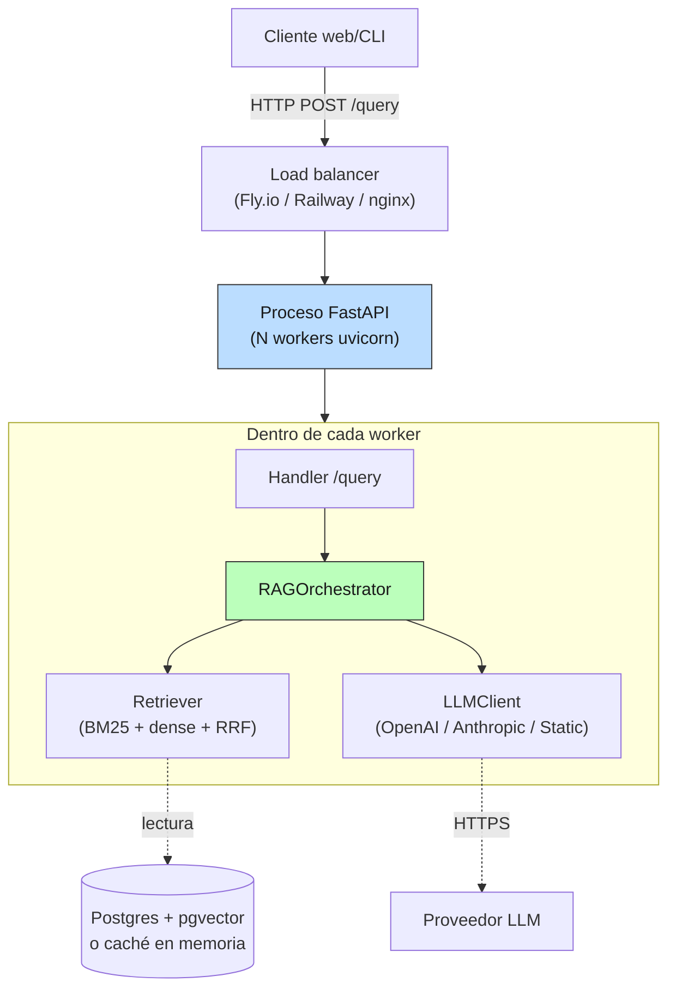

# 02 — Arquitectura de servicio

## De script a servicio

En 02-retrieval terminamos con un RAG que se invocaba así:

```python
results = hybrid.search(query, k=3)
prompt = build_prompt(query, results)
answer = client.chat.completions.create(...)
```

Funciona en un notebook. No funciona en producción. Lo que cambia no es
la lógica — el retrieval y la generación son los mismos. Cambia que ahora
hay que:

- exponerlo a HTTP para que un frontend lo consuma,
- evitar pagar el costo de `fit()` en cada llamada (decenas a miles de ms
  para construir los índices),
- aceptar tráfico concurrente sin que dos requests pisen el mismo estado,
- devolver al cliente algo **estructurado y auditable** — no solo texto,
- distinguir "el proceso está vivo" de "el RAG está listo para servir",
- poder **cambiar de proveedor de LLM** sin reescribir el handler.

Esta sección es el andamio mínimo que cubre todo eso, en menos de 300
líneas, sin Kafka, sin Kubernetes, sin service mesh. Está implementado
en [`code/02-fastapi-rag.py`](../code/02-fastapi-rag.py) y el núcleo
reutilizable en [`code/prod_lib.py`](../code/prod_lib.py).

## El despliegue mínimo viable

Para el escenario chileno típico (producto SaaS pequeño-mediano, 1-10k
usuarios activos), un solo proceso atiende todo. La complejidad **no
está** en orquestación, está en **separar capas dentro del proceso**:



Lo crítico es la línea punteada hacia Postgres y el proveedor LLM: son
las **dependencias externas** y por eso son lo que sí o sí necesita
manejo de fallo (§6 reliability).

## Stateless vs stateful: qué vive dónde

El error típico al pasar a producción es asumir que todo es stateless o
todo es stateful, cuando la realidad es mixta:

| Componente | Estado | Vive en |
|---|---|---|
| Handler `/query` | stateless | proceso, scope del request |
| `RAGOrchestrator` | stateless por request | proceso, compartido entre requests |
| Embeddings de chunks | stateful, read-only post-fit | proceso (memoria) + caché en disco/Redis |
| Índice BM25 | stateful, read-only post-fit | proceso (memoria) |
| `chunks` (corpus) | stateful, mutable cuando reindexás | **Postgres / object store** |
| Caché de respuestas LLM | stateful, mutable | Redis o disco compartido |
| Trace IDs, logs, métricas | stateful, append-only | sistema externo de observabilidad |

Regla práctica: lo **stateless o read-only post-init** puede vivir en el
proceso. Lo **mutable durante runtime** debe vivir afuera (Postgres,
Redis), porque cuando agreguemos un segundo worker en §7, todos tienen
que ver el mismo estado.

Para nuestro tamaño de corpus (16 docs, 234 chunks), los índices caben en
memoria — un solo proceso es suficiente. Cuando el corpus crezca a 10k+
docs, los índices migran a pgvector (que ya usás en Supabase) y el
proceso queda completamente stateless.

## Patrón puertos y adaptadores: por qué importa

El anti-patrón común:

```python
@app.post("/query")
def query(req):
    client = anthropic.Anthropic()         # ← acoplamiento directo al SDK
    response = client.messages.create(...)  # ← parámetros específicos
    return response.content[0].text         # ← parsing específico
```

Lo que tiene de malo:
- **Imposible testear sin red**. Para correr un test del handler hay que
  mockear el SDK de Anthropic o pegar a la red real.
- **Cambiar de proveedor implica reescribir handlers**. OpenAI vs
  Anthropic tienen APIs distintas; tu código de negocio se entera.
- **No podés hacer shadow / canary / fallback** sin reestructurar todo.

El patrón correcto: un **puerto** (la interfaz) y muchos **adaptadores**
(las implementaciones). En `prod_lib.py`:

```python
class LLMClient(Protocol):
    name: str
    def complete(self, prompt: str, *, model: str, temperature: float, max_tokens: int) -> LLMResponse: ...

class OpenAILLMClient: ...   # adaptador real
class AnthropicLLMClient: ...
class StaticLLMClient: ...   # adaptador para tests y fallback
```

El handler ahora ve solo el puerto:

```python
rag = request.app.state.rag       # RAGOrchestrator con un LLMClient adentro
return rag.query(req.query)        # no sabe qué proveedor hay debajo
```

Beneficios inmediatos:

- **Tests sin red**: inyectás un `StaticLLMClient` con respuesta fija y
  testeás el handler completo offline.
- **Degradación graceful**: si falta la API key, el servicio sigue
  arrancando con `StaticLLMClient` y devuelve "[demo]" en vez de
  fallar al startup. (Lo que hace nuestro `lifespan` en
  `02-fastapi-rag.py` cuando no encuentra `OPENAI_API_KEY`.)
- **§6 reliability** (futuro): el `LLMClient` se puede envolver en
  `RetryingLLMClient(base)` → `CircuitBreakingLLMClient(base)` →
  `FallbackLLMClient(primary, secondary)` — cada uno una capa, cada
  uno respeta el mismo `Protocol`.
- **§8 versionado de modelos** (futuro): `ShadowLLMClient(prod,
  candidate)` corre los dos en paralelo, compara y reporta — sin
  tocar el handler.

El costo de la abstracción es ~30 líneas adicionales una sola vez. El
beneficio se cobra todas las semanas.

## Lifespan: el costo caro pasa una vez

El handler no debe hacer `BM25().fit()` ni `OpenAIEmbedder()` por
request. Esos costos son de orden 100ms a varios segundos; pagados por
cada request matan la latencia.

FastAPI ofrece **lifespan**: un context manager que corre una vez al
startup (antes de aceptar tráfico) y una vez al shutdown (después de
drenar). En nuestro código:

```python
@asynccontextmanager
async def lifespan(app: FastAPI):
    chunks = load_corpus_chunks(CORPUS_DIR)         # ~50 ms
    embedder = OpenAIEmbedder(cache_path=EMB_CACHE) # ~20 ms (carga npz)
    bm25 = BM25Retriever().fit(chunks)              # ~10 ms
    dense = DenseRetriever(embedder).fit(chunks)    # ~30 ms
    hybrid = HybridRetriever([bm25, dense], ...)    # ~0 ms (no fit)
    app.state.rag = RAGOrchestrator(retriever=hybrid, llm_client=...)
    yield
    # shutdown: cerrar conexiones, vaciar batches, etc.
```

El RAG queda en `app.state` (por-app, no por-request). Los handlers lo
toman vía `request.app.state.rag`. Cada request paga solo el coseno y la
llamada al LLM — el `fit()` se amortiza sobre TODAS las queries del
proceso.

Detalle sutil: **lifespan completa antes de aceptar tráfico**. Si tu
load balancer chequea `/healthz` durante el startup, recibe 503 hasta
que termine el lifespan; eso es lo que mantiene a los usuarios fuera
mientras se carga el índice.

## Health vs ready: dos preguntas distintas

| Endpoint | Pregunta | Falla si... | Lo usa... |
|---|---|---|---|
| `GET /healthz` | ¿El proceso responde? | el handler se cuelga por más de N segundos | el orquestador para decidir si REINICIAR el proceso |
| `GET /readyz` | ¿El servicio está listo para servir? | el RAG no está cargado, o un dependency crítico (Postgres) está caído | el load balancer para decidir si RUTAR tráfico al pod |

Confundirlos es un anti-patrón común. Si tu `/healthz` chequea Postgres y
Postgres está caído, el orquestador reinicia el proceso — lo cual no
arregla nada y empeora la disponibilidad. **Healthz debe ser barato y
local; readyz puede chequear dependencias.**

En nuestro código:

```python
@app.get("/healthz")
def healthz():
    return {"status": "ok"}                # constante, sin chequear nada

@app.get("/readyz")
def readyz(request: Request):
    rag = getattr(request.app.state, "rag", None)
    if rag is None:
        raise HTTPException(503, "RAG no cargado")
    return {"status": "ready", "corpus_chunks": ...}
```

## El response shape: lo que el cliente necesita

Devolver solo el texto de la respuesta es perder información. Un RAG en
producción devuelve, en cada request:

| Campo | Por qué |
|---|---|
| `answer` | la respuesta del LLM, obvia |
| `sources` | lista de chunks usados (chunk_id, doc_id, score, snippet). Crítico para auditoría y UI: el usuario quiere ver de dónde salió la respuesta |
| `model` | qué modelo respondió (cambia en canary/A/B; el cliente puede correlacionar) |
| `in_tokens`, `out_tokens` | costo y trazabilidad |
| `cost_usd` | costo de esta respuesta (§10) |
| `latency_ms` | total + breakdown (retrieval, LLM) — para tableros y SLOs |
| `trace_id` | identificador único — el cliente puede pegarlo en bug reports; vos lo seguís en logs (§5) |
| `metadata` | cosas opcionales: k usado, cliente, prompt_version (cuando §3 las trae) |

En FastAPI esto se modela con `BaseModel` y el contrato queda
**autodocumentado** en `/docs` (OpenAPI gratis). El cliente ve el schema
exacto, los tipos, los rangos válidos.

Demostración con la primera query del demo (cliente OpenAI con tu .env):

```
trace_id : 84ccd38e6d35…
model    : gpt-4o-mini (cliente: openai)
latencia : 2150 ms total  (retrieval 1ms + LLM 2150ms)
tokens   : 272 in / 21 out  ($0.000053)
answer   : "La tasa de IVA para servicios digitales de proveedores
            extranjeros es del 19% [Fragmento 1]."
sources  :
  - [0.585] circular-01-sii-iva-digital.txt#6  …con tasa del 19%…
  - [0.535] circular-01-sii-iva-digital.txt#2  …Instruye sobre la aplicación…
  - [0.503] ley-01-dl-825-iva-base.txt#22      …NOTA DE VIGENCIA…
```

Cada uno de esos campos es algo que **necesitarás** apenas tengas un
incidente o una pregunta del usuario "¿de dónde sacó esa respuesta?".

## Validación en el borde

Pydantic valida `QueryRequest` antes de que el handler reciba el
request:

```python
class QueryRequest(BaseModel):
    query: str = Field(..., min_length=3, max_length=2000)
    k: int = Field(3, ge=1, le=10)
    model: str | None = None
```

Una query de 1 carácter (`"?"`), o `k=100`, o `k="abc"`, devuelven 422
con detalle del error. El handler no se ejecuta. Esto es lo que evita:

- Buffer overflows de prompt (un usuario manda 1M caracteres y te quema
  todo el rate limit).
- Cargas extremas (`k=10000`).
- Confusión de tipos en el handler.

La validación en el borde **es** una de las defensas de §11 (seguridad).
No es opcional.

## Stateless por request: por qué importa

`RAGOrchestrator.query()` no muta nada en `self`. No hay un `last_query`
guardado, ni un contador interno, ni un cache compartido con otras
queries. El método es **puro** (modulo retrieval y LLM, ambos read-only
desde la perspectiva del proceso).

Eso permite:

- **Multi-worker uvicorn** sin sincronización: cada worker tiene su
  copia de `app.state.rag`, leen el mismo índice (read-only), no se
  pisan.
- **Multi-thread** dentro de un worker: las llamadas a `complete()` se
  pueden paralelizar para queries distintas sin lock.
- **Reload del corpus sin downtime**: cargar el índice nuevo en otro
  worker, swappear `app.state.rag`, terminar requests en flight contra
  el viejo y descartarlo.

Si en algún momento agregamos estado por-request (rate limit por usuario,
contador de queries, sesión), va a un store externo (Redis), no a `self`.

## Anti-patrones a evitar

| Anti-patrón | Por qué duele |
|---|---|
| Crear el `client = OpenAI()` dentro del handler | Reabre conexiones HTTP en cada request; mata latencia y rate limit |
| `fit()` del índice en cada request | Pagás 100ms+ por nada; el índice es read-only |
| Estado global mutable (`COUNTER = 0`) | No es thread-safe; no es multi-worker safe; explota silenciosamente |
| Mismo endpoint hace `/health` y `/ready` | Confunde al orquestador; restarts innecesarios o tráfico mal ruteado |
| Devolver solo `text` sin sources, trace_id | Imposible debuggear o auditar |
| Cargar config con `os.environ["X"]` sin default | El proceso explota al primer request si falta una variable |
| `try: ... except Exception: pass` global | Esconde errores que importan; al rato te enterás en producción |
| Sin timeout en la llamada al LLM | Una llamada lenta cuelga el worker entero |

El último — sin timeout — es importante: vamos a verlo en §6
(reliability). FastAPI **no** tiene un timeout por request por default;
hay que ponerlo explícito en la capa de cliente HTTP.

## Estado del arte (2026)

| Aspecto | Estado | Detalle |
|---|---|---|
| FastAPI + Pydantic para APIs LLM | ✅ Estándar | El default 2026 en Python; autodocs OpenAPI, validación gratis |
| Lifespan + dependency injection | ✅ Estándar | Reemplazó `@app.on_event` deprecated; mejor para tests |
| Health/ready separados | 🟢 Best practice madura | Viene del mundo Kubernetes; sigue valiendo afuera de k8s |
| Stateless workers + Redis para estado | ✅ Estándar | El patrón scale-out de cualquier API Python moderna |
| Multi-proveedor LLM via abstracción | 🟢 Práctica madura | LiteLLM lo automatiza; hacerlo desde cero (como aquí) sigue siendo válido para entender el patrón |
| Server-Sent Events / streaming de respuestas | 🟡 En adopción | UX mejora con token-streaming; requiere reescribir handler asíncrono |
| Validación de schema en el borde (Pydantic) | ✅ Estándar | Devuelve 422 con detalle; default seguro |
| OpenAPI autodocumentado | ✅ Estándar | FastAPI lo genera; clientes typescript/python se autogeneran |

## Lo que viene en las próximas secciones

- **§3 prompts**: el template hardcoded en `DEFAULT_PROMPT_TEMPLATE` se
  va a un registry versionado, con tests obligatorios.
- **§4 caching**: hoy cada query paga LLM. Vamos a cachear respuestas y
  queries semánticamente similares.
- **§5 observabilidad**: hoy logueamos a stdout con `logger.info`.
  Vamos a estructurar (JSON), agregar tracing (OpenTelemetry) y emitir
  métricas (latencia p50/p95/p99, costo, errores).
- **§6 reliability**: hoy si Anthropic devuelve 500, el handler explota.
  Vamos a envolver `LLMClient` en retry, circuit breaker y fallback.
- **§7 despliegue**: hoy `uv run python ...`. Vamos a Dockerfile +
  docker-compose + `pydantic-settings` para config por entorno.
- **§8 versionado de modelos**: hoy `default_model="gpt-4o-mini"` es
  fijo. Vamos a shadow/canary para cambiarlo sin susto.

## Conexiones

- **02-retrieval §§1-9**: el `RAGOrchestrator` recibe el `HybridRetriever`
  que ahí construimos. Cero refactor del retrieval; solo se envuelve.
- **02-retrieval §9 router**: el siguiente paso natural es que el
  `RAGOrchestrator` no use un único `HybridRetriever` sino el router de
  §9 (citation-guided, temporal, SQL). Esa integración llega en §8 de
  esta masterclass cuando hablemos de cost-aware routing.
- **01-evals §11 online evals**: el `trace_id` que devolvemos en cada
  respuesta es la primitiva sobre la que se monta el sampling de online
  evals (§9 de esta masterclass): tomás un % de los trace_ids,
  recuperás respuesta + sources, los pasás al judge.
- **01-evals §8 estadística**: el campo `latency_ms` en la respuesta y
  el `cost_usd` son las dos series que vas a agregar con bootstrap CI
  cuando reportes el SLO mensual.
