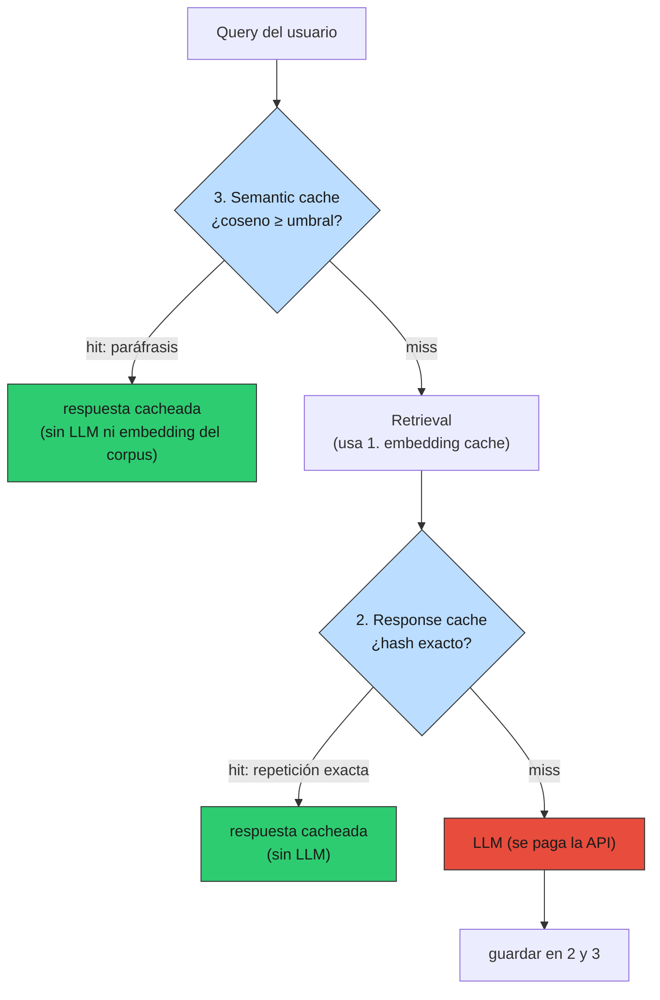
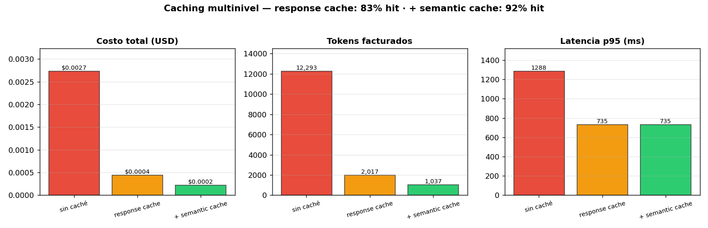

# 04 — Caching multinivel

## El caché no cambia la lógica; cambia cuánto la pagás

El RAG de §2-§3 ya responde bien. El problema en producción es que **paga la
API en cada request**, y el tráfico real tiene una propiedad que se puede
explotar: **se repite**. En un RAG fiscal chileno, "¿cuál es la tasa de IVA?"
no la pregunta un usuario: la preguntan cientos, muchas veces, con palabras
parecidas. Cachear es convertir esa repetición en ahorro sin tocar una línea
de la lógica de retrieval o generación.

### Analogía: el certificado pre-emitido

Cuando el Registro Civil o el SII recibe miles de solicitudes idénticas del
mismo certificado, no vuelve a calcularlo desde la base cada vez: lo
pre-emite y sirve la copia. El costo de generación se **amortiza** sobre toda
la demanda repetida. El caché es exactamente eso: la primera solicitud paga
el cómputo; las siguientes idénticas (o equivalentes) pagan casi nada. La
disciplina está en saber **cuándo dos solicitudes son "la misma"** y **cuándo
la copia ya no sirve** (el dato cambió).

## Tres niveles que cubren casi todo



| Nivel | Clave | Qué atrapa | Dónde vive |
|---|---|---|---|
| 1. **Embedding cache** | hash(texto) → vector | re-embeddings del mismo texto | ya en `OpenAIEmbedder` (02-retrieval) |
| 2. **Response cache** | hash(prompt+modelo+temp) → respuesta | repeticiones **exactas** | `ResponseCache` (in-process / Redis) |
| 3. **Semantic cache** | coseno(query) ≥ umbral → respuesta | **paráfrasis** de la misma intención | `SemanticCache` (scan / pgvector) |

El nivel 1 ya lo construimos y pagamos su beneficio en 02-retrieval. Esta
sección agrega los niveles 2 y 3, en [`prod_lib.py`](../code/prod_lib.py), y
los mide en [`code/04-caching.py`](../code/04-caching.py).

## La primitiva: LRU con TTL desde cero

Los tres niveles se apoyan en un caché con dos políticas de desalojo:

- **LRU** (Least Recently Used): cuando se llena, sale lo menos usado
  recientemente. Un `OrderedDict` lo da casi gratis: `move_to_end` marca
  "recién usado", `popitem(last=False)` saca el más viejo.
- **TTL** (Time To Live): cada entrada expira tras N segundos. Es la defensa
  contra servir datos rancios (el corpus cambió, la respuesta de ayer ya no
  vale).

```
maxsize=3, inserté 4 → 'iva' fue desalojado: True
TTL=0.15s → antes=1, después de 0.2s=None
```

El desalojo por TTL es **perezoso**: no hay un hilo barriendo; una entrada
vencida se descarta cuando alguien la pide y se la encuentra expirada. Para
el tamaño de estos cachés, eso sobra; un barrido activo es complejidad que no
paga. Es thread-safe con un `Lock` —el caché es estado mutable compartido
entre requests, justo lo que §2 mandaba sacar de `self` y poner en un store
con sincronización.

## Nivel 2: response cache (repeticiones exactas)

`ResponseCache` envuelve un `LLMClient` y **es** un `LLMClient` (implementa el
mismo Protocol de §2). Eso lo vuelve componible: `ResponseCache(OpenAILLMClient())`
entra donde el handler espera un cliente, sin que el handler se entere.

```python
rag = RAGOrchestrator(retriever=hybrid, llm_client=ResponseCache(OpenAILLMClient()))
```

La clave es `hash(model, temperature, max_tokens, prompt)`. Si dos requests
producen el mismo prompt exacto, el segundo no paga la API. Sobre la carga
sintética del demo (60 requests, 10 textos únicos, distribución sesgada hacia
las queries calientes):

| config | hit% | costo USD | tokens | p50 | p95 |
|---|---|---|---|---|---|
| sin caché | 0% | 0.00274 | 12.293 | 762 | 1288 |
| response cache | **83%** | 0.00044 | 2.017 | 0 | 735 |

**84% menos costo y tokens.** El hit rate (83%) es directamente la fracción
de tráfico repetido: en cuanto las queries calientes se repiten, se sirven
gratis.

> ⚠️ **Cuidado con `temperature > 0`.** Cachear sirve **una** muestra para
> todos los requests idénticos. Con `temp=0` (determinista) es correcto y
> deseable. Con `temp>0` es una decisión de producto: ganás consistencia
> (todos ven la misma respuesta) a costa de diversidad. La clave incluye la
> temperatura justamente para no mezclar regímenes.

## Nivel 3: semantic cache (paráfrasis)

El response cache no ve que "¿qué IVA pagan los servicios digitales
extranjeros?" y "¿cuál es la tasa de IVA para servicios digitales de
proveedores extranjeros?" son **la misma pregunta**. El semantic cache sí:
embebe la query y, si su coseno con una query previa supera un umbral,
devuelve la respuesta cacheada.

Agregándolo sobre el nivel 2:

| config | hit% | costo USD | tokens |
|---|---|---|---|
| response cache | 83% | 0.00044 | 2.017 |
| + semantic cache | **92%** | 0.00023 | 1.037 |

El semantic cache sube el ahorro de 84% a **92%**, atrapando las paráfrasis
que el exacto dejaba pasar.



### La calibración del umbral: el número de manual está mal

Aquí hay una trampa que solo aparece con embeddings **reales**. El demo
offline usa embeddings idealizados (paráfrasis a coseno ~0.99). La validación
`--live`, con `text-embedding-3`, cuenta otra historia:

```
            tipo |   sim | hit | query
-----------------+-------+-----+--------------------------------
      paráfrasis | 0.756 |  sí | ¿Qué IVA pagan los servicios digitales ext
      paráfrasis | 0.743 |  sí | Tasa de IVA aplicable a plataformas digita
  otra intención | 0.305 |  no | ¿Cuál es la multa máxima por Ley de Lobby
  no relacionada | 0.040 |  no | ¿Cuál es la capital de Australia?
```

Las paráfrasis genuinas caen en **~0.75**, no en 0.9. Si copiás el "umbral
0.9 que recomienda el blog post", tu semantic cache **no cachea nada**. Lo
que importa no es el valor absoluto sino la **separación**: paráfrasis ~0.75
vs otra-intención ~0.30 es un margen amplio y seguro. El umbral se calibra
contra **esos** números, con un golden (01-evals §4), no a ojo:

- umbral muy **bajo** → sirve la respuesta de una query que no es equivalente
  (un falso positivo en dominio fiscal puede ser una respuesta legalmente
  incorrecta).
- umbral muy **alto** → pierde paráfrasis legítimas; el caché no rinde.

El riesgo del semantic cache es asimétrico: un falso positivo sirve
**información equivocada con apariencia de correcta**. Por eso, en alto-stake
(01-evals §12), conviene umbral conservador + auditar una muestra de los hits.

## El insight de la cola: el caché abarata, no acelera el peor caso

Mirá las p95 del benchmark: sin caché 1288ms, con response cache 735ms... y
con semantic cache **también 735ms**. El caché baja la latencia **media**
brutalmente (los hits son ~0ms), pero la **cola p95 la fijan los misses**, que
siguen pagando el LLM completo. Por más caché que pongas, el primer usuario
que hace una query nueva paga la latencia entera.

Implicación para tus SLOs (01-evals §8): reportá p50 **y** p95 por separado.
El caché es una palanca espectacular sobre el p50 y el costo, y **casi nula**
sobre el p95. Si tu problema es el peor caso, el caché no es la herramienta;
lo son los timeouts y el fallback de §6.

## Trade-offs e invalidación

| Eje | Más caché (TTL largo, umbral bajo) | Menos caché |
|---|---|---|
| Costo / latencia media | ↓↓ mejor | peor |
| Riesgo de servir rancio | ↑ peor | ↓ mejor |
| Riesgo de respuesta equivocada (semantic) | ↑ peor | ↓ mejor |
| Memoria / almacenamiento | ↑ | ↓ |

La invalidación es la mitad difícil del caché. Dos disciplinas:

- **TTL** acota la rancidez por tiempo: para un corpus que se actualiza a
  diario (Diario Oficial), un TTL de horas evita servir la norma vieja.
- **Versión en la clave**: la clave del response cache debería incluir el
  `prompt_ref` (§3) y una **versión del corpus**. Así, cambiar de
  `rag-fiscal@v1` a `@v2`, o reindexar el corpus, **invalida automáticamente**
  lo viejo: las claves nuevas no colisionan con las viejas, que mueren por LRU.

## Cuándo NO cachear

| Caso | Por qué |
|---|---|
| Query con datos del usuario ("¿cuánto debo *yo*?") | La respuesta es personal; cachearla la filtra a otro usuario |
| Output con timestamp / "a la fecha de hoy" | Rancio al día siguiente; o no cachear o TTL ≤ 1 día |
| Corpus que muta dentro del TTL | Servís la norma derogada; baja el TTL o invalidá por versión |
| Tráfico sin repetición (queries todas únicas) | Hit rate ~0; el caché solo agrega memoria y complejidad |
| Respuestas que deben auditarse individualmente | Cada una debe registrarse como generación nueva (§11, §12) |

La regla: cachear es seguro cuando la respuesta es **función pura del input
público**. En cuanto entra el usuario, el tiempo, o un corpus volátil, el
caché necesita una clave que lo capture o no debe existir.

## Estado del arte (2026)

| Aspecto | Estado | Detalle |
|---|---|---|
| Response cache exacto | ✅ Estándar | El 80% del valor; trivial de implementar y razonar |
| Prompt caching del proveedor (Anthropic/OpenAI) | 🟢 Complementario | Cachea el *prefijo* del prompt server-side; ataca costo de input, no evita la llamada. Se combina con el response cache, no lo reemplaza |
| Semantic cache | 🟡 Útil con cuidado | Gran ahorro en dominios con alta paráfrasis; riesgo real de falsos positivos. Calibrar con golden |
| Umbral "0.9 por defecto" | 🔴 Anti-patrón | Las paráfrasis reales caen ~0.7-0.8; el 0.9 cachea casi nada. Medir siempre |
| Cache en Redis vs in-process | 🟢 Según escala | In-process basta para una réplica; Redis cuando hay multi-worker (§7) |
| Invalidación por versión (prompt/corpus en la clave) | 🟢 Best practice | Resuelve el problema más difícil del caché casi gratis |

## Lo que viene en las próximas secciones

- **§5 observabilidad**: el `from_cache` que ya viaja en la metadata del
  `RAGAnswer` se vuelve una métrica de primer orden: hit rate por nivel,
  ahorro acumulado, latencia p50/p95 **separando** hits de misses.
- **§6 reliability**: el caché es también un mecanismo de **fallback** —
  cuando el LLM está caído, servir la respuesta cacheada (aunque algo rancia)
  es mejor que un 503. Lo vamos a usar ahí.
- **§7 despliegue**: el salto de caché in-process a Redis cuando hay más de
  una réplica; la clave y el TTL no cambian, sí el backend.
- **§10 costo**: el caché es la palanca de costo más grande; ahí lo metemos en
  el presupuesto por feature con números de tu corpus.

## Conexiones

- **§2 arquitectura**: `ResponseCache` implementa el Protocol `LLMClient`; se
  apila como una capa más sobre el adaptador del proveedor, igual que harán
  retry y circuit breaker en §6.
- **§3 prompts**: el `prompt_ref` versionado entra en la clave del response
  cache; subir de `@v1` a `@v2` invalida lo viejo sin trabajo manual.
- **01-evals §4 (golden)**: el umbral del semantic cache se calibra contra un
  golden de pares (query, paráfrasis equivalentes), no a ojo.
- **01-evals §8 (estadística)**: reportá p50 y p95 por separado; el caché
  mueve el p50, no el p95, y confundirlos lleva a SLOs mal puestos.
- **02-retrieval (embedding cache)**: el nivel 1 ya estaba; esta sección
  completa la pirámide hacia arriba (response y semantic).
