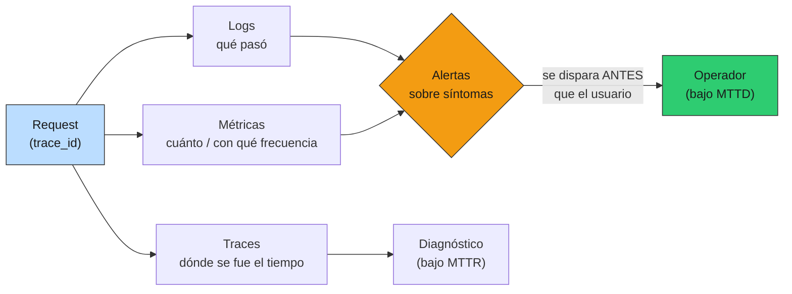

# 05 — Observabilidad y tracing

## No podés operar lo que no podés ver

El RAG de §2-§4 ya responde, cachea y versiona sus prompts. Pero en
producción hay una pregunta que ninguna de esas capas contesta: **¿cómo me
entero de que algo se rompió, y cómo lo diagnostico, antes de que el usuario
me lo cuente?** Esa es la disciplina de la observabilidad.

El notebook se observaba con `print()`. Producción necesita tres patas
distintas, cada una respondiendo una pregunta que las otras no:

| Pata | Pregunta que responde | Ejemplo |
|---|---|---|
| **Logs** | ¿Qué pasó exactamente en este evento? | "el request `req-014` falló con 503 del proveedor" |
| **Métricas** | ¿Cuánto y con qué frecuencia, agregado? | "p95 de latencia 1028ms; 7.7% de las llamadas al proveedor fallan" |
| **Traces** | ¿Dónde se fue el tiempo de este request? | "de 821ms, 812 los gastó el LLM" |

### Analogía: los indicadores de un programa público

Un programa público en ejecución sin indicadores es exactamente el RAG sin
observabilidad: funciona, hasta que no, y te enterás por el diario —es decir,
por el usuario afectado— en vez de por tu propio tablero. La métrica que
importa no es solo *cuánto tardás en arreglar* un problema (MTTR), sino
**cuánto tardás en enterarte** de que existe (MTTD, *Mean Time To Detect*).
Un MTTD alto significa que el daño ya ocurrió y se acumuló antes de que
miraras. Toda esta sección apunta a bajar el MTTD.



Las primitivas están en [`prod_lib.py`](../code/prod_lib.py) (`StructuredLogger`,
`MetricsRegistry`, `Tracer`/`Span`), hechas desde cero para entender qué hace
OpenTelemetry por debajo. La demo es [`code/05-tracing.py`](../code/05-tracing.py).

## Logs estructurados: consultables, no prosa

La diferencia entre `print` y un log estructurado no es estética, es
operativa. Un `print` es prosa:

```
Respondida query "iva" con gpt-4o-mini en 812ms ($0.000053)
```

¿Cómo contás cuántas usaron `gpt-4o-mini`? ¿Cómo filtrás las que costaron más
de un centavo? Con regex frágiles sobre texto libre. Un log estructurado es
un **evento con campos**:

```json
{"ts": 1780664809.4, "level": "INFO", "service": "rag-fiscal",
 "event": "query_served", "trace_id": "7f3a9c2e", "model": "gpt-4o-mini",
 "latency_ms": 812, "cost_usd": 5.3e-05, "from_cache": false,
 "prompt_ref": "rag-fiscal@v2"}
```

Ahora `event=query_served AND from_cache=false AND cost_usd>0.0001` es una
consulta, no una expresión regular. Y todos los campos que venimos
construyendo encajan: el `from_cache` de §4, el `prompt_ref` de §3, el
`trace_id` de §2. **La observabilidad cobra la inversión de haber
estructurado la respuesta desde el principio.**

El `trace_id` se inyecta **solo**, desde el contexto (`contextvars`): el
request lo fija una vez y todo lo que se emita debajo —en cualquier función,
sin pasarlo como argumento— lo hereda. Es lo que permite, ante un error,
recuperar **todos** los eventos de ese request con un solo filtro.

## Métricas: qué medir, en orden de prioridad

Los logs son por-evento; las métricas son agregados. Sobre una carga de 150
requests con 12 queries (con repetición) y un proveedor que falla ~12% de las
veces, la demo produce:

```
carga: 150 requests sobre 12 queries; 13 llegaron al proveedor (resto cache)

1. Latencia generación (ms): p50=664  p95=1028  p99=1149  (n=12 llamadas reales)
2. Costo (USD)     : total=$0.00051  medio=$0.000003/req
3. Tasa de fallos  : 1/13 = 7.7% de las llamadas al proveedor
4. Hit rate caché  : 137/150 = 91%
5. Calidad         : online-eval (§9) — no se infiere de logs
```

El orden no es casual; es la prioridad real de un servicio LLM:

1. **Latencia end-to-end p50/p95/p99.** Tres números, no uno: la media miente
   (la aplasta la masa de hits). El p99 es la experiencia del usuario
   desafortunado, y suele ser 10× el p50.
2. **Costo por request.** `in/out tokens × precio del modelo`. Es la línea más
   volátil del P&L (§10); medirla por request es la base para presupuestarla.
3. **Tasa de fallos.** Errores del proveedor, timeouts, rate limits. El insumo
   directo de §6 (reliability): no podés poner un circuit breaker sensato sin
   saber tu tasa de fallo base.
4. **Métricas de calidad.** Las da el online-eval (§9), no los logs: que un
   request no haya fallado no significa que la respuesta fuera correcta.

### La sutileza que evita un número degenerado

Mirá el detalle de la latencia: **se mide solo sobre las llamadas reales al
proveedor**, no sobre todos los requests. Si mezclás los 137 cache-hits de
~0ms con las 12 generaciones de ~700ms en un solo histograma, el p50 da 0 y
no le sirve a nadie. Es la misma lección de §4 (el caché mueve el p50, no el
p95): **separá "servido de caché" de "generado".** El p50=664ms es la
latencia de generación honesta; el "91% hit rate" cuenta la otra historia. Un
solo número mezclando ambas oculta las dos.

Lo mismo con la **tasa de fallos**: es `errores / llamadas al proveedor`
(1/13 = 7.7%), no `errores / requests` (1/150 = 0.7%). Como el caché
intercepta el 91% del tráfico antes de llegar al proveedor, medir sobre
requests totales diluiría la señal de que el proveedor está flaqueando.
**La fiabilidad del proveedor se mide sobre lo que efectivamente le pediste.**

> ⚠️ **Cardinalidad.** No metas labels de cardinalidad ilimitada (user_id,
> texto de la query) en las métricas: cada valor distinto crea una serie
> temporal nueva y hace explotar el backend. Lo ilimitado va en logs/traces;
> las métricas llevan labels acotados (modelo, status, endpoint).

## Tracing: dónde se fue el tiempo

Un trace sigue un request a través de todas sus etapas. El árbol de spans del
RAG, exportado a
[`examples/traces/trace-example.json`](../examples/traces/trace-example.json):

```
trace_id=trace-demo-001  (end-to-end 820.8ms)

  POST /query   820.8ms ▇▇▇▇▇▇▇▇▇▇▇▇▇▇▇▇▇▇▇▇  prompt_ref=rag-fiscal@v2
      retrieval       4.8ms ▇  k=3 retriever=hybrid-rrf
          bm25            1.2ms ▇
          dense           2.9ms ▇  embedding_cache=hit
      rerank          2.1ms ▇  candidates=20
      llm           812.4ms ▇▇▇▇▇▇▇▇▇▇▇▇▇▇▇▇▇▇▇▇  model=gpt-4o-mini from_cache=False
```

El trace deja **obvio** lo que un promedio esconde: el `llm` se come el 99%
del tiempo; retrieval y rerank son ruido. Esto cambia dónde invertís: optimizar
el retrieval acá no movería la aguja; cachear o acelerar el LLM, sí. Y el
contraste es inmediato: con `from_cache=true`, ese span baja a ~0 y la raíz se
desploma — es el ahorro de §4 visto desde el request.

Los spans **anidan** vía el mismo `contextvars`: `dense` está dentro de
`retrieval` porque se abrió mientras `retrieval` estaba en curso, sin pasar
referencias a mano. El `trace_id` del trace es el mismo `trace_id` que viaja
en el `RAGAnswer` (§2) y en cada línea de log: **un identificador une la
respuesta que vio el usuario, sus logs y su trace.** Cuando el usuario reporta
"esta respuesta estuvo mal", pegás el `trace_id` y tenés la película completa.

## El anti-patrón: dashboards bonitos sin alertas

El error más común no es no medir: es medir y **mirar**. Un dashboard hermoso
que nadie observa a las 3 AM no baja el MTTD ni un segundo. El valor de la
observabilidad se realiza en la **alerta**: algo que te despierta cuando un
síntoma cruza un umbral, **antes** que el usuario.

Reglas para alertas que sirven:

- **Alertá sobre síntomas, no sobre causas.** "p99 de latencia > 3s por 5
  min" o "tasa de error > 5%" o "quema de presupuesto > $X/hora" (§10). No
  "uso de CPU al 80%" — al usuario no le duele tu CPU, le duele la latencia.
- **Pocas y accionables.** Una alerta que se dispara 20 veces al día y nadie
  atiende es ruido que entrena al equipo a ignorar alertas (incluida la que
  importa).
- **Con runbook.** Cada alerta apunta a "qué mirar primero" (§12, incidentes).

## Estado del arte (2026)

| Aspecto | Estado | Detalle |
|---|---|---|
| OpenTelemetry como estándar | ✅ Consolidado | Unifica logs+métricas+traces; el lock-in de hace años se diluyó. En prod, emitís a OTel y elegís backend después |
| Logging estructurado (JSON) | ✅ Estándar | `print` en prod es deuda; structlog / logging con formato JSON es el default |
| Backends de traces | 🟢 Variado | Tempo/Jaeger (self-host), Honeycomb/Datadog (SaaS). Para empezar: logs + DuckDB sobre los JSON alcanza |
| Métricas pull (Prometheus) | ✅ Estándar | El `snapshot()` que armamos es lo que un scraper lee; el formato real es texto Prometheus |
| Cardinalidad como footgun | 🔴 Trampa recurrente | Meter user_id como label de métrica tumba el backend; es el error #1 de quien arranca |
| Correlación por trace_id | 🟢 Best practice | Un id que cruza logs/métricas/traces; lo construimos desde §2 |
| Auto-instrumentación de FastAPI | 🟡 Cómoda | `opentelemetry-instrumentation-fastapi` cablea spans HTTP solo; útil, pero entender el modelo (esta sección) viene primero |

La decisión build-vs-buy es clara: las primitivas de acá son para **entender**
el modelo; en producción no reimplementás un tracer, emitís a OpenTelemetry y
dejás que un backend maduro haga el almacenamiento, las queries y las alertas.
Lo que no podés delegar es **qué** medir y **sobre qué** alertar — eso es
criterio, no herramienta.

## Lo que viene en las próximas secciones

- **§6 reliability**: la tasa de fallos que medimos acá es el insumo para
  calibrar retries y circuit breakers; sin ese número base, se ponen a ojo.
- **§9 online evals**: el `trace_id` es la primitiva del sampling — tomás un %
  de los traces, recuperás respuesta + sources, los pasás al judge. La pata
  "calidad" que los logs no dan, la cierra ahí.
- **§10 costo**: la métrica de costo por request se agrega en presupuesto por
  feature y alertas de quema por hora.
- **§12 incidentes**: los traces son lo que mirás en los primeros 5 minutos de
  un incidente; el MTTD que bajamos acá es lo que te da margen para el MTTR.

## Conexiones

- **§2 arquitectura**: el `trace_id` del `RAGAnswer` y el response shape
  estructurado son la base sobre la que se monta todo esto; observabilidad es
  el cobro de esa inversión.
- **§3 prompts**: el `prompt_ref` es una dimensión de primer orden — latencia,
  costo y errores *por versión de prompt*.
- **§4 caching**: el `from_cache` separa las métricas de generación de las de
  servido; sin esa separación, p50 y tasa de fallos quedan diluidos.
- **01-evals §8 (estadística)**: p50/p95/p99 con la misma disciplina de
  distribución (no resumir con la media) que esa sección enseña; el SLO mensual
  se reporta con IC por bootstrap sobre estas series.
- **01-evals §11 (online evals)**: la pata "calidad" que las métricas de
  sistema no capturan; el `trace_id` es lo que conecta producción con el golden.
