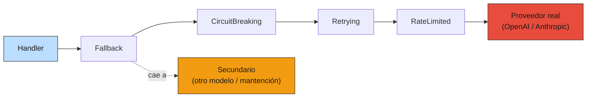
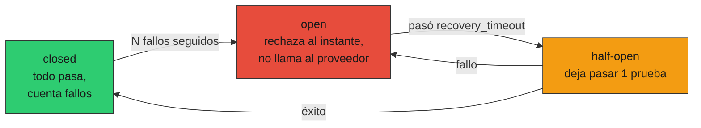

# 06 — Reliability: rate limit, retries, circuit breakers

## El modelo mental: la API del LLM es red externa flaky

Hasta acá el RAG asumió, implícitamente, que la llamada al LLM siempre
funciona. En el notebook eso es casi cierto. En producción es falso: la API
del proveedor es un **recurso compartido con SLA estadístico**, no un servicio
infalible. Va a devolver 429 cuando hay congestión, 503 cuando tiene un
incidente, y a veces simplemente va a colgar. Tu cliente tiene que tratarla
como lo que es: **red externa que falla**, igual que tratarías una llamada a
cualquier API de terceros.

La pregunta de esta sección: cuando —no si— el proveedor falle, ¿tu sistema
explota con un 500 de cara al usuario, o degrada con gracia? La medición de
§5 te dio la tasa de fallo base; acá la usamos para construir las defensas.

### Analogía: el programa que depende de un contratista externo

Un programa público que depende de un proveedor externo (un sistema de pago,
un contratista de logística) no asume que el contratista nunca falla: escribe
cláusulas de penalización, tiene un proveedor de respaldo, y un protocolo para
cuando el principal se cae. Asumir 100% de uptime de algo que no controlás no
es optimismo, es negligencia. El proveedor de LLM es ese contratista: no
controlás su SLA, así que construís las contingencias de tu lado.

## Cuatro capas, cada una un `LLMClient` componible

El pago del patrón puertos-y-adaptadores de §2 se cobra acá. Cada defensa es
un `LLMClient` que envuelve a otro, y se **apilan**:



```python
client = FallbackLLMClient(
    CircuitBreakingLLMClient(
        RetryingLLMClient(
            RateLimitedLLMClient(primary, bucket)
        ), breaker
    ), secondary
)
```

El handler ve un `LLMClient` y no sabe nada de esto. Cada capa hace una sola
cosa. Las primitivas están en [`prod_lib.py`](../code/prod_lib.py); la demo en
[`code/06-reliability.py`](../code/06-reliability.py).

## Capa 1 — Token bucket: autolimitarse antes del 429

El `TokenBucket` se rellena a `rate` tokens/segundo hasta `capacity`; cada
request consume uno. Cuando se vacía, el cliente se frena **él mismo**:

```
capacity=5, rate=2/s. Ráfaga de 8 requests en t=0:
  [✓ ✓ ✓ ✓ ✓ ✗ ✗ ✗]  → 5 pasan, 3 se frenan
tras +1s (se reponen 2 tokens): [✓ ✓ ✗] → 2 pasan
```

¿Por qué limitarse uno mismo si el proveedor ya devuelve 429? Porque **frenar
del lado del cliente es barato; que te frene el proveedor es caro**. Un 429
implica que ya gastaste el round-trip, suele venir con un `Retry-After`
forzado, y si lo repetís el proveedor puede endurecer tus límites o banearte.
El bucket reparte el tráfico parejo y te mantiene **debajo** del límite, donde
nunca ves un 429. Es el mismo token-bucket que usan los routers para QoS,
aplicado a tu cuota de API.

## Capa 2 — Retries: backoff exponencial + jitter

Lo transitorio (un 503 puntual, un timeout) muchas veces se resuelve solo: el
arreglo es reintentar. Pero **cómo** reintentás importa:

```
sin jitter:  delays = [0.5, 1.0, 2.0]   (base · 2^intento — exponencial)
con jitter:  seed=1 → [0.067, 0.847, 1.528]
             seed=2 → [0.478, 0.948, 0.113]
```

- **Backoff exponencial**: cada reintento espera el doble. Si el proveedor está
  saturado, martillarlo cada 100ms lo empeora; espaciar los reintentos le da
  aire para recuperarse.
- **Jitter** (full jitter: delay uniforme en `[0, tope]`): es la parte que la
  gente olvida y la más importante a escala. Sin jitter, mil clientes que
  cayeron **al mismo tiempo** reintentan **al mismo tiempo**: una manada
  (*thundering herd*) que vuelve a tumbar al proveedor justo cuando se
  recuperaba. El jitter los desincroniza.

Y la regla de **qué** reintentar:

| Error | ¿Reintentar? | Por qué |
|---|---|---|
| 503, timeout, conexión cortada (`TransientLLMError`) | **Sí** | Transitorio; el reintento suele funcionar |
| 429 (`RateLimitLLMError`) | **Sí**, respetando `Retry-After` | El proveedor te dice cuándo volver |
| 400, 401, 422 (`ClientLLMError`) | **No** | El request está mal; reintentarlo igual es quemar cuota |

```
un 4xx del cliente NO se reintenta:
  ✗ relanzado tras 1 intento (sin reintentos)
```

Reintentar un 400 es el anti-patrón: el request es inválido, va a fallar las
tres veces, y solo gastás cuota y latencia.

> ⚠️ **Idempotencia.** Reintentar es seguro porque una *completion* es de solo
> lectura: pedirla dos veces no tiene efectos colaterales (más allá del costo).
> Si el LLM dispara *tools* con efectos (crear un registro, enviar un correo),
> el reintento puede duplicar la acción. Ahí hace falta una clave de
> idempotencia, no reintento ciego.

## Capa 3 — Circuit breaker: dejar de pegarle al que está caído

Reintentar está bien para un blip. Pero si el proveedor está **caído de
verdad** (un incidente de 20 minutos), reintentar cada request 3 veces es
contraproducente: martillás a un servicio que intenta levantarse y colgás tus
propios workers esperando timeouts. El circuit breaker corta esa trampa con
tres estados:



Con el proveedor caído (`failure_threshold=3`, `recovery_timeout=2s`):

```
req 0 (t=0.3s)  estado=closed     fallo del proveedor (contado)
req 1 (t=0.6s)  estado=closed     fallo del proveedor (contado)
req 2 (t=0.9s)  estado=open       fallo del proveedor (contado)
req 3 (t=1.2s)  estado=open       RECHAZADO sin llamar (circuito abierto)
req 4 (t=1.5s)  estado=open       RECHAZADO sin llamar (circuito abierto)
req 5 (t=1.8s)  estado=open       RECHAZADO sin llamar (circuito abierto)

llamadas REALES al proveedor caído: 3 (no 6)
```

Tras 3 fallos el breaker **abre** y los requests siguientes se rechazan al
instante —`CircuitOpenError`, sin tocar al proveedor—. Pasado el
`recovery_timeout`, pasa a **half-open** y deja pasar **una** prueba: si va
bien, cierra; si falla, reabre. Es lo que evita oscilar entre abierto y
cerrado mientras el proveedor sigue inestable.

## Capa 4 — Fallback: degradar visible en vez de explotar

Cuando todo lo anterior se agotó —el proveedor primario falla o el circuito
está abierto—, la última capa decide qué ve el usuario. Las opciones, de mejor
a peor experiencia:

1. **Modelo secundario** (otro proveedor): GPT-4o-mini si Claude está caído.
   El usuario ni se entera; quizá baja un poco la calidad.
2. **Respuesta cacheada** (§4): servir lo último bueno, aunque algo rancio, es
   mejor que nada para muchas queries.
3. **Degradación visible**: "estamos con alta demanda, intentá en unos
   minutos". Honesto y mucho mejor que un 500 sin explicación.

El `FallbackLLMClient` cae al secundario ante cualquier `LLMError`. La pila
completa, con el primario caído 10 de 20 requests:

```
         configuración | prim.calls | servido prim/sec | errores usuario
-----------------------+------------+------------------+----------------
      Retry + Fallback |         40 |     10/10        |        0
 Retry+Breaker+Fallback |         20 |      8/12        |        0
```

Dos lecturas:

- **Errores de cara al usuario: 0** en ambas configuraciones. El fallback al
  secundario (`claude-haiku`) atrapa la caída: el usuario recibe una respuesta,
  no un 500. Esto es lo que compra el patrón.
- **`prim.calls`: 40 sin breaker, 20 con breaker.** Sin breaker, cada request
  durante la caída reintenta 3× contra el proveedor muerto (10 × 3 = 30 golpes
  inútiles + 10 sanos). Con breaker, tras abrirse deja de llamarlo: la mitad de
  golpes. Eso es **menos daño al proveedor** que se recupera, y respuestas más
  rápidas (el fail-fast del circuito abierto es instantáneo, no espera
  timeouts).

El costo del breaker se ve en el `8/12` vs `10/12`: un par de requests se
sirvieron del secundario aun después de que el primario se recuperó (el
circuito tardó en cerrar). Es la conservadora-por-diseño: prefiere seguir en
el secundario un rato más antes que reabrir prematuro.

## Por qué ese orden de apilado

`Fallback(CircuitBreaking(Retrying(RateLimited(primary))))` no es arbitrario:

- **Retry adentro del breaker**: un blip transitorio se reintenta dentro de una
  llamada lógica; solo si la llamada **completa** (con sus reintentos) falla, el
  breaker cuenta un fallo. Al revés, el breaker se abriría por blips que el
  retry habría resuelto.
- **Breaker adentro del fallback**: cuando el circuito abre, el fallback lo ve
  como un error y cae al secundario al instante. El `CircuitOpenError` es la
  señal "ni intentes el primario, andá directo al plan B".
- **Rate limit lo más adentro**: limita las llamadas al proveedor real, que es
  el recurso escaso.

## Calibración: los umbrales salen de los datos, no del aire

`failure_threshold`, `recovery_timeout`, `rate`, `max_retries` no se eligen a
ojo: salen de lo que §5 mide.

- El `rate` del bucket = tu cuota real del proveedor con margen.
- El `failure_threshold` se pone sobre la **tasa de fallo base**: si tu
  proveedor normalmente falla 1%, 3 fallos seguidos es señal real; si falla
  8% (como medimos en §5), 3 seguidos pasan seguido y abrirías el circuito sin
  motivo — subí el umbral.
- Y el que falta: **timeout**. El anti-patrón de §2 ("sin timeout en la llamada
  al LLM") se cierra acá: sin timeout, una llamada lenta cuelga el worker
  entero. El timeout va en el cliente HTTP, y un timeout cuenta como
  `TransientLLMError` (retryable).

## Estado del arte (2026)

| Aspecto | Estado | Detalle |
|---|---|---|
| Retry con backoff exponencial + jitter | ✅ Estándar | Full jitter (AWS) es el default; sin jitter es un bug a escala |
| Circuit breaker | 🟢 Best practice madura | Viene de Hystrix/Netflix; sigue vigente, hoy en libs livianas |
| Token bucket de cliente | 🟢 Recomendado | Muchos SDKs lo traen; entenderlo evita sorpresas con la cuota |
| Fallback multi-proveedor | 🟢 En auge | LiteLLM/gateways lo automatizan; el patrón es el de acá |
| Cache como fallback | 🟡 Subutilizado | Servir lo cacheado ante caída es barato y casi nadie lo cablea |
| Idempotencia en tool-calls | 🟡 Trampa nueva | Con agentes que ejecutan acciones, el retry ciego duplica efectos |
| Gateways de reliability (LiteLLM, Portkey) | 🟢 Build-vs-buy | Dan estas cuatro capas listas; valen cuando hay 3+ proveedores |

La decisión build-vs-buy: con un proveedor y un equipo chico, estas ~150
líneas son transparentes y suficientes. Un gateway (LiteLLM, Portkey) se paga
solo cuando manejás varios proveedores y querés routing+fallback+métricas sin
mantenerlo vos. Las primitivas no cambian; cambia quién las opera.

## Lo que viene en las próximas secciones

- **§7 despliegue**: el timeout, el `rate` y los umbrales pasan a
  `pydantic-settings` (config por entorno), no hardcodeados.
- **§8 versionado de modelos**: el `FallbackLLMClient` y el shadow/canary son
  la misma familia de wrappers; el secundario del fallback puede ser el
  candidato de un canary.
- **§10 costo**: el fallback a un modelo más barato es también una palanca de
  costo, no solo de disponibilidad.
- **§12 incidentes**: "proveedor caído" es el primer modo de falla del runbook;
  estas capas son lo que convierte un incidente en un no-evento.

## Conexiones

- **§2 arquitectura**: los wrappers se apilan sobre el adaptador del proveedor,
  exactamente como `ResponseCache` (§4); el handler sigue viendo un `LLMClient`.
- **§4 caching**: el `ResponseCache` es un fallback de lujo —servir lo cacheado
  cuando el LLM cae— combinable con el `FallbackLLMClient`.
- **§5 observabilidad**: la tasa de fallos medida ahí calibra estos umbrales;
  y cada apertura de circuito o fallback debería emitir un log/métrica.
- **01-evals §8 (estadística)**: "el proveedor falla 8%" es una proporción con
  su intervalo de confianza; calibrar umbrales sobre el punto sin el IC es el
  mismo error de leer ruido como señal.
