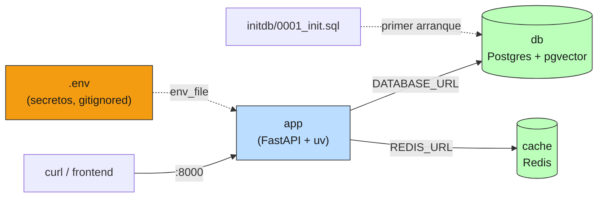

# 07 — Despliegue y configuración

## De `uv run python` a un servicio reproducible

Hasta acá el servicio se levantaba con `uv run python 02-fastapi-rag.py`, con la
config viviendo en el `.env` de tu máquina y los índices en memoria. Eso corre
en tu laptop. "Desplegarlo" significa que corra **igual** en otra máquina, sin
vos presente, con la config que ese entorno necesita, sin que un secreto se
filtre, y de forma reversible si algo sale mal. Esta sección es ese empaque.

### Analogía: institucionalizar un piloto

Un script que corre en tu máquina es un **plan piloto**: funciona porque vos
estás ahí ajustándolo. Desplegarlo es **institucionalizarlo**: que el programa
corra con su presupuesto, sus reglas escritas y su personal, reproducible sin
depender de quién lo echó a andar. La diferencia entre un piloto exitoso y una
política que escala es exactamente la diferencia entre `python script.py` y un
contenedor con su config externalizada, sus secretos en un vault y sus
migraciones versionadas.

## Config por entorno: la regla de los 12 factores

El principio: **la config es entrada del entorno, no constantes en el código.**
El mismo artefacto (la imagen) corre en dev, staging y prod; lo que cambia es el
entorno que lo alimenta. `ServiceSettings` (en [`prod_lib.py`](../code/prod_lib.py))
centraliza **todos** los knobs que las secciones anteriores fueron acumulando:

```python
class ServiceSettings(BaseSettings):
    llm_model: str = "gpt-4o-mini"          # §2
    openai_api_key: SecretStr | None = None
    k_default: int = Field(3, ge=1, le=20)  # §2, validado
    semantic_threshold: float = Field(0.7, ge=0.0, le=1.0)   # §4
    max_retries: int = Field(3, ge=0, le=10)                 # §6
    llm_timeout_s: float = Field(30.0, gt=0)                 # cierra el "sin timeout" de §2
    ...
```

El anti-patrón que reemplaza:

```python
api_key = os.environ["OPENAI_API_KEY"]    # explota en el primer request si falta
k = int(os.environ.get("K", "3"))          # parsing a mano, sin validación, regado
```

Con `ServiceSettings`, la precedencia es **argumentos > variables de entorno >
`.env` > defaults**, y la validación corre **al arrancar**:

```
intento de arrancar con k_default=999 (fuera de rango 1..20):
  ✗ ValidationError: k_default → Input should be less than or equal to 20
```

Un valor inválido tira el proceso **al startup**, con un mensaje claro, no a las
3 AM cuando un request toca esa rama. Es la misma idea de "validación en el
borde" de §2 (Pydantic en el request), aplicada a la config.

## Secretos: nunca en logs, en traces, ni en el repo

Tres lugares donde un secreto se filtra sin que lo notes: un `print(settings)`,
un stack trace que incluye variables locales, y un `git commit` del `.env`. Las
defensas:

- **Tipo `SecretStr`**: su `repr` es `**********`. Un `print`, un log o un stack
  trace nunca muestran el valor.
  ```
  repr(openai_api_key) = SecretStr('**********')
  ```
- **`.env` en `.gitignore`**: solo se commitea `.env.example` (plantilla con
  placeholders). El `docker-compose.yml` toma las credenciales de `.env`, no las
  tiene inline — el archivo versionado no contiene un solo secreto.
- **Verificación automática** (`scan_for_secrets`): un escáner de patrones
  (claves `sk-…`, URLs con password, tokens) que corre en CI sobre diffs, dumps
  de config y logs de ejemplo, y **falla el build** si encuentra algo:
  ```
  scan(public_dict): LIMPIO ✓
  scan(log naive): 2 secretos detectados → CI debería FALLAR
    redactado: ...OPENAI_API_KEY=***REDACTED*** a postgresql://***:***@db:5432/x
  ```
- **Defensa en profundidad en el logger**: el `StructuredLogger` de §5 ahora
  redacta por defecto (`redact=True`). Aunque alguien loguee un campo con un key
  por error, no llega al archivo:
  ```
  StructuredLogger(redact=True): ¿se filtró el key al log? False
  ```

El secreto vive en un **secret manager** (variables de entorno del PaaS, o un
vault) que lo inyecta en runtime. Nunca toca el control de versiones.

## El contenedor minimalista

El [`Dockerfile`](../examples/deploy/Dockerfile) empaca el servicio en una
imagen reproducible. Las decisiones que importan:

- **uv adentro**, el mismo de local: deps reproducibles desde `uv.lock`, sin
  sorpresas "en mi máquina andaba".
- **Capas ordenadas por volatilidad**: primero `pyproject.toml` + `uv.lock` y
  `uv sync` (capa que se reusa mientras las deps no cambien), después el código.
  Un cambio de código no reinstala las dependencias.
- **Usuario no-root**: si el proceso se compromete, el atacante no es root del
  contenedor.
- **Healthcheck** contra el `/healthz` de §2: el orquestador sabe si el proceso
  está vivo.

## Nivel B: el stack completo en tu máquina

El [`docker-compose.yml`](../examples/deploy/docker-compose.yml) levanta los tres
componentes del escenario chileno típico, sin cuentas cloud:



```bash
cp .env.example .env      # completá OPENAI_API_KEY
docker compose up --build
```

`app` espera (`depends_on` + `healthcheck`) a que Postgres acepte conexiones
antes de arrancar — el patrón readiness de §2 aplicado a las dependencias. El
nivel B tiene el principio completo (servicio + estado externo) sin pedir una
tarjeta de crédito.

## Migraciones de schema: alembic y el plan de rollback

El índice en memoria de §2 funciona para 234 chunks; a escala, el corpus vive en
Postgres+pgvector. Cambiar ese schema en producción —agregar una columna,
cambiar un índice— se hace con **migraciones versionadas**, no con SQL a mano.

Cada migración alembic ([ejemplo](../examples/deploy/alembic/versions/0001_init.py))
tiene dos mitades:

```python
def upgrade():    # aplicar: CREATE EXTENSION vector; CREATE TABLE chunks ...
def downgrade():  # revertir: DROP TABLE chunks; DROP INDEX ...
```

```bash
alembic upgrade head     # aplica las pendientes
alembic downgrade -1     # rollback de la última
```

El `downgrade()` **es** el plan de rollback. Sin él, "la migración rompió
producción" se resuelve restaurando un backup a mano, con downtime. Con él, es
un comando determinista. Para el nivel B local, el atajo es el
[`initdb/0001_init.sql`](../examples/deploy/initdb/0001_init.sql) que Postgres
corre al crear el volumen; crea el mismo schema, sin el versionado.

> ⚠️ El `downgrade` de pgvector no dropea la extensión `vector`: podría usarla
> otra tabla. Las migraciones destructivas (drop de columna con datos) necesitan
> un plan de dos pasos: primero dejar de escribir, después dropear en una
> migración posterior, para que el rollback intermedio no pierda datos.

## Dónde desplegar (escenario chileno)

| Opción | Cuándo | Nota |
|---|---|---|
| **Fly.io / Railway** | Default para SaaS chico-mediano | Deploy desde el Dockerfile, secrets manager incluido, escala simple |
| **VPS (Hetzner, DigitalOcean)** | Querés control y costo fijo | Más trabajo de ops; docker-compose en una VM alcanza mucho tiempo |
| **Supabase** (ya lo usás) | El Postgres+pgvector ya vive ahí | Edge Functions para lógica liviana; el servicio Python va aparte |
| **Kubernetes** | **Casi nunca** a esta escala | Ver abajo |

### Por qué K8s es over-engineering para el 95%

Kubernetes resuelve el problema de **decenas de servicios y un equipo de
plataforma**. Para un SaaS chileno de 1-3 personas y miles de usuarios, agrega un
plano de control, YAML por capas, y un costo operativo permanente que no paga
valor. Una sola instancia (o dos para redundancia) detrás de un load balancer
del PaaS atiende ese tráfico sin sudar. K8s antes de necesitarlo es complejidad
por miedo, no por escala. La señal de que **sí** lo necesitás: cuando coordinar
los despliegues de tus servicios a mano se volvió el cuello de botella — y eso
llega mucho después de los primeros miles de usuarios.

## Estado del arte (2026)

| Aspecto | Estado | Detalle |
|---|---|---|
| Config por entorno (12-factor) | ✅ Estándar | `pydantic-settings` es el default en Python; tipado + validación gratis |
| Secretos en vault, no en repo | ✅ No negociable | Scanners (gitleaks, trufflehog) en CI son práctica mínima |
| `SecretStr` / redacción en logs | 🟢 Best practice | Defensa en profundidad; barato de cablear |
| uv en el contenedor | 🟢 En auge | Builds reproducibles y rápidos; reemplaza pip/poetry en imágenes nuevas |
| PaaS (Fly/Railway) sobre K8s | 🟢 Consenso para equipos chicos | El péndulo volvió de "k8s para todo" a "k8s cuando hace falta" |
| Migraciones versionadas (alembic) | ✅ Estándar | El `downgrade` como plan de rollback es lo que falta en muchos proyectos |
| pgvector como vector store | 🟢 Maduro | "Un Postgres más" en vez de una base vectorial aparte; suficiente a esta escala |

## Lo que viene en las próximas secciones

- **§8 versionado de modelos**: `llm_model` ya es config (no constante); shadow y
  canary cambian ese valor para una fracción del tráfico sin redeploy.
- **§10 costo**: la config de modelo y caché es lo que se mueve para optimizar el
  costo por entorno; el presupuesto se setea por variable de entorno.
- **§12 incidentes**: el rollback de una migración y el redeploy de una versión
  anterior son dos de las acciones del runbook.

## Conexiones

- **§2 arquitectura**: el `lifespan`, el `/healthz` y el `/readyz` son lo que el
  Dockerfile y el compose usan para arrancar y chequear; el `_serve` ahora lee
  `HOST`/`PORT` del entorno para escuchar en `0.0.0.0` dentro del contenedor.
- **§4/§5/§6**: todos sus knobs (TTL de caché, umbral semántico, rate, umbral del
  breaker, nivel de log) viven ahora en `ServiceSettings`, configurables por
  entorno sin tocar código.
- **02-retrieval §7 (metadata)**: el schema de `chunks` con `doc_id` y `metadata`
  JSONB es lo que habilita el filtrado estructurado de esa sección en pgvector.
- **01-evals §9 (CI)**: el `scan_for_secrets` es un check de CI más, en la misma
  familia que los tests de regresión que esa sección monta.
