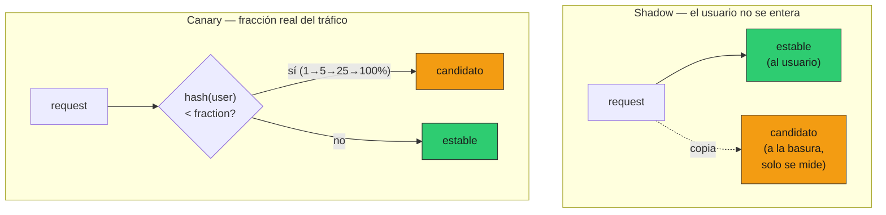

# 08 — Versionado de modelos

## El modelo es configuración, no una constante

Un `model="gpt-4o"` hardcodeado en el handler es una bomba de tiempo: el día que
quieras probar un modelo nuevo —más barato, más capaz, o porque el proveedor
retira el que usás— tenés que tocar código, redesplegar, y cruzar los dedos para
que la calidad no caiga. §7 ya hizo del modelo una variable de entorno
(`ServiceSettings.llm_model`). Esta sección resuelve la otra mitad: **cómo
cambiar ese valor sin susto**, llevando una fracción controlada del tráfico al
modelo nuevo y midiendo antes de comprometerse.

### Analogía: pilotear un cambio de política, no decretarlo

Cambiar el modelo para el 100% del tráfico de un día para el otro es como
cambiar un parámetro de una política pública por decreto y a ciegas: si estaba
mal calibrado, el daño es masivo e inmediato. Lo que se hace en serio es
**pilotear**: correr el cambio en paralelo (sin afectar a nadie) para estimar su
efecto, después aplicarlo a una región chica, medir, y recién ahí escalar — con
la capacidad de **revertir** si los indicadores caen. Shadow es la corrida en
paralelo; canary es el piloto gradual con botón de pánico.

## Tres patrones, dos wrappers

Como `Fallback` en §6, son `LLMClient` que envuelven a otros (en
[`prod_lib.py`](../code/prod_lib.py)). El caso de la demo: evaluar si se puede
migrar de `gpt-4o` (estable, caro) a `gpt-4o-mini` (candidato, ~16× más barato)
sin perder calidad.



| Patrón | Riesgo al usuario | Costo | Qué mide | Cuándo |
|---|---|---|---|---|
| **Shadow** | **Cero** (no ve al candidato) | 2× (dos llamadas) | Acuerdo, costo, latencia — offline | Primer filtro: ¿vale la pena siquiera probarlo? |
| **A/B** | Medio (50% lo ve) | 1× | Métricas online por variante | Comparar dos opciones en serio, con tráfico real |
| **Canary** | Bajo y creciente | 1× | Lo mismo, escalando | Hacer el cambio definitivo de forma segura |

## Shadow: medir sin exponer

El `ShadowLLMClient` sirve el estable al usuario y corre el candidato **en
sombra**: la respuesta del candidato no se le devuelve a nadie, solo se compara.
Si el candidato falla, el usuario ni se entera.

```
el usuario SIEMPRE recibió: {'gpt-4o'}  (cero riesgo)
acuerdo candidato↔estable : 75%
costo (la ventana shadow) : estable $0.01680  candidato $0.00101  → 94% más barato
latencia media            : estable 1100ms  candidato 650ms
```

El shadow contesta "¿vale la pena probar el candidato con tráfico real?" sin
arriesgar a un solo usuario. Acá: 94% más barato, casi la mitad de latencia, y
75% de acuerdo con el estable. Ese 75% es la pregunta abierta —¿el 25% que
difiere es peor, o solo distinto?— que el shadow **no** puede responder solo
(no sabe cuál respuesta es "mejor"). Para eso hace falta llevar tráfico real y
medir calidad online. Pero el shadow ya filtró: si el candidato fuera más caro y
peor, lo descartabas acá, gratis.

> El costo del shadow es 2× (dos llamadas por request). Por eso se corre sobre
> una ventana acotada o un `sample` del tráfico, no de forma permanente.

## Canary: rampa con ruteo sticky y botón de pánico

El `CanaryLLMClient` manda una `fraction` del tráfico al candidato. La rampa
típica es **1% → 5% → 25% → 100%**, midiendo en cada escalón. La demo confirma
que el share observado sigue la fracción:

```
 fraction |  share candidato
----------+-----------------
     0.01 |           0.010
     0.05 |           0.052
     0.25 |           0.244
     1.00 |           1.000
```

Dos propiedades no negociables:

- **Ruteo sticky por usuario.** El destino se decide por `hash(clave_de_usuario)`,
  no por moneda al aire por request. Así un mismo usuario ve **siempre la misma
  variante** y no parpadea entre dos modelos respuesta a respuesta (lo que sería
  desconcertante y arruinaría cualquier medición por usuario):
  ```
  stickiness 'ana':  {'gpt-4o-mini'}   → estable
  stickiness 'beto': {'gpt-4o'}        → estable
  ```
  En el código, la clave por defecto es el `trace_id` (§5); para stickiness
  por usuario, se keya en el `user_id`.
- **Rollback automático.** Con `max_error_rate`, el canary se auto-revierte si el
  candidato se degrada. La demo, con un candidato que falla 50%:
  ```
  rollback disparó en la request ~62  (fraction → 0.0)
  al rollback: routed candidato=20, errores candidato=12   (60% > umbral 20%)
  errores de usuario totales: 12 — acotados por el rollback
  ```
  La guardia limita el daño a los pocos requests que tocó antes de juntar
  evidencia suficiente (`min_calls`), y después manda todo al estable. Sin ella,
  el 25% del tráfico habría seguido fallando indefinidamente.

**A/B es este mismo mecanismo con `fraction` fija** (típicamente 0.5): mitad y
mitad, comparando métricas online por variante. Canary es A/B con la fracción en
rampa y la guardia de rollback.

## El criterio de promoción/rollback es estadístico

El número que el canary mide —tasa de error, costo, una métrica de calidad de
01-evals §11— es una **muestra**. Decidir "el candidato es peor" con el primer
fallo, o "es mejor" con los primeros 10 requests que salieron bien, es leer ruido
como señal. La promoción de un escalón al siguiente (y el rollback) se decide con
el mismo aparato de **01-evals §8**: el delta de la métrica entre variantes con
su **intervalo de confianza por bootstrap**. Si el IC del delta excluye 0 a favor
del candidato, promovés; si lo excluye en contra, revertís; si cruza 0, juntás
más muestra antes de decidir. El `max_error_rate` de la demo es una versión
simplificada (umbral fijo sobre `min_calls`); la versión seria usa el IC.

## El problema del versionado del proveedor

Hay una capa de versionado que **no controlás**: la del proveedor. "`gpt-4o`" o
"`claude-sonnet-4-6`" son alias que pueden **cambiar bajo tus pies** — el
proveedor actualiza el modelo detrás del mismo nombre, y tu sistema se comporta
distinto sin que vos hayas tocado nada. Las defensas:

- **Pinning a snapshots.** Cuando el proveedor ofrece nombres con fecha
  (snapshots inmutables, p. ej. un sufijo de versión datado), apuntá a ése en
  producción, no al alias flotante. Así "tu modelo" no cambia hasta que vos lo
  cambiás —con shadow/canary—.
- **Detección de drift.** Aunque pinnees, conviene un canario permanente: un
  puñado de queries golden que corren a diario y alertan si la salida cambió
  (01-evals §9). Es lo que te avisa de un cambio del proveedor antes que el
  usuario.
- **Plan ante retiro.** Los proveedores **deprecan** modelos. Tu config (§7)
  debe permitir cambiar el modelo por variable de entorno, y tu `FallbackLLMClient`
  (§6) debe tener un secundario vivo: si el primario se retira de un día para
  otro, el fallback te da aire mientras migrás ordenadamente.

> ⚠️ No verificado: los identificadores exactos de snapshot datado varían por
> proveedor y momento; consultá la doc vigente. El patrón —pinear el inmutable,
> no el alias— es lo estable.

## La receta de migración

Juntando todo, migrar de un modelo a otro (el ejemplo canónico: subir de una
versión de modelo a la siguiente, o bajar a una más barata) se ve así:

1. **Shadow** una ventana: ¿el candidato es competitivo en costo/latencia y
   razonablemente de acuerdo con el estable? Si no, se descarta gratis.
2. **Golden offline**: corré el candidato contra el golden de 01-evals con
   LLM-judge (§7 de evals); delta con IC. Si el IC dice "no peor", seguí.
3. **Canary 1% → 5% → 25% → 100%**, midiendo calidad/costo/errores online en cada
   escalón, con rollback automático armado. Cada promoción es una decisión con IC.
4. **Pin** el snapshot del modelo nuevo en la config y archivá el viejo como
   secundario del fallback por un tiempo.

## Estado del arte (2026)

| Aspecto | Estado | Detalle |
|---|---|---|
| Modelo como config, no constante | ✅ Estándar | Hardcodearlo es deuda; vive en settings (§7) |
| Shadow para evaluar candidatos | 🟢 Best practice | Filtro barato y sin riesgo; subutilizado por el costo 2× |
| Canary con rollback automático | 🟢 Maduro | Viene del despliegue de software; aplica igual a modelos |
| Ruteo sticky por usuario | 🟢 Necesario | Sin stickiness, las métricas por usuario son ruido |
| Pinning de snapshots del proveedor | 🟢 Recomendado | El alias flotante es una fuente real de regresiones silenciosas |
| Decisión por IC, no por punto | 🟢 Lo correcto | Promover/revertir por el primer dato es el error clásico |
| Gateways (LiteLLM, etc.) con routing | 🟢 Build-vs-buy | Automatizan shadow/canary; valen con varios proveedores |

## Lo que viene en las próximas secciones

- **§9 online evals**: es la pata de **calidad** que el shadow y el canary
  necesitan para decidir "mejor" y no solo "más barato"; cierra el loop con el
  golden.
- **§10 costo**: la migración a un modelo más barato (como la de la demo) es una
  palanca de costo de primer orden; ahí la cuantificamos con tu corpus.
- **§12 incidentes**: "un cambio de modelo trajo una regresión" es un modo de
  falla del runbook; el rollback del canary es su mitigación.

## Conexiones

- **§6 reliability**: `Shadow`/`Canary` son de la misma familia de wrappers que
  `Fallback`; el secundario de un fallback puede ser el candidato de un canary.
- **§7 despliegue**: `llm_model` es config; shadow/canary cambian el modelo para
  una fracción del tráfico **sin redeploy**.
- **§5 observabilidad**: el ruteo sticky usa el `trace_id`; cada decisión de
  ruteo y cada rollback debe emitir un log/métrica con la variante servida.
- **01-evals §7 (judge) y §8 (estadística)**: el judge da la métrica de calidad
  del candidato; el IC por bootstrap es lo que convierte "parece mejor" en una
  decisión de promoción defendible.
- **01-evals §9 (regresiones/CI)**: el canario permanente de drift es un test de
  regresión que corre en producción, no solo en CI.
