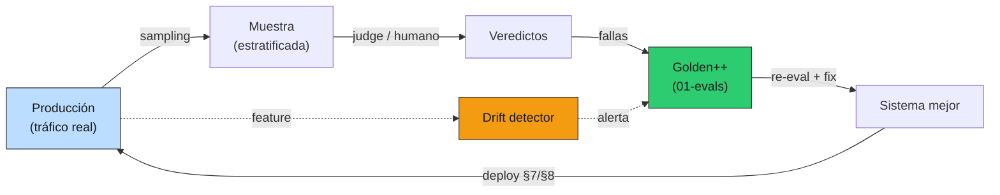

# 09 — Online evals y loop de feedback

## El online eval no es un dashboard, es un ciclo cerrado

01-evals construyó el golden y las métricas **offline**: medís el sistema contra
un dataset fijo, antes de desplegar. Pero el sistema que desplegaste no es el
sistema que mantenés: producción recibe queries que tu golden no tenía, sobre un
corpus que cambia, de usuarios que preguntan distinto con el tiempo. La pregunta
de esta sección no es "¿cómo veo métricas en vivo?" —eso es un panel— sino "¿cómo
hago que producción **mejore el golden**, que mejore el sistema, que mejore
producción?". Es un ciclo, y cerrarlo es lo que distingue un producto que mejora
de uno que se degrada en silencio.

### Analogía: monitoreo y evaluación de una política

Una política pública seria no se evalúa solo ex-ante (el diseño, el paper). Tiene
**monitoreo y evaluación** continuos: mide resultados reales en terreno, detecta
dónde la realidad se aparta del modelo, y **recalibra** la política con esa
evidencia. El golden offline de 01-evals es la evaluación ex-ante; el online eval
es el M&E: el tráfico real es el terreno, las fallas son los hallazgos, y el
golden actualizado es la política recalibrada. Sin ese loop, estás ejecutando una
política sobre supuestos de hace seis meses.



Las primitivas están en [`prod_lib.py`](../code/prod_lib.py) (`TraceSampler`,
`OnlineEvalLoop`, `DriftDetector`/`psi`); la demo en
[`code/09-online-eval-loop.py`](../code/09-online-eval-loop.py).

## Sampling: no podés evaluar el 100%

Pasar cada request por un judge LLM cuesta —en dinero y latencia— casi tanto como
servirlo. No se evalúa todo: se **muestrea**. Pero el muestreo uniforme tiene un
problema: ahoga lo raro. Si el 70% del tráfico son consultas factuales comunes y
el 0.5% son casos raros, una muestra al 5% uniforme casi no contiene casos raros
—justo los que más te interesa revisar—. La solución es **sampling
estratificado**: tasa por estrato, más reglas de "siempre muestrear".

```
2000 requests; muestreados 410 (20% del total)

      estrato |  visto | muestreado | tasa
--------------+--------+------------+------
      factual |   1400 |        142 | 10%
 out_of_scope |    404 |        135 | 33%
         rara |    196 |        133 | 68%
```

Tres decisiones de diseño visibles ahí:

- **Lo raro se sobre-muestrea** (tasa base 60%): así los casos raros entran a la
  muestra en cantidad útil, no como una anécdota suelta.
- **Lo común se sub-muestrea** (5%): ya sabés cómo se comporta; no necesitás mil
  ejemplos más.
- **Los errores se muestrean siempre** (por eso "factual" observado supera su 5%
  base): un fallo nunca debe escaparse de la revisión.

## Auto-eval con judge: confiar en lo que sabe, no en lo que no

El judge LLM (01-evals §7) puede auto-evaluar una parte del tráfico, pero **no
todo**. La distinción clave es de qué tipo de juicio se trata:

- **Lo que el judge SÍ sabe juzgar**: cosas verificables contra el contexto. "¿La
  query estaba fuera de scope y el sistema se abstuvo, o alucinó?" El judge ve la
  query y la respuesta y decide con confianza alta.
- **Lo que el judge NO sabe juzgar solo**: afirmaciones factuales que requieren
  conocer la verdad. "¿La tasa de IVA que respondió es la correcta?" El judge no
  tiene la norma en la cabeza; si lo forzás a opinar, te da un número de calidad
  **confiado y posiblemente falso** — lo peor de ambos mundos.

El `OnlineEvalLoop` modela esto con un umbral de confianza: lo de alta confianza
se mide solo; lo de baja va a **revisión humana**, no a una métrica automática:

```
auto-eval (judge por confianza):
  evaluado automáticamente : 198  (pass rate online 50%)
  a revisión humana        : 212  (factuales: el judge no las verifica solo)
  candidatos a golden      : 99   (fallas que el judge SÍ supo juzgar)
```

Forzar al judge a juzgar las 212 factuales habría producido una métrica de
calidad linda y mentirosa. Mandarlas a revisión humana es más lento pero honesto:
el dominio fiscal es alto-stake (01-evals §12), y una métrica de calidad
inventada es peor que no tener métrica.

## Llevar producción al golden

Acá cierra el loop. Las 99 fallas que el judge supo identificar no son solo un
número en un panel: son **el mejor inventario para crecer el golden**. Son queries
reales, que fallaron de verdad, sobre tu corpus real. El demo las exporta:

```
inventario exportado a examples/online-evals/golden-candidates.jsonl
(99 queries para sumar al golden de 01-evals)
```

El flujo: una query de prod falla → el judge (o un humano) confirma que está mal →
se agrega al golden con su respuesta correcta → el próximo cambio de prompt/modelo
(§3/§8) se evalúa **incluyendo** ese caso → la regresión no vuelve. El golden deja
de ser un dataset estático escrito una vez y se vuelve un organismo que crece con
las fallas reales. Esto es lo que 01-evals §11 anticipaba y producción hace
posible: **el golden de mañana lo escribe el tráfico de hoy.**

## Drift detection: cuándo el golden dejó de representar al tráfico

Aunque el sistema no cambie, el **mundo** cambia: entra una ley nueva y aparece
una familia de queries que antes no existía; el corpus se actualiza; los usuarios
preguntan distinto. Cuando la distribución de queries se aleja lo suficiente de la
que tu golden representa, tus métricas offline miden un sistema que ya no es el que
está en producción. El **PSI** (Population Stability Index) sobre una feature
cuantifica ese desplazamiento:

```
 ventana |  shift |    PSI | estado
---------+--------+--------+--------
       0 |    0.0 |  0.007 | ok
       1 |    0.2 |  0.057 | ok
       2 |    0.3 |  0.109 | ⚠ watch
       3 |    0.5 |  0.286 | ✗ DRIFT
       4 |    0.9 |  0.926 | ✗ DRIFT
       5 |    1.5 |  2.095 | ✗ DRIFT
```

Regla de pulgar: PSI < 0.1 estable, 0.1-0.25 cambio moderado (watch), > 0.25
cambio grande (drift). La feature en la demo es un escalar; en producción suele ser
**embedding-based**: la distancia del embedding de la query al centroide del corpus,
o la fracción de queries cuyo mejor `retrieval_score` cae por debajo de un umbral
(señal de que llegan preguntas que el corpus no cubre).

Qué hacer con cada estado:

- **watch**: revisá una muestra de las queries nuevas; puede ser ruido o el
  comienzo de algo.
- **drift**: el golden ya no representa al tráfico. Hay que re-muestrear queries
  reales (las del sampling de arriba), expandir el golden, y re-evaluar — porque
  un sistema con 95% en un golden viejo puede estar en 70% sobre el tráfico actual.

> ⚠️ El drift de **queries** (cambia lo que preguntan) y el de **corpus** (cambian
> los documentos) son distintos y se vigilan por separado: el primero sobre los
> embeddings de las queries, el segundo sobre los del corpus indexado.

## Estado del arte (2026)

| Aspecto | Estado | Detalle |
|---|---|---|
| Online eval como loop cerrado | 🟡 El área menos madura | Muchos productos lo llaman "dashboard" sin cerrar el loop con el golden |
| Sampling estratificado del tráfico | 🟢 Best practice | Uniforme ahoga lo raro; estratificar es barato y necesario |
| LLM-judge en línea | 🟢 Útil con límites | Sirve para lo verificable contra el contexto; no para verdad factual de dominio |
| Producción → golden | 🟢 Lo correcto | Las fallas reales son el mejor inventario; pocos lo automatizan |
| Drift detection (PSI / embeddings) | 🟢 Maduro en ML clásico | Subutilizado en RAG; el embedding-based es directo y barato |
| Human-in-the-loop para alto-stake | ✅ No negociable | En dominio regulatorio, la métrica inventada es peor que ninguna |

## Lo que viene en las próximas secciones

- **§10 costo**: el sampling y el judge en línea tienen su propio costo; entran en
  el presupuesto. Y el online eval es lo que justifica (o no) una migración a un
  modelo más barato medida en calidad real, no solo en precio.
- **§12 incidentes**: una caída del `pass_rate` online o un salto de PSI son dos
  de las alertas que disparan un runbook; el online eval baja el MTTD (§5) de las
  regresiones de calidad, que ningún error 500 te avisa.

## Conexiones

- **01-evals §11 (online evals)**: esta sección es su realización en producción;
  ahí se diseñó el concepto, acá se cablea el loop.
- **01-evals §4 (golden) y §7 (judge)**: el golden que crece y el judge que
  auto-evalúa son los mismos de esas secciones; producción los alimenta y los usa.
- **01-evals §8 (estadística)**: el `pass_rate` online es una proporción con su IC;
  comparar el de hoy con el de la semana pasada es un test, no una mirada al panel.
- **§5 observabilidad**: el sampling opera sobre los `trace_id`; recuperás la
  respuesta y los sources de un trace muestreado para pasárselos al judge.
- **§8 versionado**: las métricas de calidad online son la pata que el canary
  necesita para decidir "el candidato es mejor", no solo "más barato".
