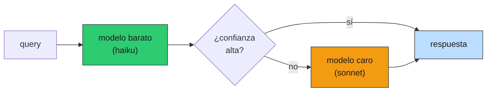
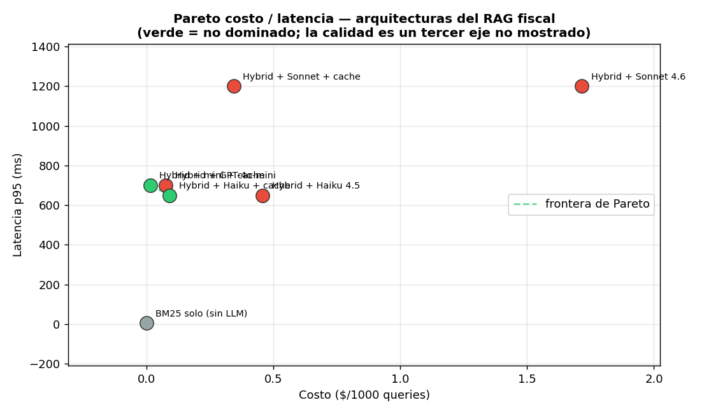

# 10 — Costo en producción

## La línea más volátil del P&L

En un producto de software clásico, el costo marginal de servir un usuario más es
casi cero: la infraestructura es un costo fijo que se amortiza. Un producto con
LLM rompe ese supuesto: cada query tiene un **costo variable real** —los tokens—
que se paga a un proveedor externo, a un precio que no controlás, y que escala
**linealmente con el uso**. Eso convierte al costo del LLM en la línea más volátil
del P&L: un cambio de modelo, de tarifa del proveedor, o un pico de tráfico pueden
**10×-arla en un día**. Esta sección es la disciplina para que esa línea no te
sorprenda en la factura.

### Analogía: estructura de costos con alto costo variable

Para un economista, el encuadre es directo: pasaste de un negocio de **altos
costos fijos y bajo costo marginal** (software tradicional) a uno con un **costo
variable per-unidad no trivial**, fijado por un proveedor con poder de precio. La
gestión cambia: ya no alcanza con "tengo el servidor pagado"; necesitás
**economía unitaria por feature** (cuánto cuesta servir una búsqueda, un chat, un
resumen), márgenes por tipo de uso, y vigilancia de la quema porque el volumen
—la demanda— mueve el costo total en tiempo real. Presupuestar esto con un número
en bruto es como costear una política sin saber el costo por beneficiario.

Las piezas están en [`prod_lib.py`](../code/prod_lib.py) (`CostMeter`,
`BudgetGuard`, `CostAwareRouter`); la demo en
[`code/10-cost-meter.py`](../code/10-cost-meter.py), toda calculada desde las
tarifas públicas (`PRICING`), sin una sola llamada real.

## Presupuestar por feature: la media miente

Medir el costo total en bruto esconde la estructura. El `CostMeter` lo desagrega
por feature, y ahí aparece lo importante:

```
   feature |  media $/req |   p99 $/req |   total $
-----------+--------------+-------------+----------
  busqueda |     0.001198 |    0.001758 |    2.3957
      chat |     0.002879 |    0.004878 |    5.7578
   resumen |     0.007821 |    0.011691 |   15.6415
```

Dos lecturas:

- **El costo es por feature, no uniforme.** Un "resumen" cuesta ~6× una
  "búsqueda" (más tokens de entrada y salida). Presupuestar con un promedio
  global mezcla peras con manzanas; la unidad económica es por feature.
- **La P99 está muy por encima de la media.** El usuario que manda el documento
  largo cuesta como diez de búsqueda. Si presupuestás con la media, el día que
  llega un cliente que usa intensivamente el resumen, la factura se dispara. Es
  la misma disciplina de distribución de 01-evals §8: reportá media **y** P99.

## Cost-aware routing: el más barato que alcanza

La pregunta de costo no es "¿qué modelo es mejor?" sino "¿cuál es el **más barato
que resuelve esta query**?". Muchas queries fiscales son simples ("¿tasa de
IVA?") y no necesitan el modelo top; otras (interpretar la interacción de dos
normas) sí. El `CostAwareRouter` clasifica y despacha:

```
10,000 queries: 7,509 simples→haiku, 2,491 complejas→sonnet
costo router      : $7.71
costo todo-sonnet : $17.16
ahorro            : 55%  (sin tocar la calidad de las complejas)
```

55% de ahorro mandando lo simple al modelo barato y reservando el caro para lo
que lo amerita. El riesgo es el **clasificador**: mandar una query difícil a
Haiku ahorra centavos y arruina la respuesta. Por eso el patrón seguro suele ser
**escalar**:



Probás el barato; si la confianza (o una autoevaluación rápida) es baja, escalás
al caro. Pagás el modelo top solo cuando hace falta, sin clasificar de antemano
con un riesgo de error.

## Caching: la palanca de costo más grande (§4)

El caché de §4 se vendió como latencia, pero su efecto mayor es **costo**: un hit
es una llamada al LLM que no se paga. Con 80% de hit rate, el costo se corta ~5×.
Es, lejos, la palanca de costo más barata de operar: no degrada calidad (sirve la
misma respuesta) y no requiere cambiar de modelo. La regla: **cachear es la
primera optimización de costo, no la última.**

## La tabla concreta: $/1000 queries sobre el corpus chileno

Con los tokens representativos del corpus (~272 in / 60 out, medidos en §2) y las
tarifas públicas:

| arquitectura | $/1000 q | p95 ms | frontera |
|---|---|---|---|
| BM25 solo (sin LLM) | 0.000 | 5 | referencia |
| Hybrid + GPT-4o-mini | 0.077 | 700 | |
| **Hybrid + mini + cache** | **0.015** | 700 | ★ (lo más barato) |
| Hybrid + Haiku 4.5 | 0.458 | 650 | |
| **Hybrid + Haiku + cache** | **0.092** | 650 | ★ (lo más rápido) |
| Hybrid + Sonnet 4.6 | 1.716 | 1200 | |
| Hybrid + Sonnet + cache | 0.343 | 1200 | |



Lo que dice el gráfico:

- **BM25 solo es referencia, no opción**: es el piso de costo y latencia, pero no
  genera respuesta. Incluirlo en la frontera sería trampa (gana sin competir).
- **La frontera son `mini+cache` (lo más barato) y `Haiku+cache` (lo más
  rápido)**: un trade-off real entre dos modelos baratos.
- **Sonnet queda dominado en costo/latencia**: es más caro Y más lento que Haiku.

Y acá está la trampa que el gráfico hace explícita en su título: **la calidad es
un tercer eje no mostrado**. En el plano costo/latencia, Sonnet no tiene sentido.
Solo se justifica si responde **mejor** las queries complejas — y eso se mide en
el plano costo/**calidad** de 01-evals §10, no acá. La decisión de modelo es a
tres ejes; este gráfico muestra dos y te recuerda el que falta.

## Alertas: presupuesto por quema, no por gasto acumulado

El `BudgetGuard` no alerta cuando ya gastaste el presupuesto —ahí es tarde—, sino
cuando la **proyección** al ritmo actual lo va a superar:

```
                momento |  gastado |    $/h |  proy. mes | estado
------------------------+----------+--------+------------+--------
   día 5 (ritmo normal) |      38$ |   0.32 |       231$ | ok
    día 10 (tráfico 2×) |     120$ |   0.50 |       365$ | ✗ OVER
    día 15 (sin frenar) |     230$ |   0.64 |       466$ | ✗ OVER
```

En el día 10 gastaste $120 de $300: el gasto acumulado **no** dispararía ninguna
alerta. Pero la tasa de quema nueva (un cliente duplicó el tráfico) proyecta
~$365 a fin de mes. La alerta salta **20 días antes** de la factura, con margen
para reaccionar (cachear más agresivo, rutear más a barato, o subir el precio del
plan). Alertar sobre el acumulado es enterarse cuando ya no hay nada que hacer.

## Estado del arte (2026)

| Aspecto | Estado | Detalle |
|---|---|---|
| Costo por feature / unidad económica | 🟢 Best practice | El bruto esconde la estructura; presupuestar es por feature |
| Cost-aware routing / escalado | 🟢 En auge | Routers (LiteLLM, etc.) lo automatizan; el escalado por confianza es el patrón seguro |
| Caché como palanca de costo | 🟢 Subutilizado | La optimización más barata; mucha gente la piensa solo como latencia |
| Prompt caching del proveedor | 🟢 Complementario | Descuenta el input repetido server-side; se combina con el response cache |
| Alertas por proyección de quema | 🟢 Necesario | Alertar por acumulado llega tarde; la proyección da margen |
| Pareto costo/calidad/latencia | 🟢 Maduro | La decisión de modelo es a 3 ejes; reducirla a uno lleva a malas elecciones |
| Caída de precios año-sobre-año | 🟡 No relaja la disciplina | Los modelos bajan de precio, pero el tráfico crece más rápido |

La caída de precios (Haiku 4.5, mini) tienta a relajarse, pero el tráfico de un
producto que crece sube más rápido que la baja de tarifas: la disciplina de
costo no es transitoria.

## Lo que viene en las próximas secciones

- **§11 seguridad**: un costo desbocado puede ser un **ataque** (un usuario en
  loop quemando tokens); el rate limit de §6 y los límites por usuario son
  también defensa de costo.
- **§12 incidentes**: "costo desbocado" es uno de los cinco modos de falla del
  runbook; la alerta de quema de §10 es su detección temprana.

## Conexiones

- **§4 caching**: la palanca de costo más grande; el 80% hit de la tabla sale de
  ahí.
- **§6 reliability**: el `CostAwareRouter` es de la familia de wrappers de §6/§8;
  y el fallback a un modelo más barato es palanca de costo además de disponibilidad.
- **§8 versionado**: la migración a un modelo más barato (la demo de §8,
  gpt-4o → mini) se cuantifica acá; shadow/canary la hacen segura.
- **§9 online evals**: la calidad real que falta en el Pareto costo/latencia la
  da el online eval; sin ella, "el barato alcanza" es una apuesta, no un dato.
- **01-evals §10 (Pareto costo/calidad)**: el tercer eje de esta sección; juntos
  cierran la decisión de modelo a costo/calidad/latencia.
- **01-evals §8 (estadística)**: media y P99 del costo con la misma disciplina de
  distribución; el costo de una feature es una distribución, no un número.
