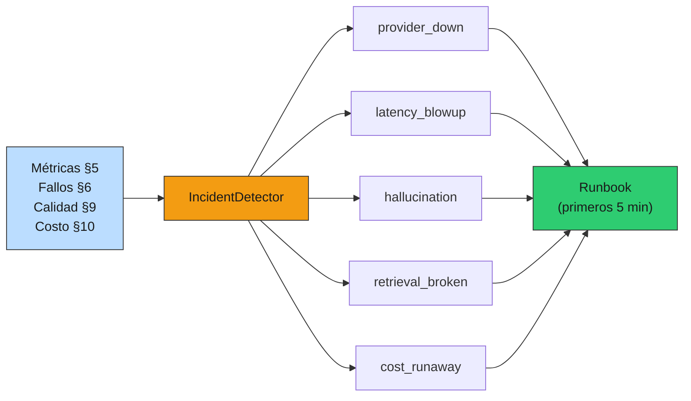
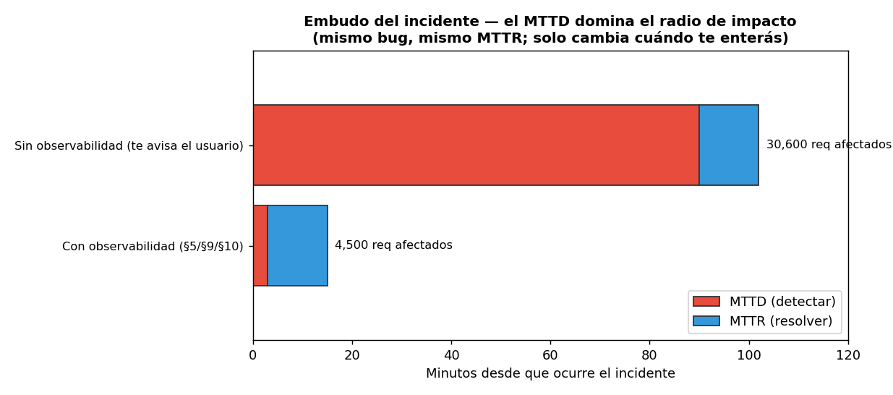

# 12 — Incidentes y postmortems

## Producción no es "si falla", es "cuándo y cómo respondés"

Todas las secciones anteriores reducen la probabilidad de falla: reliability (§6),
caching (§4), versionado seguro (§8), seguridad (§11). Pero ningún sistema real
tiene probabilidad de falla cero. La pregunta final de producción no es cómo
evitar todo incidente —imposible— sino **cuánto tardás en enterarte, qué mirás
primero, y qué aprendés después**. Esa es la disciplina de respuesta a incidentes,
y es lo que separa un susto de un desastre.

### Analogía: el protocolo de contingencia

Un programa público no asume que nunca habrá un shock (una crisis, un fraude, una
caída de un proveedor). Tiene **protocolos de contingencia**: qué se activa, quién
decide, cómo se comunica, y una revisión posterior para que el próximo shock
duela menos. No previene el shock; **acota el daño y aprende**. La respuesta a
incidentes es ese protocolo para tu RAG: no evita el 503 de Anthropic, pero
convierte una hora de caos en quince minutos de procedimiento.

Las piezas están en [`prod_lib.py`](../code/prod_lib.py) (`IncidentDetector`,
`RUNBOOKS`); la demo en [`code/12-incident-runbooks.py`](../code/12-incident-runbooks.py);
un postmortem de ejemplo en
[`examples/incidents/`](../examples/incidents/2026-05-14-alucinacion-canary.md).

## Los cinco modos de falla de un RAG

Un sistema con LLM falla de maneras que un CRUD no: no solo "se cayó", sino "sigue
respondiendo, pero mal". El `IncidentDetector` traduce las señales que las
secciones previas ya emiten al modo de falla y su runbook:



| Modo | Señal que lo dispara | Lo insidioso |
|---|---|---|
| **Proveedor caído** | tasa de error del proveedor ↑ | Obvio, pero pánico: no martillar al caído |
| **Latencia explotada** | p95/p99 ↑ | Puede ser el modelo, la cola, o un timeout faltante |
| **Alucinación masiva** | `online_pass_rate` ↓ (§9) | **El servicio NO se cae**: invisible para métricas de sistema |
| **Retrieval roto** | `retrieval_score` promedio ↓ | Un cambio de embedding model rompe la dimensión del índice |
| **Costo desbocado** | proyección de quema ↑ (§10) | Puede ser un ataque (un usuario en loop) |

El tercero es el más peligroso justamente porque **no dispara las alarmas
clásicas**: latencia y errores están perfectos mientras el sistema inventa
artículos de ley. Por eso la pata de calidad (§9) no es opcional: es la única que
ve este modo de falla.

## Runbooks: bajar la carga cognitiva del peor momento

Un incidente es el peor momento para pensar desde cero. El runbook es **qué mirar
en los primeros 5 minutos**, escrito en frío. Para "alucinación masiva":

```
1. ¿Coincide con un deploy/canary reciente (§8)? Correlacionar por prompt_ref/model.
2. Mirar el pass_rate online (§9) por variante: ¿cayó solo el candidato?
3. Rollback inmediato del canary (§8) a la versión estable.
4. Muestrear las respuestas malas por trace_id (§5) hacia el golden (§9).
5. NO 'arreglar el prompt en caliente': revertir primero, diagnosticar después.
```

El paso 5 es la regla de oro: **revertí primero, diagnosticá después**. La
tentación de "lo arreglo en caliente" alarga el incidente; el rollback detiene el
daño y te da tiempo de pensar con la presión apagada. Cada runbook referencia las
herramientas de las secciones previas —el incidente es donde todo el toolkit se
usa junto.

## MTTD > MTTR: el tiempo de detectar es el que controlás

Hay dos relojes en un incidente: el **MTTD** (Mean Time To Detect, desde que
ocurre hasta que te enterás) y el **MTTR** (Mean Time To Resolve, desde que te
enterás hasta que lo arreglás). La intuición dice optimizar el MTTR; los datos
dicen otra cosa:

```
                            escenario  | MTTD  | MTTR | requests afectados
----------------------------------------+-------+------+-------------------
        Con observabilidad (§5/§9/§10)  |   3m  |  12m |      4,500
   Sin observabilidad (te avisa usuario)|  90m  |  12m |     30,600
```



Mismo bug, **mismo MTTR de 12 minutos**. La diferencia —4.500 vs 30.600 requests
afectados, 7×— la hace **enteramente el MTTD**. Y el MTTD es lo que más controlás:
no depende de qué tan rápido tipeás el fix, sino de si tenés una **alerta** sobre
la señal correcta. Un dashboard hermoso que nadie mira a las 3 AM tiene MTTD de
"hasta que un usuario se queja". Una alerta sobre el `online_pass_rate` tiene MTTD
de minutos. **Bajar el MTTD es la mejor inversión de confiabilidad**, y es barata:
las señales ya las calculamos en §5/§9/§10; falta conectarlas a una alerta.

## El postmortem honesto (blameless)

Después del incidente, el postmortem. La regla que lo hace útil: **blameless**. La
pregunta no es "¿quién se equivocó?" sino **"¿qué nos faltó para detectarlo
antes?"**. Buscar culpables hace que la gente esconda información en el próximo
incidente; buscar fallas del sistema hace que el sistema mejore.

En el [postmortem de ejemplo](../examples/incidents/2026-05-14-alucinacion-canary.md),
un canary de modelo introdujo alucinaciones. La conclusión no fue "el que promovió
el canary se equivocó", sino: **la señal de calidad existía (el `online_pass_rate`
venía cayendo) pero no había una alerta sobre ella** — el anti-patrón de §5. La
acción que más paga no es otro modelo ni otro panel: es cablear esa señal al
detector con un umbral. El postmortem termina en **acciones**, no en culpas, y la
mayoría son acciones de detección (bajar MTTD), porque ahí está el leverage.

## Estado del arte (2026)

| Aspecto | Estado | Detalle |
|---|---|---|
| Runbooks escritos en frío | ✅ Estándar | Bajan la carga cognitiva del incidente; viven con la alerta |
| MTTD como métrica primaria | 🟢 Best practice | El foco maduro pasó de MTTR a MTTD |
| Postmortem blameless | ✅ Estándar (Google SRE) | Culpar esconde información; el foco es el sistema |
| Modos de falla específicos de LLM | 🟡 Emergente | "Alucinación masiva" y "regresión por cambio de modelo" son nuevos; la industria aún arma los runbooks |
| Detección de regresión de calidad | 🟡 Inmadura | Pocos cablean la calidad online a una alerta; es el modo más invisible |
| Alertar sobre síntomas, no causas | 🟢 Best practice | Latencia/errores/calidad del usuario, no CPU |

## Cierre de la masterclass: de la demo a producción

Esta sección cierra `03-produccion`. El arco completo: empezamos (§1) con que
**producción es una disciplina distinta** de la demo, y fuimos agregando capas
sobre el mismo RAG de 02-retrieval, sin tocar su lógica:

- **§2** lo expuso como servicio (puertos/adaptadores, lifespan, response shape).
- **§3-§4** lo hicieron versionable y barato (prompts versionados, caché multinivel).
- **§5** lo hizo observable (logs, métricas, traces) — la base de todo lo demás.
- **§6-§8** lo hicieron confiable y evolucionable (retries/breaker/fallback,
  config/secrets/deploy, shadow/canary).
- **§9-§11** cerraron los loops (online evals, costo, seguridad).
- **§12** preparó la respuesta para cuando, aun con todo eso, algo falle.

Todo se acumuló en un solo `prod_lib.py`: un toolkit donde cada pieza es pequeña,
sin estado global, y **componible** —los wrappers `LLMClient` (cache, retry,
breaker, fallback, shadow, canary) se apilan como capas sobre el mismo adaptador—.
Ese es el pago del patrón de §2: cada sección agregó una capa sin reescribir las
anteriores.

Y el hilo conductor, el **honest scaling**: para un SaaS regulatorio chileno de
1-3 personas, todo esto corre en una instancia con Postgres+pgvector+Redis, sin
Kubernetes, sin Kafka, sin multi-region. La disciplina no está en la
infraestructura grande, sino en **medir, versionar, acotar el fallo y aprender de
los incidentes** — con las herramientas mínimas que pagan su complejidad. Lo que
hace producción no es escala; es rigor.

## Conexiones

- **§5 observabilidad**: el `IncidentDetector` consume sus métricas; el MTTD bajo
  es el cobro de haber instrumentado.
- **§6 reliability**: los runbooks de `provider_down` y `latency_blowup` se apoyan
  en el breaker/fallback/rate limit; el incidente es donde se prueban de verdad.
- **§8 versionado**: el rollback del canary es la mitigación de la "alucinación
  masiva"; el ruteo sticky acota su blast radius.
- **§9 online evals**: la única señal que ve la regresión de calidad; sin ella,
  ese modo de falla es invisible.
- **§10 costo**: la alerta de quema detecta el "costo desbocado", que puede ser un
  ataque (§11).
- **01-evals §8 (estadística)**: la decisión de promover/revertir un canary se
  toma con IC, no con el primer dato — la misma disciplina, ahora en producción.
- **01-evals §12 (alto-stake)**: por qué todo esto importa más en el dominio
  fiscal: un incidente de calidad o de PII tiene consecuencias reales.
