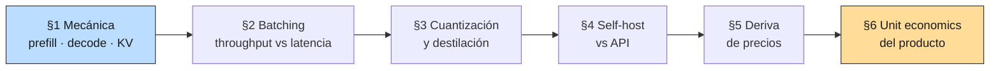

# 00 — Plan Maestro: Economía de Inferencia

## Objetivo de la masterclass

Entender **de dónde sale el precio** que pagás por token, y con eso poder decidir
con números —no con intuición— si conviene un modelo más chico, si conviene
alojarlo vos mismo, cuánto margen deja realmente una consulta, y qué supuestos de
tu modelo de costos van a caducar. Al terminar, deberías poder responder: *¿por
qué esta query cuesta lo que cuesta, qué palanca la abarata sin romperla, y a qué
volumen cambia la respuesta?*

Las masterclasses anteriores trataron el costo como un **dato exógeno**: un precio
público por millón de tokens que se mide, se presupuesta y se enruta. Esta lo
abre. La diferencia importa porque casi todas las decisiones de arquitectura
—batch o no, contexto largo o retrieval agresivo, streaming o no, modelo propio o
API— son decisiones sobre la mecánica que produce ese precio.

## El encuadre: esto es análisis de costos, no ingeniería de sistemas

Para un economista el material es familiar aunque el vocabulario no lo sea. Un
proveedor de inferencia es una **industria de altos costos fijos** (GPUs que se
pagan por hora estén ociosas o no) que vende un producto de **costo marginal
decreciente en el volumen** (el batching reparte el costo fijo de mover los pesos
entre más requests). De ahí sale casi todo lo demás: por qué el precio del input
es ~4× más barato que el del output, por qué tu latencia empeora cuando al
proveedor le va bien, y por qué alojar un modelo propio es una decisión de
**escala mínima eficiente**, no de capacidad técnica.

La pregunta de la masterclass no es "¿cómo hago inferencia rápido?" sino "¿cuál es
la estructura de costos de esto, y en qué punto cambia mi decisión?".

## Qué quedó absorbido por 01 y 03 (y por qué esta masterclass se re-especificó)

El temario original de 04 —"caching, batching, selección de modelos,
presupuestos"— se escribió antes que 01 y 03. Al terminar esas dos, entre el 60% y
el 70% de lo prometido ya estaba escrito. Mantenerlo habría sido duplicación, así
que se re-especificó al material que ningún módulo toca. El mapa de lo absorbido:

| Tema del temario original | Dónde quedó | Qué queda para 04 |
|---|---|---|
| Caching | `03 §4` (LRU/response/semántico, con hit rate calibrado) | Nada. Cubierto. |
| Selección y versionado de modelos | `03 §8` (shadow, canary, routing) | Nada. Cubierto. |
| Presupuestos y alertas | `03 §10` (`CostMeter`, `BudgetGuard`, quema proyectada) | Nada. Cubierto. |
| Frontera costo/latencia/calidad | `01 §10` y `03 §10` | Nada. Cubierto. |
| Batching | Mencionado, nunca explicado | **§2**: por qué existe y qué le hace a tu latencia. |
| Costo por token | Tratado como precio dado | **§1, §5**: de dónde sale y cómo se mueve. |

Lo que sí es nuevo y vive solo acá: la **mecánica** que genera el precio (§1, §2),
las palancas que cambian el modelo en vez de cómo lo usás (§3), la decisión de
**hacer vs. comprar** (§4), la **caducidad** de los supuestos de costo (§5) y el
salto de costo unitario a **margen de producto** (§6).

## Honestidad sobre el método: esto es un modelo, no un benchmark

Las masterclasses 01–03 midieron sobre corridas reales. Acá no se puede: no hay
GPUs en esta laptop y alquilar un H100 para producir cuatro gráficos es
exactamente el tipo de gasto que la masterclass enseña a no hacer.

Entonces el método es explícito: **construimos un modelo analítico** de la
mecánica de inferencia (aritmética de FLOPs, ancho de banda de memoria, tamaño del
KV cache), lo calibramos contra especificaciones públicas de hardware y tarifas
publicadas, y lo usamos para razonar sobre órdenes de magnitud y puntos de corte.

Reglas que se respetan en todas las secciones:

1. **Toda constante de hardware se cita** (memoria, ancho de banda, TFLOPs) y se
   marca `[verificar]` si no viene de la ficha del fabricante.
2. **El modelo predice órdenes de magnitud y puntos de equilibrio, no
   benchmarks.** Si el modelo dice "el break-even está cerca de 200M tokens/mes",
   la afirmación defendible es "está en el orden de cientos de millones", no el
   número exacto.
3. **Donde el modelo es débil, se dice.** El overhead real de servir (scheduler,
   fragmentación de memoria, cold starts) no está modelado y empuja siempre en la
   misma dirección: el self-hosting rinde peor que el papel.
4. **Ningún número de calidad se inventa.** Si una sección afirma que cuantizar
   degrada, la degradación se mide con el aparato de `01 §8` o se marca como no
   medida.

## Hilo conductor

El mismo sistema RAG sobre normativa chilena de `02-retrieval`, servido con la
infraestructura de `03-produccion`, con sus tokens ya medidos: **~272 de entrada**
por query (`03 §2`). La salida depende de cuánto se pide —21 tokens en la demo de
`03 §2`, 60 como valor representativo en `03 §10`—; acá se usa **272 in / 60 out**
y se marca explícitamente cuando una conclusión es sensible a ese supuesto. Sobre
esa carga concreta —no sobre una hipotética— se calculan todas las decisiones
económicas.

El orden va de lo físico a lo económico: las dos primeras secciones explican la
máquina, las dos del medio las palancas, y las dos últimas convierten todo eso en
decisiones de negocio.

## Temario

### Sección 1 — Mecánica de la inferencia: prefill, decode y KV cache
- Las dos fases de una respuesta y por qué tienen economías opuestas: **prefill**
  (procesar el prompt) es paralelo y limitado por cómputo; **decode** (generar
  tokens) es secuencial y limitado por ancho de banda de memoria.
- Por qué el proveedor te cobra el output ~4-5× más caro que el input: no es
  margen arbitrario, es la fase cara.
- El **KV cache**: qué guarda, cómo crece con el contexto, y por qué es el recurso
  que realmente limita cuánta gente podés atender a la vez.
- Aritmética desde cero: para un modelo de tamaño dado, cuántos bytes mueve cada
  token generado y qué techo de velocidad impone eso.
- Consecuencia de diseño para el RAG chileno: por qué meter 20 chunks en el prompt
  cuesta poco y por qué pedir una respuesta larga cuesta mucho.

### Sección 2 — Batching, throughput y la latencia que no controlás
- Por qué el batching existe: mover los pesos del modelo desde memoria es un costo
  fijo que se reparte entre todos los requests del batch. Es una economía de escala
  en el sentido literal.
- **Continuous batching**: cómo un servidor moderno mete y saca requests de un
  batch en vuelo, y por qué eso cambia la relación entre carga y latencia.
- La curva throughput-latencia: por qué tu p95 empeora justo cuando el proveedor
  tiene más tráfico, y por qué eso no es un bug sino el equilibrio del sistema.
- Qué implica para vos como **cliente** de una API: qué podés controlar
  (concurrencia, tamaño del prompt, `max_tokens`, streaming) y qué no.
- Conexión con `03 §6`: por qué el rate limiting propio mejora tu latencia además
  de proteger al proveedor.

### Sección 3 — Cuantización y destilación: cambiar el modelo, no el uso
- Las palancas de 01/03 optimizaban **cómo usás** el modelo (caché, routing,
  prompts). Estas dos cambian **el modelo mismo**.
- **Cuantización**: representar los pesos con menos bits. Por qué acelera vía
  ancho de banda (§1) y no vía cómputo. Los formatos y qué se pierde en cada uno.
- **Destilación**: entrenar un modelo chico para imitar a uno grande en *tu*
  distribución de tareas. Por qué funciona mejor en dominio estrecho —como
  normativa chilena— que en propósito general.
- La trampa: ambas se venden con benchmarks agregados que no dicen nada sobre tu
  corpus. La degradación **se mide en tu golden**, con el aparato de `01 §8`, o no
  se sabe.
- Puente con governance: un fine-tuning sustancial puede reclasificar a un
  *deployer* como *provider* bajo la AI Act. Ver B9.

### Sección 4 — Self-hosting vs. API: la escala mínima eficiente
- El planteo correcto: no es "¿puedo?" sino "¿a qué volumen deja de ser una
  decisión obvia?".
- Estructura de costos de cada opción: la API es **costo puramente variable**;
  el self-hosting es **costo fijo por hora de GPU** más operación.
- El cálculo del punto de equilibrio para la carga real del RAG chileno, con
  utilización como la variable que decide (una GPU al 15% de uso es una GPU cara).
- Los costos que no aparecen en la comparación ingenua: operación, guardia,
  actualización de modelos, el costo de oportunidad de tu tiempo.
- Cuándo el self-hosting gana por razones **no económicas** —residencia de datos,
  confidencialidad de documentos de clientes, previsibilidad regulatoria— y por
  qué en dominio público chileno ese argumento es más débil de lo que parece.
- Veredicto honesto para el escenario del proyecto.

### Sección 5 — Deriva de precios: escribir un modelo de costos que no caduque
- El hecho: el precio por unidad de capacidad cae rápido y sostenidamente. Un
  modelo de costos escrito con las tarifas de hoy caduca en meses.
- Qué se mueve y qué no: caen las tarifas por token, cae el costo de la capacidad
  equivalente, **no** cae la disciplina —porque el consumo por query sube (más
  contexto, más pasos agénticos) más rápido de lo que baja la tarifa.
- La paradoja de Jevons aplicada: abaratar la inferencia aumenta el gasto total en
  inferencia. Por qué "va a bajar de precio" no es un plan.
- Cómo escribir el modelo para que envejezca bien: parametrizar tarifas en un solo
  lugar (ya se hace en `prod_lib.PRICING_USD_PER_M_TOKENS`), razonar en ratios y
  no en absolutos, y fechar todo supuesto.
- Análisis de sensibilidad: qué decisiones del proyecto cambian si las tarifas
  caen 10× y cuáles no cambian nada. Las que no cambian son las robustas.

### Sección 6 — Unit economics de un SaaS regulatorio
- El salto: de **costo por query** (todo lo anterior) a **margen por cliente**.
- Costo marginal real de un cliente más: no son solo tokens; es tokens × queries
  por cliente × factor de re-uso de caché.
- Por qué el precio plano con costo variable es una trampa clásica: el 5% de
  usuarios intensivos define tu margen. Distribución, no media —la misma lección
  de `03 §10` llevada al P&L.
- Diseño de planes con el costo en mente: límites, créditos, tarifas escalonadas,
  y qué señal manda cada uno.
- El caso concreto: un producto sobre normativa chilena con N clientes
  institucionales, calculando margen bruto por plan y el punto donde un cliente
  destruye valor.
- Cierre: cuáles de las palancas de las seis secciones mueven de verdad el margen,
  ordenadas por retorno, y cuáles son ruido.

## Dependencias con otras masterclasses

| Dirección | Qué |
|---|---|
| ← `01 §8` | El aparato estadístico para medir si cuantizar/destilar degradó (§3). |
| ← `01 §10` | La frontera de Pareto costo/calidad; acá se le agrega el eje mecánico. |
| ← `02` | La carga concreta: tokens por query del RAG chileno. |
| ← `03 §2` | Los tokens representativos medidos (~272 in / ~60 out). |
| ← `03 §4` | El caché como palanca ya cuantificada; acá entra al margen (§6). |
| ← `03 §10` | `CostMeter`/`BudgetGuard`; acá se explica de dónde sale el precio que miden. |
| → B9 | El puente de fine-tuning → *provider* bajo la AI Act (§3). |

## Decisiones técnicas tomadas

1. **Modelo analítico, no benchmark.** Ya justificado arriba. Todo el código corre
   offline y determinista, sin GPU y sin llamadas a proveedores.
2. **Un solo módulo `econ_lib.py`** con la aritmética (memoria, ancho de banda, KV
   cache, batching, break-even, planes), importado por los seis scripts demo.
   Mismo patrón que `retrieval_lib.py` y `prod_lib.py`.
3. **Las tarifas se leen de `prod_lib.PRICING_USD_PER_M_TOKENS`**, no se duplican.
   Si caducan, caducan en un solo lugar — que es la tesis de §5 aplicada al propio
   repo.
4. **Modelo de referencia para la aritmética: uno abierto de tamaño conocido**
   (clase 8B y clase 70B), porque los tamaños de los modelos propietarios no son
   públicos y no vamos a inventarlos. Las conclusiones son de forma funcional, no
   de un modelo específico.
5. **Ninguna afirmación de calidad sin medición.** Donde §3 necesitaría medir
   degradación por cuantización y no podemos correr el modelo cuantizado, se
   declara como no medido y se explica el protocolo que lo mediría.
