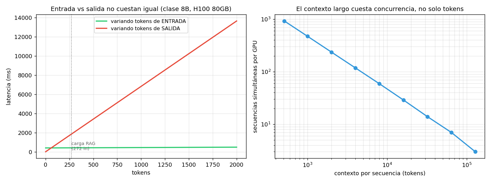

# 01 — Mecánica de la inferencia: prefill, decode y KV cache

## El precio por token no es un precio, son dos

En `03 §10` el costo entró como un dato: una tabla de tarifas por millón de tokens
que el `CostMeter` multiplica. Pero esa tabla tiene una regularidad que ningún
módulo explicó todavía, y que se ve apenas se la mira:

```
              modelo |   $/M in |  $/M out |  ratio
--------------------------------------------------
         gpt-4o-mini |    0.150 |    0.600 |   4.0×
    claude-haiku-4-5 |    0.800 |    4.000 |   5.0×
              gpt-4o |    2.500 |   10.000 |   4.0×
   claude-sonnet-4-6 |    3.000 |   15.000 |   5.0×
     claude-opus-4-7 |   15.000 |   75.000 |   5.0×
```

Cinco modelos, dos proveedores, tres órdenes de magnitud de precio entre el más
barato y el más caro — y **todos cobran la salida entre 4 y 5 veces más que la
entrada**. Una regularidad que sobrevive a esa variación no es una política
comercial: es una restricción física que se filtra al precio.

Esta sección es esa restricción. Entenderla cambia decisiones concretas de diseño
del RAG chileno: cuántos chunks meter en el prompt, cuán larga pedir la respuesta,
y por qué el contexto largo cuesta más de lo que dice la factura.

### La analogía: dos tecnologías de producción en la misma fábrica

Generar una respuesta no es un proceso, son dos, con **funciones de producción
distintas**:

- **Prefill** (procesar el prompt): es un proceso *paralelo*. Todos los tokens de
  entrada se procesan a la vez. Escala con la capacidad de cómputo.
- **Decode** (generar la respuesta): es un proceso *secuencial*. Cada token
  necesita el anterior para existir. Escala con la velocidad de la memoria.

Es la diferencia entre una línea de montaje que procesa un lote completo en
paralelo y un artesano que hace una pieza a la vez. Mismo taller, mismas máquinas,
economías opuestas. Y como la segunda es la cara, el proveedor la cobra más.

Toda la aritmética está en [`econ_lib.py`](../code/econ_lib.py); la corrida en
[`code/01-prefill-decode.py`](../code/01-prefill-decode.py). Recordá la regla de
método del plan: esto es un **modelo analítico** sobre specs públicas, no un
benchmark. Predice órdenes de magnitud, no milisegundos.

## La asimetría, medida sobre la carga real

Sobre los 272 tokens de entrada y 60 de salida del RAG chileno, en una H100 80GB:

```
    modelo |  prefill 272 tok |  decode 60 tok | decode/prefill
--------------------------------------------------------------------
  clase 8B |          11.0 ms |       409.4 ms |            37×
 clase 70B |          96.2 ms |      3582.1 ms |            37×
```

Generar 60 tokens toma **37 veces más** que procesar los 272 del prompt. Y notá
que el ratio es idéntico en ambos modelos: no es una característica del tamaño, es
una característica de la *forma* del cálculo.

## Por qué: los bytes que hay que mover

El número que lo explica todo:

```
    modelo |   bytes/token decode |  tokens/s (batch 1)
--------------------------------------------------------
  clase 8B |              16.0 GB |                 147
 clase 70B |             140.0 GB |                  17
```

Para escribir **un solo token** de un modelo de clase 70B en bf16, hay que traer
los 140 GB de pesos desde la memoria de la GPU hasta las unidades de cómputo. Los
140 GB completos. Para el siguiente token, otra vez.

En el prefill, esos mismos 140 GB se leen **una vez** y sirven para los 272 tokens
del prompt simultáneamente. El costo de mover los pesos se amortiza entre 272
tokens; en decode se paga entero por cada uno.

De ahí sale el techo de velocidad:

```
tokens/s = (ancho de banda / bytes por token) · eficiencia
```

Con 3.35 TB/s y 140 GB por token, un 70B en bf16 no puede pasar de ~17 tokens/s
por secuencia **por más rápida que sea la GPU calculando**. El cómputo está
ocioso; el cuello es la memoria. Esto se llama estar *memory-bandwidth bound*, y
es el hecho central de la economía de la inferencia.

> El modelo físico explica el **signo y el orden de magnitud** de la asimetría de
> precio, no el número exacto. Que el ratio observado sea 4-5× y no 37× se debe a
> que la tarifa también incorpora el batching (§2), que reparte el costo del
> decode entre muchas secuencias, más margen y competencia.

## El KV cache: el recurso que de verdad limita

Si generar cada token exigiera recalcular la atención sobre todo el prompt, el
decode sería cuadrático. No lo es, porque se guardan las claves y valores ya
calculados: el **KV cache**. Es la optimización que hace viable la generación
—y el recurso que fija cuántos usuarios podés atender a la vez.

Su tamaño por token de contexto:

```
bytes/token = 2 (K y V) · n_capas · n_cabezas_KV · d_cabeza · bytes_por_valor
```

```
clase 8B:  128 KB por token de contexto
clase 70B: 320 KB por token de contexto
```

Parece poco hasta que se multiplica por el contexto:

| contexto | KV por secuencia (8B) | KV por secuencia (70B) |
|---|---|---|
| 272 (la carga RAG) | 37 MB | 91 MB |
| 4.000 | 537 MB | 1.342 MB |
| 32.000 | 4.295 MB | 10.737 MB |
| 128.000 | 17.180 MB | 42.950 MB |

Una sola conversación de 128k de contexto en un 70B consume **43 GB** de KV cache
— más de la mitad de una H100, solo para esa conversación.

El `n_kv_heads` de la fórmula es donde vive la optimización que todos los modelos
modernos usan: **GQA** (grouped-query attention) comparte cabezas de KV entre
cabezas de atención. En el modelo de clase 70B de referencia son 64 cabezas de
atención contra 8 de KV: divide el KV cache por 8 sin degradar la calidad de forma
apreciable. Si te preguntabas por qué los contextos largos se volvieron viables y
baratos entre 2023 y 2026, GQA es buena parte de la respuesta.

## Cuánta gente cabe: donde el modelo se pone incómodo

```
clase 8B: pesos 16 GB + overhead 2 GB → 62 GB libres para KV
    contexto |  secuencias simultáneas
---------------------------------------
         272 |                   1,739
       4,000 |                     118
      32,000 |                      14
     128,000 |                       3
```

De 118 secuencias simultáneas a 4k de contexto, a **3** a 128k. El contexto largo
no cuesta solo tokens: cuesta **concurrencia**, y la concurrencia es el
denominador del costo por request del proveedor. Cuando pagás por contexto largo,
estás pagando la GPU que dejó de atender a otros 115 usuarios.



Y acá el modelo produjo un resultado que vale la pena no esconder:

```
clase 70B: pesos 140 GB en bf16 → NO CABE en una H100 80GB.
  Salidas: repartirlo en 2+ GPUs (y pagar la interconexión),
  o cuantizar a int8/int4 (§3).
     int8: pesos    70 GB → cabe  (   6 secuencias a 4k de contexto)
     int4: pesos    35 GB → cabe  (  32 secuencias a 4k de contexto)
```

Un modelo de 70B parámetros en bf16 **no entra** en la GPU de 80 GB más común para
servir. Esto no es un detalle de implementación: es la razón económica por la que
los modelos grandes se sirven casi siempre cuantizados. No es una optimización
opcional que alguien aplica para ahorrar unos centavos — para muchas
configuraciones es la diferencia entre servir con una GPU o con dos. Es el
argumento que §3 desarrolla.

Notá también que a int8 caben 6 secuencias y a int4 caben 32: la cuantización
libera memoria para pesos **y** deja más espacio para KV cache, así que su efecto
sobre la concurrencia es más que proporcional.

## La consecuencia de diseño para el RAG chileno

Acá es donde la física se vuelve una decisión de producto. Cuatro escenarios sobre
el pipeline de `02-retrieval`:

```
                         escenario |     in |   out |    tiempo
--------------------------------------------------------------
  base (5 chunks, respuesta corta) |    272 |    60 |    420 ms
            20 chunks en el prompt |  1,088 |    60 |    453 ms
            respuesta 4× más larga |    272 |   240 |   1649 ms
                             ambos |  1,088 |   240 |   1681 ms

Cuadruplicar el CONTEXTO: +8% de tiempo.
Cuadruplicar la RESPUESTA: +292% de tiempo.
```

**Cuadruplicar los chunks recuperados cuesta 8%. Cuadruplicar el largo de la
respuesta cuesta 292%.** La regla que sale de ahí es contraintuitiva para quien
viene de optimizar bases de datos:

> En un RAG, **recuperar de más es barato; responder de más es caro.** Ante la
> duda: más chunks, menos verborrea.

Esto reordena prioridades de las masterclasses anteriores. El esfuerzo de
`02 §4` (chunking cuidadoso) y `02 §6` (reranking para quedarse con pocos chunks)
se justifica por **calidad** —menos ruido en el contexto, mejor respuesta— y no
por costo de latencia. Si alguien recorta chunks para ir más rápido, está
optimizando la variable equivocada. En cambio, un prompt que pide "explica
detalladamente" en vez de "responde en dos frases" sí paga un costo real y
medible.

La excepción es el **precio en dólares**, que sí escala linealmente con los tokens
de entrada. Pasar de 5 a 20 chunks cuesta 8% de latencia pero ~4× el costo de
input. Como el input es 4-5× más barato que el output, en la carga del RAG chileno
eso sigue siendo poco dinero — pero es la razón por la que las dos cosas hay que
mirarlas por separado.

## Lo que este modelo no captura

Honestidad sobre los límites, según la regla 3 del plan:

- **No modela el overhead de servir**: scheduler, fragmentación del KV cache,
  cold starts, colas. Todo eso empuja en la misma dirección — la realidad rinde
  peor que este papel.
- **`efficiency = 0.7` y `mfu = 0.4` son estimaciones** dentro del rango que se
  reporta como realista, no mediciones propias. Los resultados relativos (ratios,
  puntos de corte) son robustos a estos parámetros; los absolutos en milisegundos,
  no.
- **Ignora la atención cuadrática en el prefill**, despreciable a 272 tokens pero
  no a 128k. A contextos largos, el prefill deja de ser tan barato como acá parece.
- **Los modelos propietarios no son densos ni de tamaño público.** Los MoE
  (mixture of experts) activan solo una fracción de sus parámetros por token, lo
  que cambia la aritmética de decode. Las conclusiones de forma funcional se
  mantienen; los números concretos son de los modelos abiertos de referencia.

## Estado del arte (2026)

| Aspecto | Estado | Detalle |
|---|---|---|
| Decode limitado por ancho de banda | ✅ Consenso | El hecho estructural de la inferencia; gobierna todo lo demás |
| GQA / MQA para achicar el KV cache | ✅ Estándar | Todos los modelos modernos; habilitó el contexto largo barato |
| PagedAttention / gestión de KV | ✅ Estándar | vLLM lo popularizó; reduce la fragmentación del KV cache |
| Cuantización del KV cache (no solo pesos) | 🟢 En adopción | Segunda palanca sobre el recurso escaso; menos madura que cuantizar pesos |
| Prompt caching del proveedor | 🟢 Maduro | Cachea el prefill del prefijo repetido; ataca justo la fase barata |
| Decodificación especulativa | 🟡 En adopción | Un modelo chico propone, el grande verifica; rompe parcialmente el techo de decode |
| Arquitecturas MoE | 🟢 Dominante en la frontera | Cambia la relación parámetros↔bytes movidos; el modelo denso de acá es una simplificación |
| Aritmética pública de modelos propietarios | 🔴 No disponible | Tamaños y arquitecturas no publicados; por eso se razona con modelos abiertos |

El movimiento a seguir es la **decodificación especulativa**: es el único de la
lista que ataca directamente el techo de bandwidth en vez de trabajar alrededor.
Si se generaliza, la asimetría input/output se comprime y varias conclusiones
económicas de esta masterclass se ablandan.

## Lo que viene en la próxima sección

§1 miró **una** secuencia. Pero ningún proveedor sirve una secuencia a la vez: los
140 GB de pesos que hay que mover para generar un token sirven, con el mismo
movimiento, a todas las secuencias del batch. Esa es la economía de escala que
convierte 17 tokens/s por secuencia en miles de tokens/s agregados — y la que
explica por qué tu latencia depende del tráfico de otros clientes. §2 la desarrolla.

## Conexiones

- **`03 §10` (costo en producción)**: la tabla de tarifas que ahí se usa como dato
  queda explicada acá. El ratio 4-5× output/input no era una convención.
- **`03 §4` (caching)**: el prompt caching del proveedor descuenta el prefill, que
  es justo la fase barata. Por eso ahorra dinero pero no arregla la latencia — el
  decode sigue intacto. Complementa al response cache, no lo reemplaza.
- **`02 §4` (chunking)** y **`02 §6` (reranking)**: se justifican por calidad del
  contexto, no por latencia. Este es el número que lo demuestra.
- **`03 §2` (arquitectura)**: los 272 tokens de entrada medidos ahí son la carga
  sobre la que se calcula todo acá.
- **§3 (cuantización)**: que un 70B en bf16 no entre en una H100 es el argumento
  económico de esa sección, ya planteado acá.
- **§4 (self-hosting)**: el `max_concurrent_sequences` de esta sección es el
  denominador del costo por request de un despliegue propio.
