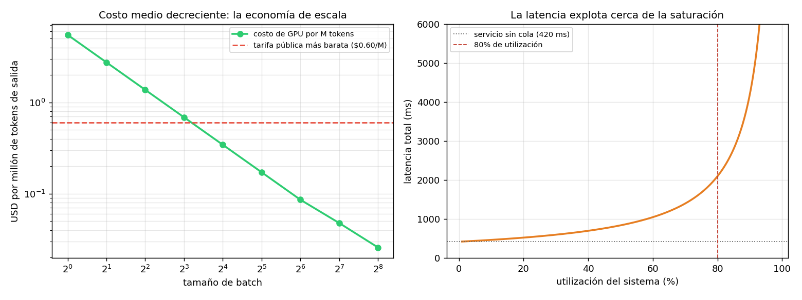
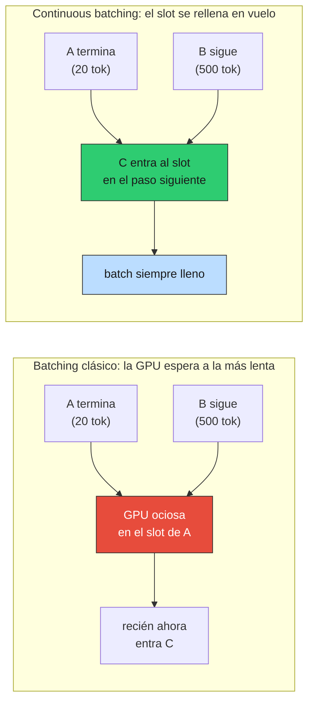

# 02 — Batching, throughput y la latencia que no controlás

## El número que no cerraba

§1 dejó un resultado incómodo: un modelo de clase 8B en una H100 genera ~147
tokens por segundo. A $2.90 la hora de GPU, eso son **$5.50 por millón de tokens
de salida**.

Pero la tarifa pública más barata de la tabla de `prod_lib` es de $0.60 por millón.
El proveedor cobra **nueve veces menos** de lo que —según §1— le cuesta producirlo.
O el modelo está mal, o falta algo.

Falta algo, y es lo que explica el negocio entero: **el proveedor no sirve una
secuencia a la vez**.

### La analogía: costos fijos y escala mínima eficiente

Los 16 GB de pesos que hay que mover desde memoria para generar un token son un
**costo fijo por paso de generación**, no un costo por secuencia. Si en ese mismo
paso hay 64 secuencias esperando su siguiente token, el movimiento de pesos sirve
a las 64. El costo fijo se reparte.

Esto es, literalmente, una **economía de escala**: costo medio decreciente en el
volumen, por indivisibilidad del insumo. Un economista reconoce la estructura de
inmediato — es la misma razón por la que una imprenta necesita tirajes largos, o
por la que un hospital rural tiene costo por paciente más alto que uno urbano. La
tecnología impone una **escala mínima eficiente**, y por debajo de ella el negocio
no cierra.

Corrida en [`code/02-batching.py`](../code/02-batching.py); la aritmética en
[`econ_lib.py`](../code/econ_lib.py).

## La curva: costo medio decreciente

```
 batch |  tok/s total |  tok/s por seq |  ms/token seq |  $/M tokens
------------------------------------------------------------------------
     1 |          147 |            147 |           6.8 |       5.496
     2 |          293 |            147 |           6.8 |       2.748
     4 |          586 |            147 |           6.8 |       1.374
     8 |        1,172 |            147 |           6.8 |       0.687
    16 |        2,345 |            147 |           6.8 |       0.344
    32 |        4,690 |            147 |           6.8 |       0.172
    64 |        9,380 |            147 |           6.8 |       0.086
   128 |       16,884 |            132 |           7.6 |       0.048
   256 |       31,267 |            122 |           8.2 |       0.026
```

Leé la columna del medio antes que ninguna: **la latencia por secuencia no cambia**
entre batch 1 y batch 64. Cada usuario recibe sus tokens a la misma velocidad,
mientras el throughput agregado se multiplica por 64 y el costo por millón de
tokens se divide por 64.

Es un almuerzo gratis, y es raro que exista uno. Existe porque el sistema estaba
**limitado por ancho de banda, no por cómputo** (§1): las unidades de cálculo
estaban ociosas esperando que llegaran los pesos. Meter más secuencias en el batch
usa capacidad que ya estabas pagando y no usabas.

A partir de batch ~128 empiezan los rendimientos decrecientes: la atención sobre
el KV cache **no** se comparte entre secuencias —cada una tiene el suyo— y ese
trabajo sí crece con el batch. La latencia por secuencia empieza a subir (6.8 →
8.2 ms/token) y el costo baja menos que proporcionalmente.



> **Límite del modelo:** la linealidad perfecta hasta batch 64 es una
> simplificación. En un servidor real la degradación empieza antes y es más suave,
> porque el batch nunca está perfectamente lleno ni perfectamente sincronizado. La
> forma de la curva —costo medio decreciente con rendimientos decrecientes— es
> robusta; los puntos exactos de quiebre no lo son.

## Por qué el número ahora sí cierra

```
Costo de GPU modelado (clase 8B, H100 a $2.9/h):
  batch   1: $   5.496 / M tokens de salida
  batch  32: $   0.172 / M tokens de salida
  batch 256: $   0.026 / M tokens de salida

Tarifa pública más barata de prod_lib: gpt-4o-mini a $0.600 / M out
```

A batch 1, el costo de producción es 9× la tarifa: **servir de a una secuencia es
ruinoso**. A batch 32, el costo cae a menos de un tercio de la tarifa, y ahí
aparece el margen del proveedor.

De acá sale la frase que conviene tener presente al negociar cualquier cosa con un
proveedor de inferencia:

> No te vende una GPU. Te vende **una fracción de una GPU muy ocupada** — y su
> negocio depende de mantenerla ocupada.

Eso explica varias cosas que de otro modo parecen arbitrarias: por qué hay
descuentos grandes por procesamiento en lote asíncrono (batch API), por qué los
límites de rate existen incluso cuando pagás bien, y por qué el precio por token
cae tanto más rápido que el costo del hardware (§5).

## Continuous batching: por qué esto funciona en la práctica

El batching clásico —juntar N requests, procesarlos, devolver N respuestas— no
sirve para LLMs: las secuencias terminan en momentos distintos (una respuesta de
20 tokens y otra de 500), y esperar a la más larga desperdicia la GPU.

El **continuous batching** (o *in-flight batching*) resuelve eso: el servidor
mantiene un batch en vuelo y, apenas una secuencia termina, mete otra en su lugar
sin esperar al resto.



La consecuencia para vos: el sistema opera **cerca de su batch objetivo casi todo
el tiempo**, lo que hace que la relación entre carga y latencia se parezca mucho
más a una cola que a una función escalonada. Que es exactamente lo que viene ahora.

## La latencia que no controlás

Con el tiempo de servicio de §1 (420 ms para la carga del RAG chileno), y tratando
el sistema como una cola M/M/1:

```
 utilización |  espera en cola |  latencia total |  vs vacío
------------------------------------------------------------
        10% |           47 ms |          467 ms |      1.1×
        30% |          180 ms |          600 ms |      1.4×
        50% |          420 ms |          840 ms |      2.0×
        70% |          980 ms |         1400 ms |      3.3×
        80% |         1680 ms |         2100 ms |      5.0×
        90% |         3780 ms |         4200 ms |     10.0×
        95% |         7980 ms |         8400 ms |     20.0×
        99% |        41580 ms |        42000 ms |    100.0×
```

La espera en cola es `servicio · ρ/(1−ρ)`. No es un resultado sobre LLMs: es
teoría de colas de manual, y por eso mismo es confiable. Lo que aporta acá es que
explica un fenómeno que todo operador observa y pocos anticipan: **la latencia no
se degrada linealmente con la carga, explota cerca de la saturación.**

Al 50% de utilización esperás lo mismo que tardás en ser atendido. Al 95%,
diecinueve veces más. Entre 80% y 95% de utilización —una diferencia que en un
dashboard parece menor— la latencia se cuadruplica.

Dos consecuencias prácticas, una para cada lado de la API:

- **Como cliente**: tu p95 empeora cuando al proveedor le va bien. No es un bug ni
  mala fe; es el equilibrio del sistema. Un proveedor que mantuviera utilización
  del 30% para darte latencia estable tendría que cobrarte el triple. La latencia
  estable y el precio bajo son sustitutos, y el proveedor eligió por vos.
- **Si alguna vez servís vos** (§4): planificar capacidad al 90% de utilización es
  planificar un incidente. El punto de operación razonable está por debajo del 80%,
  y esa GPU parcialmente ociosa **es parte del costo del servicio**, no un
  desperdicio a eliminar.

## Qué controlás y qué no

```
                                     palanca |  control |                 efecto
--------------------------------------------------------------------------------
  max_tokens (§1: el output es la fase cara) |     alto |       directo y grande
    Streaming (time-to-first-token vs total) |     alto |   percepción, no costo
    Concurrencia propia / rate limit (03 §6) |    medio |   evita tu propia cola
                           Tamaño del prompt |    medio | barato en tiempo, lineal en $
                   Utilización del proveedor |  NINGUNO | la fija el tráfico de otros
              Tamaño del batch del proveedor |  NINGUNO | decisión de infraestructura ajena
```

Dos observaciones sobre esta tabla.

**El streaming no ahorra nada**, y conviene tenerlo claro: mueve el
*time-to-first-token* hacia adelante y mejora mucho la percepción, pero el tiempo
total y el costo son idénticos. Es una decisión de experiencia de usuario que a
veces se argumenta como si fuera de performance.

**El rate limit propio de `03 §6` es la palanca subestimada.** Ahí se justificó
como cortesía con el proveedor y protección contra 429. Con la curva de colas a la
vista aparece el argumento egoísta y más fuerte: si mandás más requests
concurrentes de los que el proveedor te atiende en paralelo, el exceso hace cola
—y esa cola es tuya, y la pagás en tu p95. Autolimitarse es la diferencia entre un
p95 estable y uno que explota.

## Estado del arte (2026)

| Aspecto | Estado | Detalle |
|---|---|---|
| Continuous / in-flight batching | ✅ Estándar | vLLM, TensorRT-LLM, TGI; nadie sirve sin esto |
| PagedAttention | ✅ Estándar | Gestiona el KV cache en bloques; sube el batch efectivo |
| Batch APIs con descuento (~50%) | 🟢 Generalizado | El proveedor te paga por dejarlo llenar el batch a su ritmo |
| Chunked prefill | 🟢 En adopción | Intercala prefill y decode para que un prompt largo no frene el batch |
| Disaggregated serving (prefill ≠ decode) | 🟡 Emergente | Separar las dos fases en hardware distinto; cada una tiene su cuello |
| SLOs de latencia por tier de precio | 🟡 Incipiente | Pocos proveedores comprometen p95 contractual |
| Predecir tu latencia desde afuera | 🔴 Imposible | Depende de la utilización del proveedor, que no se publica |

El **disaggregated serving** es el que vale seguir: si prefill y decode tienen
cuellos distintos (cómputo vs. ancho de banda, §1), servirlos en el mismo hardware
es un compromiso. Separarlos permite dimensionar cada fase por su propia
restricción, y probablemente mueva la estructura de precios input/output.

## Lo que viene en la próxima sección

§1 y §2 explicaron la máquina y sus economías, tomando el modelo como dado. §3
levanta ese supuesto: **cuantización y destilación cambian el modelo mismo**.
Ambas atacan directamente el número que gobierna todo —los bytes que hay que mover
por token— y ambas vienen con una factura en calidad que hay que medir, no
suponer.

## Conexiones

- **§1 (mecánica)**: el batching funciona *porque* el decode es memory-bound. Si
  el sistema estuviera limitado por cómputo, agrandar el batch no sería gratis.
- **`03 §6` (reliability)**: el rate limiting de cliente gana acá un argumento
  propio —proteger tu p95— además del de cortesía con el proveedor.
- **`03 §10` (costo)**: los descuentos de batch API son esta economía de escala
  ofrecida como producto; entran directo al presupuesto por feature.
- **`01 §10` (Pareto costo/latencia)**: la frontera de ahí supone latencia estable.
  Esta sección muestra que la latencia es función de la utilización del proveedor,
  o sea que la frontera se mueve durante el día.
- **§4 (self-hosting)**: acá está el argumento central de esa sección. Si tu
  tráfico no llena un batch, tu costo por token es el de la fila "batch 1" —
  ruinoso frente a la tarifa pública.
