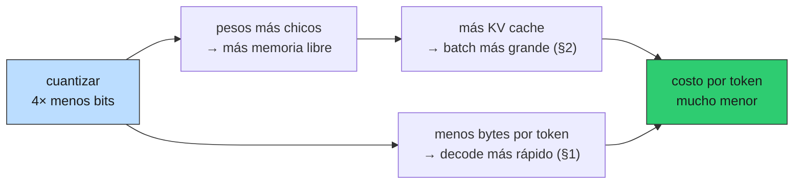

# 03 — Cuantización y destilación: cambiar el modelo, no el uso

## Un tipo distinto de palanca

Todas las palancas de costo vistas hasta acá optimizan **cómo usás** el modelo: el
caché evita llamadas (`03 §4`), el routing manda lo simple a lo barato (`03 §10`),
el prompt más corto mueve menos tokens (§1), el batching reparte el costo fijo
(§2). En ninguna se toca el modelo.

Cuantización y destilación son otra familia: **cambian el modelo mismo**. Eso las
hace mucho más potentes y mucho más peligrosas, porque son las únicas de la lista
que pueden empeorar las respuestas sin que nada en el sistema se entere.

### La analogía: cambiar la tecnología de producción

Las palancas anteriores son mejoras de **eficiencia asignativa**: mismo insumo,
mejor uso. Estas son un cambio en la **función de producción** — se produce con
otra tecnología, más barata, y la pregunta es si el producto sigue siendo el mismo.

Un economista sabe dónde mirar: en el control de calidad, no en el ahorro. El
ahorro está garantizado y es fácil de medir. La pérdida de calidad es difusa,
aparece en la cola de la distribución, y quien tomó la decisión rara vez es quien
la sufre.

Corrida en [`code/03-cuantizacion.py`](../code/03-cuantizacion.py).

## Qué compra la cuantización

Cuantizar es representar cada peso con menos bits. Como el decode está limitado
por ancho de banda (§1), menos bits por peso significa literalmente menos bytes
que mover por token:

```
clase 8B en H100 80GB:
  dtype |    pesos |  cabe |   tok/s |  seqs 4k |  batch ef. |       $/M
------------------------------------------------------------------------
   fp32 |    32 GB |    sí |      73 |       87 |         32 |    0.3435
   bf16 |    16 GB |    sí |     147 |      118 |         32 |    0.1718
    fp8 |     8 GB |    sí |     293 |      133 |         32 |    0.0859
   int8 |     8 GB |    sí |     293 |      133 |         32 |    0.0859
   int4 |     4 GB |    sí |     586 |      141 |         32 |    0.0429
```

De bf16 a int4: 4× menos memoria, 4× más tokens por segundo, 4× menos costo. Un
ahorro proporcional y directo, con la relación más limpia de toda la masterclass.

Pero el caso interesante es el modelo grande:

```
clase 70B en H100 80GB:
  dtype |    pesos |  cabe |   tok/s |  seqs 4k |  batch ef. |       $/M
------------------------------------------------------------------------
   fp32 |   280 GB |    NO |       — |        — |          — |         —
   bf16 |   140 GB |    NO |       — |        — |          — |         —
    fp8 |    70 GB |    sí |      33 |        6 |          6 |    4.0077
   int8 |    70 GB |    sí |      33 |        6 |          6 |    4.0077
   int4 |    35 GB |    sí |      67 |       32 |         32 |    0.3757
```

Dos cosas que no son proporcionales.

**Primero, hay un salto discreto.** En bf16 el modelo no entra en la GPU; en fp8
sí. Eso no es "un poco más barato": es la diferencia entre necesitar dos GPUs con
su interconexión y necesitar una. Es la razón económica por la que los modelos
grandes se sirven casi siempre cuantizados, ya anticipada en §1.

**Segundo, el ahorro real viene del batch, no de la velocidad.** De fp8 a int4 la
velocidad por secuencia apenas se duplica (33 → 67 tokens/s), pero el costo por
millón de tokens cae **11×** ($4.01 → $0.38). ¿De dónde sale la diferencia? De que
los 35 GB liberados son memoria para KV cache, y el batch alcanzable salta de 6 a
32 secuencias. Por §2, el costo por token es inversamente proporcional al batch.

Los tres efectos se componen:



Notá el contraste entre los dos modelos: en el 8B el batch objetivo (32) se
alcanza en todos los dtypes, así que el ahorro es puro efecto de velocidad. En el
70B la memoria es la restricción activa y el ahorro viene casi todo del batch. La
misma palanca opera por mecanismos distintos según dónde esté el cuello.

> **La regla:** cuando algo promete 4× de ahorro por tres vías independientes que
> se multiplican, la pregunta correcta no es cuánto ahorra. Es qué se rompe.

## Lo que la cuantización cuesta, y que este módulo no puede medir

Acá la masterclass se detiene y lo dice explícitamente, según la regla 5 del plan:

> **NO MEDIDO.** No hay ninguna cifra de degradación por cuantización en este
> documento. No tenemos GPU para correr un modelo cuantizado sobre el corpus
> chileno, y no vamos a inventar el número.

Y hay una razón adicional para no tomar prestados los números publicados: los
benchmarks de los proveedores de cuantización miden MMLU, HellaSwag o similares.
Tu pregunta no es esa. Tu pregunta es si un modelo int4 sigue distinguiendo el
régimen del DL 825 antes y después de la Ley 21.210, o si empieza a confundir
"subvención" con "subsidio" (`02 §9`). **Un agregado sobre trivia en inglés no
predice el comportamiento en un dominio estrecho y en español jurídico.**

Lo que sí se puede aportar es el protocolo, y su precio estadístico.

## Cuánto golden hace falta para saber

Antes de cuantizar conviene responder: ¿con cuántas queries de golden podría yo
*detectar* una degradación de X puntos? Es un análisis de potencia estándar:

```
 pass rate base |  caída a detectar |   n mínimo
------------------------------------------------
           90% |               1% |     14,749
           90% |               2% |      3,839
           90% |               5% |        683
           90% |              10% |        197
           90% |              15% |         97
           80% |               5% |      1,091
           80% |              10% |        291
```

El golden chunk-level de `02 §8` tiene **27 queries**. Para detectar con confianza
una caída de 5 puntos desde un 90% harían falta ~683.

La conclusión es incómoda y vale para mucho más que cuantizar:

> Con 27 queries, cuantizar y "no notar diferencia" **no es evidencia de que no
> degradó**. Es evidencia de que el instrumento no tenía resolución para verlo.

Es el mismo límite que `02 §8` ya había marcado al comparar retrievers —ningún
delta era significativo al 5%— y es el argumento económico de B6 en el backlog:
expandir el corpus no es coleccionismo, es comprar poder estadístico para poder
tomar decisiones como esta.

## El protocolo, ilustrado

Con datos **sintéticos** —repito: sintéticos, no una medición de ningún modelo
real— se ve cómo se lee el resultado. Ambos casos simulan la *misma* degradación
verdadera de 5 puntos:

```
n= 27 queries | delta observado  -7.4% | IC95% [-22.2%,  +7.4%] | ¿significativo? no
n=300 queries | delta observado  +6.0% | IC95% [ +0.7%, +11.3%] | ¿significativo? SÍ
```

Mirá el caso de n=27 con atención: el delta observado salió con **el signo
equivocado**. La muestra chica no solo falla en detectar la degradación; sugiere
que el modelo cuantizado es *mejor*. Alguien apurado que corriera ese experimento
publicaría exactamente la conclusión opuesta a la verdad, con un número que parece
respetable.

El aparato es el bootstrap de `01 §8`: literalmente la misma función
`bootstrap_ci` importada desde `retrieval_lib`. Que la misma herramienta sirva
para comparar retrievers y para decidir una cuantización es la señal de que `01`
hizo bien su trabajo.

**El protocolo completo**, entonces:

1. Fijar de antemano el delta que te importaría (¿5 puntos de faithfulness te
   parecen tolerables? ¿2?).
2. Calcular el `n` necesario. Si tu golden no llega, la decisión previa es
   expandir el golden — no cuantizar a ciegas.
3. Correr base y candidato sobre el **mismo** golden, pareado.
4. Bootstrap del delta. Si el IC cruza cero, no concluiste nada.
5. Mirar aparte las categorías de alto riesgo de `01 §12` (citas, abstención,
   alucinación normativa): la degradación por cuantización tiende a concentrarse
   en las tareas que requieren precisión, que son justo las caras en dominio legal.

El paso 5 importa más de lo que parece. Un promedio global puede moverse un punto
mientras la tasa de citas correctas se cae diez. En un producto regulatorio, ese
promedio estable es una mentira tranquilizadora.

## Destilación: el caso donde el dominio estrecho gana

La destilación entrena un modelo chico para imitar a uno grande. A diferencia de
la cuantización —que es una transformación mecánica y agnóstica al uso—, la
destilación se hace **sobre una distribución de tareas concreta**: la tuya.

Eso invierte la lógica competitiva. Un modelo destilado es peor que su maestro en
general, pero puede igualarlo en el subconjunto estrecho para el que fue
destilado. Y "responder preguntas sobre normativa tributaria y presupuestaria
chilena" es un subconjunto **muy** estrecho del espacio de tareas de un modelo de
frontera.

Es la misma tesis de foso que atraviesa el repo, aplicada al modelo: no competís
con un laboratorio en capacidad general; explotás que tu distribución de uso es
angosta y que tenés datos de ella que ellos no tienen.

Las condiciones para que valga la pena son exigentes, y conviene ser franco:

- **Volumen suficiente** para amortizar el entrenamiento y la operación. Si hacés
  10.000 queries al mes, el ahorro no paga el trabajo. Este es el mismo cálculo
  de escala mínima eficiente de §4.
- **Distribución estable.** Si el tipo de preguntas cambia cada trimestre, el
  modelo destilado envejece y hay que re-destilar.
- **Un golden que valga.** Todo el párrafo anterior sobre potencia estadística
  aplica igual, y con más razón: la destilación puede degradar de formas más
  idiosincráticas que la cuantización.

> **Puente con governance (B9).** Un fine-tuning sustancial —y una destilación lo
> es— puede reclasificar a un *deployer* como *provider* bajo la EU AI Act, con
> las obligaciones que eso arrastra. La decisión de destilar no es solo técnica y
> económica: tiene consecuencias regulatorias. El documento de governance de 05
> desarrolla el punto; las fechas y umbrales concretos están marcados para
> verificar contra fuente primaria antes de afirmarlos.

## Estado del arte (2026)

| Aspecto | Estado | Detalle |
|---|---|---|
| int8 / fp8 para servir | ✅ Estándar | Degradación reportada como mínima; es el default en producción |
| int4 (GPTQ, AWQ) | 🟢 Maduro | Degradación real pero acotada; hay que medirla en tu dominio |
| Cuantización nativa en entrenamiento | 🟢 En auge | Modelos entrenados en fp8/fp4 desde el principio; mejor que cuantizar después |
| Cuantización del KV cache | 🟢 En adopción | Ataca el otro recurso escaso (§1); menos madura que la de pesos |
| Destilación en dominio estrecho | 🟢 Probada | El caso de uso donde más rinde; requiere volumen y datos propios |
| Benchmarks de degradación por dominio | 🔴 No existen | Todo se publica sobre benchmarks generales en inglés; tu dominio no está |
| Degradación desigual por tipo de tarea | 🟡 Sub-reportado | Se reportan promedios; la caída se concentra en tareas de precisión |
| Fine-tuning y reclasificación regulatoria | 🟡 Área activa | El umbral de "modificación sustancial" bajo la AI Act no está del todo asentado |

Las dos filas rojas y amarillas del final son la razón por la que esta sección
insiste tanto en el protocolo: la industria publica promedios agregados sobre
tareas que no son la tuya, y el modo de falla que más te importa —degradación
concentrada en precisión de citas— es justamente el peor reportado.

## Lo que viene en la próxima sección

§3 mostró que un modelo se puede achicar hasta caber en una sola GPU. §4 hace la
pregunta que sigue naturalmente: **¿conviene que esa GPU sea tuya?** Con el
`batch_efectivo` de esta sección como denominador, el cálculo del punto de
equilibrio contra la tarifa de una API se vuelve concreto.

## Conexiones

- **§1 (mecánica)**: cuantizar funciona porque el decode es memory-bound. Menos
  bits por peso es menos bytes que mover, directamente.
- **§2 (batching)**: el efecto grande no es la velocidad sino el batch que la
  memoria liberada habilita. Sin §2, el ahorro de §3 parece proporcional; no lo es.
- **`01 §8` (estadística)**: el `bootstrap_ci` que decide si la degradación es
  real es el mismo, importado literalmente.
- **`01 §12` (dominios alto-stake)**: las métricas de citas y abstención son las
  que hay que mirar aparte; el promedio global esconde justo lo que importa.
- **`02 §8` (evaluación aislada)**: su advertencia sobre n=27 se vuelve acá una
  restricción operativa concreta, y el argumento económico de B6.
- **`03 §8` (versionado)**: un modelo cuantizado es un modelo nuevo. Se despliega
  con shadow o canary, no con un cambio de configuración.
- **B9 (governance)**: destilar puede cambiar tu rol regulatorio bajo la AI Act.
