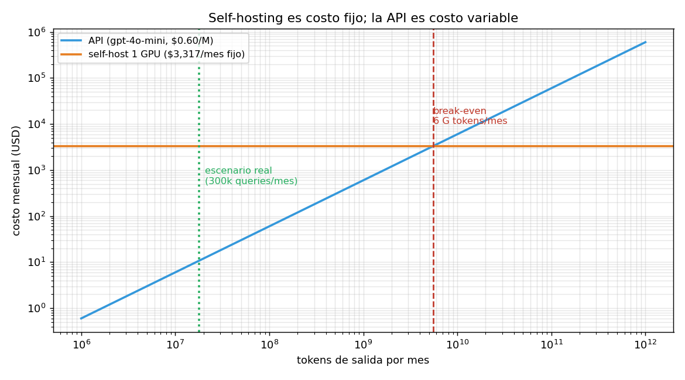

# 04 — Self-hosting vs. API: la escala mínima eficiente

## La pregunta mal planteada

"¿Puedo alojar mi propio modelo?" es una pregunta técnica, y la respuesta es sí:
§3 mostró que un modelo de clase 70B cuantizado a int4 entra en una sola GPU. Con
vLLM y una tarde, cualquiera lo levanta.

Pero es la pregunta equivocada. La correcta es económica: **¿a qué volumen deja de
ser obvio que conviene la API?** Y esa tiene un número.

### La analogía: escala mínima eficiente

Las dos opciones tienen estructuras de costos opuestas:

- **La API es costo puramente variable.** Cero costo fijo, precio por token. Si no
  la usás, no pagás.
- **El self-hosting es costo fijo.** La GPU cuesta lo mismo esté saturada o
  vacía. El costo por token es una función decreciente del volumen.

Es el problema de la **escala mínima eficiente** de manual: hay un volumen por
debajo del cual la tecnología de costos fijos no compite, por mejor que sea. La
pregunta no es cuál tecnología es superior, sino de qué lado del umbral estás.

Corrida en [`code/04-self-hosting.py`](../code/04-self-hosting.py).

## Las dos curvas

Configuración self-host: clase 8B en int4, batch 64, en una H100 80GB — el mejor
perfil que §3 permitió. Contra `gpt-4o-mini` a $0.60 por millón de tokens de
salida.

```
   queries/mes |   tokens out |      API $ |  self-host $ |       gana
----------------------------------------------------------------------
        10,000 |      600,000 |          0 |        3,317 |        API
       100,000 |    6,000,000 |          4 |        3,317 |        API
     1,000,000 |   60,000,000 |         36 |        3,317 |        API
    10,000,000 |  600,000,000 |        360 |        3,317 |        API
   100,000,000 | 6,000,000,000 |      3,600 |        3,317 |  self-host
```

El cruce está entre 10 y 100 millones de queries mensuales. Con más precisión:

```
 SIN contar operación (el cálculo ingenuo):
     3,528 M tokens de salida/mes = 58.8 M queries/mes = 22.7 queries/s sostenidas

             contando operación [estimado]:
     5,528 M tokens de salida/mes = 92.1 M queries/mes = 35.5 queries/s sostenidas
```



**35 queries por segundo sostenidas, todo el mes, sin pausa nocturna ni fines de
semana.** Conviene detenerse en esa magnitud antes de seguir: es tráfico de un
producto de consumo masivo, no de un SaaS B2B.

Notá también el efecto de incluir la operación: mover el costo de operación de $0
a $1.200 mensuales sube el umbral un 57%. El cálculo ingenuo —el que solo compara
horas de GPU contra tarifa— no se equivoca por poco.

## La utilización, que es donde está la trampa

Acá el modelo produce un resultado que matiza lo anterior y conviene no esconder:

```
 utilización |   tokens usados |   $/M tokens |     vs API
----------------------------------------------------------
         1% |           986 M | $     3.364 |       5.6×
         5% |         4,930 M | $     0.673 |       1.1×
        15% |        14,790 M | $     0.224 |       0.4×
        30% |        29,581 M | $     0.112 |       0.2×
        50% |        49,301 M | $     0.067 |       0.1×
        70% |        69,022 M | $     0.048 |       0.1×
        90% |        88,742 M | $     0.037 |       0.1×
```

En términos de **utilización**, el umbral es apenas ~5-6%. Eso suena
perfectamente alcanzable, y es la cifra que hace que el self-hosting parezca
razonable en una conversación de sobremesa.

La trampa es que 5% de una H100 sirviendo un 8B en int4 son **4.930 millones de
tokens al mes**. La utilización baja no es un problema de eficiencia operativa que
se pueda mejorar con mejor ingeniería: es que la GPU es enorme en relación al
tráfico de un producto B2B nicho. Estás comprando una fábrica para hacer
artesanías.

Y hay un techo por arriba: §2 demostró que operar por encima del 80% de
utilización hace explotar la latencia. Así que tampoco se puede compensar un
volumen mediocre "exprimiendo" la GPU — exprimirla arruina el producto. La
holgura obligatoria del 20-30% **es parte del costo del servicio**, no un
desperdicio a eliminar.

## Lo que la comparación ingenua omite

```
                                             costo |   tratamiento |                   magnitud
-----------------------------------------------------------------------------------------------
  Horas de GPU ociosa (holgura obligatoria por §2) |  en el modelo |     20-30% de la capacidad
                               Operación y guardia |      estimado |                 $1,200/mes
                    Actualización a modelos nuevos |   NO modelado | recurrente, cada pocos meses
         Redundancia (una GPU = un punto de falla) |   NO modelado |           ×2 el costo fijo
                             Cold start al escalar |   NO modelado |  minutos de carga de pesos
            Costo de oportunidad del tiempo propio |   NO modelado |     el más grande de todos
      Riesgo de quedarse atrás del estado del arte |   NO modelado |         difícil de valorar
```

Lo importante de esta tabla no es cada fila, sino que **todos los no modelados
empujan en la misma dirección**: encarecen el self-hosting. El modelo ya es
generoso con la opción propia —le da el mejor perfil de cuantización, le perdona
la redundancia, no le cobra el tiempo del dueño— y aun así pierde.

Cuando un modelo sesgado a favor de una opción concluye en contra de ella, la
conclusión es robusta. Es el mismo principio que hace valiosa una cota inferior.

De la lista, la que más se subestima es **el costo de oportunidad del tiempo
propio**. Para el perfil de este proyecto —una persona construyendo productos
verticales sobre corpus chileno— cada hora dedicada a depurar un servidor de
inferencia es una hora que no se dedica a curar el corpus o a modelar la ontología
del dominio, que es donde está el foso (§6 y el módulo 05). El self-hosting no
compite solo contra la tarifa de la API: compite contra el mejor uso alternativo
de tu atención.

## El veredicto para este proyecto

```
Escenario: producto B2B chileno, 300,000 queries/mes
  tokens de salida:      18,000,000
  costo API:             $     10.80/mes
  costo self-host:       $  3,317.00/mes
  ratio:                        307× más caro
  utilización de la GPU:     0.018%
```

Cincuenta instituciones haciendo 200 consultas diarias cada una — un producto B2B
chileno exitoso — generan **$10.80 mensuales** de costo de inferencia. Menos que
el almuerzo de un día.

> En este escenario el self-hosting no es una decisión difícil: es un error de dos
> a tres órdenes de magnitud, disfrazado de soberanía tecnológica.

Y el número tiene una segunda lectura, más útil que la primera: si el costo de
inferencia de tu producto son $10.80 al mes, **optimizarlo no es donde está tu
problema**. Toda la disciplina de `03 §10` (presupuestos, routing, alertas de
quema) es infraestructura para cuando el número importe; a esta escala, el tiempo
rinde infinitamente más en el corpus, la ontología y la distribución. §6 vuelve
sobre esto con el margen del producto entero.

## Cuándo el self-hosting gana por razones no económicas

El cálculo de arriba es de costo. Hay argumentos legítimos que no son de costo, y
conviene evaluarlos con el mismo rigor en vez de aceptarlos como evidentes:

- **Residencia de datos y confidencialidad.** El argumento fuerte cuando procesás
  documentos de clientes bajo confidencialidad —contratos, expedientes, sumarios—.
  Pero notá que para el corpus de este proyecto es **débil**: normativa, glosas
  presupuestarias y Diario Oficial son documentos *públicos*. Mandar a una API un
  decreto que está publicado en el Diario Oficial no expone nada. El argumento
  aplica a los documentos que suben los clientes, no al corpus base — y eso sugiere
  una arquitectura mixta antes que self-hosting completo.
- **Previsibilidad regulatoria.** Real en sectores con exigencias explícitas de
  localización. En Chile, para datos públicos, no hay tal exigencia. Conviene no
  inventarse una obligación que no existe: es un patrón común y caro.
- **Independencia del proveedor.** Legítimo, pero el seguro se compra más barato
  con la abstracción `LLMClient` de `03 §2` —que permite cambiar de proveedor en
  una línea de configuración— que con una GPU propia. Poder migrar vale casi lo
  mismo que no depender, a una fracción del costo.
- **Latencia previsible.** §2 mostró que tu p95 depende de la utilización del
  proveedor. Una GPU propia con tráfico bajo da latencia estable. Es el argumento
  no-económico más sólido de la lista, y aun así hay que preguntarse cuánto vale
  ese p95 estable en pesos.

La regla honesta: **si el argumento es no-económico, ponele precio igual**. "No
quiero depender de un proveedor" es una preferencia válida; "no quiero depender de
un proveedor y me cuesta $3.300 al mes cuando la alternativa cuesta $11" es una
decisión informada.

## Estado del arte (2026)

| Aspecto | Estado | Detalle |
|---|---|---|
| Servidores de inferencia open source | ✅ Maduro | vLLM, SGLang, TGI; el problema técnico está resuelto |
| Modelos abiertos competitivos | 🟢 Cada vez mejores | La brecha con la frontera se acorta en tareas acotadas |
| GPU on-demand por hora | 🟢 Commodity | Runpod, Lambda, Modal; el precio/hora es lo más volátil (§5) |
| Serverless GPU (pago por segundo) | 🟢 En auge | Cambia la estructura: acerca el self-hosting al costo variable |
| Break-even realista para SaaS nicho | 🔴 Muy lejos | Órdenes de magnitud por encima del tráfico típico B2B |
| Fine-tune servido por el proveedor | 🟢 Alternativa mediana | Adaptación de dominio sin operar infraestructura |
| Argumento de residencia de datos | 🟡 Depende del corpus | Fuerte con documentos de clientes; débil con normativa pública |

La fila a vigilar es **serverless GPU**: si el pago por segundo con cold starts
tolerables se generaliza, la dicotomía costo-fijo/costo-variable de esta sección se
difumina y el análisis hay que rehacerlo. Es exactamente el tipo de supuesto con
fecha de caducidad del que trata §5.

## Lo que viene en la próxima sección

Todo el análisis de esta sección descansa en dos precios: $2.90 la hora de GPU y
$0.60 el millón de tokens. Ambos caen rápido, y no necesariamente al mismo ritmo.
§5 pregunta qué pasa con estas conclusiones cuando los precios se mueven — y cómo
escribir un modelo de costos que no haya que rehacer cada trimestre.

## Conexiones

- **§2 (batching)**: el techo de utilización del 80% sale de ahí. Sin ese techo, el
  self-hosting parecería mucho mejor de lo que es.
- **§3 (cuantización)**: el `batch_efectivo` con el mejor perfil int4 es el
  denominador de todo el cálculo. Le dimos al self-hosting su mejor configuración.
- **`03 §2` (puertos y adaptadores)**: `LLMClient` compra la independencia del
  proveedor por una fracción del costo de una GPU propia.
- **`03 §7` (despliegue)**: la tesis de "Kubernetes es over-engineering para el
  95% de estos productos" es la misma de esta sección aplicada a otra capa.
- **`03 §10` (costo en producción)**: a $10.80 mensuales, ese aparato es
  infraestructura para cuando el número importe, no una urgencia.
- **§5 (deriva)**: los dos precios que sostienen este análisis tienen fecha de
  caducidad.
- **§6 (unit economics)**: acá se calculó el costo; allá se convierte en margen.
