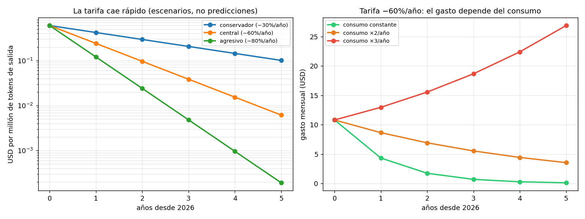

# 05 — Deriva de precios: escribir un modelo de costos que no caduque

## El problema con las cuatro secciones anteriores

§1 a §4 produjeron números concretos: $0.60 por millón de tokens, $2.90 la hora de
GPU, un break-even en 92 millones de queries mensuales, un costo de $10.80 al mes.

Todos son falsos dentro de dos años. No aproximadamente falsos: **falsos por un
factor grande**. Y lo peor de un número caduco no es que esté mal, sino que sigue
pareciendo respetable — está impreso, tiene decimales, viene de un cálculo.

Esta sección es sobre eso: qué se mueve, qué no, y cómo escribir análisis
económicos que envejezcan bien.

### La analogía: precios nominales y precios relativos

Un economista tiene entrenamiento específico para esto. Nadie compara un salario
de 1995 con uno de 2026 sin deflactar, ni evalúa una política mirando el gasto
nominal. La disciplina es separar el **nivel** (que se mueve con todo lo demás) de
los **precios relativos y las estructuras** (que son la información real).

Un modelo de costos de inferencia escrito en niveles nominales tiene exactamente el
mismo defecto que un informe de gasto público sin deflactar. La solución también es
la misma: razonar en ratios, parametrizar los niveles, y fechar todo.

Corrida en [`code/05-deriva-precios.py`](../code/05-deriva-precios.py).

## Cuán rápido caduca un número

Tres escenarios de caída anual de tarifa —**escenarios parametrizados, no
predicciones**— aplicados a la tarifa de referencia:

```
     escenario |  caída/año |    año 0 |    año 1 |    año 2 |    año 3
------------------------------------------------------------------
   conservador |       30% | $ 0.6000 | $ 0.4200 | $ 0.2940 | $ 0.2058
       central |       60% | $ 0.6000 | $ 0.2400 | $ 0.0960 | $ 0.0384
      agresivo |       80% | $ 0.6000 | $ 0.1200 | $ 0.0240 | $ 0.0048
```

En el escenario central, el precio de hoy es **16 veces** el de dentro de tres
años. Un documento que hoy afirme "esta arquitectura cuesta $500 al mes" estará
equivocado por 16× en el horizonte en que la gente todavía lo va a estar leyendo.



> Los tres escenarios son supuestos fechados en 2026-08, elegidos para cubrir un
> rango plausible. No hay ninguna afirmación acá sobre cuál va a ocurrir. El valor
> del ejercicio no está en acertar la tasa: está en ver **qué conclusiones cambian
> de signo** según cuál sea.

## La paradoja de Jevons

Acá está el resultado que contradice la intuición cómoda de "no te preocupes por el
costo, va a bajar". Con la tarifa cayendo 60% anual, y variando cuánto crece el
consumo por año:

```
     crecimiento del consumo |     año 0 |     año 1 |     año 2 |     año 3 |     año 4
----------------------------------------------------------------------------------------
           consumo constante | $   10.80 | $    4.32 | $    1.73 | $    0.69 | $    0.28
            consumo +50%/año | $   10.80 | $    6.48 | $    3.89 | $    2.33 | $    1.40
   consumo ×2/año (agéntico) | $   10.80 | $    8.64 | $    6.91 | $    5.53 | $    4.42
              consumo ×3/año | $   10.80 | $   12.96 | $   15.55 | $   18.66 | $   22.39
```

Con el consumo creciendo al triple anual, **el gasto sube pese a que la tarifa
cae 60% por año**. Es la paradoja de Jevons de manual: abaratar un insumo aumenta
su consumo lo suficiente como para que el gasto total crezca.

Y el escenario de consumo ×2 o ×3 anual no es rebuscado, es la trayectoria que ya
se ve. Cada cosa que la industria adoptó entre 2024 y 2026 empuja el consumo por
query hacia arriba:

- **Contextos más largos**: donde antes ibas con 5 chunks, ahora vas con 50.
- **Pasos agénticos**: una query del usuario ya no es una llamada al modelo, son
  N. El módulo 06 (harness) trata justamente esto, y §8 de ese módulo mide la
  varianza de costo por tarea que introduce.
- **Reintentos, verificación, auto-crítica**: cada capa de calidad cuesta llamadas.
- **Razonamiento extendido**: los modelos que "piensan" antes de responder generan
  muchos tokens que el usuario nunca ve, y que se pagan igual.

> **"Va a bajar de precio" no es un plan de costos.** La tarifa baja; tu consumo
> por query sube más rápido. La disciplina de `03 §10` no es transitoria.

## Qué le pasa a la conclusión de §4

La prueba de fuego: ¿el veredicto sobre self-hosting sobrevive a la deriva?

Suponiendo que la hora de GPU cae la **mitad** de rápido que la tarifa —el hardware
es un bien físico con costos de fabricación, mientras la tarifa incorpora también
mejoras de software y competencia—:

```
  año |  tarifa API |   GPU $/h |  break-even queries/mes
--------------------------------------------------------
    0 | $    0.6000 | $    2.90 |                    92 M
    1 | $    0.2400 | $    2.03 |                   186 M
    2 | $    0.0960 | $    1.42 |                   388 M
    3 | $    0.0384 | $    0.99 |                   836 M
```

**El break-even se aleja.** Cada año que pasa, self-hostear requiere más volumen
para tener sentido, porque la tarifa cae más rápido que el hardware. La conclusión
de §4 no solo sobrevive: se refuerza con el tiempo.

Esto es lo que hace útil el análisis de sensibilidad. No confirmó una conclusión
—eso sería sospechoso—, mostró **por qué** es robusta: no depende del nivel de los
precios sino del ratio entre dos tasas de caída, y ese ratio tiene una razón
estructural para mantenerse (software vs. hardware).

El supuesto que la rompería, y hay que decirlo: si el hardware cayera *más* rápido
que la tarifa —por ejemplo, con un exceso de capacidad de GPUs que desplomara el
precio del alquiler mientras los proveedores sostienen márgenes—, el break-even se
acercaría. Es el escenario a vigilar.

## Inventario: qué es robusto y qué es perecedero

```
                                            conclusión |       clase |                    por qué
-------------------------------------------------------------------------------------------------
                El output cuesta más que el input (§1) |     ROBUSTA |       es física, no precio
 Recuperar de más es barato, responder largo caro (§1) |     ROBUSTA |         ratio, no absoluto
           El batching da costo medio decreciente (§2) |     ROBUSTA |       estructura de costos
       La latencia explota cerca de la saturación (§2) |     ROBUSTA |            teoría de colas
               Cuantizar exige medir en tu golden (§3) |     ROBUSTA |          método, no número
    La API gana al self-hosting en este escenario (§4) |    ROBUSTA+ |  se refuerza con el tiempo
          El break-even está en ~92 M queries/mes (§4) |  PERECEDERA | se mueve con ambos precios
                         La API cuesta $10.80/mes (§4) |  PERECEDERA |            caduca en meses
              $/M tokens de cada modelo (todo el repo) |  PERECEDERA |   centralizada en prod_lib
                 Un 70B bf16 no cabe en 80 GB (§1, §3) |        SEMI | cambia si cambia el hardware
```

El patrón es nítido y vale como regla general:

> Las conclusiones robustas son **ratios, estructuras o métodos**. Las perecederas
> son, sin excepción, **niveles absolutos en dólares**.

Eso da una heurística concreta al escribir: cada vez que una frase contiene un
signo de dólar sin fecha al lado, es candidata a caducar. Cada vez que contiene un
"×" o un "más que", probablemente sobreviva.

## Cómo escribir para que envejezca bien

Cuatro reglas, todas aplicadas en este repo:

1. **Los niveles viven en un solo lugar.** Todas las tarifas del repo salen de
   `prod_lib.PRICING_USD_PER_M_TOKENS`; ni esta masterclass las duplica. Cuando
   caduquen, caducan en un archivo. Es la decisión 3 del plan maestro, y es esta
   sección aplicada al propio repositorio.
2. **Razonar en ratios.** "El output cuesta 4-5× el input" sobrevive a cualquier
   cambio de nivel. "El output cuesta $10 por millón" no llega a fin de año.
3. **Fechar todo supuesto.** Las specs de GPU llevan su fuente; los precios/hora
   están marcados `[dato estimado]`; los escenarios de caída están fechados en
   2026-08. Un supuesto sin fecha es un supuesto que alguien va a tomar por hecho.
4. **Hacer sensibilidad, no predicción.** La pregunta útil nunca es "¿cuánto va a
   costar en 2029?". Es "¿qué decisión cambia si el precio cae 30% en vez de 60%?".
   La mayoría de las veces la respuesta es *ninguna*, y eso es exactamente lo que
   uno quiere saber.

La regla 4 tiene una consecuencia práctica que vale para el resto del repo: **si
una decisión no cambia de signo en ningún escenario razonable, dejá de analizarla
y tomala.** Buena parte del tiempo que se gasta refinando estimaciones de costo se
gastaría mejor en el corpus.

## Estado del arte (2026)

| Aspecto | Estado | Detalle |
|---|---|---|
| Caída sostenida del $/token | 🟢 Hecho establecido | Varios años consecutivos; la tasa exacta se discute, la dirección no |
| Caída del costo de capacidad equivalente | 🟢 Más rápida que el hardware | Mejoras de software (batching, cuantización, arquitectura) se acumulan |
| Crecimiento del consumo por query | 🟢 Más rápido que la caída | Contexto, agentes, razonamiento extendido; todos empujan arriba |
| Efecto Jevons en gasto agregado | 🟢 Observado | El gasto total de la industria sube mientras el precio unitario baja |
| Precio de GPU on-demand | 🟡 Volátil en ambos sentidos | Depende de ciclos de capacidad; el supuesto más frágil de esta sección |
| Modelos de costo con fecha de caducidad explícita | 🔴 Rareza | Casi ningún análisis publicado fecha sus supuestos |
| Predicciones a 3+ años de precio unitario | 🔴 No confiables | Ni las de la industria ni las de terceros; usar escenarios |

La última fila merece énfasis: esta sección no predice nada, y la ausencia de
predicción es deliberada. Las dos filas rojas son el hueco que este módulo intenta
no repetir.

## Lo que viene en la próxima sección

Las cinco secciones anteriores calcularon **costo**. §6 hace la pregunta que un
producto necesita responder: **margen**. El costo por query es un insumo; lo que
decide si el negocio existe es cuánto queda después de restar el costo de servir a
un cliente del precio que ese cliente paga — y ahí la distribución importa más que
la media, igual que en `03 §10`.

## Conexiones

- **§4 (self-hosting)**: su conclusión pasa la prueba de sensibilidad y se
  refuerza. Su break-even numérico, en cambio, es perecedero.
- **`03 §10` (costo en producción)**: ahí se dijo que la caída de precios no relaja
  la disciplina porque el tráfico crece más rápido. Acá está el mecanismo con
  números: Jevons.
- **`03 §8` (versionado de modelos)**: la deriva de precios es una razón recurrente
  para migrar de modelo; shadow y canary son cómo se hace sin susto.
- **Plan maestro (decisión 3)**: centralizar las tarifas en `prod_lib` es esta
  sección aplicada al repo antes de escribirla.
- **06-harness (§8, planificado)**: el consumo ×2-×3 anual viene sobre todo de los
  bucles agénticos. Ahí se mide.
