# 00 — Plan Maestro: Ontologías y Representación del Conocimiento

> Estado tras B13 (2026-08-04): implementado sobre 40 documentos, 38 nodos
> normativos y 69 relaciones literales. §8 conserva las 30 queries de retrieval;
> §9 usa un golden estructural separado de 18 preguntas × 3 réplicas.

## Objetivo de la masterclass

Formalizar algo que el autor ya practica sin nombrarlo: clasificar el mundo
regulatorio chileno en categorías, jerarquías y relaciones. Al terminar,
deberías poder responder con propiedad: *¿qué estructura de conocimiento
necesita mi corpus, cuánto formalismo compra esa estructura, y cuándo un grafo
de conocimiento paga su costo de construcción frente a un buen filtro de
metadatos?*

Esta es la capa que el [README del repo](../../README.md) marca como
**"representación del conocimiento"** — la segunda de las cuatro capas
invariantes de un producto sobre corpus legal, entre la ingestión (`02 §4`) y
el retrieval (`02` completo, `06-harness`). Hasta acá, el repo trató el corpus
como una bolsa de documentos con metadata plana (`doc_type`, `organismo`,
`vigencia_desde/hasta` en `02 §7` y `§9`). Esta masterclass pregunta qué se
gana al hacer explícitas las **relaciones** entre esos documentos: qué
modifica a qué, qué reglamenta a qué, qué cita a qué — y si esa estructura,
una vez construida, mejora el retrieval o es una capa de complejidad que no
se gana su lugar.

## El encuadre: no es una disciplina nueva, es la que ya ejercés

Un clasificador presupuestario chileno —partida → capítulo → programa →
subtítulo → ítem → asignación— es una ontología. COFOG (clasificación
funcional del gasto), CIIU (actividad económica), CIUO (ocupación) y UNSPSC
(el código que `resolucion-01-chilecompra-compra-agil.txt` exige para cada
compra ágil) también lo son. Un economista de finanzas públicas pasa la
carrera discutiendo si dos partidas son "la misma cosa" bajo dos
clasificadores distintos — que es exactamente el problema de identidad de
entidades que la sección 4 formaliza.

Esta masterclass no enseña una disciplina ajena al dominio del autor. Le pone
nombre técnico (ontología, grafo de conocimiento, entity resolution,
bitemporalidad) a una práctica que el autor ya ejerce con otro vocabulario, y
la conecta con las herramientas de IA que el resto del repo construyó.

## Por qué ahora y no antes

Dos prerrequisitos que este plan da por cumplidos:

1. **El corpus tiene densidad de relaciones.** `B6` expandió
   `shared/corpus_chileno/` de 16 a 40 documentos organizados en cuatro
   clusters (compras públicas, tributario ampliado, presupuesto y ejecución,
   probidad + educación pública) diseñados explícitamente con cadenas de
   citas verificadas: ley → reforma → reglamento → resolución → dictamen. Un
   grafo sobre 16 documentos dispersos no habría mostrado nada; este corpus
   sí tiene aristas reales que extraer.
2. **`02 §9` dejó la pregunta abierta.** Al cerrar la masterclass de
   retrieval, la sección de casos límite marcó explícitamente: *"el modelo
   'doc reemplaza doc' se queda corto; el modelo correcto es a nivel
   artículo. Eso ya es retrieval de grano fino con versionado — el área
   donde se puede invertir mucho tiempo... y donde los productores serios
   diferencian."* La sección 6 de este módulo retoma esa frase literalmente.

## Honestidad sobre el método: el grafo tiene que ganarse el lugar

La tentación de esta masterclass es construir un grafo bonito y declararlo
superior por default. Se resiste activamente, con una regla explícita:

> **Todo lo que el grafo aporte se mide contra el retrieval híbrido de `02`,
> con el mismo aparato estadístico de `01 §8` (deltas + IC bootstrap). Si el
> grafo no gana, el resultado negativo se publica igual.**

Es la misma disciplina que `04 §4` aplicó a self-hosting (donde ganó la API)
y que `01 §10` aplica a cualquier técnica nueva: la mejora en evals es la
puerta de entrada, no la promesa de venta. GraphRAG tiene un problema de
costo real y bien documentado (Microsoft, 2024-25); esta masterclass no lo
ignora.

## Hilo conductor

El corpus regulatorio chileno de `shared/corpus_chileno/` (40 documentos,
`B6`), el golden de retrieval de `02-retrieval/examples/golden-retrieval.json`
(30 queries, reutilizado sin modificar) y el retrieval híbrido ya construido
en `02`. Sobre esa base, cada sección agrega una capa de representación:

```mermaid
graph LR
    Q["§1 Qué es una<br/>ontología"] --> M["§2 Modelar el<br/>dominio chileno"]
    M --> F["§3 Cuánto<br/>formalismo"]
    F --> I["§4 Identidad y<br/>llaves canónicas"]
    I --> E["§5 Extraer la<br/>ontología del corpus"]
    E --> T["§6 Vigencia<br/>temporal"]
    T --> G["§7 Del grafo al<br/>retrieval (GraphRAG)"]
    G --> V["§8 Evaluar con<br/>ontología"]
    V --> FOSO["§9 La ontología<br/>como foso"]

    style Q fill:#bdf,stroke:#333,color:#1a1a1a
    style FOSO fill:#fd9,stroke:#333,color:#1a1a1a
```

Las secciones 1-4 son conceptuales y de diseño (qué construir y cuánto).
Las secciones 5-6 construyen el grafo real. Las secciones 7-8 lo confrontan
con el retrieval existente. La sección 9 cierra con el argumento de
posicionamiento.

## Temario

### Sección 1 — Qué es una ontología y por qué ya construiste varias
- Taxonomía (jerarquía is-a) vs. tesauro (sinónimos, términos relacionados)
  vs. ontología (entidades + relaciones tipadas + axiomas) vs. grafo de
  conocimiento (una ontología instanciada con datos concretos).
- El clasificador presupuestario chileno como ontología de facto: sus
  entidades (partida, capítulo, programa, subtítulo, ítem, asignación) y sus
  relaciones (contiene, se financia con) ya tienen la forma exacta de una
  ontología, sin que nadie la haya llamado así.
- UNSPSC en `resolucion-01-chilecompra-compra-agil.txt`: una taxonomía
  externa que el corpus ya usa y de la que depende una obligación legal
  (clasificar correctamente es requisito de publicación).
- Qué gana un sistema RAG al tener la estructura explícita en vez de
  implícita en el texto: consultas que hoy son imposibles (¿qué normas
  modifican al DL 825?) se vuelven una travesía de grafo.

### Sección 2 — Modelado del dominio regulatorio chileno
- Entidades del dominio: Norma (ley, decreto, circular, resolución,
  dictamen, oficio), Artículo, Organismo, Instrumento presupuestario
  (partida/capítulo/programa/asignación), Obligación.
- Relaciones tipadas: MODIFICA, DEROGA, REGLAMENTA, CITA, APLICA,
  INTERPRETA — extraídas literalmente del vocabulario que el propio corpus
  usa ("modifícanse las siguientes...", "reglamenta la Ley N°...").
- *Competency questions* como método de diseño: antes de modelar, escribir
  las preguntas que la ontología debe poder responder (¿qué normas
  modifican al DL 825? ¿qué dictámenes citan la Ley 20.248?). Es el análogo
  de especificar las hipótesis antes de correr la regresión — método que ya
  se usó en `01 §4` para golden datasets.
- El esquema resultante, en Pydantic: la misma decisión de diseño que
  `retrieval_lib.Chunk` y `prod_lib.PromptTemplate`, aplicada a entidades y
  relaciones.

### Sección 3 — Cuánto formalismo comprar
- Espectro: lista de sinónimos < SKOS (jerarquías + relaciones simples,
  estándar W3C liviano) < property graph pragmático (nodos y aristas con
  atributos, sin lógica de inferencia) < RDF/OWL con razonador (axiomas,
  inferencia automática, la maquinaria completa de la web semántica).
- Honestidad de campo: casi ningún producto necesita razonamiento OWL. La
  inferencia automática de axiomas es la parte más vendida y menos usada de
  la disciplina.
- Regla de decisión explícita: si las *competency questions* de §2 se
  responden con `MATCH` de dos-tres saltos, un property graph alcanza. Si
  requieren inferir transitividad no explícita o clasificación automática,
  ahí — y solo ahí— se justifica más formalismo.
- Decisión tomada para el módulo: property graph con `networkx` +
  esquema Pydantic. Se justifica por qué no se usa Neo4j, RDF ni un
  razonador OWL para este corpus y esta escala.

### Sección 4 — Identidad y llaves canónicas
- El problema de entity resolution, con ejemplos presentes en el corpus:
  nombre completo, forma corta y `CHILECOMPRA` para la Dirección de Compras;
  el RUT de un organismo es su
  llave canónica, nunca el nombre libre — la doctrina #6 del portfolio
  aplicada aquí con ejemplos concretos.
- Es *record linkage*, técnica que el autor ya usa en trabajo de economía
  aplicada (microdatos administrativos, DIPRES): mismo problema, otro
  dominio.
- Estrategia de resolución: normalización + diccionario de sinónimos
  (reutilizando `expand_synonyms` de `02 §9`) antes de recurrir a
  similitud difusa, y por qué el orden importa (barato y determinista
  primero, costoso y probabilístico después).
- Caso límite del corpus: `cut_comunal` no aparece en este corpus (es fiscal
  nacional, no municipal), pero el principio se ilustra con el mismo tipo de
  error — usar "Ministerio de Salud" en una fuente y "MINSAL" en otra sin
  resolverlas a la misma entidad rompe cualquier consulta de grafo.

### Sección 5 — Extraer la ontología del corpus
- Extracción de entidades y relaciones con LLM + esquema Pydantic
  (structured output), sobre los 40 documentos del corpus.
- Prompt de extracción diseñado para el vocabulario legal chileno
  ("modifícanse", "derógase", "reglamenta") en vez de NER genérico.
- Tasa de error medida contra una verdad fundamental construida a mano
  (un subconjunto de relaciones anotadas manualmente desde las cadenas de
  citas que `B6` diseñó a propósito).
- Costo por documento con el aparato de `04 §1`: cuántos tokens entran,
  cuántos salen, qué modelo alcanza. No se re-deriva la aritmética; se
  aplica.
- Dónde el humano sigue siendo necesario: relaciones implícitas que el
  texto no declara explícitamente (dos normas que regulan la misma materia
  sin citarse).

### Sección 6 — Vigencia temporal y versionado normativo
- Retoma literalmente el punto que `02 §9` dejó abierto: el modelo
  "documento reemplaza documento" es demasiado grueso; la Ley 21.210
  modifica el artículo 8° del DL 825 y dispara cambios en otros artículos
  del propio DL 825, dejando el resto intacto.
- Bitemporalidad: tiempo de vigencia (`vigencia_desde/hasta`, ya presente
  en `02 §9`) vs. tiempo de registro (cuándo el sistema *se enteró* del
  cambio) — la distinción que un sistema de versionado normativo serio
  necesita y que el metadata plano de `02` no modela.
- El grafo permite lo que el filtro plano no: consultar "qué versión del
  artículo 8° del DL 825 estaba vigente el 15 de marzo de 2020" siguiendo
  una arista MODIFICA con fecha, en vez de mantener N documentos completos
  duplicados por versión.
- Extensión del esquema de §2 con `valido_desde`/`valido_hasta` a nivel de
  relación (no solo de documento), y demo sobre el caso Ley 21.210 ↔ DL 825.

### Sección 7 — Del grafo al retrieval: GraphRAG y su economía
- El problema de costo de indexación de Microsoft GraphRAG (2024): construir
  el grafo completo con resúmenes jerárquicos de comunidades es caro en
  tokens de LLM, antes de responder una sola query.
- La ola de soluciones 2025-26 que atacan ese costo: LightRAG (grafo más
  liviano, indexación incremental), HippoRAG (memoria asociativa inspirada
  en el hipocampo, sin resúmenes de comunidad), RAPTOR (árbol de resúmenes
  jerárquico, alternativa sin grafo de entidades), agentic graph retrieval
  (un agente recorre el grafo bajo demanda en vez de indexar todo de
  antemano).
- Comparación honesta con lo que `02 §7` ya resuelve: para la mayoría de las
  consultas de una-dos aristas ("¿qué modifica al DL 825?"), un filtro de
  metadatos estructurado cuesta 1/100 y responde igual de bien. El grafo
  paga cuando la consulta requiere **transitividad multi-salto** (¿qué
  normas afectan indirectamente a una obligación, a través de dos
  reglamentos intermedios?) que SQL no expresa cómodamente.
- Regla de decisión, simétrica a la de §3: no construir el grafo completo
  por adelantado si el patrón de consultas no lo necesita; considerar
  recorrido agéntico bajo demanda antes que indexación exhaustiva.

### Sección 8 — Evaluar un sistema con ontología
- El grafo se somete al mismo tribunal que cualquier técnica nueva en este
  repo: `golden-retrieval.json` de `02`, sin modificar, con el aparato de
  `01 §8` (bootstrap, IC, la regla de que n=27-30 rara vez da significativo).
- Métricas adicionales que la ontología misma necesita y que retrieval no
  tiene: cobertura de entidades (qué fracción del corpus quedó
  representada), consistencia (relaciones contradictorias detectadas),
  precisión de entity linking (de §4).
- El resultado se publica tal como salga. Si el grafo no gana en recall/nDCG
  sobre el golden de retrieval, esa es la sección que lo dice, con la misma
  honestidad que `04 §4` tuvo con self-hosting.

### Sección 9 — Ontología curada y competency questions
- Golden congelado de 18 preguntas: 8 de un salto, 7 multi-hop y 3 negativas.
- Tres réplicas LLM por pregunta; métricas por réplica, promedio por pregunta y
  bootstrap sobre 18 unidades.
- El grafo compilado es una comprobación de consistencia, no un comparador
  independiente. La conclusión se limita a una brecha de recuperación respecto
  del conocimiento curado cuando el intervalo excluye cero.
- Documento de governance / EU AI Act (criterio de aceptación `B9`): el
  puente ya señalado en `04 §3` — un fine-tuning sustancial puede
  reclasificar a un *deployer* como *provider*— se desarrolla acá, con las
  fechas del Omnibus marcadas `[verificar]` hasta confirmarlas contra el
  DOUE.

## Dependencias con otras masterclasses

| Dirección | Qué |
|---|---|
| ← `01 §4` | *Competency questions* como método, mismo patrón que golden datasets. |
| ← `01 §8` | Bootstrap + IC para el benchmark honesto de §8. |
| ← `02 §7` | El filtro de metadatos estructurado es el punto de comparación de §7. |
| ← `02 §9` | El límite "doc reemplaza doc" que §6 resuelve; `expand_synonyms` reutilizado en §4. |
| ← `04 §1` | Aritmética de costo aplicada a la extracción de §5. |
| ← `B6` | El corpus de 40 documentos con cadenas de citas es el insumo de todo el módulo. |
| → `06-harness` | El grafo como fuente de contexto estructurado para un agente que lo recorre. |
| → `B9` | El documento de governance vive dentro de este módulo (§9). |

## Decisiones técnicas tomadas

1. **Property graph con `networkx`, no Neo4j ni RDF/OWL.** Ya justificado en
   §3: la escala del corpus (40 documentos) y el patrón de consultas no
   necesitan una base de grafos dedicada ni un razonador. `networkx` es
   Python puro, sin infraestructura adicional — coherente con la doctrina
   de arquitectura plana y mínima del repo.
2. **Esquema de entidades y relaciones en Pydantic**, siguiendo el patrón ya
   establecido (`Chunk`, `PromptTemplate`, `ModelSpec`). Un solo módulo
   `ontology_lib.py` acumulado por sección, igual que `retrieval_lib.py`,
   `prod_lib.py` y `econ_lib.py`.
3. **La extracción usa LLM real (con caché), no reglas hechas a mano.** Es
   el enfoque que escala a corpus nuevos; el costo se mide, no se supone.
4. **El benchmark de §8 reutiliza `golden-retrieval.json` sin tocarlo.**
   Ningún documento nuevo del grafo puede alterar las expectativas de ese
   golden — es el mismo principio de no romper `01-evals` que rigió a `B6`.
5. **Ninguna afirmación sobre GraphRAG/LightRAG/HippoRAG sin fuente.** Es
   estado del arte de una ola muy reciente (2024-26); donde no se pueda
   verificar el detalle técnico exacto, se marca `[verificar]`.
