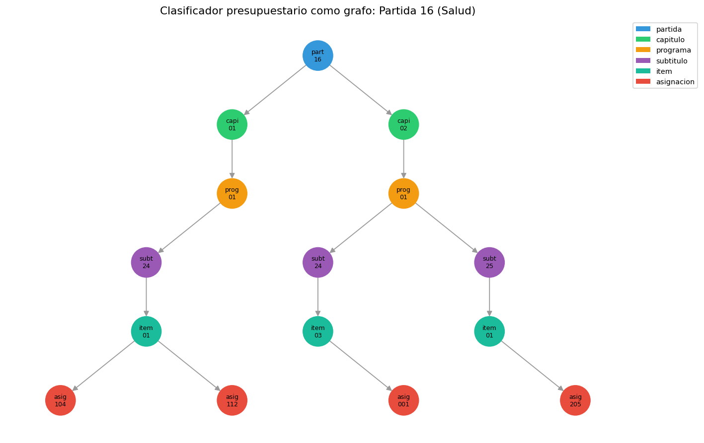

# 01 — Qué es una ontología y por qué ya construiste varias

## El vocabulario que falta, no la habilidad

"Ontología" suena a filosofía o a ingeniería de datos exótica. La tesis de
esta sección es que no lo es, al menos no para alguien que ya trabaja con
finanzas públicas chilenas: el clasificador presupuestario —Partida →
Capítulo → Programa → Subtítulo → Ítem → Asignación— es una ontología con
todas sus letras, y cualquiera que haya leído una Ley de Presupuestos ya la
usó sin llamarla así.

Lo que falta no es la habilidad de pensar en estas estructuras. Es el
vocabulario técnico para reconocerlas, formalizarlas y —lo que interesa a
este repo— dárselas a un sistema de IA como algo explícito en vez de dejarlas
implícitas en párrafos de texto plano.

### La analogía: del lenguaje natural al modelo de datos

Es el mismo salto que separa "tengo una intuición sobre qué gastos son
comparables" de "tengo una tabla normalizada con llaves foráneas". La
intuición ya está —un economista de finanzas públicas distingue sin esfuerzo
una Asignación de un Subtítulo—; lo que una ontología aporta es que esa
distinción deje de vivir solo en la cabeza de quien lee el documento y pase a
ser algo que un programa puede recorrer, consultar y verificar.

Código en [`ontology_lib.py`](../code/ontology_lib.py); demo en
[`code/01-ontologia-vs-grafo.py`](../code/01-ontologia-vs-grafo.py).

## Cuatro términos, con ejemplos del corpus en vez de definiciones de libro

La disciplina usa cuatro palabras que se solapan y rara vez se explican con
ejemplos concretos. Con material del propio corpus regulatorio chileno:

| Término | Qué agrega | Ejemplo del corpus |
|---|---|---|
| **Taxonomía** | jerarquía is-a, sin relaciones tipadas | UNSPSC en `resolucion-01-chilecompra-compra-agil.txt`: cada compra ágil se clasifica por "familia" y "clase" del Estándar Universal de Productos y Servicios |
| **Tesauro** | sinónimos y términos relacionados, sin jerarquía estricta | `expand_synonyms` de `02 §9`: "DIPRES" se resuelve a "Dirección de Presupuestos" sin que una cosa "contenga" a la otra |
| **Ontología** | entidades + relaciones **tipadas** + reglas de qué es válido | Norma MODIFICA Norma, Decreto REGLAMENTA Ley — el vocabulario que §2 formaliza a partir de lo que el propio corpus ya declara ("modifícanse las siguientes...") |
| **Grafo de conocimiento** | la ontología **instanciada** con datos reales | el grafo que este script construye: 63 nodos concretos del clasificador presupuestario 2024, no un esquema vacío |

La progresión importa porque cada término agrega algo que el anterior no
tiene. Un tesauro sin jerarquía no responde "¿qué contiene qué?". Una
taxonomía sin relaciones tipadas no distingue "modifica" de "reglamenta" — dos
relaciones jurídicamente muy distintas que un simple árbol is-a colapsaría en
una sola arista genérica. Una ontología sin instanciar es un esquema en
blanco, útil para diseñar pero inerte hasta que tiene datos adentro. El grafo
de conocimiento es donde el trabajo de este módulo empieza a producir algo
consultable.

## El clasificador presupuestario, parseado como grafo

Sobre los cinco documentos `glosa-*.txt` del corpus (`B6`), un parser de
expresiones regulares extrae la jerarquía completa:

```
Nodos: 63  ·  Aristas CONTIENE: 58

       partida:   5 nodos
      capitulo:  11 nodos
      programa:  12 nodos
     subtitulo:  13 nodos
          item:   9 nodos
    asignacion:  13 nodos
```

Cada nodo es un `NodoClasificador` (Pydantic) con su nivel, código, nombre y
—cuando el texto lo trae— monto y glosa asociada. Cada arista es `CONTIENE`,
del nivel superior al inferior. Es la ontología más simple posible: **un
solo tipo de entidad genérica (nodo de clasificador) y una sola relación**.
Precisamente por eso es el punto de partida correcto: antes de modelar las
seis o siete relaciones tipadas que `§2` va a necesitar para el corpus
normativo completo, conviene ver la disciplina funcionar con la relación más
elemental que existe.

## La competency question: la pregunta que el grafo responde y grep no

El método de diseño que `§2` va a formalizar —escribir las preguntas antes
de construir el modelo, igual que se hace con un golden dataset en `01
§4`— se ilustra acá con una pregunta real de un analista presupuestario:
**¿en qué gasta cada Partida, y cuánto suma?**

```
                                      partida |  asignaciones |  monto total (miles $)
--------------------------------------------------------------------------------------
                       16 MINISTERIO DE SALUD |             4 |          5,275,327,880
                   09 MINISTERIO DE EDUCACIÓN |             1 |          1,012,567,400
 15 MINISTERIO DEL TRABAJO Y PREVISIÓN SOCIAL |             3 |            228,508,350
              12 MINISTERIO DE OBRAS PÚBLICAS |             2 |            800,386,355
05 MINISTERIO DEL INTERIOR Y SEGURIDAD PÚBLICA |             3 |          1,379,671,450
```

Con el grafo, la respuesta es `nx.descendants()` más una suma — dos líneas.
Sin él, hay que reconstruir a mano la jerarquía completa cada vez que se hace
la pregunta, porque el texto plano no declara "estas cuatro Asignaciones son
descendientes de la Partida 16"; lo *implica* a través de la indentación y el
orden de aparición, que es exactamente lo que un grafo hace explícito.



## Límite honesto: el parser de reglas se queda corto

La sección no esconde dónde el enfoque simple falla. La Partida 09
(Educación) aparece con **una** sola Asignación en el grafo, pero el
documento fuente contiene **seis**: cinco en una tabla ("Programa 20:
Subvenciones a Establecimientos Educacionales") y una en el formato lineal
que el parser reconoce (JUNAEB, Capítulo 09).

El parser de esta sección busca el patrón `Asignación NNN - nombre` seguido
de `Monto: $X miles`, porque es determinista, rápido de escribir y suficiente
para *ilustrar* que el clasificador es una ontología. Pero el mismo corpus
—escrito, además, por la misma persona— ya usa un segundo formato (tabla)
para exactamente la misma información. Un parser de reglas se rompe cada vez
que aparece una variante de formato nueva, y en un corpus regulatorio real la
heterogeneidad de formato es la norma, no la excepción: circulares, oficios,
resoluciones y glosas de distintos años y distintos redactores no comparten
convenciones tipográficas.

> Esto **no es un defecto a corregir en esta sección**. Es la razón concreta,
> medida sobre el propio corpus, por la que `§5` usa extracción con LLM en
> vez de reglas escritas a mano para construir la ontología del corpus
> completo: un extractor semántico no le importa si la información vive en
> una lista o en una tabla, porque no está haciendo pattern matching sobre la
> sintaxis — está leyendo el significado.

## Qué gana un sistema RAG con esto

Hasta acá, todo lo que `02-retrieval` construyó trata al corpus como una
bolsa de chunks con metadata plana. Eso es suficiente para responder "¿qué
dice el artículo 8° del DL 825?" (`02` completo lo resuelve bien) pero no
para "¿qué normas modifican al DL 825?" — una pregunta sobre la **estructura
relacional** del corpus, no sobre su contenido textual. El clasificador
presupuestario de esta sección resuelve la versión más simple de ese
problema (contención); `§2` en adelante construye el vocabulario de
relaciones (MODIFICA, DEROGA, REGLAMENTA, CITA) que hace falta para el
corpus normativo completo.

## Estado del arte (2026)

| Aspecto | Estado | Detalle |
|---|---|---|
| Clasificadores presupuestarios como ontologías de facto | ✅ Práctica establecida | COFOG, GFS del FMI; ningún país los llama "ontología" pero lo son |
| UNSPSC como taxonomía en compras públicas | ✅ Estándar internacional | Usado literalmente en `resolucion-01` del corpus; obligatorio para publicar una compra ágil |
| Property graphs para dominios regulatorios | 🟢 Práctica madura en legaltech | Harvey, EvenUp y similares los usan como núcleo de producto |
| Extracción de estructura desde texto heterogéneo | 🟡 En transición | Regex para lo estructurado, LLM para lo heterogéneo — `§5` desarrolla el segundo caso |
| Ontologías formales (OWL) para corpus legales pequeños | 🔴 Sobre-construcción común | El error que `§3` va a nombrar explícitamente: comprar más formalismo del que las consultas necesitan |

## Lo que viene en la próxima sección

Esta sección usó una sola relación (`CONTIENE`) porque el clasificador
presupuestario la necesita y nada más. El corpus normativo —leyes, decretos,
circulares, resoluciones, dictámenes citándose entre sí— necesita un
vocabulario de relaciones más rico. `§2` lo diseña con el mismo método que
`§1` insinuó acá: escribir primero las preguntas que el sistema debe poder
responder, y recién después decidir qué entidades y relaciones hacen falta
para responderlas.

## Conexiones

- **`01 §4` (golden datasets)**: el método de "preguntas antes que esquema"
  que `§2` formaliza como *competency questions* es el mismo que ya se usó
  para diseñar el golden dataset de evals.
- **`02 §7` (metadata filtering)**: el clasificador presupuestario es,
  visto desde retrieval, el metadata estructurado más rico que el corpus
  tiene — esta sección lo hace recorrible como grafo en vez de solo
  filtrable como columna.
- **`02 §9` (casos límite)**: `expand_synonyms` es el ejemplo de tesauro de
  la tabla; la resolución DIPRES/Dirección de Presupuestos que ahí se
  trató como caso especial es exactamente el problema que `§4` formaliza.
- **`B6`**: el corpus de 40 documentos con cadenas de citas verificadas es
  el insumo que hace que `§2` en adelante tenga aristas reales que extraer,
  no solo un ejercicio de diseño en el vacío.
