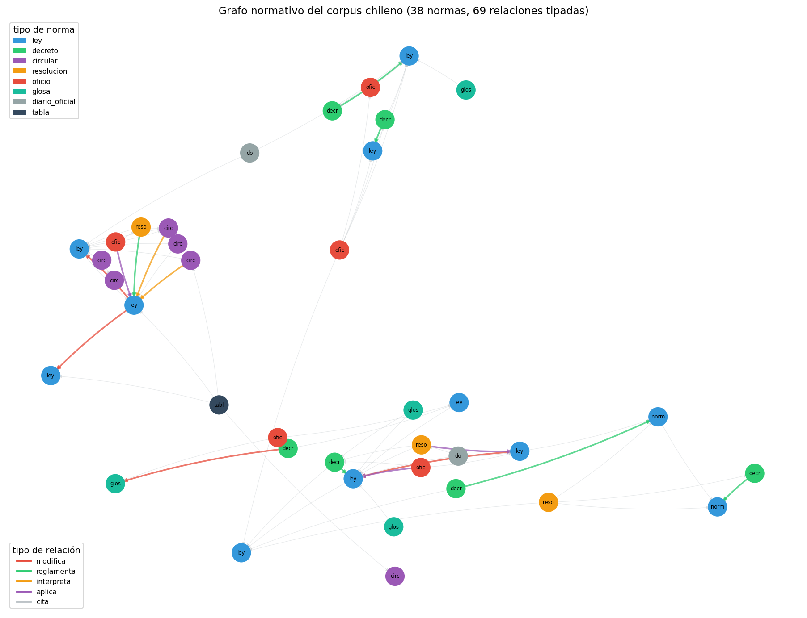

# 02 — Modelado del dominio regulatorio chileno

## El método: preguntas antes que esquema

La tentación al modelar un dominio es empezar por las entidades: "necesito
una clase Norma, una clase Artículo, una clase Organismo...". Es el orden
equivocado. `01 §4` ya estableció el método correcto para golden datasets —
escribir las preguntas que el sistema debe responder *antes* de decidir su
estructura— y esta sección aplica el mismo método a la ontología: las
**competency questions** primero, el esquema después.

Es, otra vez, algo que el autor ya practica sin el nombre: nadie diseña una
tabla de base de datos para un análisis de política pública sin antes saber
qué preguntas el análisis necesita responder. La ontología no es distinta.

### La analogía: especificar las hipótesis antes de estimar el modelo

Un economista que corre una regresión sin haber escrito antes qué relación
espera encontrar termina "explicando" cualquier coeficiente que le salga. Un
modelo de ontología diseñado sin competency questions termina igual:
entidades y relaciones elegantes que no responden ninguna pregunta real del
dominio. El orden importa tanto en un caso como en el otro.

Código en [`ontology_lib.py`](../code/ontology_lib.py) (extensión de §1);
demo en [`code/02-grafo-normativo.py`](../code/02-grafo-normativo.py); datos
en [`examples/relaciones-manual.json`](../examples/relaciones-manual.json).

## Las competency questions de este módulo

Escritas antes de tocar el esquema, con el corpus de `B6` a la vista:

1. ¿Qué normas **modifica** una ley dada?
2. ¿Qué normas **modifican** a una norma dada? (la pregunta inversa —
   "¿sigue vigente tal como fue escrita?")
3. ¿Qué documento **reglamenta** una ley dada?
4. ¿Qué documentos **dependen**, directa o transitivamente, de una norma
   dada, sin límite de saltos?
5. ¿Puede una sola respuesta distinguir "lo menciona" de "depende de un
   cambio en ella"?

Cada una de las cinco exige algo que el metadata plano de `02 §7` no tiene:
una relación **tipada** y **transitiva** entre documentos, no una columna de
atributos por documento.

## El vocabulario, extraído del propio corpus

No se inventó un vocabulario de relaciones desde una teoría general de
ontologías legales. Se leyó el corpus y se contaron los verbos que las
normas chilenas usan para referirse unas a otras: "modifícanse",
"derógase", "reglamenta la Ley Nº...", "conforme a", "en virtud de". De ahí
salieron seis relaciones:

| Relación | Qué implica | Verbo real en el corpus |
|---|---|---|
| `MODIFICA` | el texto original **cambió** | "Introdúcense las siguientes modificaciones...", "Sustitúyese el artículo..." |
| `DEROGA` | el texto original **dejó de regir** | (no aparece en el corpus actual — ver nota) |
| `REGLAMENTA` | ambas normas están vigentes; una depende de la otra | "Aprueba Reglamento de la Ley Nº..." |
| `INTERPRETA` | ninguna deja de regir por la existencia de la otra | "Imparte instrucciones sobre..." |
| `APLICA` | usa la norma para resolver un caso concreto | "Absuelve consulta...", dictámenes de Contraloría |
| `CITA` | mención sin implicancia sobre vigencia | "conforme a", "de conformidad con", "en virtud de" |

> **Nota honesta:** `DEROGA` está en el esquema porque es una relación real
> del dominio (una ley puede derogar a otra completa o parcialmente), pero
> **no aparece en las 69 relaciones curadas de este corpus** — ninguno de
> los 40 documentos deroga a otro. Se mantiene en el vocabulario porque
> excluirla sería sobre-ajustar el esquema a los datos disponibles en vez
> de al dominio que representan.

## Por qué no basta con una relación genérica

Colapsar las seis relaciones en una sola ("se relaciona con") es la
simplificación obvia, y es exactamente la que pierde lo que le importa al
dominio. Contadas sobre las 69 relaciones curadas:

```
    relación | ocurrencias | ejemplo verificado
------------------------------------------------------------------------------------------
        cita |          54 | oficio --[cita]--> ley
  reglamenta |           6 | decreto --[reglamenta]--> ley
    modifica |           4 | decreto --[modifica]--> glosa
      aplica |           3 | oficio --[aplica]--> ley
  interpreta |           2 | circular --[interpreta]--> ley
```

`CITA` domina en volumen —es la relación "débil", sin implicancia sobre
vigencia— pero `MODIFICA` y `REGLAMENTA` son las que de verdad importan:
determinan si un texto sigue rigiendo tal como fue escrito. Numéricamente
son minoría; jurídicamente son el motivo por el que se construye el grafo.



Se ven los cuatro clusters de `B6` como componentes casi separadas —compras
públicas, tributario, presupuesto, probidad/educación— unidas por unas
pocas aristas grises de `CITA` que cruzan de un cluster a otro (el
oficio-01 sobre subvenciones, citado por el oficio-05 de traspaso a
Servicios Locales, es la más visible: la línea roja gruesa que atraviesa
el diagrama es justamente esa dependencia entre clusters).

## Las competency questions, respondidas

**P1 — ¿Qué normas modifica la Ley 21.210?**

```
    -> ley-01-dl-825-iva-base.txt
    -> ley-05-dl-824-renta-base.txt
```

Una sola ley, **dos** normas modificadas en artículos distintos (el artículo
primero modifica el DL 825; el artículo segundo, el DL 824). Es el ejemplo
concreto de por qué el modelo "doc reemplaza doc" que `02 §9` marcó como
insuficiente lo es: la Ley 21.210 no reemplaza a ninguna de las dos leyes
que toca, las modifica parcialmente y en paralelo. `§6` retoma esto para
llevarlo a nivel de artículo con vigencia temporal.

**P2 — ¿Qué normas modifican al DL 825?**

```
    <- ley-02-ley-21210-modernizacion.txt
```

La pregunta inversa a P1, resuelta invirtiendo la dirección del recorrido
(`vecinos_por_relacion(..., direccion="in")`) sin tocar el esquema.

**P3 — ¿Qué documento reglamenta la Ley 19.886?**

```
    <- decreto-03-reglamento-compras-publicas.txt
```

**P4 — ¿Qué documentos se relacionan directamente con la SEP (Ley 20.248)?**

```
    <- decreto-01-subvencion-escolar.txt
    <- decreto-06-reglamento-servicios-locales.txt
    <- do-01-extracto-decreto-aranceles.txt
    <- glosa-02-presupuesto-educacion.txt
    <- ley-09-ley-21040-educacion-publica.txt
    <- oficio-01-contraloria-subvenciones.txt
    <- oficio-05-contraloria-traspaso-slep.txt
```

Los siete documentos tienen una arista **directa** hacia `ley-08`. La
versión inicial presentó `oficio-05` como caso multi-hop porque su cita
directa a la Ley 20.248 no estaba anotada. Corregir el ground truth elimina
el supuesto recorrido de dos-tres saltos: P4 demuestra el valor de una
consulta estructurada, pero no el de la transitividad.

El grafo corregido sí contiene rutas multi-hop genuinas. Por ejemplo:

```text
decreto-04 -> ley-06 -> ley-03 -> ley-07
```

La modificación presupuestaria cita la Ley de Presupuestos; esta cita la
Ley de Compras; y esta última cita la Ley 18.575. `§8` evalúa esta clase de
pregunta con un golden estructural separado, sin reutilizar P4 como prueba.

## Por qué un solo tipo de relación no alcanza (el caso completo)

Para hacer explícito el costo de simplificar, se comparó el conjunto de
documentos que dependen del DL 825 usando solo `CITA` contra usarlo junto
con `MODIFICA`:

```
Documentos que CITAN al DL 825, directa o transitivamente: 9

Documentos que citan O modifican, en cualquier número de saltos: 10
```

La diferencia es **`ley-02`**: modifica al DL 825, no solo lo menciona. El
resto llega por `CITA` directa o transitiva; la versión inicial subcontaba
esas citas por la incompletitud del ground truth.

Un grafo con una sola relación genérica puede contar cuántos documentos
*mencionan* al DL 825. No puede separar "lo menciona" de "depende de un
cambio en él" — la pregunta que le importa a quien tiene que auditar si una
norma sigue vigente tal como fue escrita en 1974.

## El esquema en Pydantic

Tres clases, siguiendo el patrón ya establecido en el repo (`Chunk` en
`retrieval_lib`, `PromptTemplate` en `prod_lib`, `ModelSpec` en `econ_lib`):

- **`Norma`**: identidad mínima (id, tipo, identificador oficial, título).
- **`RelacionNormativa`**: una arista tipada con **fundamento textual
  obligatorio** — una cita literal que permite auditarla contra la fuente.
  `§5` puntúa `(origen, tipo, destino)`; el fundamento se revisa como
  trazabilidad, no como parte de esa métrica.
- **`TipoRelacion`**: el enum de seis valores de la tabla de arriba.

## La verdad fundamental que este módulo deja construida

Las 69 relaciones de esta sección no son solo una demo: son **curadas a
mano por lectura directa del texto**, cada una con su fundamento citado, y
quedan guardadas en `examples/relaciones-manual.json` con ese propósito
explícito. `§5` va a extraer relaciones automáticamente con un LLM sobre el
corpus completo; este conjunto es la vara con la que se va a medir si esa
extracción acierta.

Cobertura: 38 de 40 documentos del corpus. Quedan fuera `glosa-03` y
`tabla-01`, que no contienen referencias explícitas a otro documento del
catálogo. `glosa-02` ya no se trata como distractor: cita literalmente la
Ley 20.248 y forma parte de la ontología.

## Estado del arte (2026)

| Aspecto | Estado | Detalle |
|---|---|---|
| Vocabularios de relaciones legales tipadas | ✅ Práctica establecida | Legislation.gov.uk, EUR-Lex y sistemas legaltech usan esquemas similares (amends, repeals, implements) |
| Extracción de relaciones desde verbos del propio texto | 🟢 Método sólido | Más robusto que importar una ontología genérica; el vocabulario legal chileno tiene sus propios verbos técnicos |
| Fundamento textual obligatorio por relación | 🟢 Best practice en legaltech serio | Auditable; sin él, una relación extraída automáticamente no es verificable |
| Datasets curados a mano como ground truth de extracción | ✅ Estándar en NLP | Es exactamente lo que se hizo acá para preparar §5 |
| Ontologías legales formales (LKIF, Akoma Ntoso) | 🟡 Maduras pero pesadas | Resuelven más de lo que este corpus necesita — el argumento de `§3` |

## Lo que viene en la próxima sección

Esta sección diseñó **qué** modelar. La siguiente pregunta es **cuánto**
formalismo comprar para modelarlo: seis relaciones y un grafo dirigido con
`networkx` ya alcanzan para responder las cinco competency questions de
arriba. `§3` hace explícita la regla de decisión que evita comprar más de
lo que hace falta.

## Conexiones

- **`01 §4` (golden datasets)**: mismo método — preguntas antes que
  esquema — aplicado a otro artefacto.
- **`01 §8` (estadística)**: cuando `§5` mida la tasa de error de la
  extracción automática contra esta verdad fundamental, usará el mismo
  aparato de deltas e IC.
- **`02 §7` (metadata filtering)**: P4 se responde con una arista directa;
  el valor diferencial de la transitividad se evalúa por separado en §8.
- **`02 §9` (casos límite)**: P1 es el ejemplo concreto del límite que esa
  sección dejó abierto sobre versionado a nivel artículo.
- **`B6`**: las cadenas de citas diseñadas a propósito en el corpus son el
  insumo de las 69 relaciones explícitas de esta sección.
- **`§5`**: `relaciones-manual.json` es la verdad fundamental contra la que
  se mide la extracción con LLM.
