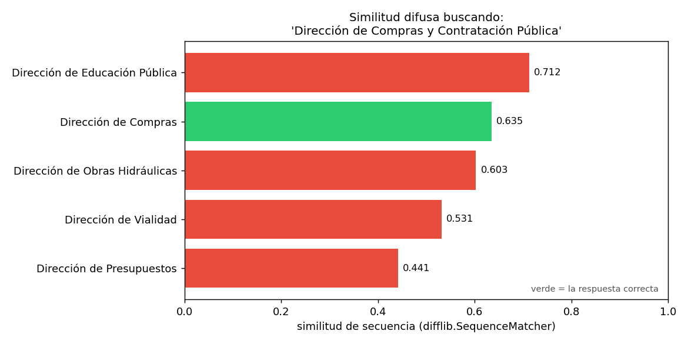

# 04 — Identidad y llaves canónicas

## El problema que `§1-§3` dieron por resuelto

El clasificador presupuestario de `§1` y el grafo normativo de `§2` asumen,
en silencio, que dos menciones del mismo organismo en dos documentos
distintos se convierten en el mismo nodo. Esa suposición no se cumple sola.
Un grafo construido por coincidencia literal de texto crea un nodo por
cada **forma de escribir** una entidad, no un nodo por entidad — y esa es
precisamente la brecha entre "tengo texto" y "tengo una ontología" que este
módulo viene cerrando desde `§1`.

Esta sección resuelve esa brecha para la pieza más simple del esquema:
identificar cuándo dos organismos mencionados con nombres distintos son el
mismo organismo. Es la doctrina #6 del portfolio —*nunca usar el nombre
libre como identificador; siempre una llave canónica*— aplicada con
ejemplos verificados por grep, no supuestos.

### La analogía: record linkage, otro dominio

Es exactamente el problema que un economista enfrenta al cruzar microdatos
administrativos: dos bases que usan "Servicio de Impuestos Internos" en una
y "SII" en la otra no se unen solas, y unirlas mal (por similitud
superficial de texto) es peor que no unirlas. La disciplina se llama
*record linkage* fuera de este dominio y *entity resolution* dentro de él;
es el mismo problema con otro nombre.

Código en [`ontology_lib.py`](../code/ontology_lib.py); demo en
[`code/04-identidad-y-llaves.py`](../code/04-identidad-y-llaves.py).

## El problema, verificado por grep (no supuesto)

Un `grep` sistemático sobre los 40 documentos del corpus (`B6`) encuentra
**tres formas textuales distintas** para el mismo organismo — la Dirección
de Compras y Contratación Pública:

```
'Dirección de Compras y Contratación Pública'
    -> ley-03, ley-04 (forma completa, primera mención)
'Dirección de Compras'
    -> ley-03, decreto-03, resolucion-01 (forma corta, menciones posteriores)
'CHILECOMPRA'
    -> resolucion-01 (nombre de marca, encabezado institucional)
```

> **Nota metodológica.** El plan de este módulo anticipaba "DIPRES" /
> "Dirección de Presupuestos" como ejemplo. Al verificar contra el corpus
> real, "DIPRES" **no aparece ni una sola vez** como sigla — el corpus
> siempre usa la forma completa. El ejemplo real y verificado es la
> Dirección de Compras; se documenta acá el ajuste porque es exactamente
> el tipo de comprobación contra la fuente que la doctrina del portfolio
> exige antes de publicar una afirmación.

Sin resolución, un grafo construido por coincidencia literal crearía
**tres nodos donde hay un organismo**. No es un error de recorrido — el
grafo estaría mal construido antes de correr ninguna consulta de `§2`.

## Nivel 1 — Normalización + diccionario (barato, sin falsos positivos)

El primer paso, siempre: minúsculas, sin acentos, espacios colapsados, y
coincidencia exacta contra un catálogo de variantes conocidas.

```
                                         mención | resuelve a
---------------------------------------------------------------
     Dirección de Compras y Contratación Pública |       dccp
                            dirección de compras |       dccp
                                     CHILECOMPRA |       dccp
                  Servicio de Impuestos Internos |        sii
                                esta Contraloría |        cgr
                    Ministerio de Obras Públicas | (sin match)
```

Las cinco primeras resuelven a la misma llave canónica —`dccp`, `sii`,
`cgr`— sin importar mayúsculas ni forma larga o corta. La sexta, un
organismo real del corpus pero fuera de este catálogo curado, **no
resuelve**, y eso es lo correcto: el Nivel 1 nunca inventa una
coincidencia que no está en el diccionario.

Nótese el caso `sii`: el corpus usa **siempre** la forma completa
"Servicio de Impuestos Internos", sin variantes. No todo organismo tiene el
problema de esta sección — parte del trabajo de entity resolution es
reconocer cuándo *no* hace falta resolver nada.

## Nivel 2 — Similitud difusa: el fallback, y su riesgo medido

Cuando el diccionario no encuentra nada, el segundo nivel —costoso,
probabilístico— entra a jugar. Sobre una mención deformada (como saldría de
un OCR o una cita informal):

```
Mención deformada: 'Direccion de Compras y Contratacion Publ.'
  Nivel 1 (diccionario exacto): (sin match)
  Nivel 2 (similitud difusa):   dccp  (score=0.95)
```

El fallback rescata un caso legítimo. Pero el mismo mecanismo tiene un modo
de falla real, no hipotético, y se puede medir sobre nombres institucionales
chilenos genuinos:

```
Buscando la mejor coincidencia difusa para: 'Dirección de Compras y Contratación Pública'
  0.712  Dirección de Educación Pública
  0.635  Dirección de Compras <- la correcta
  0.603  Dirección de Obras Hidráulicas
  0.531  Dirección de Vialidad
  0.441  Dirección de Presupuestos
```



**"Dirección de Educación Pública" queda más cerca, por similitud de
caracteres, que la respuesta correcta.** Es un *stress test* controlado con
nombres reales, no un fallo observado del pipeline de producción. Los nombres institucionales
chilenos comparten estructura —"Dirección de X Pública/Nacional"— que la
similitud léxica no distingue de la identidad real. Este no es un caso
patológico construido para asustar: es el primer resultado que salió de
comparar la Dirección de Compras contra un puñado de otras direcciones
públicas del corpus.

> **Por eso el orden del pipeline no es negociable.** El Nivel 1
> (determinista, sin falsos positivos) va primero. El Nivel 2 (probabilístico,
> con riesgo medido de preferir el vecino equivocado) es un fallback que
> solo se activa cuando el primero no encontró nada — nunca una alternativa
> de igual jerarquía.

## Lo que ningún nivel resuelve solo: la anáfora

Dos circulares y una resolución del corpus usan la frase **"este Servicio"** para referirse
al organismo que las emite:

```
resolucion-02-sii-registro-plataformas.txt      -> 'este Servicio' = SII
circular-06-sii-credito-especial-construccion.txt -> 'este Servicio' = SII
circular-05-sii-factura-electronica.txt          -> 'este Servicio' = SII
```

"Este Servicio" no tiene ninguna forma léxica que un diccionario pueda
mapear de antemano: la misma frase, en un documento de la Contraloría,
resolvería a la Contraloría. La única resolución correcta es **contextual**
— mirar quién emitió el documento, no qué dice el texto de la mención.

Ni el Nivel 1 ni el Nivel 2 de este pipeline lo resuelven por sí solos.
Ambos necesitan un tercer insumo: el metadata de procedencia del documento
—el organismo emisor, ya identificable en el encabezado que el parser de
`§1-§2` procesa— cruzado con la posición del pronombre dentro del texto.
Es la razón por la que un extractor completo (`§5`) no puede ser solo un
diccionario ni solo un modelo de similitud: necesita el documento entero
como contexto, no la mención aislada.

## El principio general, más allá de este corpus

La doctrina del portfolio lo dice sin rodeos: **nunca usar el nombre libre
como identificador**. Comunas se identifican por `cut_comunal` a cinco
dígitos, nunca por nombre; un organismo público, por su RUT, nunca por
cómo lo escribió quien redactó el documento. Este corpus —texto normativo,
no una base de datos administrativa— no trae RUTs de organismos, así que el
principio se demuestra con la llave canónica de diseño (`Organismo.id`,
un slug estable) en vez de con el RUT real. El mecanismo es idéntico al que
ya se usó en `§1`: la llave del nodo del clasificador presupuestario se
construyó por ruta completa precisamente para que dos "Subtítulo 24" en
partidas distintas no colisionaran — entity resolution por construcción, en
vez de por reparación posterior.

## Estado del arte (2026)

| Aspecto | Estado | Detalle |
|---|---|---|
| Diccionario de variantes conocidas | ✅ Siempre el primer paso | Barato, auditable, sin falsos positivos — ninguna razón para saltárselo |
| Similitud de secuencia (Levenshtein, Jaro-Winkler) | 🟢 Maduro, riesgo conocido | Útil como fallback; el riesgo de nombres con estructura compartida está bien documentado en record linkage clásico |
| Entity resolution con embeddings | 🟢 En adopción | Captura similitud semántica ("SII" ~ "Servicio de Impuestos Internos" sin overlap de caracteres); no resuelve la anáfora |
| Resolución de anáfora / correferencia con LLM | 🟢 Práctica madura en 2026 | Es exactamente lo que `§5` va a necesitar para el extractor completo |
| RUT / llave canónica oficial como estándar de identidad | ✅ Ya exigido en Chile | Registro de proveedores del Estado, SII, Servel — todos usan RUT, no nombre |
| Herramientas de record linkage probabilístico (Fellegi-Sunter, Splink) | 🟢 Estándar en microdatos | La misma disciplina que este corpus necesita a escala mucho mayor |

## Lo que viene en la próxima sección

Con el vocabulario de relaciones (`§2`), la regla de cuánto formalismo
(`§3`) y la resolución de identidad (`§4`) decididas, el módulo tiene todo
lo que hace falta para dejar de construir la ontología a mano. `§5` la
extrae automáticamente del corpus completo con un LLM — y usa exactamente
los tres niveles de esta sección (diccionario, similitud, contexto
documental) como parte de su pipeline de post-procesamiento.

## Conexiones

- **Doctrina del portfolio (#6)**: "nunca usar el nombre libre como
  identificador" es la regla que esta sección demuestra con datos, no solo
  cita.
- **`§1`**: la llave por ruta completa del clasificador presupuestario ya
  era entity resolution por diseño; acá se hace explícita como técnica
  general.
- **`§2`**: el catálogo de `Norma` de esa sección asume implícitamente que
  cada documento resuelve a una sola entidad — supuesto válido para normas
  (un documento = una norma) pero no para organismos (múltiples documentos
  mencionan al mismo organismo de formas distintas).
- **`02 §9`**: `expand_synonyms` resuelve el problema inverso —expandir una
  sigla para retrieval léxico—, no colapsar variantes a una entidad única.
  Son operaciones relacionadas pero no intercambiables.
- **`§5`**: el pipeline de tres niveles (diccionario → similitud → contexto
  documental) es, literalmente, la etapa de post-procesamiento que la
  extracción automática va a necesitar para no terminar con un nodo por
  cada forma de escribir un organismo.
