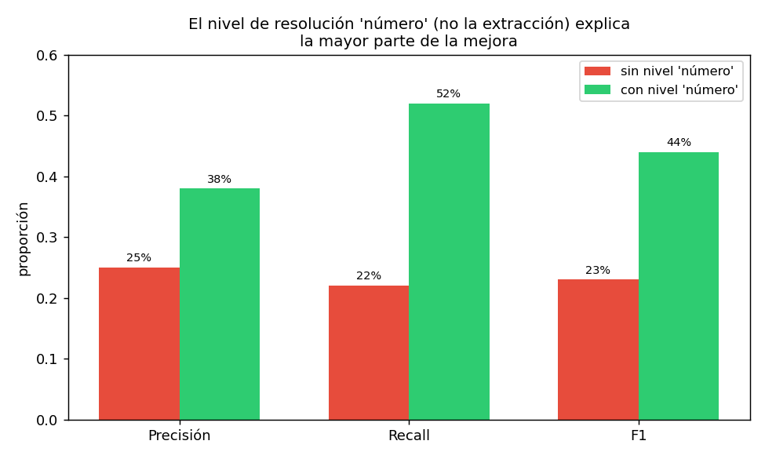

# 05 — Extraer la ontología del corpus

## Reemplazar la curación manual, y medir qué se pierde al hacerlo

`§2` construyó el grafo normativo a mano: 37 normas, 47 relaciones, cada una
leída y verificada por una persona. Eso no escala — ni a los 40 documentos
completos del corpus, ni mucho menos a un corpus real de miles de normas.
Esta sección reemplaza esa curación por un extractor automático, y hace lo
que `§1` ya insistió en hacer con el parser de regex: **medir el límite del
método en vez de asumir que funciona**.

El resultado no es el que uno esperaría de una demo bien vendida. Es más
interesante que eso.

Código en [`ontology_lib.py`](../code/ontology_lib.py) (clase
`LLMExtractor`); demo en
[`code/05-extraccion-llm.py`](../code/05-extraccion-llm.py). Primera
corrida llama a la API (`gpt-4o-mini`, structured output vía Pydantic);
corridas siguientes leen de
[`examples/cache-extraccion-llm.json`](../examples/cache-extraccion-llm.json).

## El diseño: extracción y resolución como etapas separadas

El extractor recibe el texto de un documento y devuelve, por cada norma que
el texto menciona, un `identificador_destino` en **texto libre** —tal como
aparece en el documento ("Ley Nº 21.210", "DL Nº 825")—, un `tipo` (del
vocabulario de seis relaciones de `§2`) y un `fundamento` (la cita textual
que sustenta la relación). El modelo no conoce los nombres de archivo del
corpus, así que resolver ese identificador a un `doc_id` es un paso
**deliberadamente separado**, no parte del mismo prompt.

Esa separación es la decisión de diseño de la sección, y paga dividendos
inmediatos: permite medir el error de **extracción** (¿el LLM encontró la
relación correcta en el texto?) y el error de **resolución** (¿el
identificador se mapeó al documento correcto?) por separado, en vez de
como un número único que mezcla las dos cosas.

El prompt está escrito con el vocabulario legal chileno de `§2`
("modifícanse", "sustitúyese", "derógase", "Aprueba Reglamento de la Ley
Nº...") en vez de pedir NER genérico — la clasificación por tipo de relación
depende de reconocer verbos jurídicos específicos, no entidades nombradas
sueltas.

## Primer resultado: precisión y recall bajos, y la razón no es la esperada

Sobre una muestra de 10 documentos (cubriendo los cuatro clusters de `B6`
y los tipos de relación más importantes, no solo `CITA`), comparado contra
`relaciones-manual.json`:

```
Ground truth en la muestra (10 docs):  23 relaciones
Extraídas y resueltas:                 20 relaciones
Verdaderos positivos (match exacto):    5
Falsos positivos:                      15
Falsos negativos (no detectadas):      18

Precisión: 25%   Recall: 22%   F1: 23%
```

Un número que, presentado solo, parecería un extractor mediocre. No lo es
—o no solo eso—. De los 20 identificadores extraídos que no resolvieron a
ningún `doc_id`, la mayoría no eran errores de extracción: eran fallas de
**resolución**, con el mismo pipeline de dos niveles de `§4` (diccionario
exacto + similitud difusa con umbral 0.85).

## El diagnóstico: el mismo problema de `§4`, con datos reales

Revisando los identificadores sin resolver, el patrón salta a la vista:

```
'Decreto Ley Nº 825' vs 'DL Nº 825, de 1974'                    -> 0.500
'Decreto Supremo Nº 250' vs 'Decreto Supremo Nº 250, de 2004'   -> 0.830
'Circular Nº 62' vs 'Circular Nº 62, de 2020'                   -> 0.757
'Ley Nº 18.695' vs 'Ley Nº 18.575'                               -> 0.846
```

Los dos casos del medio son coincidencias **legítimas** que el umbral de
0.85 rechazaba injustamente. Pero bajar el umbral para rescatarlos crearía
el problema exacto que `§4` ya midió: **"Ley Nº 18.695" y "Ley Nº 18.575"
comparten 0.846 de similitud y son dos leyes completamente distintas** — el
umbral no puede distinguir "casi el mismo texto" de "casi el mismo número",
que en este dominio son cosas opuestas.

La solución no es ajustar el umbral. Es reconocer que un identificador
legal chileno tiene una parte **estable** (el número) y una parte que es
**ruido de formato** ("Decreto Ley" vs "DL", "de 1974" o no). Es la misma
lección de `§1` (UNSPSC es un código, no un nombre) y de `§4` (llave
canónica, nunca texto libre), aplicada un nivel más abajo.

## El nivel intermedio: resolver por número

Un tercer nivel de resolución, entre el diccionario exacto y la similitud
difusa: extraer el número del identificador y matchear contra el número de
los identificadores del catálogo.

```python
def resolver_por_numero(identificador: str, normas: list[Norma]) -> str | None:
    m = _NUMERO_RE.search(identificador)          # "Decreto Ley Nº 825" -> "825"
    numero = m.group(1)
    candidatos = [n for n in normas si su identificador contiene ese número]
    return candidatos[0].id if len(candidatos) == 1 else None
```

Sobre los doce identificadores que antes no resolvían:

```
'Decreto Ley Nº 825'      -> 825    -> ley-01-dl-825-iva-base.txt          ✓
'Decreto Ley Nº 824'      -> 824    -> ley-05-dl-824-renta-base.txt        ✓
'Decreto Supremo Nº 250'  -> 250    -> decreto-03-reglamento-compras...    ✓
'Decreto Supremo Nº 148'  -> 148    -> decreto-06-reglamento-servicios...  ✓
'Circular Nº 62'          -> 62     -> circular-02-sii-renta-propyme.txt   ✓
'Circular Nº 50'          -> 50     -> circular-03-sii-ppm-honorarios.txt  ✓
'Decreto Supremo Nº 71'   -> 71     -> decreto-02-reglamento-ley-lobby.txt ✓
'Ley Nº 18.695'           -> 18.695 -> (ningún candidato)                  — correcto: NO está en el corpus
'Código Tributario'       -> (sin número)                                  — correcto: no es un identificador numerado
'Resolución Nº 7'         -> 7      -> (ningún candidato)                  — correcto: no está en el corpus
```

Siete resoluciones correctas nuevas, y —lo importante— **el caso peligroso
sigue sin resolver**: "Ley Nº 18.695" no matchea nada, en vez de matchear
falsamente a "Ley Nº 18.575" como haría la similitud difusa con un umbral
más permisivo. La comparación por número es más segura que la comparación
de caracteres para este dominio específico, porque compara exactamente la
parte del identificador que es estable.

## El resultado, con el nivel nuevo

```
Extraídas y resueltas:                 32 relaciones
Verdaderos positivos (match exacto):   12
Falsos positivos:                      20
Falsos negativos (no detectadas):      11

Precisión: 38%   Recall: 52%   F1: 44%
```



Recall casi se duplicó (22% → 52%) sin tocar el prompt de extracción ni una
sola línea. **La mejora vino enteramente de la resolución de identidad, no
de la extracción de relaciones.** Es la confirmación práctica de por qué la
sección separó ambas etapas desde el diseño: si se hubiera medido un solo
número mezclado, esta mejora habría sido invisible — parecería que "el LLM
extrajo mejor" cuando en realidad el LLM extrajo lo mismo y el pipeline
simplemente dejó de perder la mitad de sus hallazgos correctos en la etapa
de resolución.

## Los falsos positivos, mirados de cerca (no todos son errores)

El demo advierte explícitamente: "sin revisar caso por caso, la precisión
reportada es una **cota inferior**, no el error real." Dos ejemplos
verificados contra el texto real, uno de cada categoría:

**Un error real y sistemático.** El extractor clasificó
`circular-01 --modifica--> ley-01` (DL 825) y `circular-01 --modifica-->
ley-02` (Ley 21.210). Ambas están mal: `circular-01` es explícitamente
interpretativa ("Instruye sobre la aplicación..."), y una circular del SII
no puede modificar una ley por definición jurídica. El mismo patrón se
repite en `tabla-02 --modifica--> ley-05`. En los tres casos, el texto
fuente **menciona** que la Ley 21.210 modificó al DL 825/824, y el LLM le
atribuyó esa modificación al documento que la menciona en vez de al
documento que la ejecuta. Es un error de **agencia**, no de vocabulario: el
modelo confunde "este texto habla de un cambio" con "este texto hace el
cambio".

**Un hallazgo real que la curación manual de `§2` no anotó.** El extractor
encontró `resolucion-01 --cita--> ley-03` (Ley 19.886). Al verificar contra
el texto real:

```
VISTOS: Lo dispuesto en la Ley Nº 19.886; en el artículo 7º bis de
dicho cuerpo legal, incorporado por la Ley Nº 21.634; en el Decreto...
```

La cita **existe**, literalmente en el encabezado "VISTOS" de la
resolución. `§2` había registrado la relación de `resolucion-01` con
`ley-04` (aplica) y `decreto-03` (cita), pero no esta — exactamente lo que
la nota de `§2` advertía ("curación manual, no exhaustiva"). El extractor
automático encontró algo real que la curación manual, hecha por una
persona leyendo el mismo texto, pasó por alto.

> La lectura correcta de la precisión del 38% no es "el extractor acierta
> 4 de cada 10 veces". Es: de los 20 casos marcados como falsos positivos,
> al menos algunos son errores reales de agencia (categoría verificada
> arriba) y al menos algunos son hallazgos correctos que la verdad
> fundamental no cubría (categoría también verificada). El número agregado
> sin esa distinción sub-representa la calidad real del extractor y
> sobre-representa la completitud de la curación manual.

## El costo, con la aritmética de `04 §1`

```
Llamadas a la API: 10   ·   Tokens in: 15.735   ·   Tokens out: 2.195
Costo (gpt-4o-mini): $0.0037   ·   Costo proyectado, corpus completo: $0.0147
```

Menos de dos centavos para extraer relaciones de los 40 documentos
completos. El costo, otra vez —como en `04 §4` y `04 §6`—, no es el
obstáculo. El obstáculo es la calidad de la resolución de identidad, que
esta sección acaba de medir en detalle.

## Dónde el humano sigue haciendo falta

Dos categorías que el extractor no puede ver, por diseño, no por un prompt
insuficiente:

1. **Relaciones implícitas.** `norma-01` (Ley de Lobby, 20.730) y
   `norma-02` (Ley de Probidad, 20.880) regulan materias contiguas
   —conflictos de interés de funcionarios públicos— y ningún documento del
   corpus las conecta explícitamente. Un extractor de texto nunca las va a
   relacionar porque no existe ninguna oración que lo diga. Hace falta
   conocimiento de dominio: saber que "lobby" y "declaración de intereses"
   son instrumentos de la misma política de transparencia, aunque el texto
   no lo declare.
2. **Relaciones que dependen de contexto documental.** La anáfora de `§4`
   ("este Servicio") requiere saber quién emite el documento —el
   encabezado, no la oración donde aparece la mención—. El prompt de esta
   sección no la resuelve: necesitaría el emisor como input adicional al
   texto, exactamente el insumo que `§4` identificó como necesario.

## Estado del arte (2026)

| Aspecto | Estado | Detalle |
|---|---|---|
| Structured output con Pydantic sobre LLMs de propósito general | ✅ Estándar | `client.chat.completions.parse()`; sin necesidad de parsear JSON a mano |
| Extracción de relaciones legales tipadas con LLM | 🟢 Práctica madura | Legaltech (Harvey, Robin AI) lo usa como paso de indexación |
| Separar extracción de resolución de identidad | 🟢 Buena práctica, sub-aplicada | Muchos pipelines mezclan ambas etapas y pierden la capacidad de diagnosticar dónde falla cada una |
| Comparación numérica sobre similitud de caracteres para IDs de dominio | 🟡 Poco documentado | Específico de dominios con identificadores numerados (legal, contable, científico) |
| Ground truth curado a mano como techo de comparación | 🟡 Riesgo conocido, poco discutido | La "verdad fundamental" puede ser incompleta, como se verificó acá |
| Costo de extracción con LLM sobre corpus chico-mediano | ✅ Trivial | Centavos, no dólares — el cuello de botella nunca es el presupuesto |

## Lo que viene en la próxima sección

El grafo de `§2` (curado a mano) y el de esta sección (extraído, con
errores medidos) todavía tratan cada documento como una unidad estática:
"la Ley 21.210 modifica al DL 825", sin decir **desde cuándo** ni **qué
pasaba antes**. `§6` retoma exactamente el punto que `02 §9` dejó
pendiente: modelar la vigencia temporal, para poder responder "¿qué texto
regía el 15 de marzo de 2020?" — una pregunta que ni la curación manual ni
el extractor de esta sección pueden responder todavía.

## Conexiones

- **`§1`**: la lección de "el código es la parte estable, el nombre es
  ruido" (UNSPSC) es literalmente la que resuelve el problema de esta
  sección con los identificadores de norma.
- **`§2`**: `relaciones-manual.json` es el ground truth, y esta sección
  encontró un caso concreto donde esa curación manual estaba incompleta —
  no invalida `§2`, confirma su propia advertencia ("no exhaustiva").
- **`§4`**: `resolver_organismo` y `resolver_organismo_difuso` se
  reutilizan sin modificar; el riesgo de la similitud difusa que esa
  sección midió con nombres de organismo se repite acá, con datos reales,
  con identificadores de norma.
- **`04 §1`**: la aritmética de costo se aplica, no se re-deriva.
- **`04 §3`**: el análisis de potencia de esa sección (683 queries para
  detectar 5 puntos de degradación) es la referencia para calibrar que el
  costo de extracción nunca es el problema — la resolución sí.
- **`§6`**: la vigencia temporal es el problema que ni la curación manual
  ni el extractor automático resuelven todavía.
