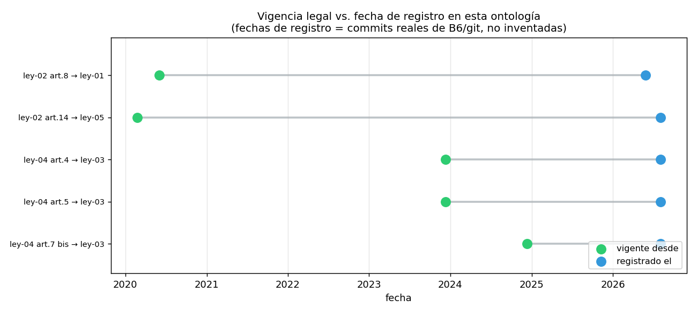

# 06 — Vigencia temporal y versionado normativo

## El documento es una unidad demasiado gruesa

Una ley puede modificar algunos artículos y dejar otros intactos; también puede
crear un artículo con vigencia futura. Marcar el documento completo como
reemplazado confunde esos estados.

`ModificacionArticulo` tipa `valido_desde` y `registrado_el` como
`datetime.date` y clasifica cada evento como `crea`, `modifica` o `deroga`.
`texto_vigente()` devuelve `VersionArticulo`:

- `no_existe`;
- `original`;
- `modificado`;
- `derogado`.

Además informa `fuente_doc_id` y `vigente_desde`. Ya no devuelve una tupla cuya
ausencia podía significar dos cosas distintas.

## Casos del corpus

Se modelan cinco eventos:

- Ley 21.210 modifica el art. 8 del DL 825 desde 2020-06-01;
- Ley 21.210 modifica el art. 14 del DL 824 desde 2020-02-24;
- Ley 21.634 modifica los arts. 4 y 5 de la Ley 19.886 desde 2023-12-11;
- Ley 21.634 crea el art. 7 bis desde 2024-12-11.

La entrada en vigencia del IVA a servicios digitales se mantiene en 2020-06-01:
la disposición transitoria difiere su aplicación y la Resolución Exenta 55 del
SII, presente en el corpus, confirma esa fecha. El propio SII documentó que los
cambios entraron en vigencia el 1 de junio
([fuente oficial](https://www.sii.cl/noticias/2020/010620noti01aav.htm)). Antes del 11-12-2024 el art. 7
bis está en estado `no_existe`, no “texto original”.

El corpus no contiene una derogación pertinente. El estado `derogado` se prueba
con un fixture sintético para validar el ciclo completo sin inventar hechos en
los datos.

## Bitemporalidad

`valido_desde` responde qué regía; `registrado_el` responde qué sabía esta
ontología. Una modificación puede ser jurídicamente antigua y haberse cargado
años después. `que_sabia_el_sistema()` filtra por la segunda fecha, no por la
primera.

## Conexiones

- `02 §9`: corrige la vigencia a nivel de documento.
- `§2`: complementa aristas `MODIFICA` con artículo y fechas.
- Los tests cubren creación futura, modificación, derogación, fecha inválida y
  bitemporalidad.
