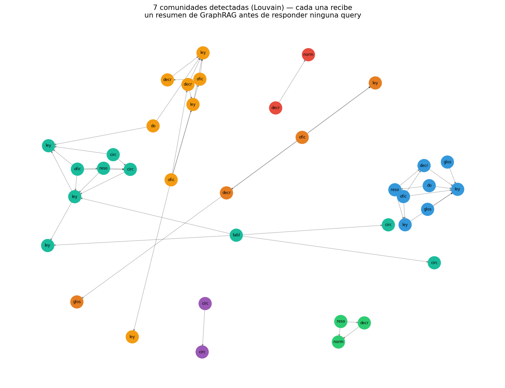

# 07 — Del grafo al retrieval: GraphRAG y su economía

## La pregunta que faltaba

Las seis secciones anteriores construyeron un grafo cada vez más completo:
entidades, relaciones tipadas, identidad resuelta, vigencia temporal. En
ningún momento se preguntó si construirlo **completo por adelantado** es
la decisión correcta. Esta sección hace esa pregunta con la disciplina que
`§3` ya estableció para el formalismo en general: medir, no describir.

GraphRAG —el enfoque que popularizó Microsoft en 2024— construye un grafo
de entidades sobre todo el corpus y genera resúmenes jerárquicos de
comunidades **antes** de responder ninguna consulta. Tiene un problema de
costo bien documentado, y una ola de soluciones 2024-2026 que lo atacan.
Esta sección reproduce ese paso de indexación sobre el propio corpus para
medir su costo real, en vez de repetir el problema en abstracto.

Código en [`ontology_lib.py`](../code/ontology_lib.py) (`comunidades_del_grafo`,
`GraphRAGIndexer`); demo en
[`code/07-graphrag-economia.py`](../code/07-graphrag-economia.py).

## El problema de costo, verificado

La cifra que circula sobre GraphRAG no es un rumor: indexar un dataset
legal de 5 GB con el pipeline original de Microsoft GraphRAG costó
**USD 33.000 en tokens de LLM en 2024** — extracción de entidades,
extracción de relaciones y resúmenes jerárquicos de comunidad, pasando el
corpus completo por el modelo varias veces antes de que un usuario hiciera
una sola pregunta ([Shereshevsky, 2025](https://medium.com/graph-praxis/the-graphrag-cost-cliff-how-33-000-became-33-in-eighteen-months-be1b0fbe37e4)).

Es, no por casualidad, un dataset del **mismo dominio** que este módulo:
legal. El problema de costo de GraphRAG no es hipotético para el tipo de
corpus que este repo construye — es el caso de uso exacto donde se
documentó.

La parte que la ola 2024-2026 vino a resolver: para mediados de 2025,
Microsoft Research había reducido ese costo de indexación al **0,1% de la
cifra original** con LazyGraphRAG, que selecciona comunidades
dinámicamente en vez de resumir todo por adelantado
([Microsoft Research, 2025](https://www.microsoft.com/en-us/research/blog/lazygraphrag-setting-a-new-standard-for-quality-and-cost/)).
La dirección del progreso es clara: mover el costo de la indexación
exhaustiva hacia la consulta, bajo demanda.

## Réplica sobre el propio corpus

Sobre las 37 normas y 47 relaciones de `§2`, detección de comunidades
(Louvain) más un resumen por LLM de cada una — el mismo paso, a escala de
este corpus:

```
Louvain detecta 7 comunidades sobre 37 nodos / 47 aristas.

Comunidad 0 (8 normas) — Normativa sobre Compras Públicas y Contratación en Chile
Comunidad 1 (3 normas) — Regulación del Lobby y la Gestión de Intereses en Chile
Comunidad 2 (2 normas) — Probidad en la Función Pública y Prevención de Conflictos de Intereses
Comunidad 3 (8 normas) — Educación Pública y Subvención Escolar Preferencial en Chile
Comunidad 4 (2 normas) — Exenciones y créditos fiscales en el sector de la construcción
Comunidad 5 (10 normas) — Normativa Tributaria en Chile
Comunidad 6 (4 normas) — Presupuesto del Ministerio de Salud 2024
```



Louvain recupera, sin que se le haya dicho, los cuatro clusters que `B6`
diseñó a propósito —compras públicas, tributario, presupuesto, probidad/
educación— y además los subdivide con criterio: separa "lobby" de
"probidad" (comunidades 1 y 2), y separa un satélite de "exenciones y
crédito de construcción" (comunidad 4) del resto del cluster tributario.
Los resúmenes que el LLM genera por comunidad son legibles y correctos —el
tipo de contenido que un índice temático de un corpus legal necesitaría.

**Costo de esta indexación completa: $0,0009.** Siete llamadas, unos 4.200
tokens en total. A la escala de este corpus, GraphRAG no tiene problema de
costo — el problema aparece a la escala de un corpus real (miles de
documentos, no 37).

## Comparación: la misma pregunta sin indexar nada

El grafo simple de `§1-§2` —sin comunidades, sin resúmenes, sin LLM en el
camino— responde las competency questions directamente:

```
P1 (§2, 1 salto):        2 resultados en 0.074 ms, $0
P4 (§2, multi-salto):    6 resultados en 4.152 ms, $0
```

Cero llamadas a un LLM, para una pregunta de un salto y para una de varios.
Esto reencuadra la pregunta de la sección: no es "grafo sí o grafo no" —
`§1-§6` ya mostraron que el grafo simple paga su costo. Es **"grafo simple
o GraphRAG con comunidades"**, y son cosas distintas que responden
preguntas distintas.

## Dónde cada uno gana, con evidencia externa

Un trabajo de 2026 que compara específicamente GraphRAG contra RAG denso en
sistemas de búsqueda agéntica da el resultado más nítido que se puede citar
sobre esta pregunta: bajo inferencia de un solo paso, GraphRAG aporta
**mejoras marginales en QA general (+0,47 en promedio)** pero **mejoras
sustanciales en QA multi-salto (+27,23 en promedio** sobre HotpotQA, 2Wiki
y Musique) ([arXiv:2604.09666](https://arxiv.org/html/2604.09666v1)).

Es exactamente la distinción que separa a este corpus en dos tipos de
pregunta:

- **Competency questions de `§2`** ("¿qué reglamenta la Ley 19.886?", "¿qué
  documentos dependen de la SEP?"): son consultas puntuales, de 1 a 3
  saltos, con un origen y un destino claros. El grafo simple las resuelve
  gratis. Las comunidades de GraphRAG no aportan nada acá —de hecho, un
  resumen de comunidad *pierde* precisión frente a seguir la arista exacta.
- **Preguntas de sensemaking global** ("¿cuáles son los grandes temas
  regulatorios que conectan estos documentos?", "¿qué áreas del corpus
  están más entrelazadas entre sí?"): son exactamente las que los resúmenes
  de comunidad de la sección anterior responden bien, y que ni el grafo
  simple ni un filtro de metadatos pueden responder sin ese paso adicional.

## La referencia de `02 §7`, sin repetir el trabajo

`02 §7` ya midió el costo de responder consultas factuales con SQL/metadata
filter contra vector search:

```
                  estrategia |  tiempo/query |    $/query |   $/1M queries
--------------------------------------------------------------------------
                    SQL puro |       ~0.1 ms |         $0 |             $0
     Vector denso (cacheado) |        ~10 ms |         $0 |             $0
        Vector denso (nueva) |   ~100-500 ms |     ~$10⁻⁶ |         ~$1-10
      Vector + extractor LLM |      +0.5-2 s |     ~$10⁻³ |        ~$1.000
```

Para una competency question de una-dos aristas, un `WHERE` sobre una tabla
de relaciones cuesta exactamente lo mismo que la fila "SQL puro" de esa
tabla: nada. El grafo simple de `§1-§2` cuesta lo mismo. **Construir un
grafo con comunidades para responder este tipo de pregunta es pagar un
costo de indexación —aunque sea bajo, como acá— por una capacidad que la
pregunta no usa.**

## La regla de decisión, simétrica a la de `§3`

`§3` estableció: no comprar más formalismo del que las competency questions
necesitan. Esta sección aplica el mismo principio al costo de indexación:

1. **Si el patrón de consultas es de 1-3 saltos con origen y destino
   claros** (la mayoría de `§2`): grafo simple o metadata filter. No indexar
   comunidades.
2. **Si el patrón exige transitividad multi-salto sin destino fijo de
   antemano** (P4 de `§2`: "¿qué depende de esta norma, sin límite de
   saltos?"): el grafo simple sigue alcanzando —ya lo demostró `§2`— sin
   necesitar resúmenes de comunidad.
3. **Si el patrón es sensemaking global sobre un corpus grande** ("¿de qué
   trata este corpus en conjunto?", útil para un tablero de navegación o un
   agente que decide por dónde empezar): ahí es donde las comunidades
   pagan, y donde LazyGraphRAG y similares atacan el costo de construirlas.
4. **Preferir recorrido bajo demanda (agéntico) sobre indexación
   exhaustiva** cuando sea posible: un agente que camina el grafo en el
   momento de la consulta —HippoRAG con Personalized PageRank, o
   simplemente un agente con la tool `alcance_transitivo` de este módulo—
   paga el costo solo de las consultas que realmente se hacen, no de un
   índice completo construido para preguntas hipotéticas. Es la misma
   economía de "no construir por adelantado" que `06-harness` (planificado)
   va a desarrollar para agentes en general.

## Estado del arte (2026), con fuentes

| Aspecto | Estado | Fuente |
|---|---|---|
| Costo de indexación GraphRAG (2024) | 🔴 Documentado como alto | USD 33.000 en un dataset legal de 5 GB — [Shereshevsky, 2025](https://medium.com/graph-praxis/the-graphrag-cost-cliff-how-33-000-became-33-in-eighteen-months-be1b0fbe37e4) |
| LazyGraphRAG (selección dinámica de comunidades) | 🟢 Reduce el costo ~1000× | Costo de indexación al 0,1% de la cifra 2024 — [Microsoft Research, 2025](https://www.microsoft.com/en-us/research/blog/lazygraphrag-setting-a-new-standard-for-quality-and-cost/) |
| LightRAG | 🟢 Grafo liviano + indexación incremental | Combina KG y retrieval vectorial en dos niveles (local/global) |
| HippoRAG | 🟢 Sin resúmenes de comunidad | Grafo de entidades + Personalized PageRank para multi-salto, sin el paso caro de resumir |
| RAPTOR | 🟢 Alternativa sin grafo de entidades | Árbol jerárquico por clustering recursivo de resúmenes |
| GraphRAG vs. RAG denso en QA multi-salto | ✅ Medido | +27,23 promedio en HotpotQA/2Wiki/Musique vs. +0,47 en QA general — [arXiv:2604.09666](https://arxiv.org/html/2604.09666v1) |
| Recorrido agéntico bajo demanda vs. indexación exhaustiva | 🟡 Dirección activa de investigación 2026 | Métodos como HippoRAG ya evitan la indexación cara; agentes que deciden qué recorrer en tiempo real son la frontera |

## Lo que viene en la próxima sección

Todo lo construido en `§1-§7` —incluida la réplica de GraphRAG de esta
sección— todavía no se sometió al único tribunal que importa en este repo:
¿mejora el retrieval del corpus regulatorio chileno, medido contra el
mismo golden y el mismo aparato estadístico que se usó para cualquier otra
técnica? `§8` lo somete a esa prueba, con el compromiso ya declarado desde
el plan maestro: si no gana, se publica igual.

## Conexiones

- **`§2`**: las competency questions de esa sección son el banco de pruebas
  de este capítulo — todas resueltas sin necesitar comunidades.
- **`§3`**: la regla de decisión de esta sección es la misma disciplina de
  "no comprar más de lo que la pregunta necesita", aplicada al costo de
  indexación en vez de al nivel de formalismo del esquema.
- **`02 §7`**: sus números de costo/latencia se citan sin repetir el
  trabajo — la fila "SQL puro" es, para preguntas de grafo simple, el mismo
  orden de magnitud.
- **`04 §1`**: la aritmética de costo que mide la indexación de esta
  sección es la misma que se aplicó en `§5`.
- **`06-harness`** (planificado): la preferencia por recorrido bajo demanda
  sobre indexación exhaustiva es la misma economía que ese módulo va a
  desarrollar para el diseño de agentes en general.
- **`§8`**: el juicio final sobre si todo el grafo —con o sin comunidades—
  se ganó su lugar frente al retrieval de `02`.
