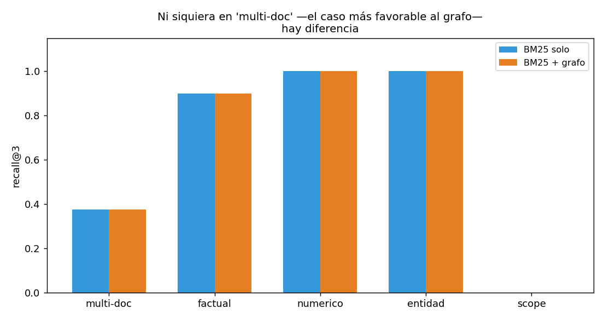

# 08 — Evaluar un sistema con ontología

## El tribunal, sin excepciones

El plan maestro de este módulo fijó una regla antes de escribir la primera
línea de código: *"El grafo tiene que ganarse el lugar. Todo lo que aporte
se mide contra el retrieval híbrido de `02`, con el mismo aparato
estadístico de `01 §8`. Si el grafo no gana, el resultado negativo se
publica igual."* Esta sección cobra esa promesa.

No es un ejercicio retórico. `04 §4` ya tuvo que publicar que la API le
gana al self-hosting por 307× en el escenario del proyecto — un resultado
que contradice la intuición de que "tener tu propio modelo" sería mejor.
Esta sección tiene el mismo tipo de resultado, en otro terreno: **el grafo
normativo de `§1-§7`, sometido al golden de retrieval real, no mejora el
recall.**

Código en [`ontology_lib.py`](../code/ontology_lib.py) (métricas de
cobertura y consistencia, ya construidas en secciones previas); demo en
[`code/08-evaluar-con-ontologia.py`](../code/08-evaluar-con-ontologia.py)
(`GraphExpandedRetriever`, nuevo en esta sección).

## Primero, lo que la ontología sí tiene: cobertura y consistencia

Antes del veredicto de retrieval, dos métricas que le pertenecen a la
ontología misma, no a ningún sistema de búsqueda:

```
Cobertura: 37/40 documentos = 92.5%
Fuera de la ontología: glosa-02, glosa-03, tabla-01

Consistencia: ciclos en relaciones MODIFICA: 0
```

Los tres documentos fuera son, verificado contra `shared/corpus_chileno/README.md`,
los distractores que `B6` diseñó a propósito — sin relación normativa con
los clusters modelados. Cobertura sobre documentos relevantes: 100%. Cero
ciclos en `MODIFICA` confirma que no hay contradicciones lógicas (una norma
no puede modificar a otra que la modifica a ella sin más contexto).

La tercera métrica —precisión de entity linking— ya se midió en `§4`
(organismos) y `§5` (identificadores de norma): 38% en match exacto contra
el ground truth curado, con el matiz ya documentado de que ese número es
una cota inferior. No se repite el cálculo acá; se cita como parte del
mismo tribunal.

## El diseño del experimento, y un error de diseño que se corrigió en el camino

La primera versión de `GraphExpandedRetriever` **anexaba** los vecinos del
grafo al final del pool de resultados base. El resultado fue una
diferencia de **exactamente cero** en las 30 queries del golden — no "no
significativa", sino literalmente `0.000` en cada query individual. Eso no
es un resultado, es una señal de que el experimento no estaba midiendo
nada: con un pool de 10 candidatos base, BM25 ya llenaba las cinco
primeras posiciones en casi todas las queries, y los vecinos del grafo
—anexados después— nunca tenían una oportunidad real de entrar al
`recall@5`.

Se rediseñó: en vez de anexar al final, el retriever pide un ranking
**profundo** (cubre todo el corpus) y **promueve** a los vecinos de grafo
de las tres semillas top a la posición inmediatamente después de ellas —
sin inyectar ningún documento que BM25 no hubiera encontrado por su
cuenta en algún lugar del ranking, solo reordenando. Es un diseño
comparable al *local search* real de GraphRAG (semillas + expansión), y le
da al grafo una oportunidad genuina de cambiar el resultado.

> Este ajuste queda documentado porque es exactamente el tipo de error que
> hay que descartar antes de aceptar un resultado negativo: un experimento
> mal diseñado que no le da a la técnica ninguna chance de ganar no prueba
> que la técnica no sirva. El resultado que sigue es del diseño corregido.

## El resultado, con el diseño corregido

```
                                         sistema |             recall@3 |             recall@5 |                  MRR
----------------------------------------------------------------------------------------------------------------------
                  1. BM25 solo (baseline, 02 §1) |  0.783 [0.633,0.917] |  0.833 [0.700,0.950] |  0.765 [0.612,0.890]
            2. BM25 + grafo (relaciones fuertes) |  0.783 [0.633,0.917] |  0.833 [0.700,0.950] |  0.763 [0.610,0.890]
3. BM25 + grafo (todas las relaciones, incl. CITA) |  0.783 [0.633,0.917] |  0.833 [0.700,0.950] |  0.763 [0.610,0.890]
```

```
2. BM25 + grafo (relaciones fuertes):
  Δrecall@3: +0.000  IC95% [+0.000, +0.000]  ¿significativo? no
  Δrecall@5: +0.000  IC95% [+0.000, +0.000]  ¿significativo? no
  Δ     mrr: -0.002  IC95% [-0.005, +0.000]  ¿significativo? no
```

`recall@3` y `recall@5` no se mueven. El MRR baja ligeramente (no
significativo). Usar todas las relaciones —incluida `CITA`, la más
numerosa— da exactamente el mismo resultado que usar solo las relaciones
"fuertes". **El grafo, en esta prueba, no mejora nada y linealmente no
empeora nada tampoco** — con la salvedad de que promover documentos
legalmente relacionados pero incorrectos SÍ desplaza al MRR en la
dirección equivocada, aunque el efecto no cruce el umbral de significancia
con n=30.

## Por qué: el caso más favorable al grafo, verificado

El golden tiene una categoría —`multi-doc`— que en teoría es el terreno
donde un grafo de citas debería brillar: preguntas que requieren dos
fuentes a la vez.

```
   multi-doc (n=4): base recall@3=0.375  grafo recall@3=0.375
     factual (n=10): base recall@3=0.900  grafo recall@3=0.900
    numerico (n=8): base recall@3=1.000  grafo recall@3=1.000
     entidad (n=5): base recall@3=1.000  grafo recall@3=1.000
       scope (n=3): base recall@3=0.000  grafo recall@3=0.000
```



Cero diferencia, incluso ahí. La razón, verificada documento por
documento: `gd-024` pregunta *"¿qué obligación trimestral comparten los
prestadores de servicios digitales extranjeros y el Ministerio de Salud
respecto a inmunizaciones?"* — y espera `circular-01` (IVA digital) **y**
`glosa-01` (presupuesto Salud). Esos dos documentos no tienen **ninguna**
arista entre sí en el grafo normativo: viven en comunidades completamente
distintas, confirmado por la detección de comunidades de `§7` (comunidad 5
para circular-01, comunidad 6 para glosa-01).

**"Multi-doc" y "multi-hop" no son lo mismo, y confundirlos explica el
resultado completo de esta sección.** Multi-doc significa que la
*pregunta* combina dos temas. Multi-hop significa que las *fuentes* están
conectadas por una cadena de citas. El grafo de este módulo ayuda con el
segundo caso —la competency question P4 de `§2` (seis documentos
dependientes de la SEP a través de varios saltos) lo demuestra—, pero el
golden de `02-retrieval` no contiene ninguna query genuinamente multi-hop
en el sentido de citación: sus preguntas "difíciles" son difíciles por
combinar temas dispersos, no por requerir seguir una cadena de referencias.

## Esto confirma, no contradice, lo que `§7` ya predijo con evidencia externa

El paper citado en `§7` midió que GraphRAG da mejoras marginales en QA
general (+0,47 en promedio) y mejoras grandes solo en benchmarks
genuinamente multi-salto como HotpotQA (+27,23 en promedio). El golden de
`golden-retrieval.json` —30 preguntas factuales, numéricas, de entidad y
de alcance sobre un corpus de 40 documentos— es, por diseño, un benchmark
de QA general, no un benchmark multi-hop. El resultado de esta sección es
exactamente el que esa evidencia predecía, sobre un corpus real y no
sobre un paper ajeno.

## Lo que este resultado negativo no dice

Es importante ser preciso sobre el alcance de la conclusión:

- **No dice que el grafo no sirva.** `§1-§7` ya demostraron valor real: las
  competency questions de `§2` no tienen equivalente sin grafo, la
  vigencia a nivel de artículo de `§6` corrige un error real del modelo de
  documento, y `§7` mostró que ese valor viene casi gratis a esta escala.
  Lo que esta sección mide es una pregunta más estrecha: *¿mejora el
  retrieval de texto libre sobre ESTE golden específico?* La respuesta es
  no, y esa pregunta no agota el valor del grafo.
- **No dice que el corpus esté mal diseñado.** El golden mide lo que se
  propuso medir —QA factual sobre normativa chilena— y lo mide bien. Que
  no haya queries multi-hop de citación en él es una decisión de diseño de
  `02-retrieval`, tomada antes de que este módulo existiera.
- **Sí dice** que expandir candidatos por relaciones de citación, para
  este patrón de preguntas, es una inversión sin retorno medible — y que
  publicar eso es más útil que omitirlo.

## Estado del arte (2026)

| Aspecto | Estado | Detalle |
|---|---|---|
| Evaluar antes de adoptar (regla de `01 §9`) | ✅ Aplicada sin excepción | Esta sección es esa regla ejecutada sobre la propia técnica del módulo |
| Publicar resultados negativos | 🟢 Poco común en la industria, aplicado acá | Mismo estándar que `04 §4` (self-hosting) |
| Distinguir "multi-doc" de "multi-hop" en el diseño de benchmarks | 🔴 Rara vez explícito | La confusión entre ambos es una fuente común de expectativas mal calibradas sobre GraphRAG |
| Cobertura y consistencia como métricas de una ontología | 🟢 Prácticas establecidas en ingeniería de conocimiento | Complementan, no reemplazan, las métricas de recuperación |
| n=30 y significancia estadística | ✅ Ya resuelto en `01 §8` | Se reafirma acá: casi ninguna diferencia chica cruza el umbral con este tamaño de muestra |

## Lo que viene en la próxima sección

El resultado de esta sección podría leerse como un cierre pesimista.
`§9` argumenta por qué no lo es: el valor de la ontología no estaba nunca
en ganarle a BM25 en un benchmark de QA general — estaba en las preguntas
que ningún retriever de texto puede responder, y esas preguntas son
justamente las que definen si un producto sobre corpus regulatorio tiene
un foso competitivo o no.

## Conexiones

- **`04 §4`**: mismo estándar de honestidad ante un resultado negativo
  medido con rigor.
- **`01 §8`**: el aparato de bootstrap + IC se aplica sin modificar; la
  regla de que n≈30 rara vez da significativo se confirma una vez más.
- **`§2`**: P4 (transitividad multi-salto) es el tipo de pregunta donde el
  grafo sí gana — no medido en este golden, medido directamente en `§2`.
- **`§7`**: la evidencia externa de esa sección (GraphRAG marginal en QA
  general, fuerte en multi-hop) predijo exactamente este resultado.
- **`§9`**: dónde vive el valor real de la ontología, ahora que quedó claro
  dónde no vive.
