# 00 — Plan Maestro: Harness Agéntico

## Objetivo de la masterclass

Un agente de IA tiene dos componentes separables: el **modelo**, que decide, y el
**harness**, que define qué puede percibir, qué puede hacer y qué observa después
de actuar. Este módulo sostiene —y mide— que a igualdad de modelo, el harness
explica más varianza en la calidad del resultado que un salto de generación de
modelo. Al terminar deberías poder responder: *¿qué le doy al agente, en qué
formato, con qué herramientas, bajo qué permisos, y cómo sé si el bucle está
funcionando o solo parece funcionar?*

Es la capa que el [README del repo](../../README.md) marca como **"retrieval y
orquestación"**, la tercera de las cuatro capas invariantes. `02-retrieval`
resolvió la mitad de esa capa —cómo encontrar el fragmento correcto— asumiendo un
consumidor pasivo: un prompt que recibe *k* chunks y responde. Este módulo levanta
ese supuesto. El consumidor pasa a ser un agente que decide **cuándo** buscar,
**qué** buscar y **cuándo parar**, y esa autonomía cambia el problema de ingeniería
completo: el contexto deja de ser un parámetro y pasa a ser un presupuesto que se
administra a lo largo de N iteraciones.

## El encuadre: el harness es diseño institucional

La intuición que hace transferible este módulo a un economista no es de ingeniería
de software, es de **diseño de mecanismos**.

Un agente de IA es un agente en sentido literal: un decisor con capacidad limitada
que actúa por cuenta de un principal, bajo información incompleta y con objetivos
que hay que inducir, no suponer. El harness es el conjunto de reglas del juego que
ese agente enfrenta:

| Concepto de diseño institucional | Su contraparte en el harness |
|---|---|
| Restricción de información del agente | Ventana de contexto: qué ve y qué no (§2) |
| Contrato incompleto | Esquema de la herramienta: lo que especifica y lo que deja abierto (§3) |
| Estándar de interoperabilidad | MCP: un protocolo en vez de N integraciones ad hoc (§4) |
| Estructura organizacional (jerarquía vs. equipo) | Un agente vs. orquestador/trabajadores (§5) |
| Delegación con costo de monitoreo | Permisos, checkpoints y sandbox (§6) |
| Evaluación por resultado vs. por proceso | Métricas de trayectoria vs. de respuesta (§7) |
| Restricción presupuestaria dura | Corte del bucle que no converge (§8) |

La consecuencia práctica de tomarse en serio la analogía: cuando un agente falla,
la primera pregunta no es "¿le pongo un modelo mejor?" sino **"¿qué regla del
entorno hizo que esta fuera la decisión razonable?"**. Un agente que hace la misma
búsqueda inútil cuatro veces no es tonto: está en un entorno que no le informa que
la búsqueda fue inútil. Eso es un problema de diseño del canal de retroalimentación
—de información, no de capacidad— y se arregla en el harness, gratis, sin cambiar
de modelo.

## Por qué "harness" acá significa el harness agéntico

El término está sobrecargado y el repo ya usó el otro sentido. `01 §9` construyó un
**eval harness**: el andamiaje que corre un golden dataset contra un sistema y
produce métricas con IC. Este módulo trata el **harness agéntico**: el bucle,
el contexto, las herramientas y los permisos con que un modelo opera en producción.

No son homónimos casuales, son parientes: ambos son el andamiaje que rodea al
modelo y decide qué entra, qué sale y qué se registra. El eval harness es el
antepasado del agéntico, y §7 los reúne — evaluar un agente es correr un eval
harness sobre las trayectorias que produjo el harness agéntico.

## Por qué ahora y no antes

Tres deudas que los módulos anteriores dejaron explícitamente para acá:

1. **`04 §6` identificó el punto de inflexión económico y no lo desarrolló.** El
   cierre de economía fue que a escala de un producto B2B chileno el costo de
   inferencia es ruido —márgenes brutos sobre 99%— *salvo* cuando la arquitectura
   se vuelve agéntica: con 15 pasos por consulta y modelo premium, la holgura del
   plan cae de 7.975× a 12×. Ese factor 15 es el objeto de estudio de §8.
2. **`05` construyó un grafo que ningún consumidor recorre.** El módulo de
   ontologías cerró con 38 normas y 69 relaciones literales, y con un resultado
   incómodo en §8: expandir el grafo *a priori* sobre el golden de retrieval no
   mejora recall (delta −0,033, IC que incluye cero). La hipótesis que ese
   resultado deja abierta es que el grafo no se consume expandiendo de antemano
   sino **recorriéndolo bajo demanda**, que es exactamente lo que hace un agente
   con una herramienta de travesía. La regla de decisión de `05 §7` lo dice con
   todas las letras —"dependencia transitiva: recorrido de grafo bajo demanda"—
   pero ese módulo no tenía quién hiciera el recorrido. Acá lo hay.
3. **`03 §6` sembró la idempotencia de las llamadas y no tuvo dónde cobrarla.** En
   una arquitectura request/response, reintentar una llamada idempotente es
   higiene. En un bucle agéntico con efectos laterales y reintentos automáticos,
   es la diferencia entre un reintento y una acción duplicada. §6 lo retoma.

## Honestidad sobre el método: qué se puede medir offline y qué no

La tentación de este módulo es la contraria a la de `05`. Allá el riesgo era
construir un grafo bonito y declararlo superior; acá el riesgo es **escribir
teoría sobre agentes sin correr ninguno**, o correr uno con un modelo simulado y
presentar el resultado como si dijera algo sobre modelos reales.

Regla de método, en tres partes:

1. **Toda comparación entre harnesses se hace con la política de decisión fija.**
   Cuando el objeto de estudio es la regla del entorno (§1, §3, §6), el modelo se
   mantiene constante y el delta es atribuible al harness por construcción. Es un
   diseño experimental, no un atajo: si el modelo variara entre brazos, el
   experimento no mediría lo que dice medir.
2. **Todo lo que involucre a un modelo real se ejecuta con caché versionado y
   auditable**, con el contrato `LLMCacheEntry` que `05` ya definió (prompt,
   esquema, modelo devuelto, tokens, costo histórico). Offline por defecto,
   `--allow-api` solo para regenerar. Ninguna corrida de tests toca la red.
3. **Un agente determinista no es un modelo.** Los experimentos con política
   determinista miden propiedades **estructurales** del bucle (cuántos pasos,
   cuánto contexto, cuántas llamadas redundantes, si el error se recupera) y no
   autorizan ninguna afirmación sobre capacidad de razonamiento. Donde la
   conclusión dependa de que el modelo *entienda* algo, se corre el modelo real
   y se dice el n.

Y la regla heredada de todo el repo: si el agente pierde contra el pipeline no
agéntico de `02`, ese resultado se publica igual.

## Hilo conductor

El mismo corpus de siempre —40 documentos de `shared/corpus_chileno/`— más los dos
artefactos que los módulos previos dejaron listos: el retrieval híbrido de `02` y
el grafo normativo de `05`. Sobre esa base, cada sección agrega una capa del
harness:

```mermaid
graph LR
    B["§1 El bucle<br/>percibir→actuar"] --> C["§2 Contexto como<br/>recurso escaso"]
    C --> T["§3 La tool<br/>como contrato"]
    T --> M["§4 MCP<br/>servidor real"]
    M --> MA["§5 Uno o<br/>varios agentes"]
    MA --> P["§6 Permisos y<br/>sandbox"]
    P --> E["§7 Evaluar<br/>trayectorias"]
    E --> CO["§8 Costo y<br/>corte del bucle"]
    CO --> PR["§9 El harness<br/>como práctica"]

    style B fill:#bdf,stroke:#333,color:#1a1a1a
    style M fill:#cfc,stroke:#333,color:#1a1a1a
    style PR fill:#fd9,stroke:#333,color:#1a1a1a
```

Las secciones 1-3 construyen el bucle y sus dos recursos escasos (contexto y
herramientas). La 4 lo saca del proceso y lo pone detrás de un protocolo. Las 5-6
tratan la organización y el control. Las 7-8 lo someten a medición. La 9 baja todo
a la práctica personal del autor.

## Temario

### Sección 1 — Qué es un harness y por qué decide más que el modelo
- El bucle: percibir → decidir → actuar → observar, y por qué el cuarto paso es el
  que casi todos los tutoriales tratan como trivial y es el que rompe el bucle.
- Anatomía mínima de un agente en `harness_lib.py`: `Tool`, `ToolRegistry`,
  `AgentLoop`, `Trajectory`. Menos de lo que sugiere el discurso de frameworks.
- Experimento: la misma política de decisión, dos harnesses (uno que devuelve
  errores opacos y resultados sin truncar, otro con contrato explícito y
  observaciones acotadas) sobre las mismas tareas del corpus chileno. El delta
  atribuible al harness, con la política fija.
- Por qué "agente" no es una categoría binaria: el espectro workflow → agente, y
  el costo de moverse hacia la derecha.

### Sección 2 — Context engineering: el contexto como problema de asignación
- El contexto no es "memoria", es un **presupuesto** con precio (`04 §1`), y cada
  token gastado en algo desplaza otra cosa. Es un problema de asignación, no de
  almacenamiento.
- Las cuatro partidas del presupuesto: instrucciones del sistema, definiciones de
  herramientas, historia de la trayectoria y resultados recuperados. Medición de
  cuánto pesa cada una en el agente real de §1, iteración por iteración.
- Compaction: qué se puede tirar y qué no. Estrategias medidas sobre la misma
  trayectoria (truncar, resumir, indexar a memoria externa) y qué pierde cada una.
- Memoria externa como retrieval: la conexión directa con `02`. Recuperar un chunk
  a demanda es más barato que mantenerlo en contexto durante 15 iteraciones.

### Sección 3 — Diseño de herramientas: la tool como contrato
- Granularidad: la herramienta como unidad de delegación. Demasiado fina obliga a
  N llamadas para una tarea; demasiado gruesa devuelve 40k tokens y arruina el
  presupuesto de §2.
- El esquema como contrato incompleto: qué especifica el JSON Schema, qué queda
  para la descripción en prosa, y por qué la descripción es parte del prompt
  aunque no la escribas en el prompt.
- **Los mensajes de error como canal de enseñanza.** Un error que dice
  `KeyError: 'doc_id'` no enseña nada; uno que dice qué se esperaba, qué llegó y
  qué hacer a continuación convierte un fallo en una corrección. Medición: tasa de
  recuperación tras el primer error, con los dos diseños.
- Reglas de diseño derivadas del corpus chileno: paginación obligatoria, ids
  canónicos en vez de nombres libres (doctrina #6), y toda respuesta con su
  trazabilidad a la fuente (doctrina #5).

### Sección 4 — MCP como estándar
- El problema que resuelve: N clientes × M fuentes de datos es N×M integraciones;
  un protocolo lo vuelve N+M. Es estandarización de interfaz, con la misma
  economía que cualquier estándar de interoperabilidad.
- Las primitivas del protocolo (tools, resources, prompts) y cuál corresponde a
  qué parte del corpus chileno.
- **Entregable: un servidor MCP funcional sobre `shared/corpus_chileno/`**, con
  el SDK oficial. Expone búsqueda híbrida (`02`), lectura de norma con paginación
  (§3) y travesía del grafo normativo (`05`). Es artefacto de portfolio, no
  ejercicio: se conecta a un cliente MCP real.
- Gobernanza del estándar: qué cambia cuando un protocolo deja de pertenecer a un
  proveedor. Estado verificado, con fuente.

### Sección 5 — Arquitecturas multiagente
- El patrón orquestador/trabajador y su análogo organizacional: subagentes como
  **aislamiento de contexto**, no como "más inteligencia". Un subagente es un
  departamento con su propia información, no un empleado más listo.
- Cuándo un solo agente con buen contexto le gana a tres agentes coordinados: el
  costo de coordinación es real y se paga en tokens, en latencia y en pérdida de
  información en cada frontera.
- Medición sobre el corpus: la misma tarea multi-documento resuelta por un agente
  y por orquestador + trabajadores, comparando pasos, tokens y calidad.
- El patrón que el autor ya usa (Claude Code planificador + Codex implementador)
  como caso concreto de división del trabajo por ventaja comparativa.

### Sección 6 — Control, permisos y sandboxing
- Delegación con costo de monitoreo: revisar todo anula la ganancia de delegar; no
  revisar nada externaliza el riesgo. El diseño de permisos es dónde se pone el
  corte.
- Clasificación de herramientas por reversibilidad y alcance, y el permiso como
  función de esa clasificación (no como lista de bloqueo escrita a mano).
- Idempotencia de las llamadas: `03 §6` la dejó sembrada. En un bucle con
  reintentos automáticos, una herramienta con efectos laterales no idempotente
  duplica acciones. Clave de idempotencia y demo del fallo.
- Sandbox: qué aísla y qué no. Conexión con `03 §11` (inyección de prompt) —
  en un agente con herramientas, la inyección deja de ser un problema de output y
  pasa a ser un problema de ejecución.

### Sección 7 — Evaluar agentes: se evalúan trayectorias
- Por qué la métrica de resultado no alcanza: dos agentes con la misma respuesta
  final pueden diferir 5× en costo, y uno de los dos acertó por casualidad.
- Métricas de trayectoria sobre el `Trajectory` de §1: pasos hasta la respuesta,
  llamadas inválidas, llamadas redundantes, recuperación tras error, precisión de
  selección de herramienta contra una trayectoria de referencia.
- **Entregable: un agente evaluado sobre una tarea real del dominio**, con golden
  de trayectorias congelado y el aparato estadístico de `01 §8` (bootstrap, IC).
  Modelo real, con caché versionado; el n se declara.
- Límites de los benchmarks agénticos públicos y por qué un eval propio del
  dominio sigue siendo el que decide.

### Sección 8 — Costo y latencia del bucle
- Un agente no hace una llamada, hace N — y N es una variable aleatoria. El
  problema de costo no es la media sino la **cola**: el p95 es el que rompe el
  plan mensual de `04 §6`.
- Distribución del costo por tarea medida sobre las trayectorias de §7, no
  supuesta. Percentiles, no promedios.
- Caching de prefijo: el bucle agéntico es el caso de uso donde más rinde, porque
  el prefijo (sistema + herramientas) se repite en cada iteración. Cuantificación
  con la aritmética de `04 §1` y el `CostMeter` de `03 §10`.
- Reglas de corte: cómo detectar un bucle que no converge —y por qué el criterio
  debe ser observable dentro del bucle, no evidente solo desde afuera.

### Sección 9 — El harness como práctica personal
- El caso de estudio es este repositorio: `AGENTS.md`, `CLAUDE.md`, `BACKLOG.md`
  como cola de trabajo, hooks de sesión, skills y subagentes. Qué de eso es
  harness y qué es decoración.
- El archivo de instrucciones como contrato de trabajo: por qué las reglas que
  funcionan son las verificables ("`uv run pytest` en verde antes de cerrar") y
  las que no funcionan son las aspiracionales ("escribe código de calidad").
- Qué delegar y qué no, con criterio explícito: reversibilidad, costo de
  verificación y si el error se detecta o se acumula en silencio.
- Cierre del módulo y del repo: qué queda en pie de las seis masterclasses y cuál
  es la próxima frontera honesta.

## Dependencias con otras masterclasses

| Dirección | Qué |
|---|---|
| ← `01 §8` | Bootstrap + IC para el eval de trayectorias de §7. |
| ← `01 §9` | El eval harness es el antepasado del harness agéntico; §7 los reúne. |
| ← `02` completo | El retrieval híbrido es la herramienta principal del agente y del servidor MCP. |
| ← `03 §4` | Caching multinivel; §8 agrega el caching de prefijo del bucle. |
| ← `03 §6` | Idempotencia y reintentos: §6 cobra la deuda en un bucle con efectos laterales. |
| ← `03 §10` | `CostMeter` y `BudgetGuard` aplicados al costo por tarea, no por llamada. |
| ← `03 §11` | Inyección de prompt, que en un agente con herramientas escala a ejecución. |
| ← `04 §1` | Aritmética prefill/decode: por qué el prefijo repetido del bucle es cacheable. |
| ← `04 §6` | El factor 15× de pasos por consulta que hizo caer la holgura del plan. |
| ← `05 §7` | "Recorrido de grafo bajo demanda": la regla que ese módulo enunció sin poder ejecutar. |
| ← `05` (contrato de caché) | `LLMCacheEntry` y el caché versionado se reutilizan sin duplicar. |

## Decisiones técnicas tomadas

1. **Un solo módulo `harness_lib.py` acumulado por sección**, igual que
   `retrieval_lib.py`, `prod_lib.py`, `econ_lib.py` y `ontology_lib.py`. Sin
   framework de agentes de terceros: el bucle son ~150 líneas y esconderlas detrás
   de una abstracción de un tercero haría al módulo menos didáctico y más frágil.
2. **El servidor MCP usa el SDK oficial (`mcp`)**, no una implementación propia del
   protocolo. Acá el objetivo es interoperar con clientes reales, y un protocolo
   reimplementado a mano interopera con nada. Es la decisión opuesta a la del punto
   1 y por la razón opuesta: el bucle es contenido pedagógico, el protocolo es
   infraestructura.
3. **Offline por defecto, con caché versionado.** Mismo contrato `LLMCacheEntry`
   de `05`, importado, no copiado. `uv run pytest` y todos los scripts corren sin
   API key ni red.
4. **Las herramientas del agente son las capacidades ya construidas en el repo.**
   Ninguna herramienta de juguete: buscar es el híbrido de `02`, leer es el corpus
   real, recorrer es el grafo de `05`. El módulo integra lo construido en vez de
   simular un entorno nuevo.
5. **Toda afirmación sobre MCP, frameworks agénticos y benchmarks lleva fuente o
   se marca `[verificar]`.** Es el área de estado del arte más volátil del repo y
   la que más se escribe de memoria.
