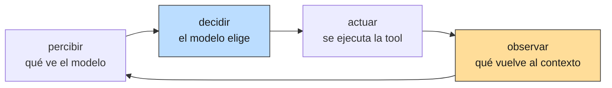
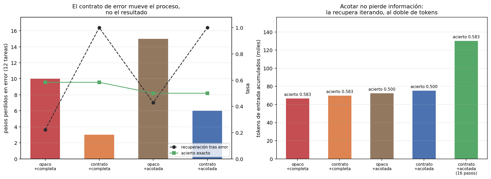

# 01 — Qué es un harness y por qué decide más que el modelo

## El bucle, y el paso que nadie mira

Un agente es un bucle de cuatro pasos:



De los cuatro, **el modelo solo hace uno**. Los otros tres los escribe quien
construye el sistema: qué información entra, qué acciones están disponibles, y —el
que casi todos los tutoriales despachan como *logging*— **qué texto vuelve al
contexto después de actuar**.

Ese cuarto paso es el objeto de esta sección. La observación no es un registro de
lo que pasó: es el único canal por el que el agente se entera del estado del mundo.
Si la observación miente, omite o no dice qué salió mal, el modelo decide sobre una
representación equivocada del mundo — y va a decidir mal por más capaz que sea.

La analogía útil no es de software. Un agente de IA es un agente en el sentido de
la teoría económica: un decisor con información limitada que actúa por cuenta de un
principal. El harness es el **conjunto de reglas del entorno** que ese decisor
enfrenta: su restricción de información, su menú de acciones, y la señal que recibe
después de cada una. Cuando un agente rinde mal, la primera pregunta no es "¿le
pongo un modelo mejor?" sino *"¿qué regla del entorno hizo que esta fuera la
decisión razonable?"*.

## La anatomía mínima, sin framework

El discurso de la industria sugiere que construir un agente requiere adoptar un
framework. El bucle completo de [`harness_lib.py`](../code/harness_lib.py) son
cuatro objetos y unas ciento veinte líneas:

| Objeto | Qué es |
|---|---|
| `Herramienta` | Nombre, descripción, esquema Pydantic de argumentos y la función. El JSON Schema que ve el modelo sale del mismo esquema que valida la llamada: una sola fuente de verdad. |
| `ToolRegistry` | Despacha la llamada y **traduce el fallo a texto**. Es donde el diseño del entorno se convierte en algo que el modelo lee. |
| `AgentLoop` | Los cuatro pasos y las condiciones de corte. Cuarenta líneas. |
| `Trayectoria` | El registro de qué se hizo, no solo qué se respondió. Es el insumo de §7 y la razón por la que existe como objeto y no como log. |

Y un quinto que es el objeto de estudio del módulo:

```python
class HarnessConfig(BaseModel):
    max_pasos: int = 8
    max_chars_observacion: int | None = None   # None = la observación entra entera
    estilo_error: Literal["opaco", "contrato"] = "opaco"
    max_repeticiones: int = 3
```

Cambiar cualquiera de esos campos deja el modelo, las herramientas y la tarea
intactos, y altera solo lo que el agente percibe. Todo delta medido en esta
masterclass es un delta de este objeto.

Las herramientas no son de juguete: `buscar_corpus` es el BM25 de `02`,
`leer_norma` lee los archivos reales de `shared/corpus_chileno/` paginados, y
`vecinos_grafo` recorre el grafo normativo auditado de `05`. Los fallos que siguen
son fallos reales del dominio, no artefactos de un entorno inventado para la demo.

## El experimento: factorial 2×2

Doce tareas congeladas en
[`examples/tareas-agente.json`](../examples/tareas-agente.json). No se anotó nada
nuevo: cada tarea copia la pregunta y los documentos esperados de un golden ya
auditado del repo — cinco de recuperación y tres de abstención del golden de
`01-evals`, y cuatro de las *competency questions* de `05`. La métrica es objetiva
y no usa juez LLM:
**el conjunto de documentos que el agente cita contra el conjunto esperado**.

Se cruzan dos reglas del entorno, con todo lo demás fijo (mismo `gpt-4o-mini` a
temperatura 0, mismas herramientas, mismo prompt de sistema, mismo tope de ocho
pasos):

| | observación completa | observación acotada a 1.200 caracteres |
|---|---|---|
| **error opaco** (`Error: ToolError`) | brazo 1 | brazo 3 |
| **error con contrato** (esperado / recibido / siguiente paso) | brazo 2 | brazo 4 |

Cruzarlos importa. La primera versión de este experimento tenía dos brazos —"todo
mal" contra "todo bien"— y produjo un delta agregado que no se podía atribuir a
ninguno de los dos cambios. Con cuatro brazos, el efecto principal de cada factor
es el promedio de su efecto en los dos niveles del otro, y se puede leer por
separado.

```
métrica                         opaco+completa   contrato+completa       opaco+acotada    contrato+acotada
----------------------------------------------------------------------------------------------------------
acierto exacto                           0.583               0.583               0.500               0.500
F1 de docs citados                       0.639               0.639               0.500               0.500
pasos promedio                            4.75                4.83                5.33                5.33
pasos con error                             10                   3                  15                   6
recuperación tras error                  0.222               1.000               0.429               1.000
llamadas redundantes                         1                   0                   5                   3
tareas sin respuesta                         2                   2                   5                   5
tokens de entrada                        66618               69896               72477               75192
```

Efectos principales:

```
métrica                       efecto contrato      efecto acotar
----------------------------------------------------------------
acierto exacto                          0.000             -0.083
pasos con error                            -8                  4
recuperación tras error                 0.675              0.103
llamadas redundantes                       -2                  4
tokens de entrada                        2996               5578
```



## Resultado 1: el contrato de error arregla el proceso y no mueve el resultado

El efecto del contrato de error sobre el acierto es **exactamente cero**. Sobre el
proceso es enorme: los pasos perdidos en error caen de 10 a 3 (y de 15 a 6 con
observación acotada), y la recuperación tras un error pasa de 0,222 a **1,000**.

Publicar esto tal cual importa más que el número bonito que se esperaba. La lectura
correcta no es "los mensajes de error no sirven": es que **arreglaron exactamente el
mecanismo que atacan** —el agente ya no se queda pegado en un fallo— y que las
tareas que fallaron en este conjunto no fallaban por eso.

El caso que lo muestra entero es la tarea `t-08`, *"¿Qué documentos dependen en
hasta dos saltos del DS 250?"*. Con error opaco, la trayectoria completa es:

```
0 vecinos_grafo(doc_id="ds-250", tipo_relacion="aplica",      direccion="out") -> Error: ToolError
1 vecinos_grafo(doc_id="ds-250", tipo_relacion="aplica",      direccion="out") -> Error: ToolError
2 vecinos_grafo(doc_id="ds-250", tipo_relacion="cita",        direccion="out") -> Error: ToolError
3 vecinos_grafo(doc_id="ds-250", tipo_relacion="deroga",      direccion="out") -> Error: ToolError
4 vecinos_grafo(doc_id="ds-250", tipo_relacion="interpreta",  direccion="out") -> Error: ToolError
5 vecinos_grafo(doc_id="ds-250", tipo_relacion="modifica",    direccion="out") -> Error: ToolError
6 vecinos_grafo(doc_id="ds-250", tipo_relacion="reglamenta",  direccion="out") -> Error: ToolError
7 vecinos_grafo(doc_id="ds-250", tipo_relacion="aplica",      direccion="in")  -> Error: ToolError
```

Ocho pasos, ocho errores, cero información. Y acá está lo importante: **el agente no
se quedó paralizado, hizo exactamente lo racional**. Le dijeron que la llamada
falló y no cuál de los tres argumentos estaba mal, así que enumeró
sistemáticamente el espacio del parámetro que podía enumerar —los seis tipos de
relación— y después empezó con las direcciones. Es una búsqueda ordenada sobre la
dimensión equivocada, porque el error nunca dijo que el problema era `doc_id`:
`"ds-250"` no es un identificador del corpus.

El mismo modelo, en el mismo paso 0, con el error que sí lo dice:

```
0 vecinos_grafo(doc_id="ds-250", ...) -> ERROR en 'vecinos_grafo'. Esperado: un doc_id
    presente en el grafo normativo. Recibido: ds-250. Siguiente paso: usá
    'buscar_corpus' para ubicar el documento primero.
1 buscar_corpus(consulta="DS 250")                  -> ok  [decreto-03-reglamento-compras-publicas.txt#0] DECRETO SUPREMO Nº 250
2 vecinos_grafo(doc_id="decreto-03-reglamento-compras-publicas.txt", ...) -> ok
3..7 seis travesías productivas del grafo
```

Un paso de error, y el resto del presupuesto gastado en trabajo útil. Las dos
trayectorias fallan la tarea —vuelvo a eso enseguida— y **una métrica de resultado
las califica idéntico**. Esa ceguera es el argumento de §7 y acá ya se puede ver.

> Un agente que repite ocho veces una llamada inútil no es tonto: está en un
> entorno que no le informa qué falló. El arreglo cuesta veinte líneas en el
> `ToolRegistry` y no requiere cambiar de modelo.

## Resultado 2: acotar la observación no pierde información, pero cuesta el doble

Acotar la observación a 1.200 caracteres baja el acierto de 0,583 a 0,500 y triplica
las tareas que ni siquiera llegan a responder (de 2 a 5). La conclusión tentadora
—"truncar destruye información"— es falsa, y el quinto brazo lo demuestra: el mismo
entorno acotado, con el tope de pasos subido de 8 a 16, recupera el acierto por
completo.

```
métrica                       contrato+acotada    contrato+acotada (16 pasos)
------------------------------------------------------------------------------
acierto exacto                           0.500                          0.583
pasos promedio                            5.33                           7.00
tareas sin respuesta                         5                              2
tokens de entrada                        75192                         130315
```

Mismo acierto que el brazo sin truncar (0,583) con **casi el doble de tokens de
entrada** (130.315 contra 66.618). El truncado no borró la información: la puso
detrás de una iteración más. Y una iteración más no cuesta el fragmento que se
ahorró — cuesta **reenviar toda la conversación anterior**, porque cada llamada del
bucle manda el historial completo.

Esa es la asimetría central del context engineering y el punto de partida de §2:

> En un bucle agéntico, ahorrar contexto por observación es barato y ahorrar
> *iteraciones* es caro. El costo del contexto no es lineal en lo que guardás: es
> cuadrático en cuántas veces tenés que volver a mandarlo.

## Lo que ninguno de los cuatro brazos arregla

Las tres familias de tarea se comportan de forma muy distinta, y el harness no
explica nada de esa diferencia:

```
familia          acierto (los cuatro brazos)
------------------------------------------------
abstencion       1.000
estructural      0.500
recuperacion     0.400 (0.200 con observación acotada)
```

La abstención sale perfecta en los cuatro brazos: las tres tareas donde la respuesta
correcta es "no consta en el corpus" se resuelven siempre. Es un resultado a favor
del corpus y del prompt de sistema, no del harness.

Las estructurales se parten al medio, y la mitad que falla lo hace por una razón que
`t-08` deja a la vista: la pregunta pide el cierre transitivo a dos saltos, y
`vecinos_grafo` devuelve **un salto de un tipo de relación por llamada**. Cubrir dos
saltos sobre seis tipos de relación y dos direcciones no entra en ocho pasos, ni en
dieciséis. Ningún mensaje de error arregla eso: es un problema de **granularidad de
la herramienta**, la unidad de delegación está mal elegida. §3 lo diagnostica y lo
mide.

## El espectro workflow → agente

"Agente" no es una categoría binaria y conviene no usarla como bandera. Lo que hay
es un espectro según **quién elige el siguiente paso**:

| | Quién decide el orden | Ejemplo en este repo | Costo |
|---|---|---|---|
| Cadena fija | El programador | El pipeline RAG de `02`: recuperar → rerankear → generar | 1 llamada |
| Ruteo | El modelo, una vez | El `CostAwareRouter` de `03 §10` | 1-2 llamadas |
| Bucle acotado | El modelo, hasta N veces | Este módulo | 2-8 llamadas |
| Autonomía abierta | El modelo, sin tope | Fuera de alcance acá | indeterminado |

Moverse hacia abajo compra flexibilidad y paga en tres monedas: costo (de 1 llamada
a 4,75 promedio en el brazo base), varianza (§8) y verificabilidad. La pregunta de
diseño no es "¿hago un agente?" sino **"¿cuánta indeterminación en el orden de los
pasos me compra algo que la cadena fija no me daba?"**. Para diez de las doce tareas
de acá, un pipeline fijo de `02` hubiera bastado; las estructurales de dos saltos
son las que justifican el bucle.

## Estado del arte (2026)

| Aspecto | Estado | Detalle |
|---|---|---|
| Bucle tool-use como patrón dominante | ✅ Consenso | Todo agente serio es este bucle; las diferencias están en el entorno, no en el bucle |
| Tool-calling nativo en la API | ✅ Estándar | Todos los proveedores grandes; el esquema JSON por herramienta es el contrato |
| Frameworks de agentes | 🟡 En disputa | Conviven frameworks pesados y el patrón "escribí el bucle vos"; no hay convergencia |
| Mensajes de error como canal de diseño | 🟢 Reconocido, poco medido | Se recomienda ampliamente; casi no se publican mediciones del efecto separado |
| Diseño experimental factorial en harness | 🔴 Raro | Lo habitual es comparar sistemas completos, donde nada es atribuible |
| Métricas de trayectoria | 🟡 En adopción | Ver §7 |

Lo que este experimento sugiere y no puede probar con n=12: que el orden de
prioridades habitual está invertido. Se invierte primero en el modelo, después en el
prompt y casi nunca en el texto que devuelven las herramientas — que es lo único de
los tres que costó veinte líneas.

## Límites de este experimento

- **n = 12 tareas, un modelo, una réplica.** Los deltas de proceso son grandes y
  consistentes en los dos niveles del otro factor; los de resultado (±0,083) están
  dentro de lo que una tarea que cambia de signo mueve. No se calculan IC acá: el
  aparato estadístico entra en §7, donde el objeto de estudio es la medición misma.
- **Un solo modelo (`gpt-4o-mini`).** Un modelo más capaz probablemente infiera de
  `Error: ToolError` lo que este no infirió. Eso ablandaría el resultado 1 sin
  tocar el 2, que es aritmético.
- **Temperatura 0 y caché congelado.** La corrida offline reproduce exactamente las
  327 decisiones de los cinco brazos, con cero llamadas a la API; no hay varianza de
  muestreo dentro de estos números, y por eso tampoco hay que confundirlos con una
  estimación de la varianza real.
- **Las tareas vienen de goldens de retrieval y de grafo**, no de un benchmark
  agéntico. Miden si el agente encuentra y cita la evidencia correcta, no si razona
  bien sobre ella.

## Lo que viene en la próxima sección

El resultado 2 dejó el problema planteado: acotar la observación empuja el costo
hacia las iteraciones, y cada iteración reenvía todo el historial. Eso convierte al
contexto en un **problema de asignación** —cuántos tokens le doy a las
instrucciones, a los esquemas de las herramientas, a la historia y a la evidencia
recuperada— y no en un problema de almacenamiento. §2 mide las cuatro partidas de
ese presupuesto sobre estas mismas trayectorias.

## Conexiones

- **`01 §9` (eval harness)**: el mismo nombre, el otro sentido. Aquel orquesta
  evaluaciones; este orquesta acciones. §7 los reúne cuando el objeto evaluado
  pasa a ser la trayectoria.
- **`02` (retrieval)**: `buscar_corpus` es el BM25 de esa masterclass. La novedad no
  es el buscador sino quién decide cuándo llamarlo.
- **`05 §2` (grafo normativo)**: `vecinos_grafo` recorre las 69 relaciones auditadas,
  con el `fundamento` —la cita literal— en la observación, para que el agente cite
  la fuente y no el grafo.
- **`05 §7` (recorrido bajo demanda)**: la regla de decisión que ese módulo enunció
  sin tener quién la ejecutara. `t-08` muestra que ejecutarla necesita una
  herramienta de la granularidad correcta (§3).
- **`03 §6` (idempotencia)**: las llamadas redundantes que se cuentan acá son
  inocuas porque todas las herramientas son de lectura. §6 levanta ese supuesto.
- **§7 (evaluar trayectorias)**: dos trayectorias con el mismo resultado y procesos
  opuestos son el argumento entero de esa sección, y `t-08` ya lo exhibe.
